---
---

**1.  Conceptualización bimodal de los espacios**

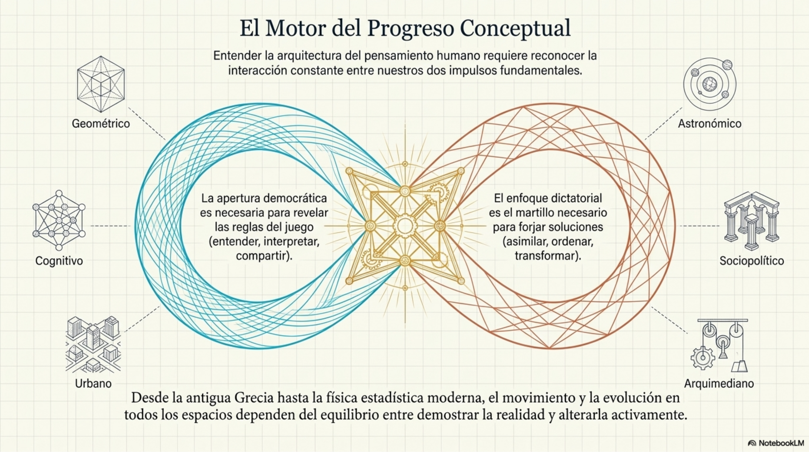

<table>
<tr>
<td>

Conceptualizar significa crear conceptos. Toda conceptualización corresponde a un estilo o manera de concebir, organizar y comunicar conceptos y relaciones conceptuales que expresan y transmiten información y conocimientos. Son maneras de visualizar posibilidades de comprensión y explicación acerca de la estructura y el funcionamiento de sistemas que se desarrollan y describen en determinados espacios.

Existen diferentes tipos de espacios donde lo que se mueve y cambia corresponde a diversas categorías de seres, objetos, circunstancias y procesos. Aquí nos referiremos a los siguientes tipos de espacios: el geométrico, el astronómico, el cognitivo, el sociopolítico, el urbano y el arquimediano.

Proponemos una conceptualización bimodal de estos espacios que opera en términos de dos enfoques o puntos de vista opuestos y con frecuencia conflictivos: el democrático que es válido para todo y todos con el fin de demostrar y ayudar a comprender y el dictatorial que es sólo para algunos cuantos privilegiados con el propósito de que asimilen y transformen. Aplicamos dicha conceptualización bimodal en tres contextos: el comunitario en relación con la Grecia antigua, el cognitivo que trata de matemáticas, química y física, y el individual conectado con la obra de Arquímedes de Siracusa.

</td>
</tr>
</table>

**OBJETIVOS Y CONTENIDOS DE LAS SECCIONES**
<table>
<tr>
<td>

**1.1. Espacios sociopolíticos, urbanos y astronómicos en la antigua Grecia**

Describir la manera como en la antigua Grecia se conceptualizaron la creación y evolución de los espacios sociopolíticos, urbanos y astronómicos. Considerar en todos los casos los puntos de vista democrático y dictatorial.

Enfoques dictatoriales y democráticos en la interpretación de espacios
Construcción de espacios sociopolíticos en la vida de la familia y la comunidad
Diseño y construcción de espacios urbanos
Dos conceptualizaciones opuestas del espacio astronómico

</td>
</tr>
</table>

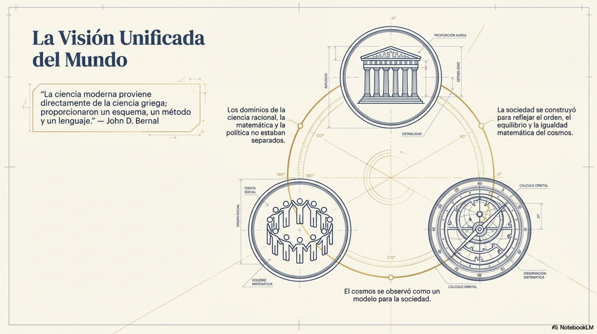

<table>
<tr>
<td>

**1.2. Espacios cognitivos en matemáticas, química y física**

Explicar cómo las conceptualizaciones dictatoriales o democráticos pueden aplicarse a espacios cognitivos con fines de interpretación en matemáticas, de ordenamiento en química y de clasificación en física.

Espacio de interpretación de la ecuación de la circunferencia
Espacio de ordenamiento de la tabla periódica de los elementos químicos
Espacio de clasificación de las partículas según la física estadística

</td>
</tr>
</table>

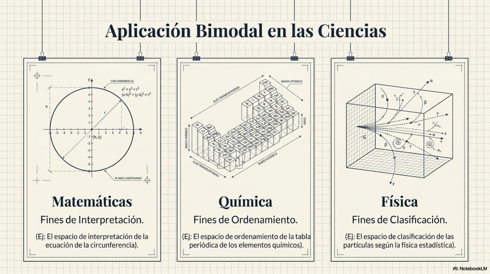

<table>
<tr>
<td>

**1.3. Espacios arquimedianos en matemáticas, física e ingeniería**

Describir las siguientes aportaciones de Arquímedes: libros publicados, método de exhaución, ley de la palanca, determinación del centro de gravedad, principio de flotación, ingeniería aplicada (tornillo hidráulico, polipastos), tecnología militar (catapultas, garras, espejos ustorios) e instrumentos de precisión (balanza hidrostática).

Conceptualizaciones democráticas en matemáticas y física
Conceptualizaciones dictatoriales en la solución de problemas prácticos
Conceptualizaciones en la solución del problema de la corona de oro

</td>
</tr>
</table>

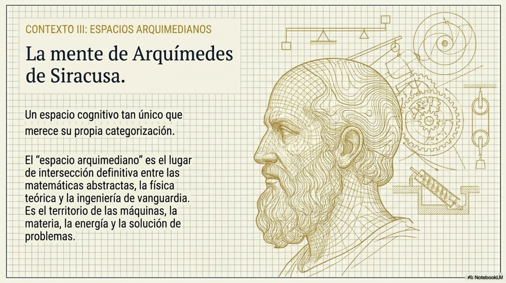

<table>
<colgroup>
<col style="width: 48%" />
<col style="width: 51%" />
</colgroup>
<thead>
<tr class="header">
<th colspan="2">Tabla 1.1. <em>Eventos y publicaciones en la Grecia
antigua</em></th>
</tr>
</thead>
<tbody>
<tr class="odd">
<td>Filosofía y Literatura</td>
<td>Matemáticas, Astronomía y Física</td>
</tr>
<tr class="even">
<td colspan="2"><ol type="1">
<li>

Surgimiento: (1000 – 480) a.C.

</li>
</ol></td>
</tr>
<tr class="odd">
<td>
Homero: <em>La Ilíada y La Odisea</em> (840)

Hesiodo: <em>Teogonía</em> (entre 700 y 800)

Solón de Atenas: reformas políticas y sociales (638-558)

Pitágoras de Samos (529-475): funda su escuela en Crotona en
530
</td>
<td>
Tales de Mileto (624-546): <em>Astrología náutica</em>

Anaximandro de Mileto (610-546): <em>Sobre la naturaleza (El ápeiron,
Cosmología)</em>

Parménides de Elea (514-470): <em>De la naturaleza</em> (crítica al
movimiento)
</td>
</tr>
</tbody>
</table>

<table>
<colgroup>
<col style="width: 50%" />
<col style="width: 50%" />
</colgroup>
<thead>
<tr class="header">
<th colspan="2"><ol start="2" type="1">
<li>
Edad de oro: (480 – 400) a.C.
</li>
</ol></th>
</tr>
</thead>
<tbody>
<tr class="odd">
<td>
Pericles de Atenas (495-429): reformas políticas y sociales
(461-429)

Sócrates de Atenas (470-399): (no escribió)

Jenofonte de Atenas (431-354): <em>Anábasis o la Expedición de los
diez mil</em> (385-368)

Empédocles de Agrigento, Sicilia (494-434): <em>Sobre la
naturaleza</em> (poemas filosóficos)
</td>
<td>
Anaxágoras de Clazómenas, Jonia (500-428): <em>Sobre la
naturaleza</em> (el Sol es fuego)

Filolao de Crotona (470-380): <em>Sobre la naturaleza</em> (Sol,
Tierra y Luna cubiertos de fuego)

Leucipo de Mileto (siglo V): <em>Gran orden del cosmos.</em>
Demócrito de Abdera, Tracia (460-357): <em>Pequeño orden del
cosmos</em>
</td>
</tr>
</tbody>
</table>

<table>
<colgroup>
<col style="width: 49%" />
<col style="width: 50%" />
</colgroup>
<thead>
<tr class="header">
<th colspan="2"><ol start="3" type="1">
<li>
Declinación y caída: (400-146) a.C.
</li>
</ol></th>
</tr>
</thead>
<tbody>
<tr class="odd">
<td>
Platón de Atenas (427-374): crea la Academia en 386-7

Aristóteles de Estagira (384-322) crea el Liceo en 334

Epicuro de Samos (341-270) crea la escuela de filosofía El Jardín (Ho
Kepos): <em>Cartas, Máximas capitales</em>

Imperio de Alejandro Magno (336–323)
</td>
<td>
Euclides de Alejandría (325-265?): <em>Elementos</em>

Aristarco de Samos (280-264): <em>Acerca de los tamaños y distancias
al Sol y a la Luna</em>

Eratóstenes de Cirena (276-194): <em>Geografía, Sobre la medición de
la Tierra</em>

Apolonio de Perga (240-190): Las <em>Cónicas</em>

Arquímedes de Siracusa (287-212): 10 libros
</td>
</tr>
</tbody>
</table>

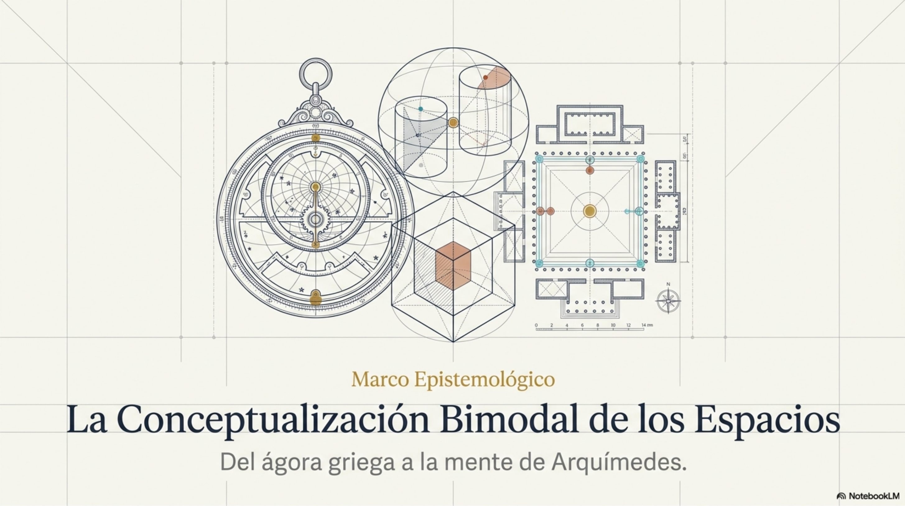

**1.1  Espacios sociopolíticos, urbanos y astronómicos en la antigua  Grecia**

El movimiento es el resultado de interacciones, disruptivas o equilibradas, entre las fuerzas impulsivas que evolucionan en el tiempo
y las formas organizadas de las trayectorias que se recorren en determinados espacios. El movimiento de los objetos geométricos se da en
espacios matemáticos. El movimiento de los cuerpos celestes se da en espacios astronómicos. El movimiento de las ideas y las teorías se da en espacios cognitivos. El movimiento de las sociedades se da en espacios sociopolíticos. El movimiento y localización de los seres humanos se da en espacios urbanos. El movimiento de las máquinas, la materia y la energía se da en el espacio arquimediano.

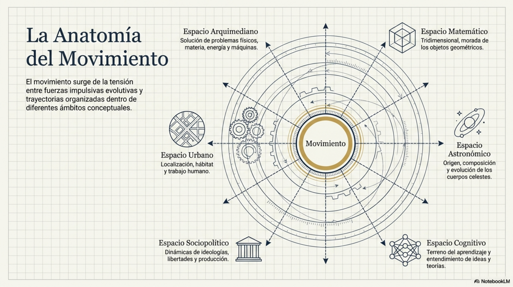

**Grecia en la antigüedad**

Los griegos establecieron un paradigma en el que la ciencia racional,
los principios matemáticos y la filosofía política dejaron de ser
dominios separados, para convertirse en expresiones distintas de una
visión unificada del mundo. Miraron ese mundo, vieron un modelo de
evolución y construyeron una sociedad que reflejaba su comprensión del
cosmos. Se basaron en la idea de que el mundo está racionalmente
ordenado y que la sociedad humana puede y debe estructurarse sobre
principios de razón y equilibrio.

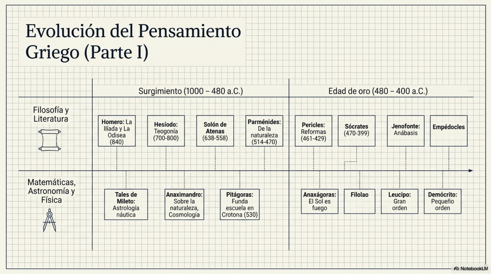

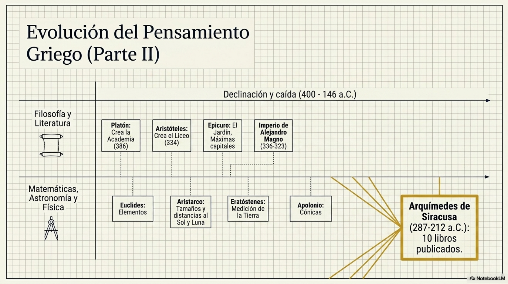

Los logros intelectuales y culturales de la antigua Grecia no estaban
compartimentalizados. La conceptualización de sus espacios pasó de ser
un esfuerzo puramente abstracto para entrelazarse profundamente en el
tejido de su evolución política y social. Los principios que usaron para
racionalizar la composición de los cielos y definir formas geométricas
eran los mismos que emplearon para construir sus ciudades-estado y
organizar sus vidas públicas. Este cambio social ocurrió en paralelo con
una "nueva imagen" de los espacios astronómicos y geométricos.

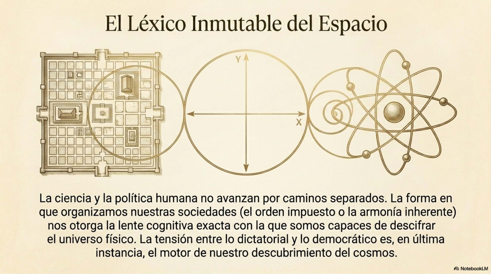

**Enfoques dictatoriales y democráticos en la interpretación de
espacios**

Esta sección se basa en la conferencia *Géométrie et astronomie
sphérique dans la première cosmologie grecque* de Jean-Pierre Vernant,
donde presenta dos esquemas interpretativos de las formas de evolución e
interdependencia: la visión dictatorial y la democrática.

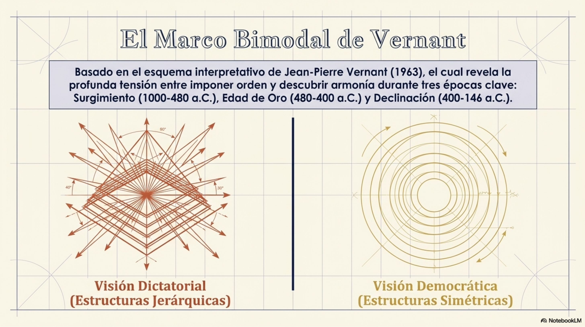

Un enfoque dictatorial interpreta el espacio mediante reglas impuestas y
restricciones que se aplican del centro a periferia, mientras que un
enfoque democrático ve el espacio a través del equilibrio, la igualdad y
la simetría. El enfoque dictatorial es centrífugo e impone reglas desde
un punto central de autoridad; el enfoque democrático es centrípeto y
construye orden a partir de las propiedades compartidas e iguales de sus
partes constituyentes. Existe una dicotomía entre la restricción
repulsiva de la conceptualización dictatorial y el equilibrio colectivo
de la conceptualización democrática. La conceptualización bimodal de los
espacios es una herramienta conceptual que funciona a la vez como
esquema interpretativo, método de análisis y lenguaje de comunicación.

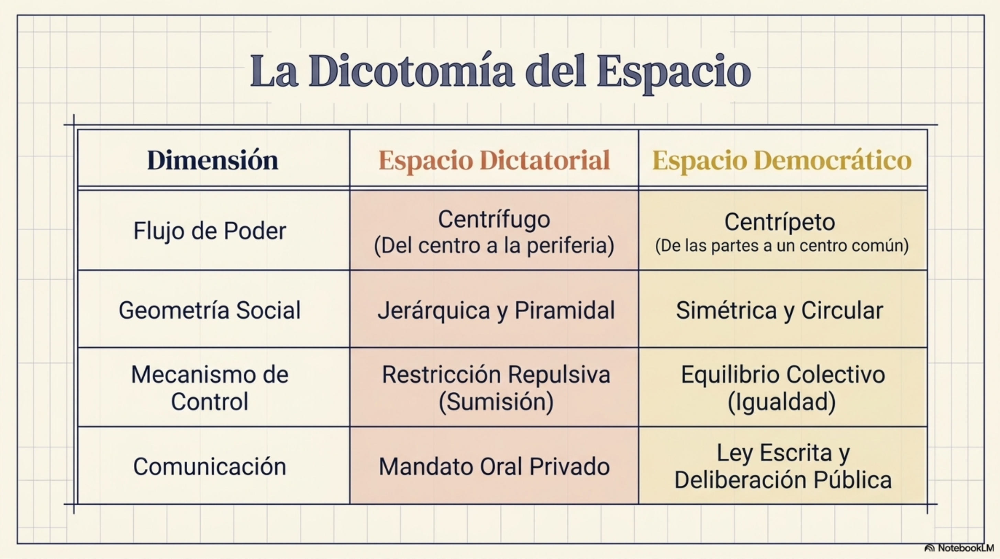

**Construcción del espacio sociopolítico en Grecia**

Antes de que se establecieran instituciones políticas en Grecia, la
sociedad tenía una estructura jerárquica: el nivel más alto de la
organización social lo ocupaba el rey-sacerdote. Toda la población
estaba bajo las condiciones de dominación y sumisión impuestas por la
dictadura real. La transición de una sociedad dictatorial a una
democrática fue facilitada por desarrollos culturales e intelectuales
uno de los cuales fue la escritura; el otro fue la creación de la polis
griega o ciudad-estado en cuyo centro se encontraba el espacio público
llamado ágora.

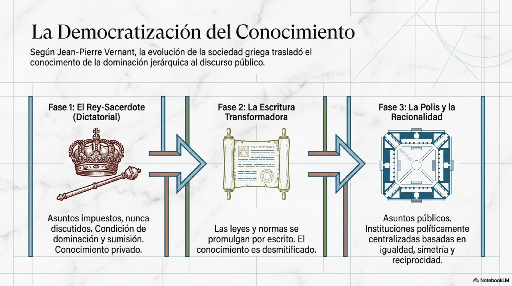

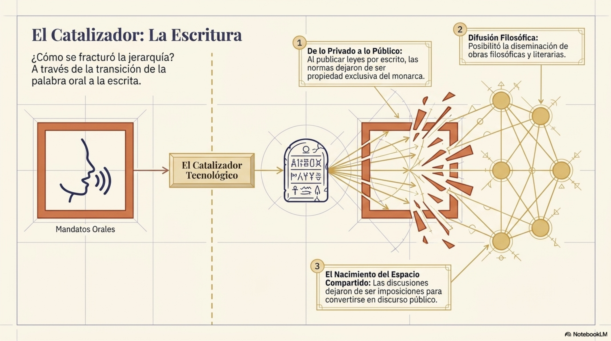

En el canto II de La Odisea, Homero narra que Telémaco, hijo de Ulises y
Penélope, convoca una asamblea pública en Ítaca donde denuncia el
comportamiento abusivo de los pretendientes al trono que acosan a su
madre; les acusa que están consumiendo la riqueza de su casa, expresa su
dolor por la ausencia de su padre y pide a los soldados que protejan a
su madre formando un ágora (palabra griega para asamblea).

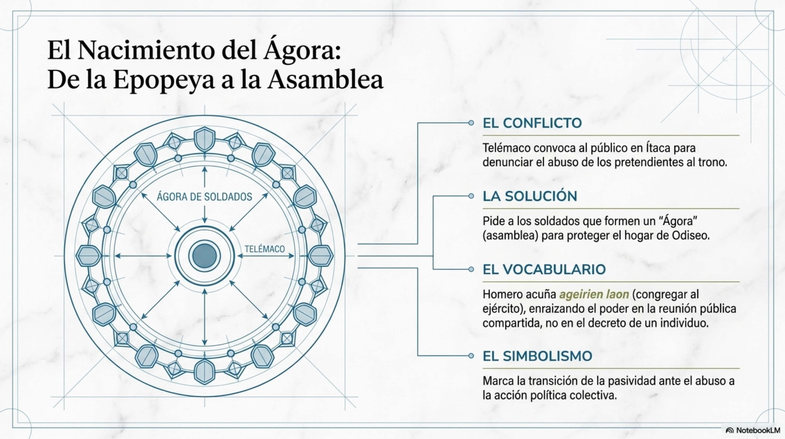

**Creadores de cultura**

Para caracterizar el proceso de construcción del espacio sociopolítico
Vernant propone considerar la participación de cuatro personajes claves
en el desarrollo cultural de Grecia en la antigüedad: el filósofo
Ferocides de Siros (Ferécides o Pherecydes) (c. 580–520 a.C.), el
historiador y geógrafo Heródoto de Halicarnaso (484 a.C. - 425 a.C.), el
poeta Homero (siglo VIII a.C.) y el arquitecto Hipódamo de Mileto \[(498
– 408) a.C.\].

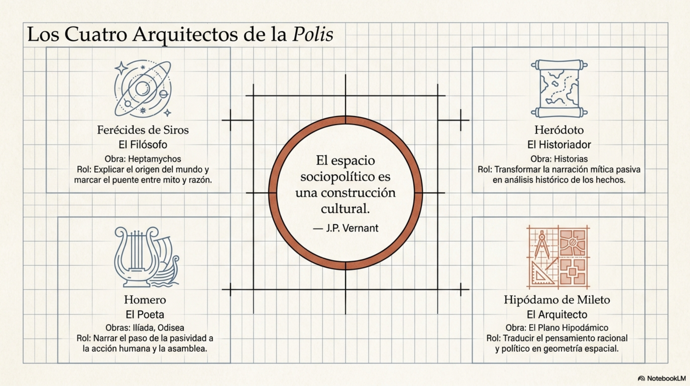

El filósofo presocrático Ferocides de Siros (Ferécides o Pherecydes) (c.
580–520 a.C.) desempeñó un papel crucial al ser el primer escritor en
publicar obra filosófica en prosa. Escribió libros para transformar
conocimientos privados en posibilidades públicas de discusión,
transformando lo que era posesión de unos cuantos en una fuente de
comunicación accesible para todos.

Heródoto de Halicarnaso (484 a.C. - 425 a.C.), considerado uno de los
primeros grandes historiadores es para algunos el “padre de la
historia”. Cuando murió el dictador Polícrates de Samos, quien había
gobernado aproximadamente entre 538 a.C. y 522 a.C.**,** le sucedió en
el poder su secretario y colaborador cercano Meandrio de Samos
(Maeandrius). Según relata Heródoto, Meandrio declaró que no quería
gobernar como tirano y propuso establecer una forma de gobierno más
equitativa: pidió a todos los ciudadanos que se reunieran en una
asamblea y les informó que se comportaría de manera democrática, en
total desacuerdo con su predecesor.

Homero (siglo VIII) fue el gran poeta épico de Grecia, una figura entre
la historia y la leyenda. Se le atribuyen dos grandes poemas épicos: *La
Ilíada* que narra episodios de la Guerra de Troya, se centra en la
figura de Aquiles y trata temas como la guerra, la gloria, el honor y la
ira. *La Odisea* cuenta el regreso de Odiseo (Ulises) a su hogar; es una
historia de viajes, aventuras y astucia. Ambas obras presentan una
visión profunda de la existencia humana: luchar, sufrir… y luego
intentar volver y reconstruirse.

Uno de los primeros arquitectos urbanos fue Hipódamo de Mileto (498 –
408) a.C. Se la ha considerado el “padre del urbanismo” por abordar la
planificación de las ciudades con criterios racionales.Fue un
organizador racional del espacio y la sociedad, una figura clave en la
transición hacia el pensamiento sistemático en Grecia. Habiendo sido
contemporáneo del auge de la democracia en Atenas, vinculó arquitectura,
política y filosofía. Fue un pensador social que propuso dividir la
sociedad en tres clases (artesanos, agricultores y guerreros) y
distinguir tres tipos de territorios (el sagrado, el público y el
privado).

**Diseño y construcción de espacios urbanos**

La ciudad democrática en la Grecia antigua reflejaba equilibrio y
concordancia entre el diseño socio político y el urbano: había sido
concebida y construida como un sistema centralizado y simétrico
gobernado por principios racionales y democráticos.

Hipódamo propuso organizar las ciudades de manera racional y geométrica,
tal como lo indicó en el plano de la reconstrucción de la ciudad de
Mileto, destruida por los persas en 490 a.C. El correspondiente plano
hipodámico muestra una estructura reticular ordenada de calles anchas y
rectas, con un ágora como centro organizador de la vida comunitaria,
acogedor escenario del discurso público. Aquí urbanismo es orden,
simetría y equilibrio.

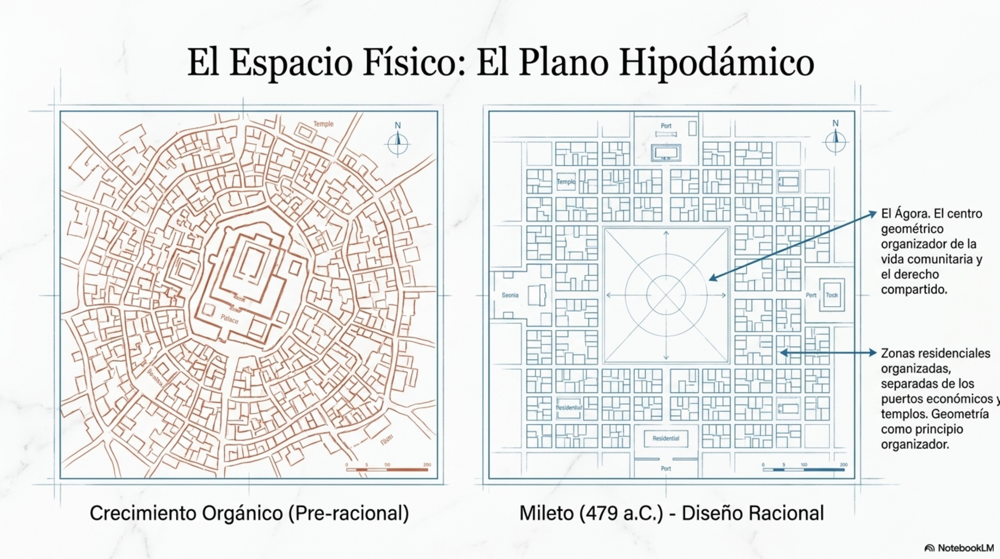

A continuación, comparamos el espacio urbano de la ciudad de Mileto con
los espacios de dos construcciones mesoamericanas, la pirámide de
Teotihuacán (cerca del año 450 a.C.) y el palacio de Machu Picchu (cerca
del año 1500 d.C.). Estas construcciones corresponden a tres visiones
muy distintas del espacio urbano: en Mileto es la visión cívica-racional
griega de proporción y simetría; en Teotihuacan es la visión
cosmológica-monumental mexica símbolo de un poder sagrado y en Machu
Picchu es la visión orgánica-adaptativa peruana que expresa equilibrio
entre construcción y medio ambiente.

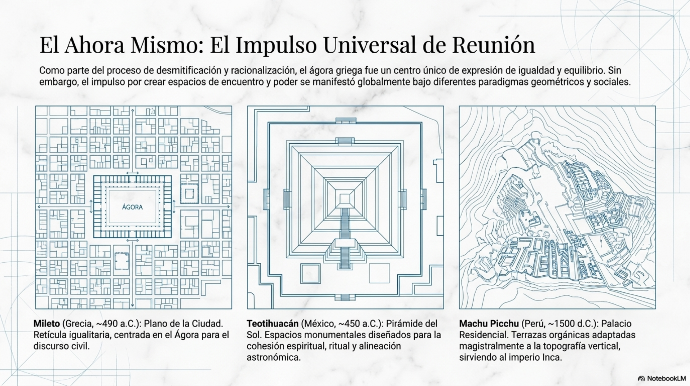

El diseño urbano del Ágora de Mileto coloca esta construcción en el
centro de un espacio abierto, rectangular y regular rodeado de edificios
públicos como mercados y edificios administrativos. Su función es ser el
foco de la vida política, el comercio y la interacción social. Muestra
una lógica espacial que responde a un diseño concebido para la
participación ciudadana como expresión de la razón, el orden humano y la
vida cívica.

El diseño urbano de la pirámide del Sol en Teotihuacán posiciona esta
construcción a lo largo del eje urbano monumental que es la Calzada de
los Muertos; es una estructura piramidal masiva y axial orientada
astronómicamente en relación con los ciclos solares. Su función es la de
un espacio ritual y religioso dedicado al culto a deidades y a
ceremonias colectivas. Muestra una lógica espacial que impone jerarquía
y representa al cosmos.

El diseño urbano del palacio residencial en Machu Picchu integra esta
construcción a un escenario montañoso que forma parte de un trazado
irregular de terrazas, muros de piedra y desniveles. Su función es la de
un espacio residencial dedicado a la élite inca con propósitos
administrativos y ceremoniales. Muestra una lógica espacial que integra
lo ecológico con lo simbólico y manifiesta armonía, adaptación y
equilibrio.

**Dos conceptualizaciones del espacio astronómico**

Según Vernant, la nueva imagen de la sociedad democrática griega iba en
paralelo con una nueva imagen de los espacios astronómicos: implicó
superar las ideas babilónicas y eliminar los mitos sobre la forma de la
Tierra. Según la astronomía babilónica las estrellas eran divinidades
cuyas intenciones podían percibirse si sus posiciones en el cielo se
observaban y registraban cuidadosamente. De ello se encargaban los
escribas que servían al rey, además de registrar la actividad económica
del reino y de contabilizar todos los acontecimientos celestiales y
terrestres. Su conocimiento era aritmético, sin conexión con ningún
sistema geométrico de representaciones espaciales de posiciones y
movimientos.

Por su parte, la astronomía antigua griega buscaba explicaciones sobre
la estructura del mundo sin apelar a divinidades ni ceremonias rituales,
aunque estaba llena de mitos. Esa visión del universo evolucionó desde
la conceptualización dictatorial de la cosmogonía jerárquica de Hesíodo
de Askra, hacia la conceptualización democrática de la cosmología
simétrica de Anaximandro de Mileto.

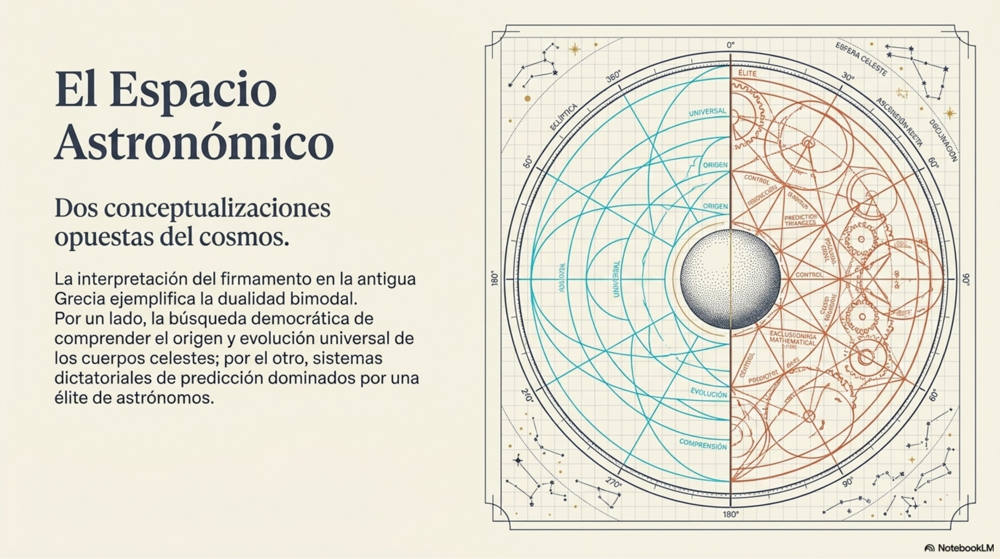

**La cosmogonía de Hesíodo**

Hesíodo de Askra, Tebas (cerca del 800 a.C.) fue un poeta de la época
arcaica que introdujo en sus obras una visión moral y práctica de la
vida humana y destacó la importancia del trabajo, la justicia y el
orden. Se le tribuyen dos obras: *Los trabajos y los días*, un poema
didáctico en el que ofrece consejos sobre la vida agrícola, la justicia,
el trabajo y la conducta moral y *Teogonía*, un tratado mitológico que
describe el origen del universo y la genealogía de los dioses.

La *Teogonía* es un relato mitológico que describe la búsqueda de orden
en el cosmos: el mundo no es un caos incomprensible, sino una totalidad
ordenada que puede explicarse. Representa el paso del mythos (el relato
simbólico) al logos (la explicación racional): no solo narra historias
de dioses, intenta explicar el origen del universo (es una cosmogonía
más que una cosmología).

El espacio astronómico que describe la *Teogonía* corresponde a un
modelo puramente geométrico consistente en un recipiente cerrado para
evitar la percepción de luz en el mundo desordenado. Es un mundo
rígidamente jerarquizado verticalmente: en el nivel superior la
autoridad de Zeus y luego en orden descendiente, los dioses inmortales,
los seres humanos y hasta abajo los muertos y los dioses del inframundo.

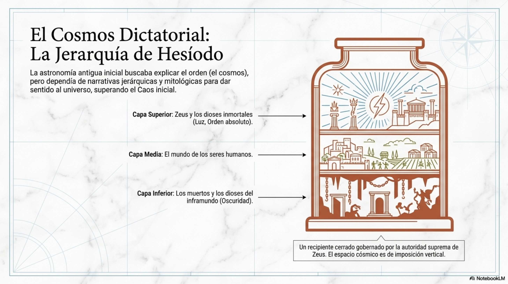

**La cosmología de Anaximandro**

Anaximandro de Mileto, Jonia (619 – 546) a.C., fue un pensador
originario de Mileto que propuso que el origen de todo (*arché*) no es
algo concreto como el agua (como suponía su maestro Tales) sino una
realidad indeterminada, infinita y eterna. Sugirió que del ápeiron (en
griego: “lo indefinido” o “lo ilimitado”) surgen todas las cosas y a él
regresan, siguiendo una especie de ley natural de equilibrio.

Anaximandro afirmó que los elementos (calor, frío, seco, húmedo) están
en conflicto, pero que existe una especie de justicia cósmica que regula
ese conflicto, que las cosas “pagan” por sus excesos retornando al
ápeiron. Propuso la existencia de un principio originario abstracto que
abría el camino a la explicación racional del cosmos y continuaba la
transición del mito al logos iniciada en la tradición griega. Todo se
explica mediante principios impersonales y necesarios, mediante
relaciones geométricas y condiciones de equilibrio que obedecen
principios abstractos y universales en lugar de referirse a acciones
divinas con propósitos que ni son descriptivos ni explicativos.

Hizo aportaciones científicas en campos tales como: Cosmología (propuso
un modelo del universo donde la Tierra flota en el espacio), Geografía
(elaboró uno de los primeros mapas del mundo conocido), Astronomía
(estudió los cuerpos celestes y sus movimientos) y Biología primitiva
(sugirió que los seres humanos provienen de formas de vida más simples).

Según el modelo cosmológico de Anaximandro todo surge del ápeiron, lo
indefinido; el universo está organizado en anillos concéntricos
alrededor de la Tierra: el Sol sería el anillo más lejano y grande, la
Luna estaría en un anillo más cercano y las estrellas serían aún más
próximas. Pero esos anillos contienen fuego y están envueltos por aire o
niebla de manera que los cuerpos celestes pueden observarse a través de
aberturas en esos anillos. Además, la Tierra flota libremente en el
espacio, cumple con un propósito cercano a un principio de simetría como
explicación física: es toda una visión democrática acerca del universo.

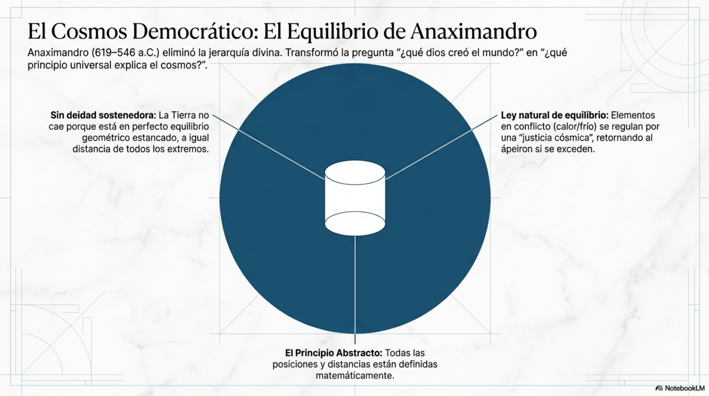

**Evolución del espacio griego**

Las herramientas intelectuales de equilibrio y simetría, forjadas para
crear un cosmos democrático, fueron las mismas herramientas que los
griegos aplicarían al problema de la organización urbana y política.
También reconceptualizaron el universo alrededor de un centro de
equilibrio y reestructuraron físicamente sus ciudades alrededor del
ágora como centro de equilibrio político y social, cuna de la
democracia.

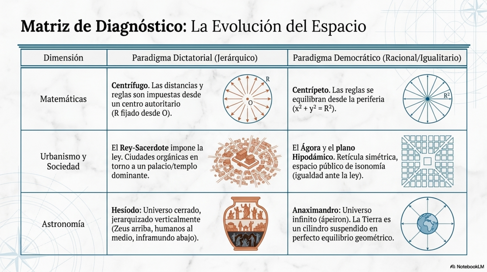

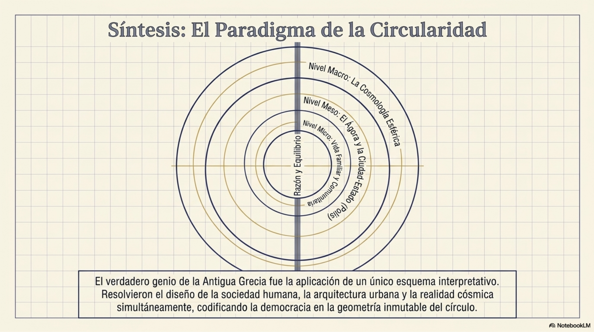

La evolución sociopolítica y científico tecnológica de la Grecia muestra
que resolvieron el diseño de la sociedad humana, la arquitectura urbana
y realidad cósmica, a partir de un proceso de democratización que se
inició en un primer nivel micro de la vida familiar y de la comunidad,
pasó por el nivel meso del ágora y la ciudad- estado y finalmente llegó
al nivel macro de la cosmología esférica.

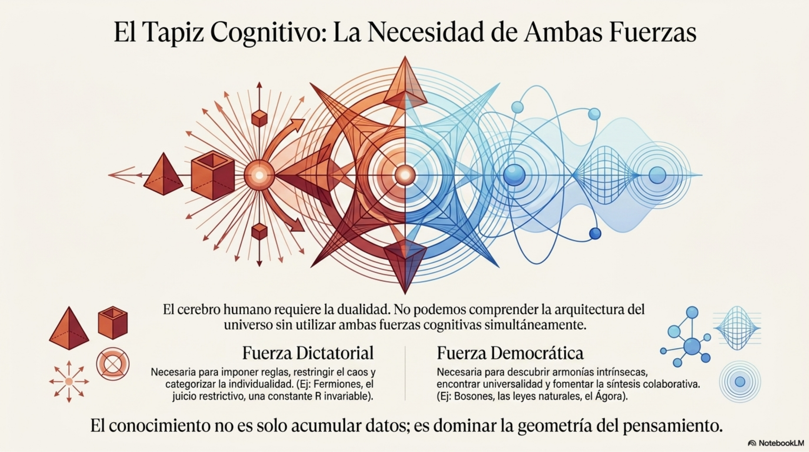

**1.2.  Espacios cognitivos en matemáticas, química y física**

La conceptualización bimodal característica de los enfoques democráticos
y dictatoriales distingue y confronta lo que es válido para todos y lo
que sólo es propio de algunos privilegiados. Los balances entre derechos
y obligaciones son homogéneos y constantes en el primer caso, mientras
que son dispersos y variables en el segundo.

En esta sección consideramos tres ejemplos de conceptualización bimodal
aplicada a espacios cognitivos diferentes: el primer ejemplo es en
matemáticas y consiste en un esquema interpretativo demasiado simple
pero ilustrativo acerca del significado de la ecuación de la
circunferencia; el segundo ejemplo es en química y se refiere al método
de ordenación de los elementos en su tabla periódica; el tercer ejemplo
es en física y describe el lenguaje de clasificación propio de la física
estadística que indica si las partículas son bosones o son fermiones. En
los dos primeros ejemplos les cuestión de interpretación decidir qué
tipo de conceptualización se aplica. En el tercer ejemplo la
conceptualización bimodal va más lejos porque cada familia de partículas
(los fermiones y los bosones) tiene características que son de tipo
dictatorial o democrático.

**Espacio de interpretación de la ecuación de la circunferencia**

La dualidad conceptual en la conceptualización de espacios matemáticos
puede ilustrarse si se analizan las condiciones en que una colección de
puntos representados como P (x, y) satisface la ecuación de una
circunferencia *x² + y² = R²*, donde x representa a las abscisas, y a
las ordenadas en un plano cartesiano bidimensional y R corresponde al
radio de la circunferencia. Son dos maneras de ver una ecuación
matemática a través de una lente democrática o dictatorial.

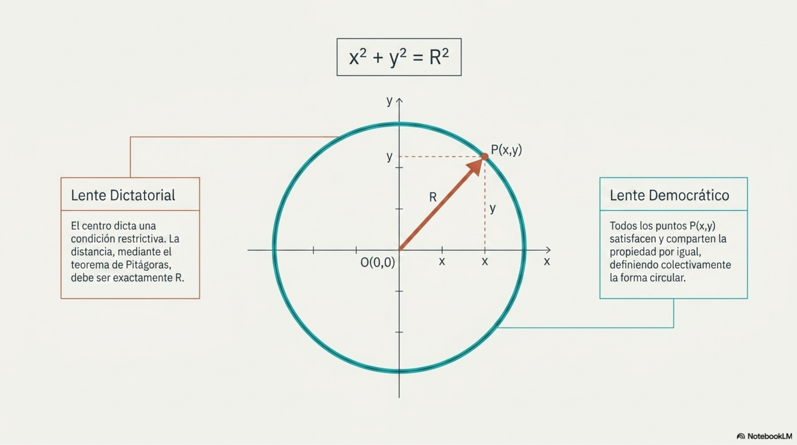

**Espacio de ordenamiento de la tabla periódica de los elementos
químicos**

La manera de interpretar cómo se ordenan los elementos químicos de
acuerdo con la estructura de la tabla periódica puede corresponder a
alguna de las versiones de la conceptualización bimodal del
correspondiente espacio cognitivo de la química. Desde un punto de vista
democrático, todo elemento químico tiene un lugar en la tabla en la fila
(periodo) y columna (grupo) que le corresponde según el valor de su
número atómico y otros parámetros representativos. Sin embargo, desde un
punto de vista dictatorial la pertenencia de un elemento a cierto grupo
es posible sí y sólo sí la correspondiente configuración electrónica del
elemento es la misma que la del grupo en cuestión.

A partir de los experimentos de Ernest Rutherford y colaboradores se
sabe que el átomo es eléctricamente neutro y contiene un núcleo de carga
positiva rodeado de electrones de cargas negativas. Posteriormente se
descubre que el núcleo contiene protones y neutrones.

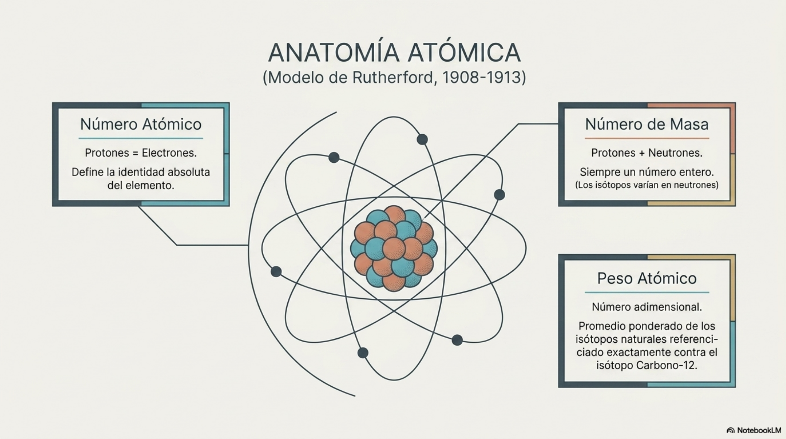

La tabla periódica de los elementos es un método de organización
sistemática que describe y explica las propiedades de todos los
elementos químicos en función de su estructura atómica. Es un arreglo
bidimensional de elementos que los ordena y agrupa según dos parámetros
característicos: el número atómico que es la cantidad de protones en el
núcleo (igual al número de electrones), lo cual determina la identidad
del elemento y el peso atómico, que es el promedio ponderado de las
masas de sus isótopos.

El peso atómico se define respecto a una escala en la que el isótopo
carbono-12 tiene exactamente un valor de 12 unidades. Por tanto, el peso
atómico es un número adimensional que indica cuántas veces, en promedio,
la masa de los átomos de un elemento es mayor que 1/12 de la masa del
carbono-12. Los isótopos son átomos con el mismo número de protones,
pero diferente número de neutrones.

La organización de los elementos químicos en la tabla periódica explica
la periodicidad de sus propiedades. La organización de los elementos en
filas (periodos) y columnas (grupos), revela patrones regulares en el
tamaño del átomo, su energía de ionización, su afinidad electrónica y su
electronegatividad. Que un elemento pertenezca a cierto grupo quiere
decir que tiene similitud química con los demás elementos de su misma
columna. Tal similitud química se debe a que todos esos elementos tienen
similares configuraciones electrónicas externas al núcleo (igual número
de electrones de valencia) y además, que reaccionan de manera parecida.

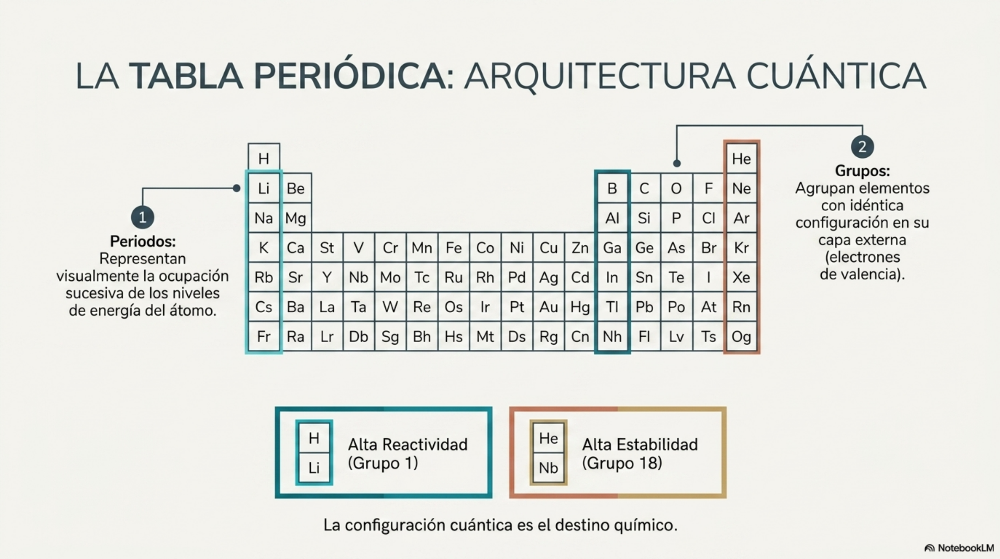

Según la mecánica cuántica los electrones no recorren trayectorias
definidas en las órbitas que describen alrededor del núcleo. Sus
posiciones sucesivas se describen mediante una función de onda que es la
solución matemática de la llamada ecuación de Schrödinger para un
electrón. El orbital representa una distribución de probabilidad, no una
órbita fija. Un orbital no es un camino, sino una “nube de probabilidad”
que propone donde es más probable encontrar al electrón. La estructura
de las soluciones cuantizadas de dicha ecuación queda completamente
determinada por una serie de cuatro números cuánticos.

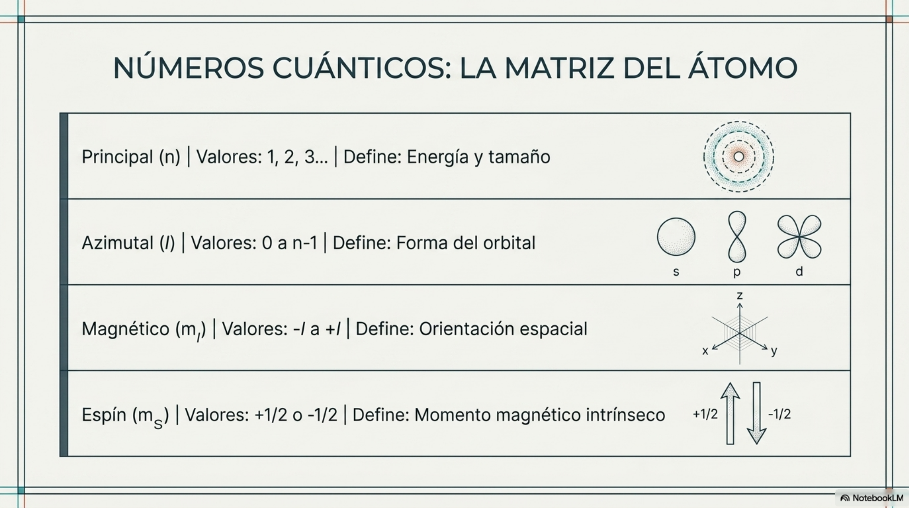

La tabla periódica muestra tendencias periódicas en la forma cómo
cambian las propiedades al avanzar en la tabla: de izquierda a derecha
aumenta la carga nuclear efectiva y de arriba hacia abajo aumenta el
tamaño atómico. Esto permite predecir comportamientos químicos.

Por otra parte, la tabla ayuda a entender la formación de enlaces
indicando por qué los átomos ganan, pierden o comparten electrones y
cómo se forman enlaces iónicos, covalentes o metálicos.

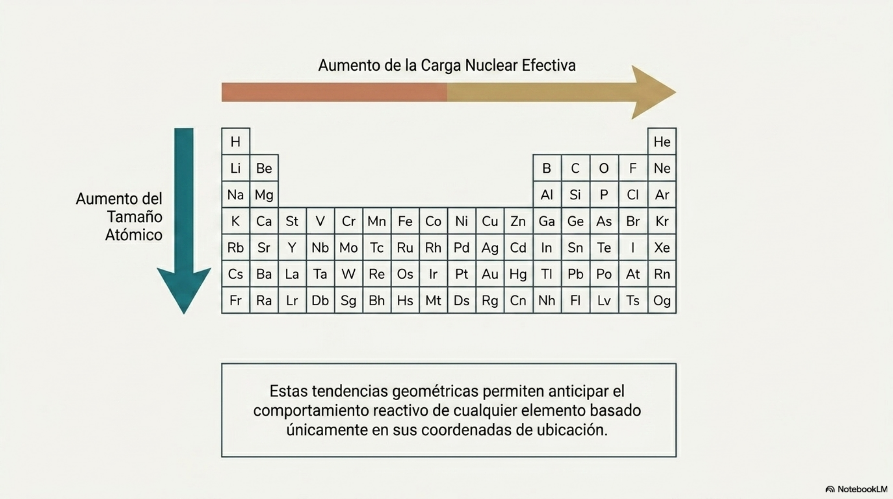

**Espacio de clasificación de las partículas según la física
estadística**

La conceptualización bimodal del espacio de las partículas elementales
bajo la dicotomía dictatorial o democrática indica que los fermiones
como los electrones muestran un comportamiento dictatorial impuesto por
el Principio de exclusión de Pauli, mientras que los bosones como los
fotones suelen condensarse muy democráticamente.

Wolfgang Pauli descubrió el Principio de exclusión: ningún par de
electrones en un átomo pueden tener números cuánticos idénticos; es
decir, dos partículas no pueden ocupar el mismo estado cuántico al mismo
tiempo y cada partícula mantiene su individualidad forzada. Los
integrantes de la familia de los fermiones se repelen entre sí porque
obedecen a una restricción impositivo de naturaleza centrífuga que va
desde el centro representado por el Principio de exclusión hacia la
periferia donde se ubican todos los fermiones, los cuales satisfacen
estructuras jerárquicas impuestas por ordenamientos externos.

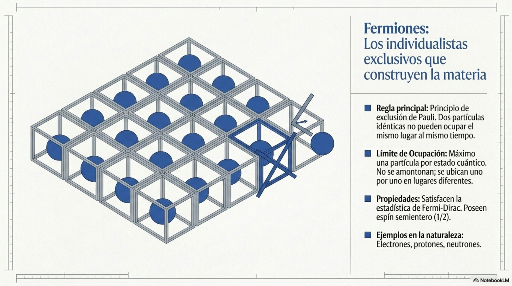

Por el contrario, en el caso de los bosones la conceptualización
democrática del espacio

indica que el orden no se impone desde arriba, sino que surge de la
participación colectiva que propicia la condensación, según la cual
múltiples partículas comparten el mismo estado cuántico. Los bosones son
sociables y colaborativos, funcionan como una colectividad descrita por
un mismo estado; todos juntos no cada uno por su lado. Este es un
enfoque que favorece la atracción, que libera en la dirección centrípeta
que va desde la periferia donde habitan todos los bosones hacia el
centro que los jala de la misma manera porque todas las partículas
comparten el mismo estado cuántico, lo cual indica orden, equilibrio y
armonía.

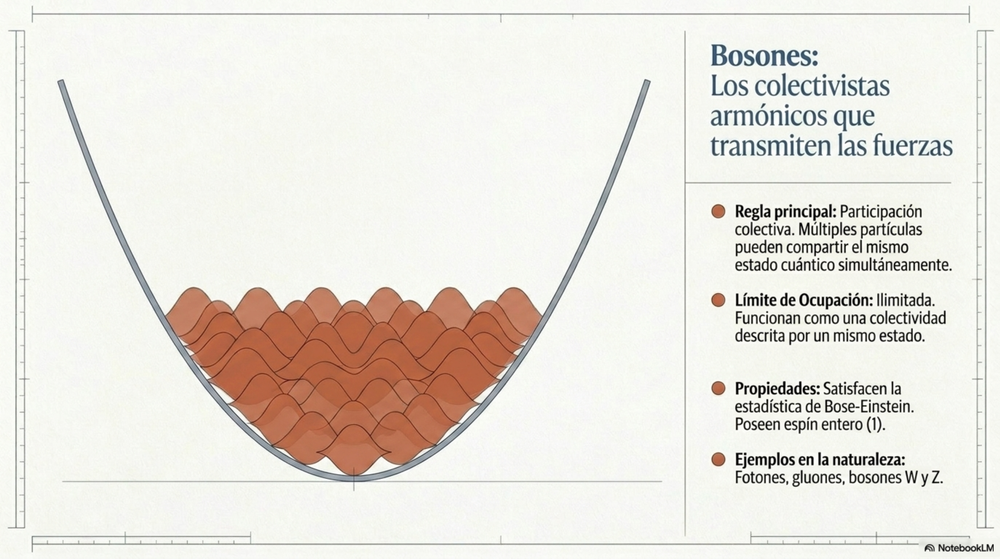

Las estadísticas cuánticas describen cómo se comportan las partículas en
sistemas microscópicos. Si en la función de onda total de un sistema
compuesto de N partículas se intercambian dos partículas idénticas
representadas por xj y xk, el resultado es que la
nueva función no cambia de signo respecto de la función anterior (la
función es simétrica) o sí cambia de signo (la función es
antisimétrica):

$\psi\left( x_{1},\ x_{2},\ \ldots.\ x_{j},\ x_{k},\ldots\ x_{N} \right) = \ ( \pm )\psi\left( x_{1},\ x_{2},\ \ldots.\ x_{k},\ x_{j},\ldots\ x_{N} \right)\ $

La función antisimétrica representa a la familia de los fermiones
(electrones, protones, neutrones) que obedecen el Principio de exclusión
de Pauli y en consecuencia, la ocupación máxima es de una partícula por
estado. Los fermiones satisfacen la estadística de Fermi-Dirac y son
partículas con espín semientero, mientras que los bosones satisfacen la
estadística de Bose-Einstein y tienen espín entero.

La función simétrica representa a la familia de los bosones (fotones,
gluones, bosones W y Z); por lo tanto, la función es invariante frente a
la operación de permutación de partículas; es decir, que muchas
partículas pueden ocupar el mismo estado cuántico (la ocupación es
ilimitada).

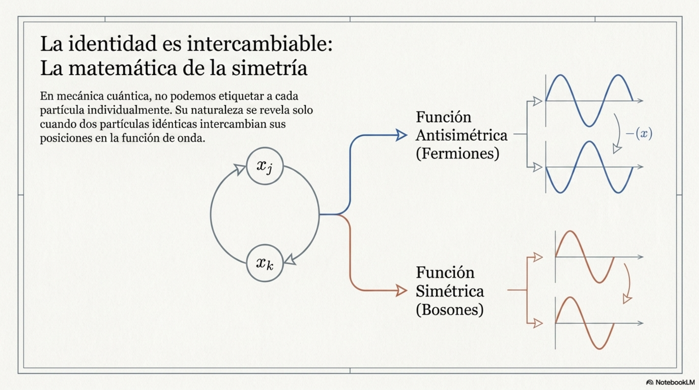

La condensación de Bose–Einstein ocurre cuando un conjunto de bosones se
enfría a temperaturas extremadamente bajas, cercanas al cero absoluto.
En tales condiciones muchas partículas colapsan al mismo estado cuántico
fundamental, el sistema deja de comportarse como un conjunto de
partículas individuales y cada vez más partículas ocupan el estado de
menor energía, hasta que una fracción macroscópica “se condensa” en tal
estado. La condensación es un fenómeno de coherencia cuántica
macroscópica: todas las partículas tienen la misma fase y se comportan
como una sola entidad cuántica.

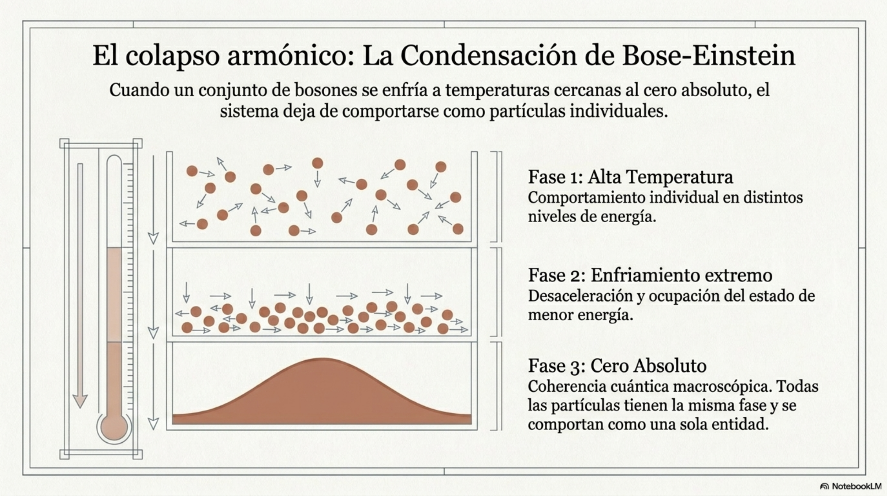

**Las contribuciones de Wolfgang Pauli y Max Born**

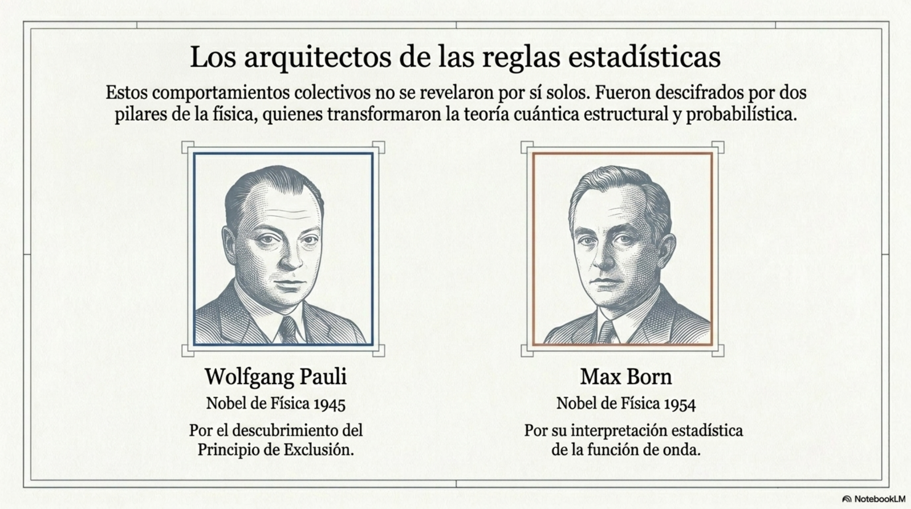

A continuación, para cada Premio Nobel indicamos el motivo por el cual
se otorgó el premio, según lo presenta el documento llamado FACTS
(Hechos) publicado en la página de la Fundación Nobel. Luego indicamos
el título de cada Conferencia Nobel y su respectiva referencia. Después,
presentamos una serie de diapositivas elaboradas por el programa
NotebookLM, mismo que tomó como fuente de referencia un resumen de
elaboración propia que comprendió dos partes: la primera parte describe
la problemática que se planteaban en los tiempos en que cada uno de los
autores empezó a trabajar en el tema en cuestión; la segunda parte
presenta las principales aportaciones de cada autor y termina con
algunas consideraciones acerca de las investigaciones que sabrán de
continuar.

<u>Premio Nobel de Física otorgado a Wolfgang Pauli (1900-1958)</u>

HECHOS: "En el modelo del átomo de Niels Bohr, los electrones se mueven
en órbitas fijas alrededor de un núcleo. A medida que este modelo se
desarrollaba, a los electrones se les asignaban ciertos números
cuánticos correspondientes a distintos estados de energía y movimiento.
En 1925, Wolfgang Pauli introdujo dos nuevos números y formuló el
principio de Pauli, que proponía que ningún par de electrones en un
átomo pudieran tener conjuntos idénticos de números cuánticos. Más tarde
se descubrió que los protones y neutrones en los núcleos también podían
describirse en términos de esos números cuánticos y que el principio de
Pauli también se les aplicaba."

Wolfgang Pauli – Hechos. NobelPrize.org. Alcance del Premio Nobel AB
2023. Sáb. 25 feb
2023. https://www.nobelprize.org/prizes/physics/1945/pauli/facts/

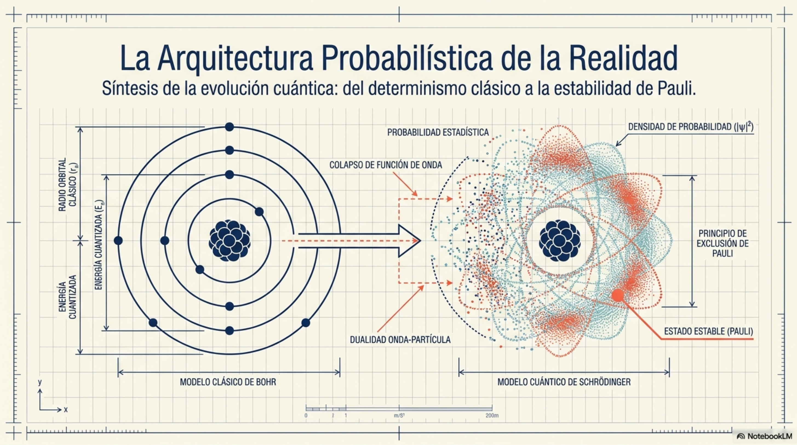

CONFERENCIA NOBEL: *Principio de Exclusión y Mecánica Cuántica*.

Wolfgang Pauli – Conferencia Nobel. NobelPrize.org. Alcance del Premio
Nobel AB 2023. Sáb. 25 feb
2023. <https://www.nobelprize.org/prizes/physics/1945/pauli/lecture/>

**Descripción de la problemática**

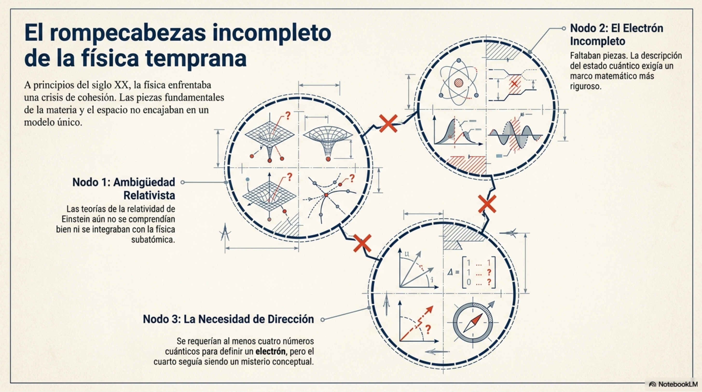

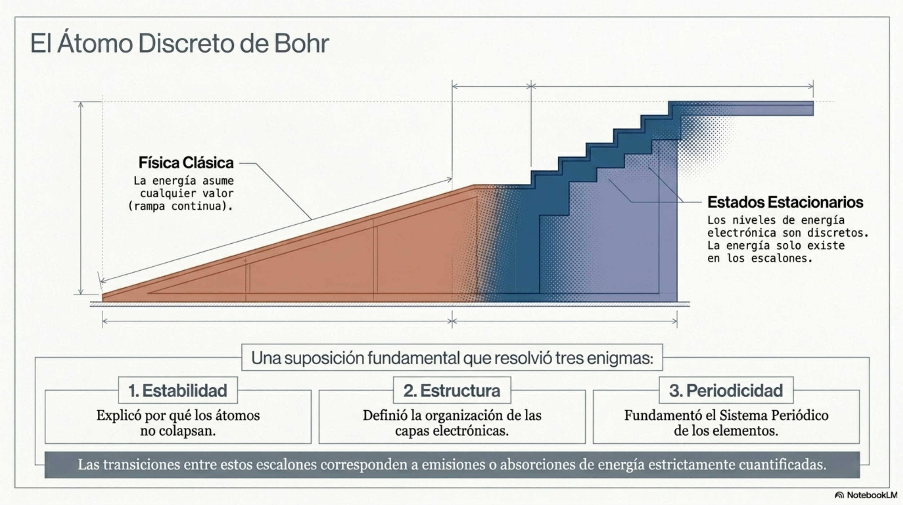

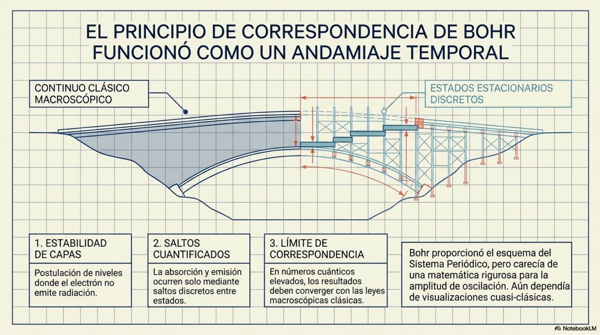

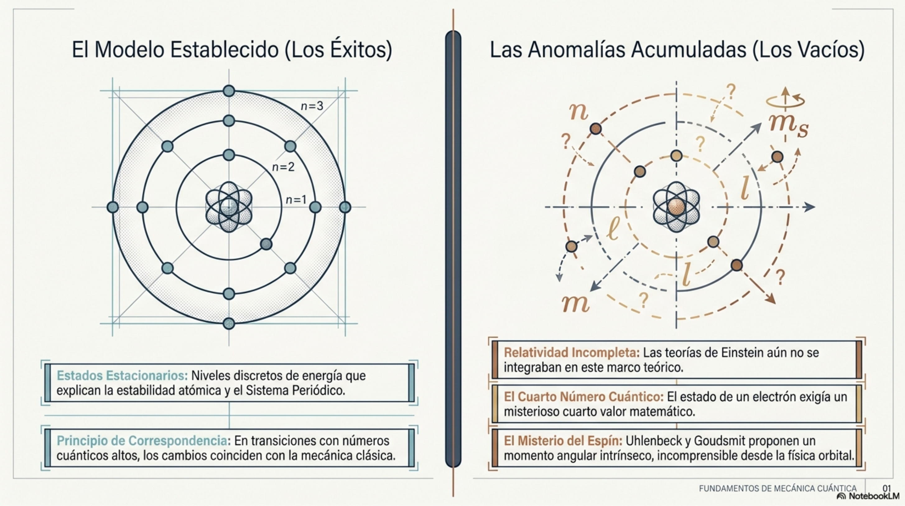

**Aportaciones de Pauli**

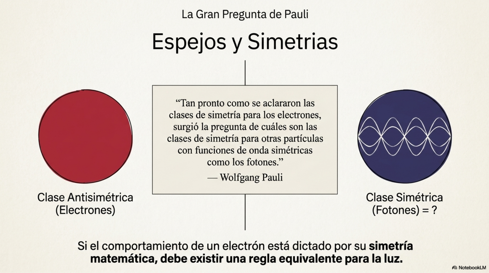

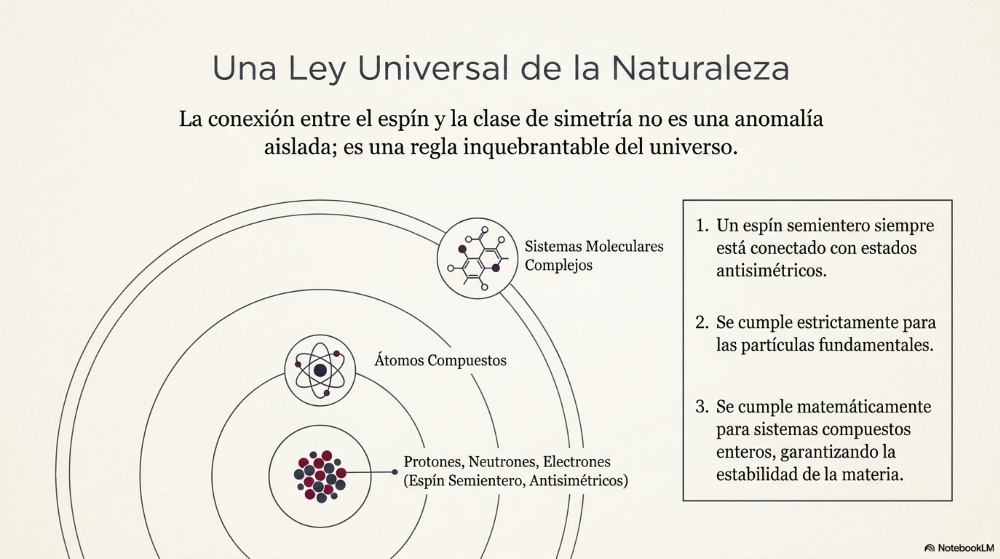

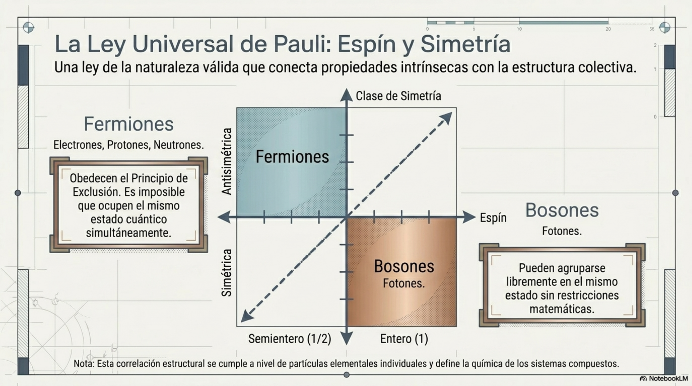

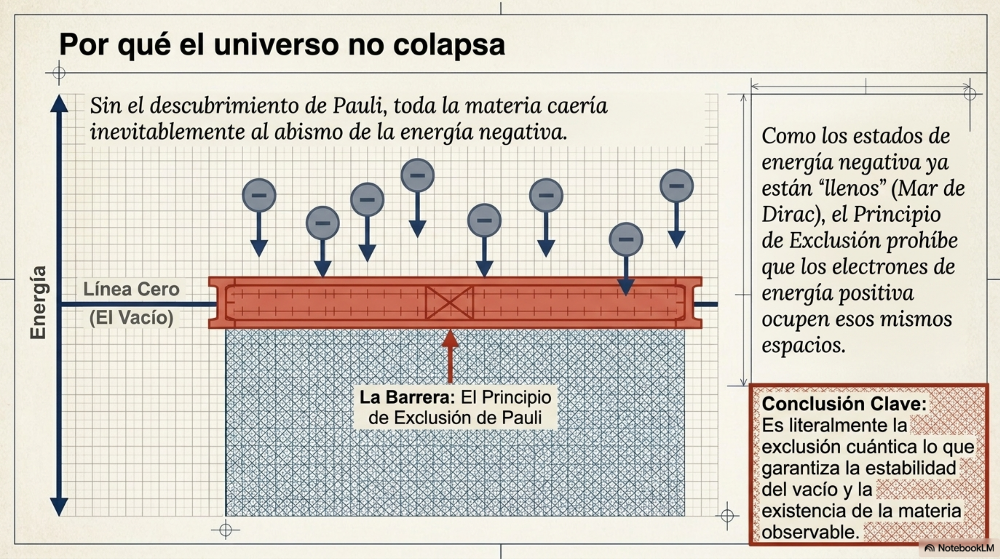

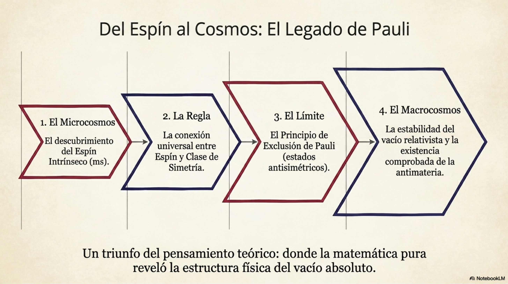

<u>Premio Nobel de Física de otorgado a Max Born (1882-1970)</u>

HECHOS: "En la teoría del átomo de Niels Bohr, los electrones absorben y
emiten radiación de longitudes de onda fijas al saltar entre órbitas
alrededor de un núcleo. La teoría proporcionaba una buena descripción
del espectro creado por el átomo de hidrógeno, pero necesitaba
desarrollarse para adaptarse a átomos y moléculas de mayor complejidad.
Tras el trabajo inicial de Werner Heisenberg alrededor de 1925, Max Born
contribuyó al desarrollo posterior de la mecánica cuántica. También
demostró que la ecuación de onda de Schrödinger podría interpretarse
como la que hace predicciones estadísticas de las variables, más que
predicciones exactas."

Max Born – Hechos. NobelPrize.org. Alcance del Premio Nobel AB 2023.
Sáb. 25 feb
2023. <https://www.nobelprize.org/prizes/physics/1954/born/facts/>

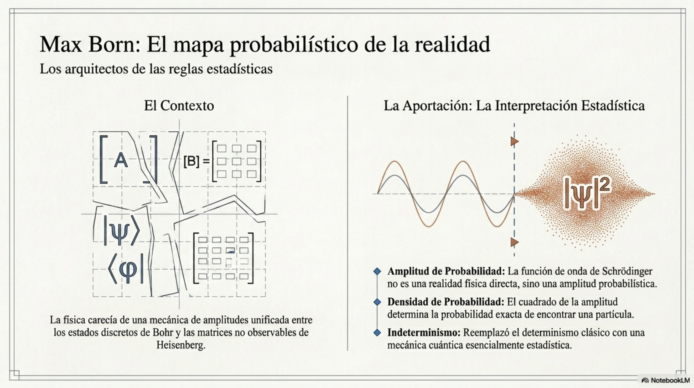

CONFERENCIA NOBEL: *Las Interpretaciones Estadísticas de la Mecánica
Cuántica*.

Max Born – Conferencia Nobel. NobelPrize.org. Alcance del Premio Nobel
AB 2023. Sáb. 25 feb
2023. https://www.nobelprize.org/prizes/physics/1954/born/lecture/

**Descripción de la problemática**

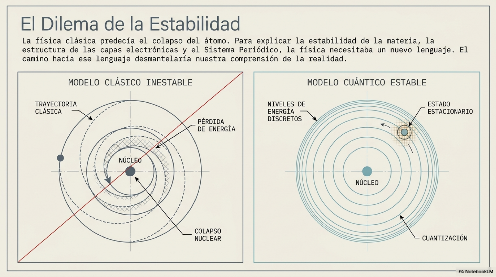

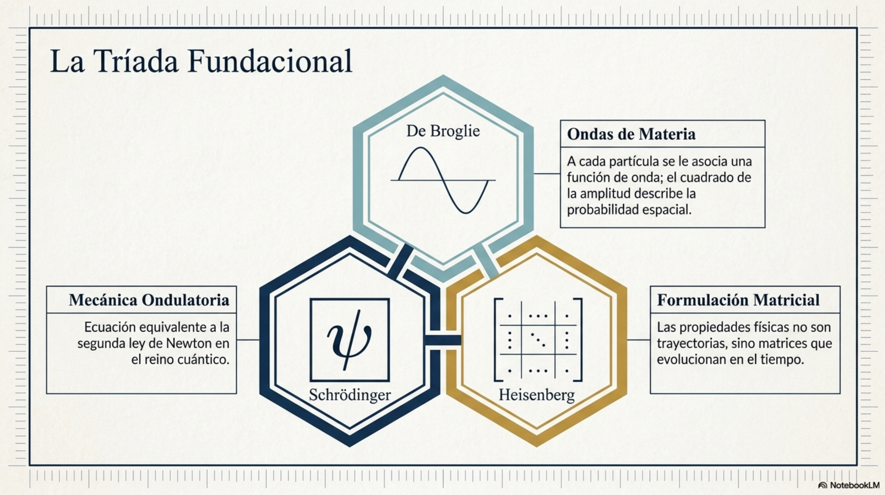

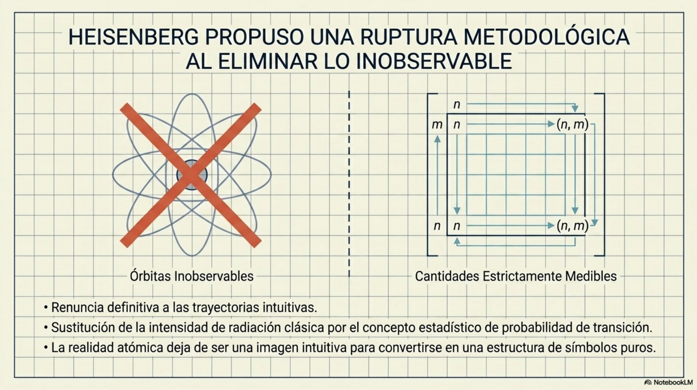

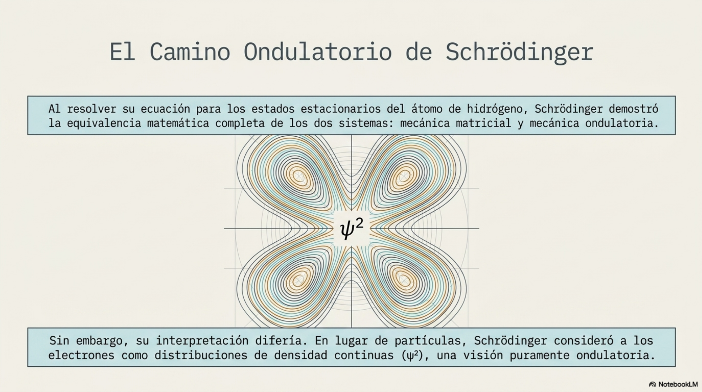

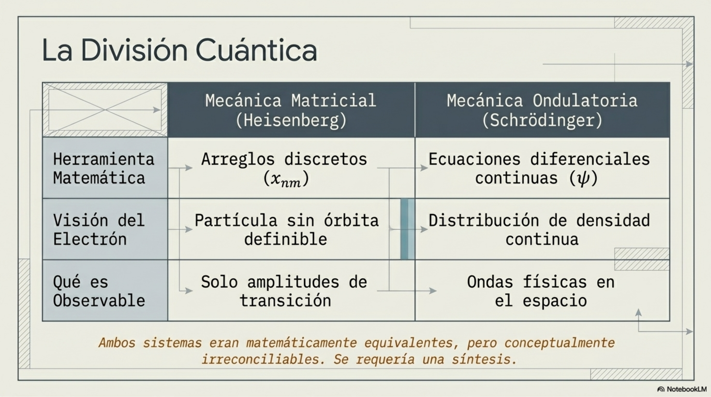

**Aportaciones de Born**

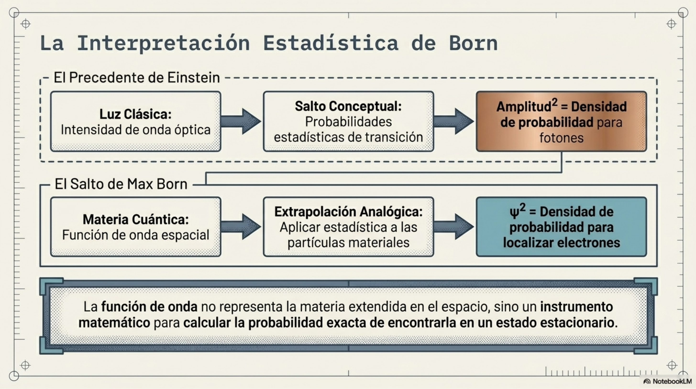


**1.3. Espacios arquimedianos en matemáticas, física e ingeniería**

La dicotomía entre las conceptualizaciones dictatoriales (imposiciones
que privilegian a unos cuantos) y las democráticas (acceso libre para
todos y en todo) fue el escenario cognitivo que posibilitó en la antigua
Grecia el alejamiento de las jerarquías basadas en mitos hacia la
formulación y aplicación de leyes racionales. En esa época el científico
más destacado fue Arquímedes, quien nació en Siracusa en el año 287 a.C.
y murió en el 212 a.C. cuando un soldado romano lo mató durante el
asalto a la ciudad. Arquímedes estudió en Alejandría bajo la tutela de
los sucesores de Euclides. Arquímedes significa en griego "mente
superior": fue el precursor del método científico moderno.


Las conceptualizaciones bimodales consideradas en secciones anteriores
también se dan en el espacio arquimediano: hay enfoques democráticos en
sus trabajos de tipo abstracto y general en matemáticas y fundamentos de
la física; hay enfoques dictatoriales en sus descubrimientos
experimentales y aplicaciones en ingeniería y tecnología militar.
También hay condiciones donde ambas conceptualizaciones son equivalentes
en relación con problemas prácticos, como en el problema de la
falsificación de la corona de oro que el rey Hierón planteó a
Arquímedes.. En esta sección analizamos tres casos de conceptualización
del espacio arquimediano, cada uno relacionado con los tres enfoques
antes descritos.


La obra de Arquímedes representa la síntesis por excelencia entre la
geometría teórica y abstracta y la mecánica tangible y práctica. Para
hacer cálculos, exploraba y realizaba experimentos mentales para tratar
figuras geométricas como objetos formados por pequeños componentes en
equilibrio. Un examen de sus contribuciones revela una mente que se
movía sin esfuerzo entre el mundo de las ideas y el mundo de los
objetos.


**Conceptualizaciones democráticas en matemáticas y física**

<u>Contribuciones en matemáticas</u>

En lo que sigue indicamos los títulos de los diez libros que han
sobrevivido, según Durant (1966): *El método*, *Una colección de Lemas,
La medición de un círculo*, *La cuadratura de la parábola. Sobre
espirales, La Esfera y el Cilindro, Sobre los conoides y esferoides*,
*El Calculador de Arena, El equilibrio plan, Sobre cuerpos flotantes*.


<u>Contribuciones relacionadas con el desarrollo de la física</u>

Para Arquímedes, la ciencia era un esfuerzo unificado para entender el
mundo y para cambiarlo mediante inventos y descubrimientos. Arquímedes
no solo describió fenómenos, los expresó en relaciones matemáticas y los
convirtió en leyes generales. Usó modelos físicos para descubrir
matemáticas y empleó desarrollos matemáticos para explicar la realidad
física. Integró Geometría, Física e Ingeniería al introducir leyes
matemáticas en fenómenos físicos y desarrollar métodos de aproximación
rigurosos en descripción y explicación de fenómenos físicos. Creó
modelos que expresaban relaciones cuantitativas y diseñó herramientas
para medir y actuar sobre el mundo. No solo descubrió leyes, transformó
el conocimiento en tecnología. Navegó con astucia y creatividad en el
rico y poderoso espacio arquimediano que creó y compartió.


En el plano teórico de sus aportaciones consideraremos tan solo tres
ejemplos: la ley de la palanca, la determinación de centros de gravedad
y el principio de flotación.


El Principio de flotación que ahora lleva su nombre es un modelo
cuantitativo del comportamiento de fluidos: establece una condición de
equilibrio entre el peso del cuerpo (W) y la fuerza de empuje (E) que es
igual al peso del volumen desplazado (Vdesp).


**Conceptualizaciones dictatoriales en la solución de problemas
prácticos**

Arquímedes no se limitó a contemplar las formas del mundo: las midió,
probó y manipuló, demostrando una profunda capacidad para traducir y
aplicar principios matemáticos a la realidad física. Esta brillantez
teórica se correspondía con una gran habilidad como ingeniero e inventor
para determinar y controlar las condiciones restrictivas del
funcionamiento de máquinas e instrumentos que diseñó y construyó con el
fin de realizar tareas concretas. Mas que inventar muchos dispositivos
mecánicos se dedicó a entender cómo se transmitía y transformaba la
fuerza, con lo cual sentó las bases teóricas de la mecánica aplicada.
Integró al desarrollo de aplicaciones prácticas su conocimiento de las
leyes de la mecánica del movimiento y del equilibrio.


Las máquinas de Arquímedes no eran ingenios aislados, formaban un
sistema tecnológico defensivo muy completo que convertía principios
físicos en ventaja estratégica real durante el asedio de Siracusa.


La balanza hidrostática atribuida a Arquímedes es un instrumento de
brazos iguales para medir densidades comparando el peso de un objeto de
masa *m* en dos condiciones: cuando el objeto está suspendido en el aire
(su peso es *Waire = mg*) y cuando el mismo objeto está
totalmente sumergido en un fluido, circunstancia que está sujeta al
principio de flotación: en tal caso su nuevo peso es *Wagua =
Waire - E* , donde el empuje *E* que es igual al peso del
volumen del fluido desalojado, en este caso el volumen total del cuerpo
(*Vdes = Vtotal*).

**Conceptualizaciones en la solución del problema de la corona de oro**

Cuentan que el rey Hierón de Siracusa entregó a un joyero un bloque de
oro para que le hiciera una corona, pero cuando la recibió sospechó que
la corona podía tener menos oro que el entregado inicialmente. Le
planteó a Arquímedes su duda y le pidió resolverla.


No existen evidencias de cómo Arquímedes resolvió el problema de la
corona de oro y menos aún si lo abordó siguiendo un enfoque de
conceptualización dictatorial o democrática. Por lo tanto, presentaremos
dos posibles procedimientos para resolver la duda de Hierón y luego
consideraremos la cuestión de la conceptualización bimodal del espacio
arquimediano en relación con el planteamiento e interpretación del
principio de flotación.


Lo anterior puede concretarse haciendo la siguiente consideración: si la
densidad de la corona es $\rho_{corona} = \ $*m/V* y contiene una masa
de oro $m_{o}$ y de plata $m_{p}$ con $m = m_{o} + m_{p}$, entonces el
volumen total de la corona es
$V = \frac{m_{o}}{\rho_{oro}} + \frac{m_{p}}{\rho_{plata}}$

Resolviendo el par de ecuaciones anteriores se obtiene que
$m_{p} = \frac{V - \frac{m}{\rho_{oro}}}{\frac{1}{\rho_{plata}} - \frac{1}{\rho_{oro}}}$
Esto significa que si $V = \frac{m}{\rho_{oro}}$ la corona es de oro
puro y si tal numerador es mayor que cero entonces la corona contiene
plata.

Si la corona contiene plata, mayor es su volumen y mayor es el empuje,
por lo que el peso aparente es menor. Esto significa que un pequeño
cambio en la densidad cuando se pasa del aire al agua, produce un
aumento en el volumen del cuerpo sumergido y por lo tanto un mayor
empuje que es detectable por la diferencia de peso en cada brazo de la
palanca.

El empuje es tal que
$W_{aire} - W_{agua} = {E = \ \rho}_{agua}\text{ }g\text{ }V$. Por lo
tanto, para la corona

$$\rho_{corona} = \ \frac{m}{V} = \ \frac{(mg\rho_{agua})}{(W_{aire} - W_{agua})}
$$

El uso de la balanza convierte un problema geométrico (determinación de
volúmenes) en uno dinámico (cálculo de fuerzas: los pesos aparentes en
el aire y en el agua):

$$\Delta W = (W_{aire} - W_{agua})_{corona} - (W_{aire} - W_{agua})_{oro}
$$

Lo anterior transforma la sospecha cualitativa incierta de Hierón en la
medición cuantitativa precisa de Arquímedes.

En lo que sigue consideraremos la cuestión de si Arquímedes resolvió la
duda que le planteó Hierón siguiendo un enfoque de conceptualización
particular: el democrático o el dictatorial.


El principio de flotación de Arquímedes puede interpretarse como una ley
democrática cuando se considera su universalidad e igualitarismo. Por el
contrario, la conceptualización dictatorial interpreta al principio de
flotación como un instrumento restrictivo de juicio aplicado a un caso
específico.


Esta comparación demuestra cómo el planteamiento de la misma duda y el
propio proceso de resolución del problema puede conceptualizarse de
manera democrática o dictatorial. Esta dicotomía conceptual implica la
posibilidad de aplicar enfoques que van más allá de ser simples
metáforas descriptivas; proponen un marco analítico recurrente y
poderoso que ayuda a comprender la evolución del pensamiento y la
estructuración del conocimiento. Son ejemplos de aplicaciones prácticas
del aprendizaje contextual.


**REFERENCIAS**

Bernal, J. D., *Science in History*.
Cambridge, Massachusetts, MIT Press, (1954).

Durant, W., *The story of civilization.
Vol. 2 The Life of Greece*, New York, Simon and Schuster, (1966).

HELLEMANS, A. y BUNCH, B*. The Timetables of SCIENCE. A Chronology of
the Most Important People and Events in the History of Science*, New
York, Simon and Schuster, (1988).

KLEIN, M., *El pensamiento matemático de la antigüedad a nuestros días*.
Vol.1. Madrid: Alianza Editorial. (1972).

[VERNANT, Jean-Pierre. *Géométrie et astronomie sphérique dans la
première cosmologie
grecque*](https://gallica.bnf.fr/ark:/12148/bpt6k58160321/f3.item). La
Pensée (1963),109, p.82.
