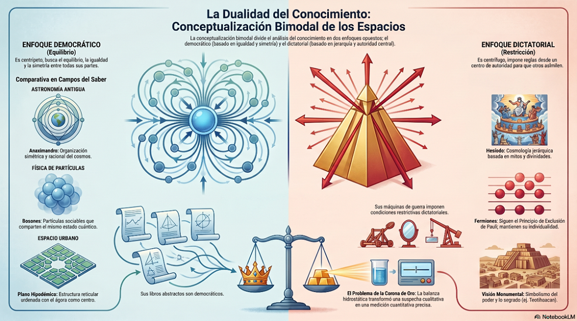
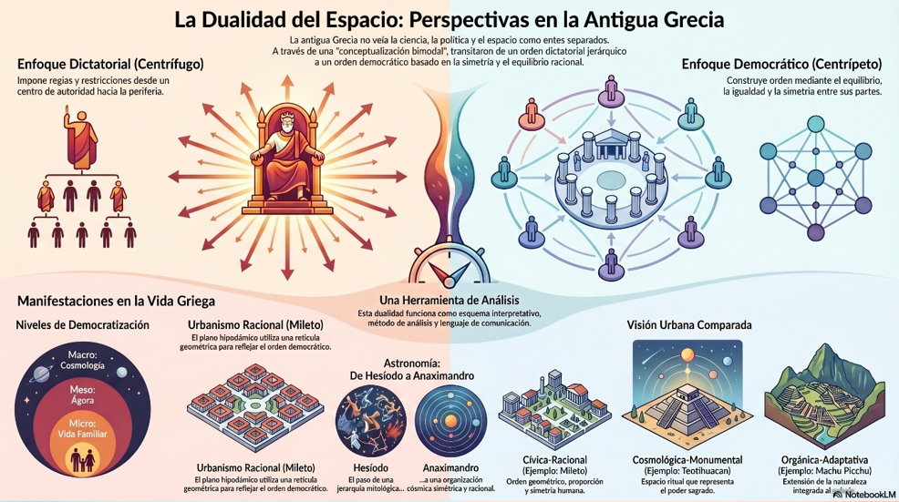
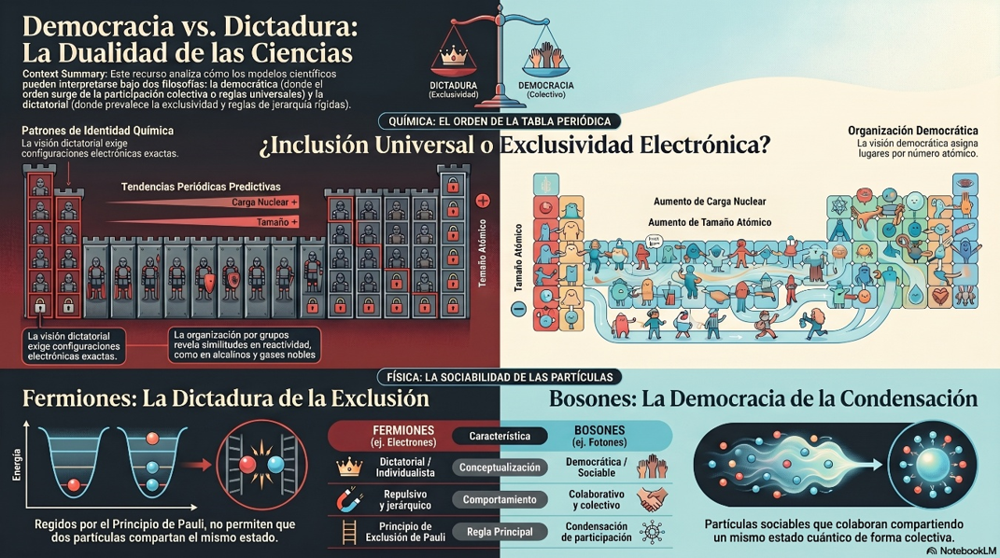
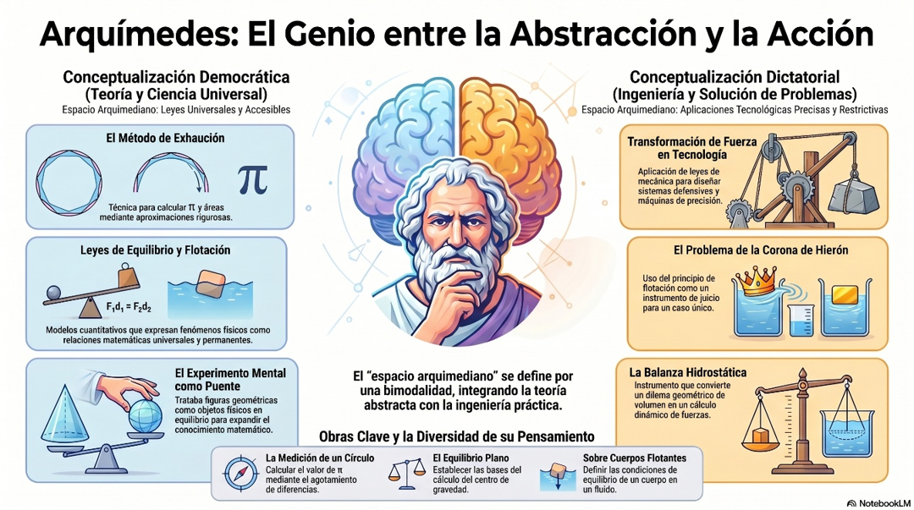
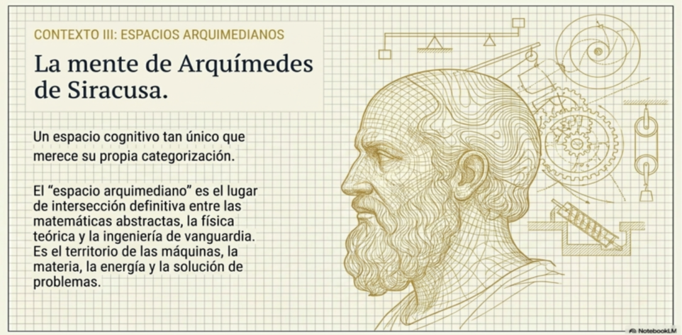

# Capítulo 1. Conceptualización bimodal de los espacios

Conceptualizar significa crear conceptos. Toda conceptualización corresponde a un estilo o manera de concebir, organizar y comunicar conceptos y relaciones conceptuales que expresan y transmiten información y conocimientos. Son maneras de visualizar posibilidades de comprensión y explicación acerca de la estructura y el funcionamiento de sistemas que se desarrollan y describen en determinados espacios.

Existen diferentes tipos de espacios donde lo que se mueve y cambia corresponde a diversas categorías de seres, objetos, circunstancias y procesos. Aquí nos referiremos a los siguientes tipos de espacios: el geométrico, el astronómico, el cognitivo, el sociopolítico, el urbano y el arquimediano.

Proponemos una conceptualización bimodal de estos espacios que opera en términos de dos enfoques o puntos de vista opuestos y con frecuencia conflictivos: el democrático que es válido para todo y todos con el fin de demostrar y ayudar a comprender y el dictatorial que es sólo para algunos cuantos privilegiados con el propósito de que asimilen y transformen. Aplicamos dicha conceptualización bimodal en tres contextos: el comunitario en relación con la Grecia antigua, el cognitivo que trata de matemáticas, química y física, y el individual conectado con la obra de Arquímedes de Siracusa.

**OBJETIVOS Y CONTENIDOS DE LAS SECCIONES**

**1.1. Espacios sociopolíticos, urbanos y astronómicos en la antigua Grecia**

Describir la manera como en la antigua Grecia se conceptualizaron la creación y evolución de los espacios sociopolíticos, urbanos y astronómicos. Considerar en todos los casos los puntos de vista democrático y dictatorial.

* Enfoques dictatoriales y democráticos en la interpretación de espacios
* Construcción de espacios sociopolíticos en la vida de la familia y la comunidad
* Diseño y construcción de espacios urbanos
* Dos conceptualizaciones opuestas del espacio astronómico

**1.2. Espacios cognitivos en matemáticas, química y física**

Explicar cómo las conceptualizaciones dictatoriales o democráticos pueden aplicarse a espacios cognitivos con fines de interpretación en matemáticas, de ordenamiento en química y de clasificación en física.

* Espacio de interpretación de la ecuación de la circunferencia
* Espacio de ordenamiento de la tabla periódica de los elementos químicos
* Espacio de clasificación de las partículas según la física estadística

**1.3. Espacios arquimedianos en matemáticas, física e ingeniería**

Describir las siguientes aportaciones de Arquímedes: libros publicados, método de exhaución, ley de la palanca, determinación del centro de gravedad, principio de flotación, ingeniería aplicada (tornillo hidráulico, polipastos), tecnología militar (catapultas, garras, espejos ustorios) e instrumentos de precisión (balanza hidrostática).

* Conceptualizaciones democráticas en matemáticas y física
* Conceptualizaciones dictatoriales en la solución de problemas prácticos
* Conceptualizaciones en la solución del problema de la corona de oro

  <table style="font-family: 'Times New Roman', Times, serif; font-size: 14px; max-width: 800px; width: 100%; border-collapse: collapse; margin: 20px 0; border: 2px solid #333333; box-shadow: 0 4px 8px rgba(0,0,0,0.1);">
    <thead>
      <tr style="background-color: #f6f8fa;">
        <th colspan="2" style="text-align: center; padding: 12px; font-size: 16px; border: 2px solid #333333;">
          <strong>Tabla 1.1. <em>Eventos y publicaciones en la Grecia antigua</em></strong>
        </th>
      </tr>
      <tr style="background-color: #f0f2f5; font-weight: bold; text-align: center;">
        <th style="padding: 10px; border: 2px solid #333333; width: 50%; text-align: center;">
          Filosofía y Literatura
        </th>
        <th style="padding: 10px; border: 2px solid #333333; width: 50%; text-align: center;">
          Matemáticas, Astronomía y Física
        </th>
      </tr>
    </thead>
    <tbody>
      <tr>
        <td colspan="2" style="padding: 8px 12px; font-weight: bold; text-align: center; border: 2px solid #333333; background-color: #eaeef2;">
          1. Surgimiento: (1000 – 480) a.C.
        </td>
      </tr>
      <tr>
        <td style="padding: 10px; border: 2px solid #333333; vertical-align: top; line-height: 1.5;">
          • Homero: <em>La Ilíada</em> y <em>La Odisea</em> (840) 
          • Hesiodo: <em>Teogonía</em> (entre 700 y 800) 
          • Solón de Atenas: reformas políticas y sociales (638-558) 
          • Pitágoras de Samos (529-475): funda su escuela en Crotona en 530
        </td>
        <td style="padding: 10px; border: 2px solid #333333; vertical-align: top; line-height: 1.5;">
          • Tales de Mileto (624-546): <em>Astrología náutica</em> 
          • Anaximandro de Mileto (610-546): <em>Sobre la naturaleza</em> (El ápeiron, Cosmología) 
          • Parménides de Elea (514-470): <em>De la naturaleza</em> (crítica al movimiento)
        </td>
      </tr>
      <tr>
        <td colspan="2" style="padding: 8px 12px; font-weight: bold; text-align: center; border: 2px solid #333333; background-color: #eaeef2;">
          2. Edad de oro: (480 – 400) a.C.
        </td>
      </tr>
      <tr>
        <td style="padding: 10px; border: 2px solid #333333; vertical-align: top; line-height: 1.5;">
          • Pericles de Atenas (495-429): reformas políticas y sociales (461-429) 
          • Sócrates de Atenas (470-399): (no escribió) 
          • Jenofonte de Atenas (431-354): <em>Anábasis</em> o la <em>Expedición de los diez mil</em> (385-368) 
          • Empédocles de Agrigento, Sicilia (494-434): <em>Sobre la naturaleza</em> (poemas filosóficos)
        </td>
        <td style="padding: 10px; border: 2px solid #333333; vertical-align: top; line-height: 1.5;">
          • Anaxágoras de Clazómenas, Jonia (500-428): <em>Sobre la naturaleza</em> (el Sol es fuego) 
          • Filolao de Crotona (470-380): <em>Sobre la naturaleza</em> (Sol, Tierra y Luna cubiertos de fuego) 
          • Leucipo de Mileto (siglo V) <em>Gran orden del cosmos</em> 
          • Demócrito de Abdera, Tracia (460-357): <em>Pequeño orden del cosmos</em>
        </td>
      </tr>
      <tr>
        <td colspan="2" style="padding: 8px 12px; font-weight: bold; text-align: center; border: 2px solid #333333; background-color: #eaeef2;">
          3. Declinación y caída: (400-146) a.C.
        </td>
      </tr>
      <tr>
        <td style="padding: 10px; border: 2px solid #333333; vertical-align: top; line-height: 1.5;">
          • Platón de Atenas (427-374): crea la <em>Academia</em> en 386-7 
          • Aristóteles de Estagira (384-322) crea el <em>Liceo</em> en 334 
          • Epicuro de Samos (341-270) crea la escuela de filosofía <em>El Jardín (Ho Kepos)</em>: <em>Cartas</em>, <em>Máximas capitales</em> 
          • Imperio de Alejandro Magno (336–323)
        </td>
        <td style="padding: 10px; border: 2px solid #333333; vertical-align: top; line-height: 1.5;">
          • Euclides de Alejandría (325-265?): <em>Elementos</em> 
          • Aristarco de Samos (280-264): <em>Acerca de los tamaños y distancias al Sol y a la Luna</em> 
          • Eratóstenes de Cirena (276-194): <em>Geografía</em>, <em>Sobre la medición de la Tierra</em> 
          • Apolonio de Perga (240-190): <em>Las Cónicas</em> 
          • Arquímedes de Siracusa (287-212): 10 libros
        </td>
      </tr>
    </tbody>
  </table>

**1.1  Espacios sociopolíticos, urbanos y astronómicos en la antigua  Grecia**

El movimiento es el resultado de interacciones, disruptivas o equilibradas, entre las fuerzas impulsivas que evolucionan en el tiempo
y las formas organizadas de las trayectorias que se recorren en determinados espacios. El movimiento de los objetos geométricos se da en
espacios matemáticos. El movimiento de los cuerpos celestes se da en espacios astronómicos. El movimiento de las ideas y las teorías se da en espacios cognitivos. El movimiento de las sociedades se da en espacios sociopolíticos. El movimiento y localización de los seres humanos se da en espacios urbanos. El movimiento de las máquinas, la materia y la energía se da en el espacio arquimediano.

**Grecia en la antigüedad**

Los griegos establecieron un paradigma en el que la ciencia racional,
los principios matemáticos y la filosofía política dejaron de ser
dominios separados, para convertirse en expresiones distintas de una
visión unificada del mundo. Miraron ese mundo, vieron un modelo de
evolución y construyeron una sociedad que reflejaba su comprensión del
cosmos. Se basaron en la idea de que el mundo está racionalmente
ordenado y que la sociedad humana puede y debe estructurarse sobre
principios de razón y equilibrio.

Los logros intelectuales y culturales de la antigua Grecia no estaban
compartimentalizados. La conceptualización de sus espacios pasó de ser
un esfuerzo puramente abstracto para entrelazarse profundamente en el
tejido de su evolución política y social. Los principios que usaron para
racionalizar la composición de los cielos y definir formas geométricas
eran los mismos que emplearon para construir sus ciudades-estado y
organizar sus vidas públicas. Este cambio social ocurrió en paralelo con
una "nueva imagen" de los espacios astronómicos y geométricos.

**Enfoques dictatoriales y democráticos en la interpretación de
espacios**

Esta sección se basa en la conferencia *Géométrie et astronomie
sphérique dans la première cosmologie grecque* de Jean-Pierre Vernant,
donde presenta dos esquemas interpretativos de las formas de evolución e
interdependencia: la visión dictatorial y la democrática.

Un enfoque dictatorial interpreta el espacio mediante reglas impuestas y
restricciones que se aplican del centro a periferia, mientras que un
enfoque democrático ve el espacio a través del equilibrio, la igualdad y
la simetría. El enfoque dictatorial es centrífugo e impone reglas desde
un punto central de autoridad; el enfoque democrático es centrípeto y
construye orden a partir de las propiedades compartidas e iguales de sus
partes constituyentes. Existe una dicotomía entre la restricción
repulsiva de la conceptualización dictatorial y el equilibrio colectivo
de la conceptualización democrática. La conceptualización bimodal de los
espacios es una herramienta conceptual que funciona a la vez como
esquema interpretativo, método de análisis y lenguaje de comunicación.

**Construcción del espacio sociopolítico en Grecia**

Antes de que se establecieran instituciones políticas en Grecia, la
sociedad tenía una estructura jerárquica: el nivel más alto de la
organización social lo ocupaba el rey-sacerdote. Toda la población
estaba bajo las condiciones de dominación y sumisión impuestas por la
dictadura real. La transición de una sociedad dictatorial a una
democrática fue facilitada por desarrollos culturales e intelectuales
uno de los cuales fue la escritura; el otro fue la creación de la polis
griega o ciudad-estado en cuyo centro se encontraba el espacio público
llamado ágora.

En el canto II de La Odisea, Homero narra que Telémaco, hijo de Ulises y
Penélope, convoca una asamblea pública en Ítaca donde denuncia el
comportamiento abusivo de los pretendientes al trono que acosan a su
madre; les acusa que están consumiendo la riqueza de su casa, expresa su
dolor por la ausencia de su padre y pide a los soldados que protejan a
su madre formando un ágora (palabra griega para asamblea).

**Creadores de cultura**

Para caracterizar el proceso de construcción del espacio sociopolítico
Vernant propone considerar la participación de cuatro personajes claves
en el desarrollo cultural de Grecia en la antigüedad: el filósofo
Ferocides de Siros (Ferécides o Pherecydes) (c. 580–520 a.C.), el
historiador y geógrafo Heródoto de Halicarnaso (484 a.C. - 425 a.C.), el
poeta Homero (siglo VIII a.C.) y el arquitecto Hipódamo de Mileto \[(498
– 408) a.C.\].

El filósofo presocrático Ferocides de Siros (Ferécides o Pherecydes) (c.
580–520 a.C.) desempeñó un papel crucial al ser el primer escritor en
publicar obra filosófica en prosa. Escribió libros para transformar
conocimientos privados en posibilidades públicas de discusión,
transformando lo que era posesión de unos cuantos en una fuente de
comunicación accesible para todos.

Heródoto de Halicarnaso (484 a.C. - 425 a.C.), considerado uno de los
primeros grandes historiadores es para algunos el “padre de la
historia”. Cuando murió el dictador Polícrates de Samos, quien había
gobernado aproximadamente entre 538 a.C. y 522 a.C.**,** le sucedió en
el poder su secretario y colaborador cercano Meandrio de Samos
(Maeandrius). Según relata Heródoto, Meandrio declaró que no quería
gobernar como tirano y propuso establecer una forma de gobierno más
equitativa: pidió a todos los ciudadanos que se reunieran en una
asamblea y les informó que se comportaría de manera democrática, en
total desacuerdo con su predecesor.

Homero (siglo VIII) fue el gran poeta épico de Grecia, una figura entre
la historia y la leyenda. Se le atribuyen dos grandes poemas épicos: *La
Ilíada* que narra episodios de la Guerra de Troya, se centra en la
figura de Aquiles y trata temas como la guerra, la gloria, el honor y la
ira. *La Odisea* cuenta el regreso de Odiseo (Ulises) a su hogar; es una
historia de viajes, aventuras y astucia. Ambas obras presentan una
visión profunda de la existencia humana: luchar, sufrir… y luego
intentar volver y reconstruirse.

Uno de los primeros arquitectos urbanos fue Hipódamo de Mileto (498 –
408) a.C. Se la ha considerado el “padre del urbanismo” por abordar la
planificación de las ciudades con criterios racionales.Fue un
organizador racional del espacio y la sociedad, una figura clave en la
transición hacia el pensamiento sistemático en Grecia. Habiendo sido
contemporáneo del auge de la democracia en Atenas, vinculó arquitectura,
política y filosofía. Fue un pensador social que propuso dividir la
sociedad en tres clases (artesanos, agricultores y guerreros) y
distinguir tres tipos de territorios (el sagrado, el público y el
privado).

**Diseño y construcción de espacios urbanos**

La ciudad democrática en la Grecia antigua reflejaba equilibrio y
concordancia entre el diseño socio político y el urbano: había sido
concebida y construida como un sistema centralizado y simétrico
gobernado por principios racionales y democráticos.

Hipódamo propuso organizar las ciudades de manera racional y geométrica,
tal como lo indicó en el plano de la reconstrucción de la ciudad de
Mileto, destruida por los persas en 490 a.C. El correspondiente plano
hipodámico muestra una estructura reticular ordenada de calles anchas y
rectas, con un ágora como centro organizador de la vida comunitaria,
acogedor escenario del discurso público. Aquí urbanismo es orden,
simetría y equilibrio.

A continuación, comparamos el espacio urbano de la ciudad de Mileto con
los espacios de dos construcciones mesoamericanas, la pirámide de
Teotihuacán (cerca del año 450 a.C.) y el palacio de Machu Picchu (cerca
del año 1500 d.C.). Estas construcciones corresponden a tres visiones
muy distintas del espacio urbano: en Mileto es la visión cívica-racional
griega de proporción y simetría; en Teotihuacan es la visión
cosmológica-monumental mexica símbolo de un poder sagrado y en Machu
Picchu es la visión orgánica-adaptativa peruana que expresa equilibrio
entre construcción y medio ambiente.

El diseño urbano del Ágora de Mileto coloca esta construcción en el
centro de un espacio abierto, rectangular y regular rodeado de edificios
públicos como mercados y edificios administrativos. Su función es ser el
foco de la vida política, el comercio y la interacción social. Muestra
una lógica espacial que responde a un diseño concebido para la
participación ciudadana como expresión de la razón, el orden humano y la
vida cívica.

El diseño urbano de la pirámide del Sol en Teotihuacán posiciona esta
construcción a lo largo del eje urbano monumental que es la Calzada de
los Muertos; es una estructura piramidal masiva y axial orientada
astronómicamente en relación con los ciclos solares. Su función es la de
un espacio ritual y religioso dedicado al culto a deidades y a
ceremonias colectivas. Muestra una lógica espacial que impone jerarquía
y representa al cosmos.

El diseño urbano del palacio residencial en Machu Picchu integra esta
construcción a un escenario montañoso que forma parte de un trazado
irregular de terrazas, muros de piedra y desniveles. Su función es la de
un espacio residencial dedicado a la élite inca con propósitos
administrativos y ceremoniales. Muestra una lógica espacial que integra
lo ecológico con lo simbólico y manifiesta armonía, adaptación y
equilibrio.

**Dos conceptualizaciones del espacio astronómico**

Según Vernant, la nueva imagen de la sociedad democrática griega iba en
paralelo con una nueva imagen de los espacios astronómicos: implicó
superar las ideas babilónicas y eliminar los mitos sobre la forma de la
Tierra. Según la astronomía babilónica las estrellas eran divinidades
cuyas intenciones podían percibirse si sus posiciones en el cielo se
observaban y registraban cuidadosamente. De ello se encargaban los
escribas que servían al rey, además de registrar la actividad económica
del reino y de contabilizar todos los acontecimientos celestiales y
terrestres. Su conocimiento era aritmético, sin conexión con ningún
sistema geométrico de representaciones espaciales de posiciones y
movimientos.

Por su parte, la astronomía antigua griega buscaba explicaciones sobre
la estructura del mundo sin apelar a divinidades ni ceremonias rituales,
aunque estaba llena de mitos. Esa visión del universo evolucionó desde
la conceptualización dictatorial de la cosmogonía jerárquica de Hesíodo
de Askra, hacia la conceptualización democrática de la cosmología
simétrica de Anaximandro de Mileto.

**La cosmogonía de Hesíodo**

Hesíodo de Askra, Tebas (cerca del 800 a.C.) fue un poeta de la época
arcaica que introdujo en sus obras una visión moral y práctica de la
vida humana y destacó la importancia del trabajo, la justicia y el
orden. Se le tribuyen dos obras: *Los trabajos y los días*, un poema
didáctico en el que ofrece consejos sobre la vida agrícola, la justicia,
el trabajo y la conducta moral y *Teogonía*, un tratado mitológico que
describe el origen del universo y la genealogía de los dioses.

La *Teogonía* es un relato mitológico que describe la búsqueda de orden
en el cosmos: el mundo no es un caos incomprensible, sino una totalidad
ordenada que puede explicarse. Representa el paso del mythos (el relato
simbólico) al logos (la explicación racional): no solo narra historias
de dioses, intenta explicar el origen del universo (es una cosmogonía
más que una cosmología).

El espacio astronómico que describe la *Teogonía* corresponde a un
modelo puramente geométrico consistente en un recipiente cerrado para
evitar la percepción de luz en el mundo desordenado. Es un mundo
rígidamente jerarquizado verticalmente: en el nivel superior la
autoridad de Zeus y luego en orden descendiente, los dioses inmortales,
los seres humanos y hasta abajo los muertos y los dioses del inframundo.

**La cosmología de Anaximandro**

Anaximandro de Mileto, Jonia (619 – 546) a.C., fue un pensador
originario de Mileto que propuso que el origen de todo (*arché*) no es
algo concreto como el agua (como suponía su maestro Tales) sino una
realidad indeterminada, infinita y eterna. Sugirió que del ápeiron (en
griego: “lo indefinido” o “lo ilimitado”) surgen todas las cosas y a él
regresan, siguiendo una especie de ley natural de equilibrio.

Anaximandro afirmó que los elementos (calor, frío, seco, húmedo) están
en conflicto, pero que existe una especie de justicia cósmica que regula
ese conflicto, que las cosas “pagan” por sus excesos retornando al
ápeiron. Propuso la existencia de un principio originario abstracto que
abría el camino a la explicación racional del cosmos y continuaba la
transición del mito al logos iniciada en la tradición griega. Todo se
explica mediante principios impersonales y necesarios, mediante
relaciones geométricas y condiciones de equilibrio que obedecen
principios abstractos y universales en lugar de referirse a acciones
divinas con propósitos que ni son descriptivos ni explicativos.

Hizo aportaciones científicas en campos tales como: Cosmología (propuso
un modelo del universo donde la Tierra flota en el espacio), Geografía
(elaboró uno de los primeros mapas del mundo conocido), Astronomía
(estudió los cuerpos celestes y sus movimientos) y Biología primitiva
(sugirió que los seres humanos provienen de formas de vida más simples).

Según el modelo cosmológico de Anaximandro todo surge del ápeiron, lo
indefinido; el universo está organizado en anillos concéntricos
alrededor de la Tierra: el Sol sería el anillo más lejano y grande, la
Luna estaría en un anillo más cercano y las estrellas serían aún más
próximas. Pero esos anillos contienen fuego y están envueltos por aire o
niebla de manera que los cuerpos celestes pueden observarse a través de
aberturas en esos anillos. Además, la Tierra flota libremente en el
espacio, cumple con un propósito cercano a un principio de simetría como
explicación física: es toda una visión democrática acerca del universo.

**Evolución del espacio griego**

Las herramientas intelectuales de equilibrio y simetría, forjadas para
crear un cosmos democrático, fueron las mismas herramientas que los
griegos aplicarían al problema de la organización urbana y política.
También reconceptualizaron el universo alrededor de un centro de
equilibrio y reestructuraron físicamente sus ciudades alrededor del
ágora como centro de equilibrio político y social, cuna de la
democracia.

La evolución sociopolítica y científico tecnológica de la Grecia muestra
que resolvieron el diseño de la sociedad humana, la arquitectura urbana
y realidad cósmica, a partir de un proceso de democratización que se
inició en un primer nivel micro de la vida familiar y de la comunidad,
pasó por el nivel meso del ágora y la ciudad- estado y finalmente llegó
al nivel macro de la cosmología esférica.

