**10.2. La naturaleza está fundamentalmente indeterminada**

En 1935 Albert Einstein, Boris Podolsky y Nathan Rosen publican el
artículo: *Can Quantum-Mechanical Description of Physical Reality Be
Considered Complete?* (**Physical Review**, 47(10), 777–780), donde
proponen la teoría de variables ocultas para explicar el fenómeno del
entrelazamiento y la consideran incompatible con la mecánica cuántica.

Ese mismo año Erwin Schroedinger responde con el artículo *Discussion of
Probability Relations between Separated Systems* (**Proceedings of the
Cambridge Philosophical Society**, 31, 555–563), donde introduce el
término *Verschränkung* (entrelazamiento) y explica que tal fenómeno
cuántico ocurre “cuando dos sistemas interactúan y luego se separan, ya
no pueden describirse de forma independiente; el estado de uno está
inseparablemente ligado al del otro.”

En 1964 John Stuart Bell publica *On the Einstein Podolsky Rosen
paradox* (**Physics Physique Fizika**, 1(3), 195–200)*,* donde explica
que, si se viola cierta desigualdad matemática entre correlaciones de
mediciones, los resultados de la mecánica cuántica no están gobernados
por variables ocultas.

En 1972 John Clauser y Stuart Freedman publican *Experimental Test of
Local Hidden-Variable Theories* ***(*Physical Review Letters**, 28(14),
938–941), donde reportan acerca de un experimento para probar si los
fotones contienen "variables ocultas" y para ello utiliza átomos de
calcio como fuente generadora de pares de fotones entrelazados que salen
en direcciones opuestas para pasar por filtros de polarización con
diferentes orientaciones. El análisis de sus mediciones descarta
cualquier forma de teoría local de variables ocultas.

En 1982 Alain Aspect, con la colaboración de Jean Dalibard y Gérard
Roger, publica *Experimental Realization of Einstein-Podolsky-Rosen-Bohm
Gedankenexperiment: A New Violation of Bell’s Inequalities* (**Physical
Review Letters**, 49(2), 91–94.), donde resuelve una falla o laguna
(loophole) relacionada con el experimento de Clauser, hace ajustes en la
configuración del dispositivo de medición y se asegura que ninguna
información previa pueda influir en la emisión de los fotones. Los
resultados proporcionan una conclusión muy clara de que no existen
variables ocultas y que la descripción cuántica es correcta.

En 1998 Anton Zeilinger, con la colaboración de Dik Bouwmeester,
Jian-Wei Pan, Klaus Mattle, Markus Eibl y Harald Weinfurter, publica
*Experimental quantum teleportation* (**Nature**, 390, 575–579.), donde
reporta la producción de pares entrelazados de fotones y utiliza números
aleatorios para hacer cambios en los dispositivos de medición. Además,
emplea señales de galaxias distantes para controlar dichos cambios para
que fueran verdaderamente independientes y libres de cualquier posible
"información secreta" o coordinación local.

Posteriormente se otorga el Premio Nobel de Física de 2022 a Alain
Aspect, John Clauser y Anton Zeilinger “for experiments with entangled
photons, establishing the violation of Bell inequalities and pioneering
quantum information science”.

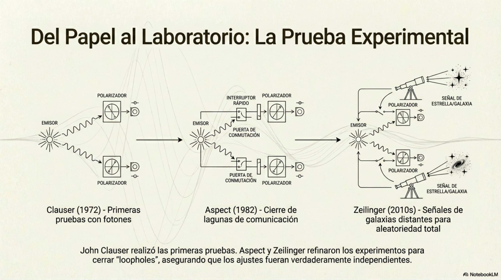

**John Clauser: la primera prueba experimental de la desigualdad de
Bell**

Estructura lógica de los experimentos de Clauser–Freedman

1.  Formulación del conflicto teórico.

El experimento se basa en tres premisas fundamentales: realismo,
localidad e independencia estadística. Según la desigualdad de Bell, si
las partículas contienen variables ocultas predeterminadas, la
correlación entre mediciones resultantes de un gran número de pruebas
nunca superaría un valor matemático específico. La desigualdad de Bell
impone una restricción sobre las correlaciones medibles y la mecánica
cuántica predice violaciones a tal restricción para estados
entrelazados. El análisis de los resultados experimentales plateó la
siguiente alternativa lógica: si se satisface la desigualdad, entonces
el realismo local es viable, pero si se viola, al menos una de las
premisas fundamentales no se satisface, es falsa.

2.  Traducción de las variables teóricas en cantidades medibles.

Clauser y Freedman tradujeron las desigualdades de Bell en términos de
funciones de correlación como tasas de conteo de coincidencias entre dos
detectores de fotones equipados con polarizadores. Sustituyeron
promedios abstractos de variables ocultas por conteos de fotones
accesibles experimentalmente.

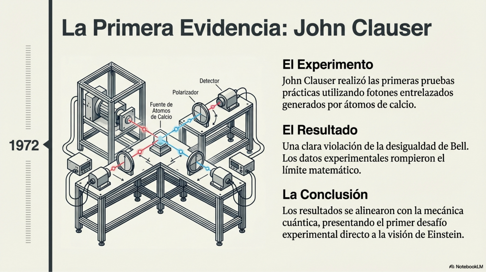

3.  Producción de pares de fotones entrelazados con determinadas
    polarizaciones.

Se utilizaron fuentes de calcio atómico para generar parejas de fotones
entrelazados que simultáneamente salían en direcciones opuestas, cada
uno hacia un filtro de polarización.

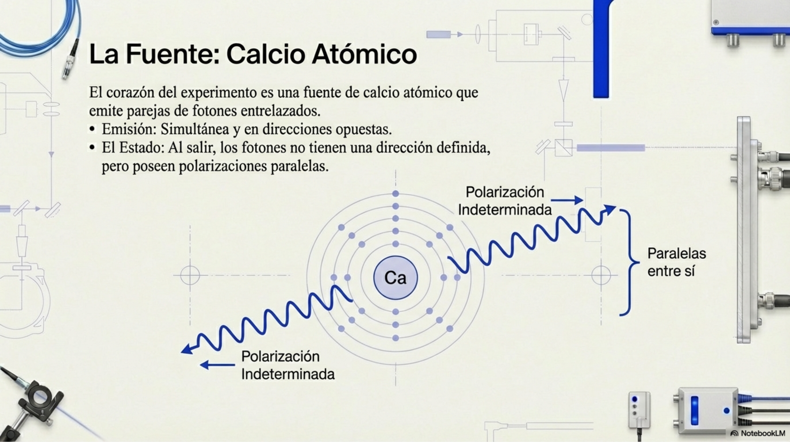

4.  Separación de las estaciones de medición.

Los detectores que recibirán y contabilizarían la llegada de los fotones
después de pasar por los polarizadores se colocaron aproximadamente a 6
metros de distancia, creando así una separación espacial en el registro
de tales mediciones. La frecuencia con la que ambos fotones atraviesan o
no ambos filtros depende del ángulo entre los polarizadores.

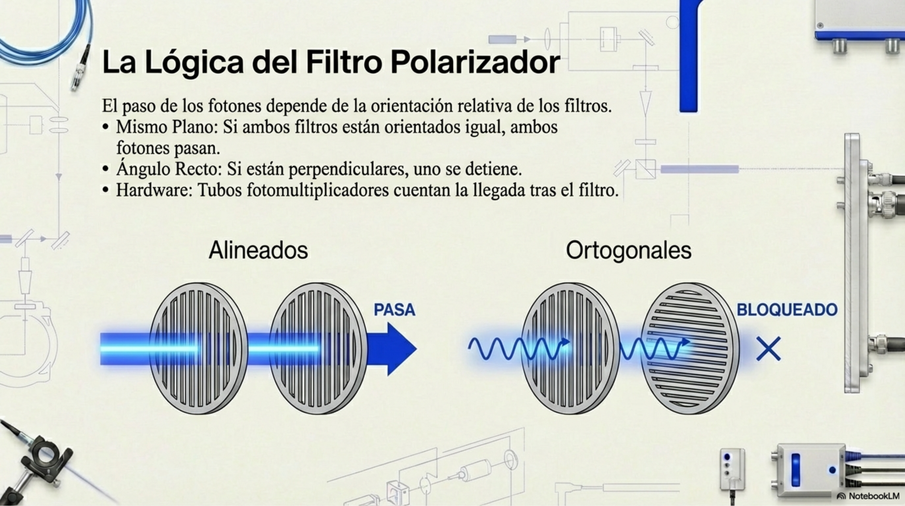

5.  Selección de ángulos entre los polarizadores y recopilación de
    datos.

Para obtener estimaciones de las correlaciones en los conteos de llegada
de los fotones, los experimentadores siguieron el siguiente
procedimiento: 1. Fijar ajustes de polarizadores en ángulos
predeterminados, 2. Acumular conteos de coincidencias, 3. Repetir para
otras combinaciones de ángulos, 4. Calcular funciones de correlación y
evaluar el parámetro CHSH S, y 5. Insertar el valor de S en la expresión
de desigualdad de Bell y comparar con el valor clásico S = 2.

6.  Interpretación de resultados.

Se observaron que las correlaciones superaban el límite clásico de Bell
y concluyeron que los resultados coincidían con las predicciones
cuánticas dentro de los errores experimentales. Esto implicaba que, si
las premisas del realismo local eran correctas, no habría violación
posible. La conclusión del experimento fue contundente: bajo supuestos
de muestreo justo, se descartaban las teorías locales de variables
ocultas.

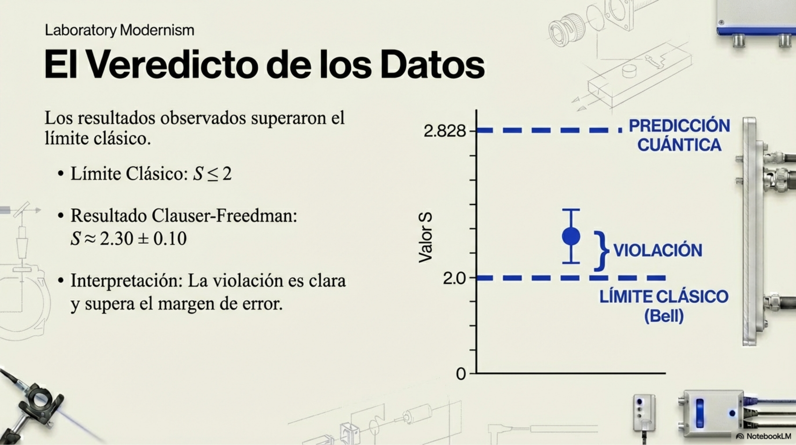

7.  Consideración de limitaciones lógicas en la realización del
    experimento

La conclusión lógica del resultado del experimento quedaba condicionada
a la superación de lagunas o fallas (loopholes) que surgieron cuando la
puesta en práctica del dispositivo experimental no era totalmente
congruente con las suposiciones de realismo y localidad. Para cerrar
estas lagunas (close loopholes) se necesitaba corregir las fallas o
lagunas experimentales detectadas y estar seguros de que las violaciones
observadas desafiaban genuinamente las visiones clásicas del mundo en
lugar de deberse a imperfecciones en el experimento.

El experimento de Clauser–Freedman no cerró dos lagunas:

1.  Laguna de detección: la eficiencia del detector fue baja (~10%) a la
    hora de capturar fotones. El experimento funcionó como un
    procedimiento de "selección sesgada", detectando sólo aquellos
    fotones que mostraban fuertes correlaciones, mientras pasaba por
    alto otros que pudieran haber contenido información oculta
    correspondiente a eventos no detectados.

\(2\) Vacío de localidad: los filtros polarizadores de medición se
ajustaban previamente a ángulos fijos, lo que significa que los ajustes
o cambios en ese mecanismo de detección se producían antes de que el par
entrelazado de fotones saliera de su fuente y no durante su vuelo.

A pesar de las fallas anteriores, el experimento fue revolucionario
porque pasó el análisis de la paradoja EPR del dominio de la filosofía
al de la física de laboratorio: proporcionó la primera evidencia
cuantitativa contra el realismo local y cambió la idea de que "La
mecánica cuántica es extraña" por la evidencia de que "La naturaleza
viola las restricciones clásicas de localidad."

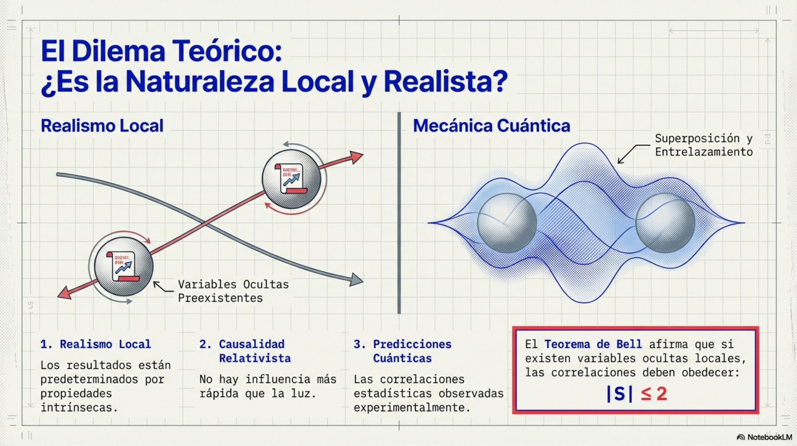

**Alain Aspect: resolver la laguna de la comunicación (close a
loophole)**

Estructura lógica de los experimentos de Alain Aspect y colaboradores.

1.  Partir de un dilema teórico claro.

Las pruebas de Bell diseñadas por Aspect fueron un refinamiento lógico
progresivo de trabajos anteriores. El objetivo seguía siendo probar la
compatibilidad lógica entre el realismo local, las predicciones de la
mecánica cuántica y la causalidad relativista.

2.  Producción de pares de fotones entrelazados.

Como en el experimento de Clauser-Freedman, Aspect utilizó átomos de
calcio excitados por un láser para generar pares de fotones entrelazados
con polarizaciones definidas. La obtención de correlaciones en los
estados de polarización de estos pares de fotones servirá para probar la
desigualdad de Bell.

3.  Separación de las estaciones de medición.

Cada detector incluye un analizador de polarización, un tubo
fotomultiplicador y la electrónica requerida para el conteo de
coincidencias. Los detectores se colocaron separados por 13 m; esta
distancia la recorre la luz en 43 ns.

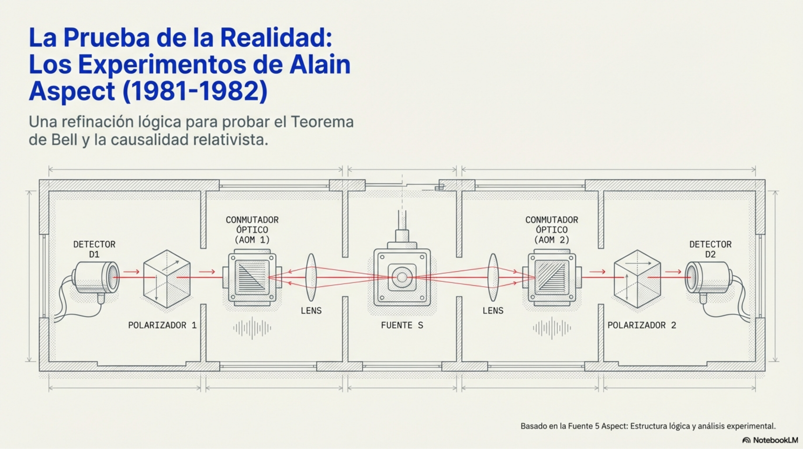

4.  Cambio rápido en la orientación de los polarizadores.

En lugar de fijar las orientaciones de los polarizadores antes de la
salida de los fotones, Aspect introdujo moduladores acusto-ópticos para
producir cambios rápidos y periódicos en las orientaciones de los
polarizadores cuando los fotones aún estaban en vuelo hacia los
detectores. Esta conmutación (switching) se realizaba cada 10 ns, de
manera que el tiempo de conmutación de los polarizadores fuese más corto
que el tiempo de viaje de los fotones entre las estaciones de medición.

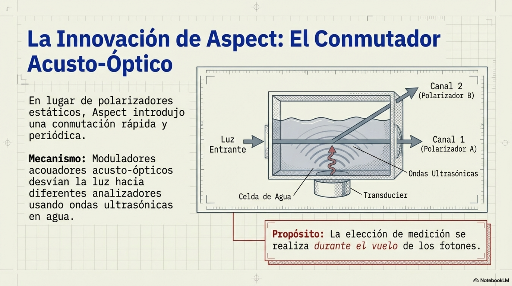

5.  Medición de las tasas de coincidencia y cálculo del parámetro S.

Después de pasar por el polarizador, cada fotón era detectado por un
fotomultiplicador y luego registrado. El valor calculado de S violó la
cota clásica de Bell S \> 2 y se acercó a la predicción cuántica de
$\mid S \mid \approx 2\sqrt{2} \approx 2.828$. El resultado obtenido fue
$\mid S \mid \approx 2.70 \pm 0.05.$

6.  Obtención de una conclusión lógica.

Los experimentos de Aspect demostraron que, incluso cuando los ajustes
en la medición cambiaban durante el vuelo de los fotones, las
correlaciones observadas seguían violando la desigualdad de Bell. Por lo
tanto, el entrelazamiento cuántico no podía explicarse utilizando
teorías que preservaran tanto la localidad como la preexistencia de
variables ocultas.

7.  Revisión del cierre de lagunas de la comunicación.

Los experimentos anteriores indicaron que existía una laguna en la
medición: si previamente se hacían ajustes en la medición antes de que
se emitieran los fotones, podría haberse transmitido información que
influyera en la forma de la emisión. Además, la información acerca del
cambio en la orientación del polarizador del lado izquierdo del
dispositivo experimental no debería llegar al polarizador del lado
derecho antes de que se éste cambiara su orientación.

<table>
<colgroup>
<col style="width: 25%" />
<col style="width: 38%" />
<col style="width: 35%" />
</colgroup>
<thead>
<tr class="header">
<th colspan="3">Tabla 10.3. Resumen comparativo de experimentos de
entrelazamiento.</th>
</tr>
</thead>
<tbody>
<tr class="odd">
<td>Dimensión lógica</td>
<td>Clauser–Freedman (1972)</td>
<td>Aspect (1981–1982)</td>
</tr>
<tr class="even">
<td>Papel histórico</td>
<td>Primera prueba experimental de las desigualdades Bell con fotones
entrelazados.</td>
<td>Pruebas más refinadas y decisivas que resuelven las fallas
detectadas.</td>
</tr>
<tr class="odd">
<td>Marco teórico</td>
<td>Basado en la prueba de la desigualdad de Bell caracterizada por el
criterio de CHSH.</td>
<td>Formulación explícita de CHSH con ajustes de polarizadores
dependientes del tiempo.</td>
</tr>
<tr class="even">
<td>Sistema físico</td>
<td>Cascada de átomos de calcio que produce pares de fotones
entrelazados.</td>
<td>Cascadas atómicas de calcio como antes y mejoras en configuraciones
ópticas.</td>
</tr>
<tr class="odd">
<td>
Observable

de entrelazamiento
</td>
<td>Correlaciones de polarización de pares de fotones.</td>
<td>Correlaciones de polarización de pares de fotones.</td>
</tr>
<tr class="even">
<td>Características de la fuente</td>
<td>Decaimiento de cascada atómica radiativa (estados 4p → 4s →
3p).</td>
<td>Mejoría en la fuente: mayor eficiencia en el registro.</td>
</tr>
<tr class="odd">
<td>Arreglos de medición</td>
<td>Orientación fija del polarizador durante cada emisión de la pareja
de fotones.</td>
<td>Cambio rápido en las orientaciones de polarizadores durante el vuelo
de fotones.</td>
</tr>
<tr class="even">
<td>Prueba de suposición lógica clave</td>
<td>Realismo local (valores de polarización predeterminados) de acuerdo
con criterio de localidad.</td>
<td>Realismo local con prueba más fuerte de la condición de
localidad</td>
</tr>
<tr class="odd">
<td>Parámetro de Bell (S)</td>
<td>Violación experimental consistente con la predicción cuántica.</td>
<td>Violación más cercana a la predicción cuántica; mayor significado
estadístico.</td>
</tr>
<tr class="even">
<td>Cambios de orientación en polarizadores.</td>
<td>Estática (ajustes elegidos antes de cada emisión de fotones).</td>
<td>Dinámico (cambio durante el vuelo de los fotones).</td>
</tr>
<tr class="odd">
<td>Control de fallas</td>
<td>No se resolvió completamente la falla de localidad.</td>
<td>Reducción significativa de la falla de localidad</td>
</tr>
<tr class="even">
<td>Eficiencia en la detección</td>
<td>Detección de baja eficiencia (se requiere muestreo más
confiable).</td>
<td>Sigue siendo baja la detección de eficiencia (continua la detección
de la falla).</td>
</tr>
<tr class="odd">
<td>Significado estadístico</td>
<td>Clara violación de la desigualdad de Bell pero confianza
moderada.</td>
<td>Mayor precisión y mejor concordancia con la predicción de la
mecánica cuántica.</td>
</tr>
<tr class="even">
<td>Estructura lógica del argumento</td>
<td>Si existen variables ocultas locales, se cumple la desigualdad de
Bell, hay violación y se cuestiona el realismo local</td>
<td>Si se cumplen variables ocultas locales y la localidad, se cumple
CHSH ≤ 2, la medición de S ≈ 2,7 implica un mayor debilitamiento del
realismo local.</td>
</tr>
<tr class="odd">
<td>Impacto epistemológico</td>
<td>Demostración de tensión empírica entre realismo local y mecánica
cuántica</td>
<td>Reforzamiento del caso empírico contra variables ocultas
locales</td>
</tr>
<tr class="even">
<td>Avance conceptual</td>
<td>Primera operación de la prueba de la desigualdad de Bell</td>
<td>Cambios variables en el tiempo en las orientaciones de los
polarizadores.</td>
</tr>
</tbody>
</table>

**Anton Zeilinger: el vínculo cósmico y la conectividad global**

Para perfeccionar aún más los experimentos de Aspect, Zeilinger propuso
cerrar las lagunas restantes; es decir, eliminar las fallas
experimentales detectadas. Además, realizó experimentos sobre
teletransportación cuántica, intercambio de entrelazamientos, pruebas de
Bell a larga distancia y comunicación cuántica por satélite. El
procedimiento seguido para realizar tales experimentos comprendió las
siguientes etapas:

(1). Preparación de un estado entrelazado (generar uno o más pares de
fotones en un estado entrelazado bien definido).

(2). Separación espacial (enviar los fotones entrelazados a ubicaciones
muy alejadas y asegurar una separación entre los detectores mejor aún
que en los experimentos de Clauser y Aspect).

(3). Elección de la base de medición (seleccionar aleatoriamente los
cambios en las orientaciones de los polarizadores utilizando generadores
de números aleatorios de alta velocidad).

(4). Evento de medición (realizar mediciones de polarización y registrar
resultados de forma independiente en cada estación; los resultados deben
ser estadísticamente independientes localmente y las correlaciones deben
calcularse globalmente).

(5). Análisis de correlación (calcular probabilidades conjuntas y
funciones de correlación; probar desigualdades de Bell o límites de
fidelidad de teletransportación).

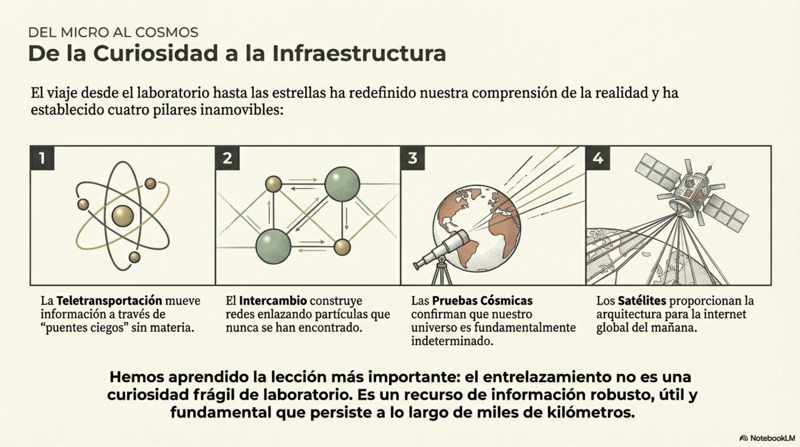

<u>Teletransportación cuántica: transmitir información sin movimiento de
materia</u>

Si en el mundo clásico se quiere transmitir información, hay que mover
la materia donde se transporta; por ejemplo, hacer que se propague un
pulso de electrones o una onda de luz. En cambio, en la
teletransportación cuántica se utiliza el entrelazamiento entre
partículas para conseguir que la transferencia de la información se
logre sin movimiento de materia: la información es transferida sin que
tenga que ser intercambiada durante el tránsito entre partículas. La
estructura lógica de la teletransportación comprende los siguientes
pasos:

1\. Preparación: los investigadores crean un par de partículas
"mensajeras" entrelazadas (fotones 2 y 3) y las envían a detectores en
diferentes ubicaciones.

2.  Introducción: se agrega una tercera partícula (fotón 1), que lleva
    el estado cuántico desconocido que deseamos teletransportar.

3\. Medición: Se miden los “estados Bell " en los fotones 1 y 2. Esta
medición conecta los dos fotones, pero destruye efectivamente sus
identidades cuánticas individuales.

4\. Adquisición: Condicionada al resultado específico de las mediciones
anteriores, el fotón 3 se ajusta para adquirir el estado original del
fotón 1.

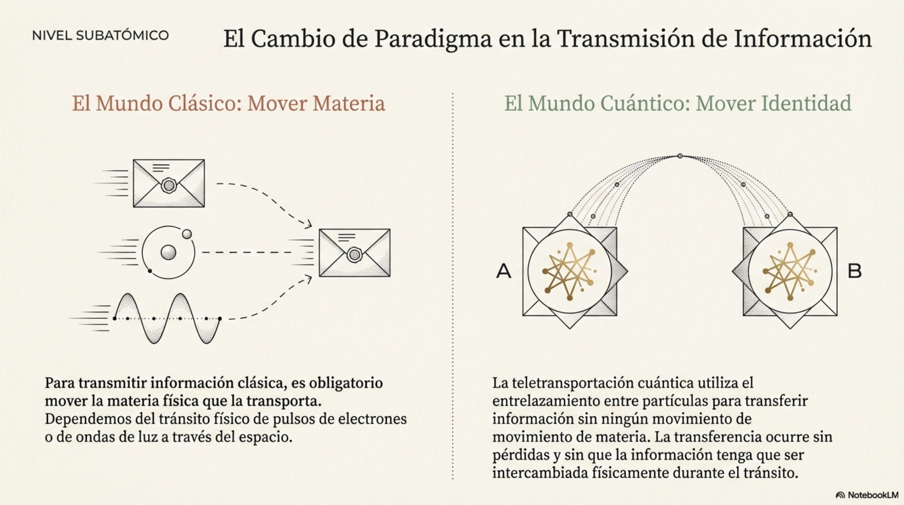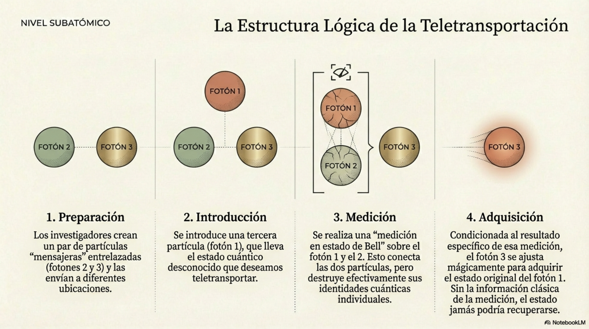

<u>Intercambio de entrelazamientos: construcción de redes cuánticas</u>

| En las telecomunicaciones modernas, se utilizan fibras ópticas para transportar la luz, con el inconveniente de los fotones son absorbidos por el vidrio. Para resolver esto de forma clásica y evitar la pérdida de la señal durante la transmisión suelen emplearse amplificadores que en distintos lugares de la trayectoria leen la señal y la amplifican. Zeilinger resolvió esto usando el intercambio de entrelazamientos, un proceso que permite formar una cadena de fotones entrelazados sin tener que "leer" la información contenida en el interior de cada uno de ellos. |
|---------------------------------------------------------------------------------------------------------------------------------------------------------------------------------------------------------------------------------------------------------------------------------------------------------------------------------------------------------------------------------------------------------------------------------------------------------------------------------------------------------------------------------------------------------------------------------------|

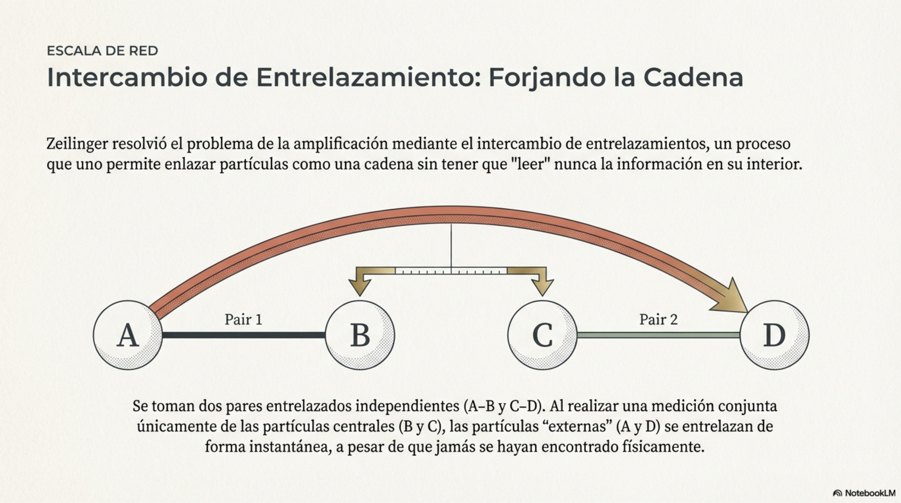

Si se toman dos pares de fotones entrelazados que son independientes
(A–B y C–D) y se realiza una medición conjunta de los fotones centrales
(B y C), Zeilinger demostró que las partículas "externas" (A y D) se
entrelazan, aunque nunca se hayan encontrado. Así se forma una red
cuántica de conexiones, implicando que el entrelazamiento es una
propiedad relacional, no intrínseca de los fotones. Es una conexión
establecida a través del acto de medir en sí, más que el resultado de
compartir historias individuales.

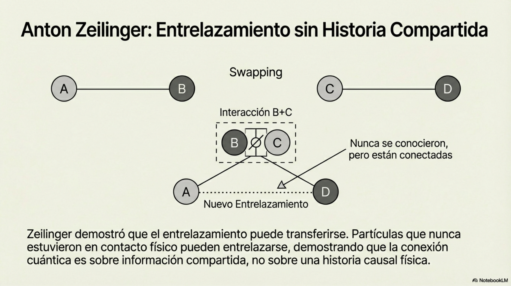

<u>Pruebas de Bell a largas distancias</u>

Para demostrar que la conexión entre partículas era verdaderamente
indeterminada y no estaba gobernada por "variables ocultas", Zeilinger
sacó sus experimentos de los laboratorios y los llevó al campo; hizo
experimentos en las islas Canarias y centró sus experimentos en tres
aspectos clave: gran separación espacial, selección aleatoria de la base
de detección y alta eficiencia de detección.

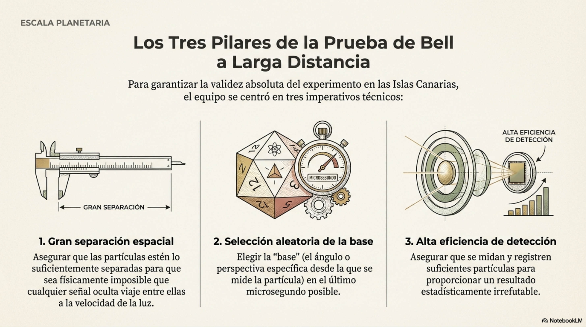

Para contrarrestar el argumento de que las decisiones "aleatorias" que
hace una computadora pueden llegar a ser predecibles, Zeilinger utilizó
señales de luz de galaxias distantes para controlar sus filtros de
medición. Como esta luz salió de su fuente hace miles de millones de
años, no podría estar "al tanto" de cuándo se realizaría un experimento
en la Tierra.

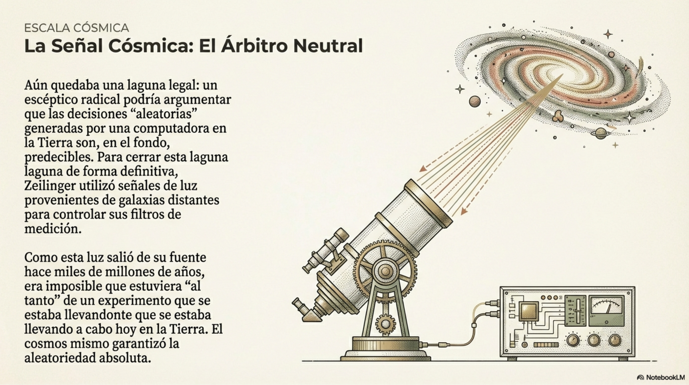

Los experimentos realizados proporcionaron los siguientes resultados:

1\. Integridad de la mecánica cuántica: demostración de que la teoría se
mantiene firme a lo largo de cientos de kilómetros.

2\. Indeterminación: confirmación de que la naturaleza es
fundamentalmente aleatoria y no guiada por "instrucciones secretas".

3\. Cierre de lagunas (corrección de fallas experimentales):
demostración de que los ajustes de medición son verdaderamente
independientes, usando el cosmos como árbitro neutral.

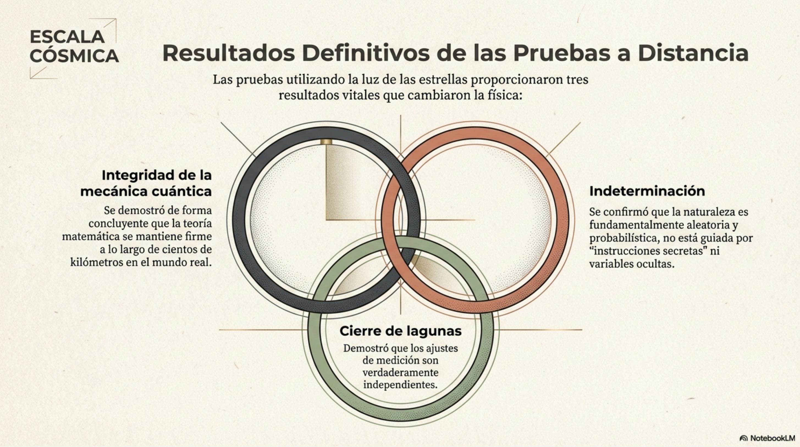

<u>Comunicación cuántica: satélites para entrelazarse con las
estrellas</u>

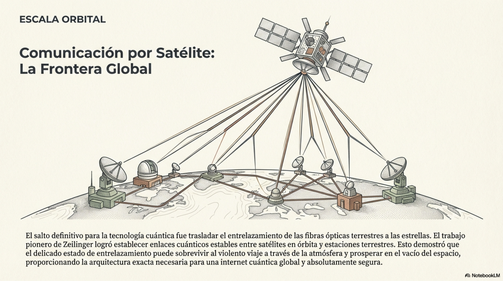

Una internet cuántica basada en los métodos de Anton Zeilinger es
intrínsecamente más segura que la internet clásica por las siguientes
razones:

Ausencia de información en tránsito: En la teletransportación cuántica,
la información se transfiere sin movimiento de materia y no se
intercambia durante el tránsito entre las partículas. Como no existe un
pulso de luz o un haz de electrones que viaje por un cable llevando el
mensaje, nada puede interrumpir la transmisión del mensaje.

Conexión sin lectura: El intercambio de entrelazamiento permite enlazar
partículas en cadena sin tener que leer la información que es
transmitida. En mecánica cuántica, el acto de medir o leer una partícula
destruye su identidad cuántica individual. Por ello, si alguien
intentara observar la información, colapsaría el estado cuántico,
evidenciando inmediatamente el intento de intrusión.

Aleatoriedad protegida por el Cosmos: Las pruebas de Zeilinger
confirmaron que la naturaleza es fundamentalmente aleatoria y no está
guiada por instrucciones secretas o variables ocultas. Al usar señales
de galaxias distantes para asegurar que las mediciones sean
independientes, se garantiza que el sistema sea impredecible para
cualquier observador externo.

Doble llave de seguridad: Para que el receptor adquiera el estado
original de la información, necesita obligatoriamente el resultado de
una medición clásica realizada en el origen. Sin esta información
clásica, el estado no puede recuperarse, lo que significa que poseer
solo la partícula cuántica no sirve de nada para un interceptor.

Arquitectura robusta por satélite: El uso de satélites permite que estos
enlaces cuánticos sobrevivan al vacío de la atmósfera terrestre y del
espacio interestelar, creando una arquitectura global donde el
entrelazamiento funciona como un recurso de información robusto y útil
que persiste a través de miles de kilómetros.

**10.3. La segunda revolución cuántica**

La segunda revolución cuántica representa una transición revolucionaria
en ciencia y tecnología: en el siglo pasado partió de la elaboración de
teorías y la realización de experimentos y actualmente permite
desarrollar una infraestructura tecnológica global de grandes alcances.
Para conseguirlo se han conjugado tres factores: la herramienta
diagnóstica en que se convirtió la desigualdad de Bell, la confirmación
empírica que generaron los experimentos de entrelazamiento y las
aplicaciones prácticas que han propiciado los avances de las tecnologías
cuánticas.

Las tecnologías de la segunda revolución cuántica no son sólo
metodologías, dispositivos, servicios y productos; se han transformado
en sistemas de procesamiento de información cuántica. En tal escenario
el entrelazamiento, la coherencia y la superposición cuántica pasaron de
ser fenómenos que necesitan explicarse, a ser actualmente recursos
controlables diseñados para hacer posible el desarrollo, entre otros, de
la computación, la comunicación y la medición de precisión.

**Computadoras cuánticas**

Las computadoras cuánticas (ordenadores) utilizan partículas
entrelazadas para procesar información aprovechando las propiedades de
los estados entrelazados. Las partículas entrelazadas actúan como una
sola unidad, independientemente de la distancia entre ellas y lo que
ocurre con una partícula determina inmediatamente el estado de la otra
partícula.

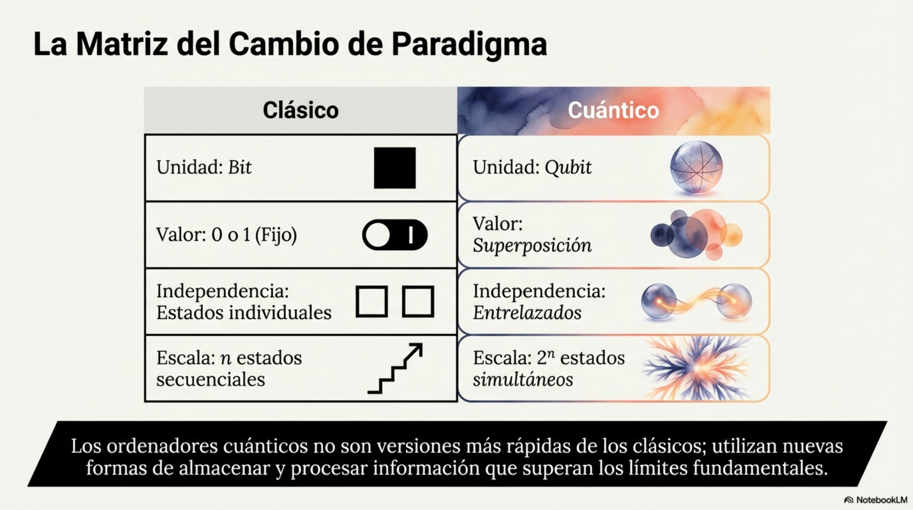

Un quibit de información existe en múltiples estados simultáneamente; no
tiene un valor fijo hasta que se mide. Como consecuencia de la medición
desaparecen todas las posibilidades que existían simultáneamente y la
indeterminación previa desaparece. Es entonces que se produce un colapso
en la información que conduce a la determinación clásica de solo dos
posibilidades: cero o uno. En tales circunstancias, la generación del
entrelazamiento requiere que se combinen las siguientes propiedades: la
preparación de qubits, la creación de la superposición, la interacción
física controlada entre qubits y la formación de un estado cuántico
conjunto no separable.

Dos qubits se entrelazan cuando están vinculados mediante una
interacción cuántica controlada que correlaciona los correspondientes
estados cuánticos: el sistema pasa de un estado separable a un estado no
separable (entrelazado). El entrelazamiento aparece porque los qubits
dejan de tener estados individuales y el estado físico real pertenece al
sistema completo; es decir, la información ya no está localizada en cada
qubit, sino distribuida globalmente. Además, en un ordenador cuántico,
los qubits se entrelazan mediante puertas cuánticas (quantum gates) que
crean correlaciones entre los qubits para que después se realicen
colectivamente los cálculos que se necesitan para efectuar procesos
tales como inicialización, superposición, creación de entrelazamiento,
interferencia y medición.

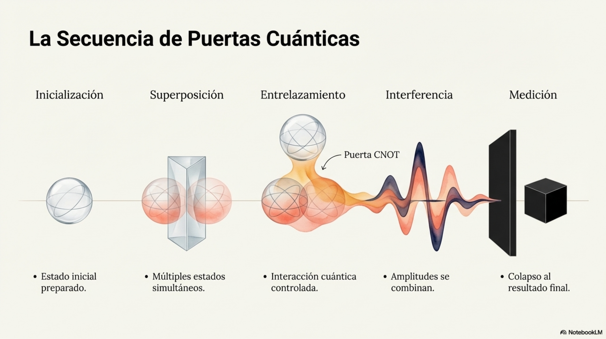

**Comunicaciones encriptadas**

Actualmente experimentamos el tránsito de una seguridad basada en la
complejidad algorítmica hacia una cimentada en la aplicación de
propiedades como el entrelazamiento. Este cambio redefine el sentido de
confiabilidad en la transmisión de los mensajes cuando la privacidad es
una consecuencia de cómo funciona el universo a nivel subatómico. En las
comunicaciones cuánticas el entrelazamiento crea correlaciones perfectas
y toda medición externa destruye esas correlaciones, por lo que el
sistema mismo actúa como detector de espionaje. Este tipo de
comunicaciones tienen tres propiedades revolucionarias.

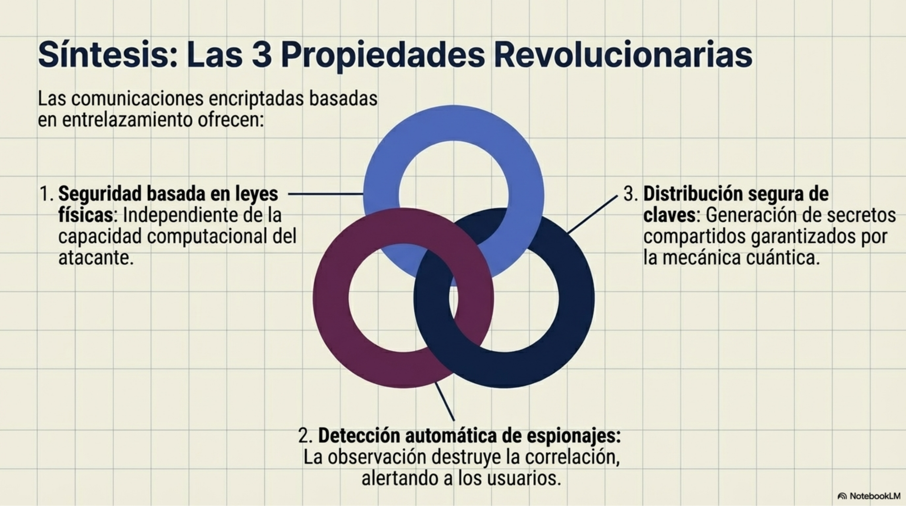

Existen grandes diferencias entre la aplicación de algoritmos
matemáticos y la aplicación de principios físicos; por ello la
criptografía clásica difiere de la criptografía cuántica.

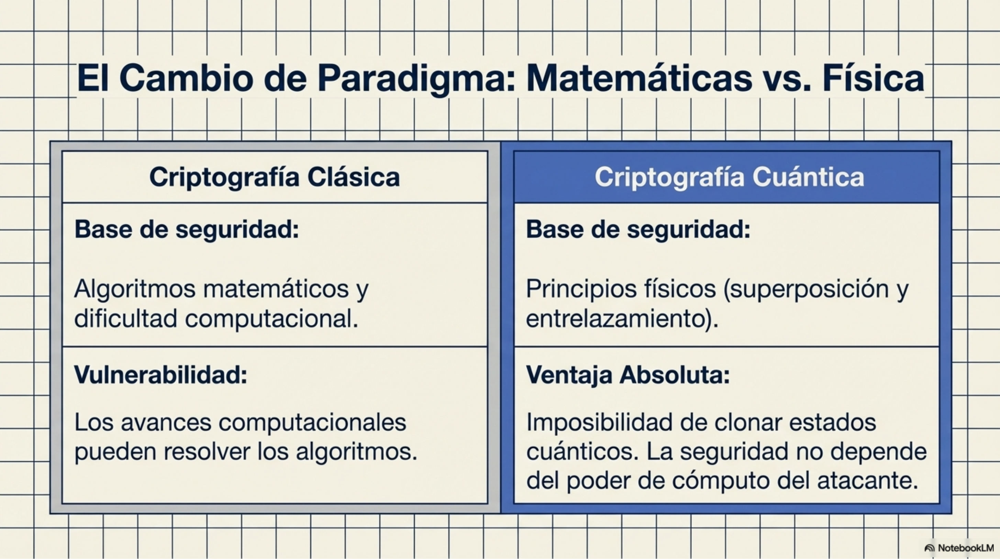

La propiedad esencial de la criptografía cuántica es que cualquier
intento de observación deja una huella detectable, lo cual, en
principio, convierte a la comunicación cuántica en intrínsecamente
segura. Cualquier sistema de comunicación de alta seguridad debe cumplir
con cinco funciones críticas identificadas en la teoría de la
información para garantizar la confianza entre las partes:
Confidencialidad, Integridad del mensaje, Autenticación y Distribución
segura de claves.

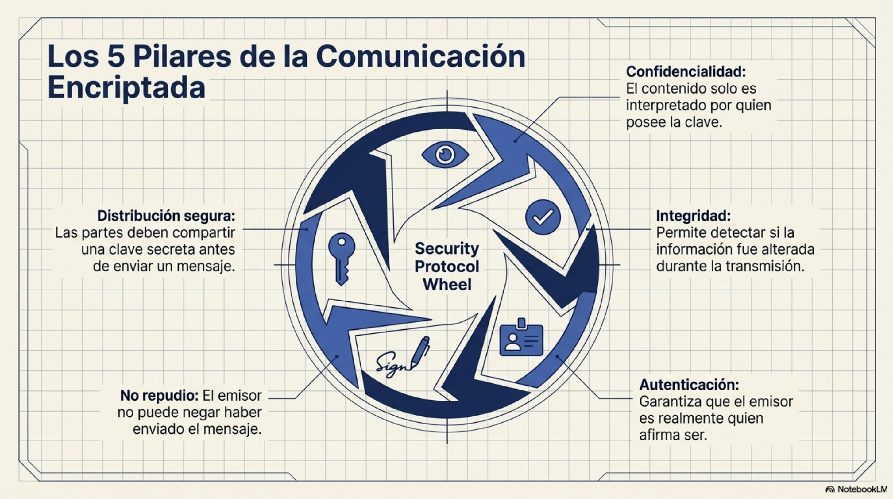

El entrelazamiento interviene en el diseño y aplicación de dos
procedimientos de seguridad.

1)  La distribución cuántica de claves (Quantum Kee Distribution: QKD)
    entre dos usuarios quienes comparten pares de partículas
    entrelazadas.

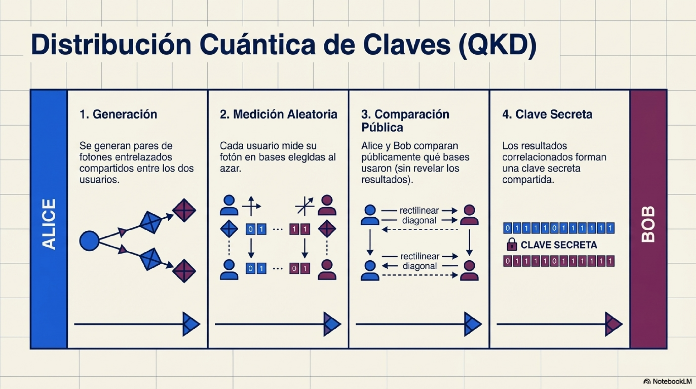

2)  La detección automática de espionaje: si un espía intenta hacer
    alguna medición durante la transmisión rompe el entrelazamiento e
    introduce errores estadísticos en las correlaciones.

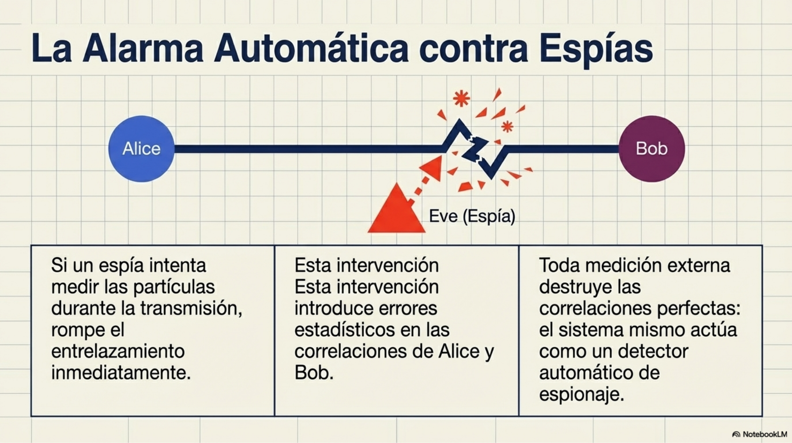

La conexión entre la violación de la desigualdad de Bell y la seguridad
criptográfica indica que la seguridad en el manejo de claves puede
certificarse a partir de correlaciones cuánticas que no pueden
explicarse mediante teorías clásicas locales. La desigualdad de Bell
permite probar empíricamente la existencia de correlaciones cuánticas no
locales.

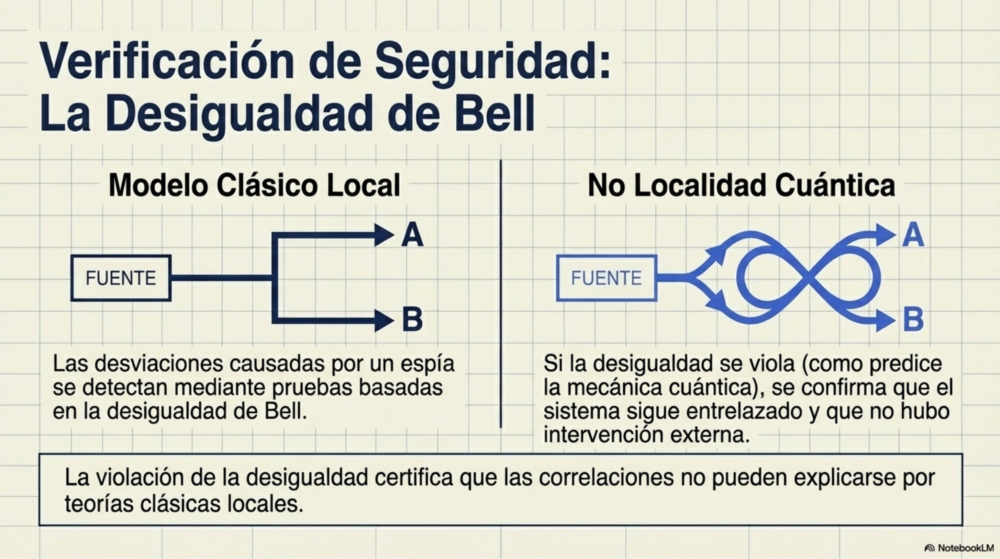

El parámetro $S\ $es una cantidad que mide la fuerza de las
correlaciones entre los resultados de mediciones realizadas sobre dos
sistemas físicos separados (por ejemplo, dos fotones). Es una medida
experimental de la correlación entre sistemas cuánticos; es una prueba
de la existencia de la no localidad cuántica.

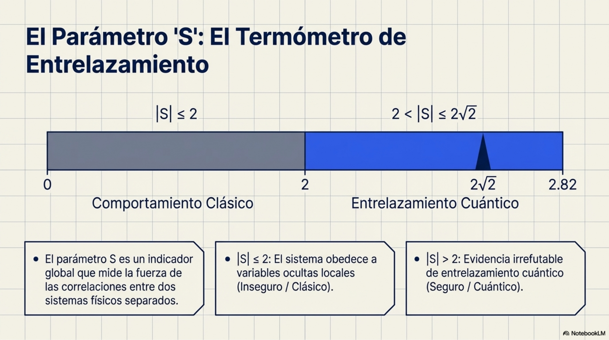

En tecnologías modernas, tales como la criptografía cuántica, las redes
cuánticas y la computación cuántica, el valor de $S\ $indica cuánto
entrelazamiento utilizable existe en el sistema. Cuanto mayor es $S$ más
fuerte es el entrelazamiento y mayor puede ser la seguridad en los
protocolos criptográficos.

**Mediciones de gran precisión**

La metrología cuántica se propone hacer mediciones precisas mediante el
diseño, construcción y operación de aparatos y dispositivos
experimentales de gran sensibilidad. El objetivo es realizar mediciones
en sistemas cuánticos para obtener valores cuantitativos de magnitudes
físicas asociadas a tiempos, duraciones, distancias, frecuencias,
velocidades, aceleraciones, temperatura, gravitación, intensidad de
campo magnético …

Un sistema cuántico funciona como un portador de información que
interactúa con el entorno y luego es leído por una medición. El
desarrollo de esta componente de la segunda revolución cuántica ha
producido, entre otros muchos productos, relojes atómicos y sensores de
campo magnético, así como la interferometría ultrasensible que ha
permitido detectar ondas gravitacionales.

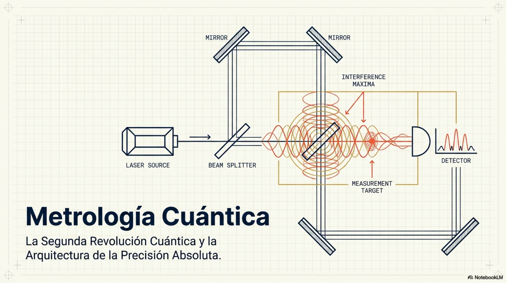

Como resultado del control directo de estados cuánticos individuales, la
comprensión de la realidad científico-tecnológica que nos presenta la
segunda revolución cuántica se basa en cuatro evidencias: la conexión
instantánea, el olvido de las variables ocultas, la validación
experimental y la no localidad del universo.

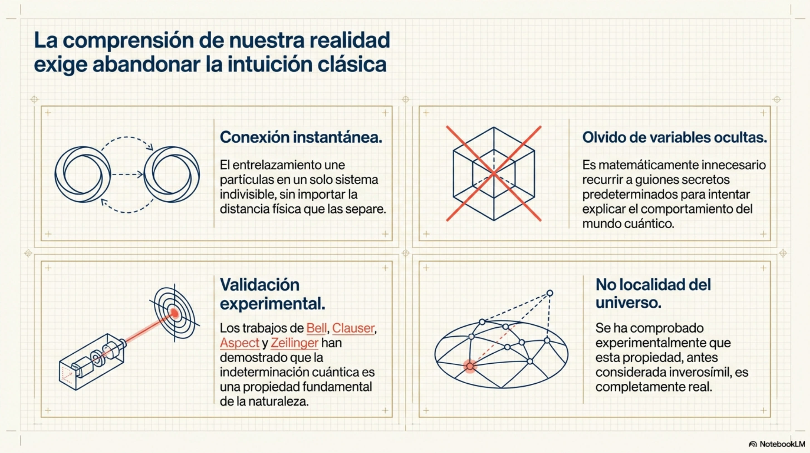

En la metrología clásica, la precisión de una medición suele mejorar
cuando se repite el experimento muchas veces, de manera que la
incertidumbre estadística típica disminuya como: $\frac{1}{\sqrt{N}}$ ,
donde $N$es el número de partículas (fotones, átomos o mediciones). Este
límite se conoce como límite estándar cuántico (Standard Quantum Limit).
En la metrología cuántica se utilizan estados cuánticos correlacionados,
especialmente entrelazados, para alcanzar un límite más favorable:
$\frac{1}{N}$ , el llamado límite de Heisenberg, que representa la
máxima precisión permitida por la mecánica cuántica. La metrología
cuántica explota tres propiedades esenciales: la superposición, el
entrelazamiento y los estados comprimidos.

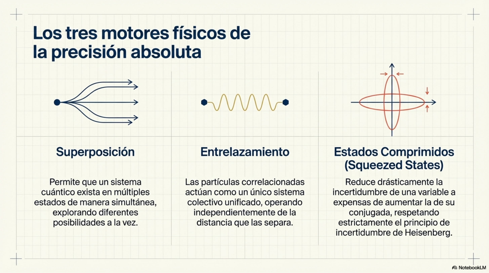

El procedimiento general utilizado en la metrología cuántica se expresa
en términos de un protocolo que permite convertir un parámetro físico
invisible en información medible; comprende tres fases operativas: la
codificación, la información, la amplificación y la extracción.

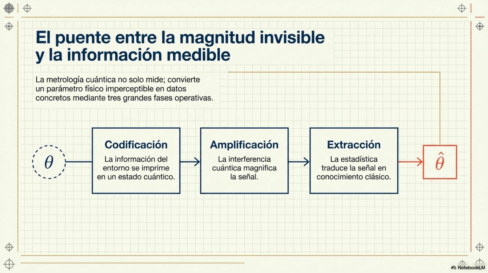

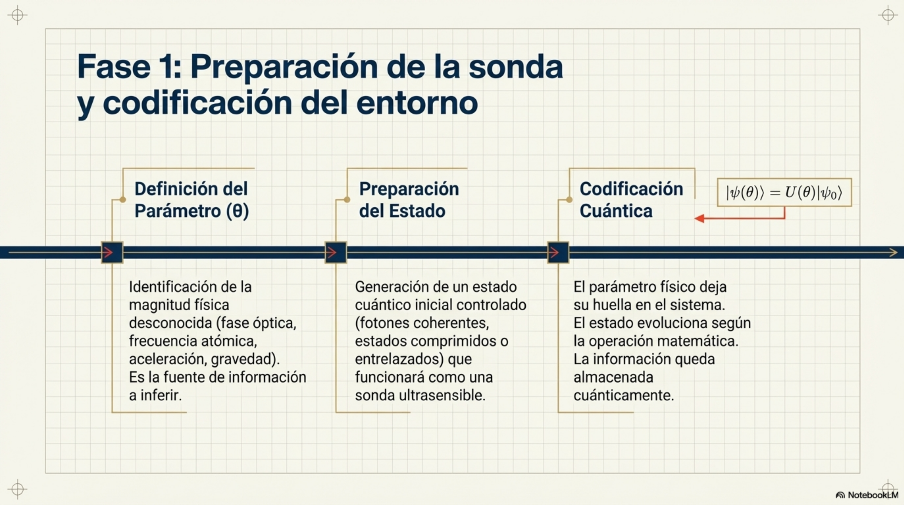

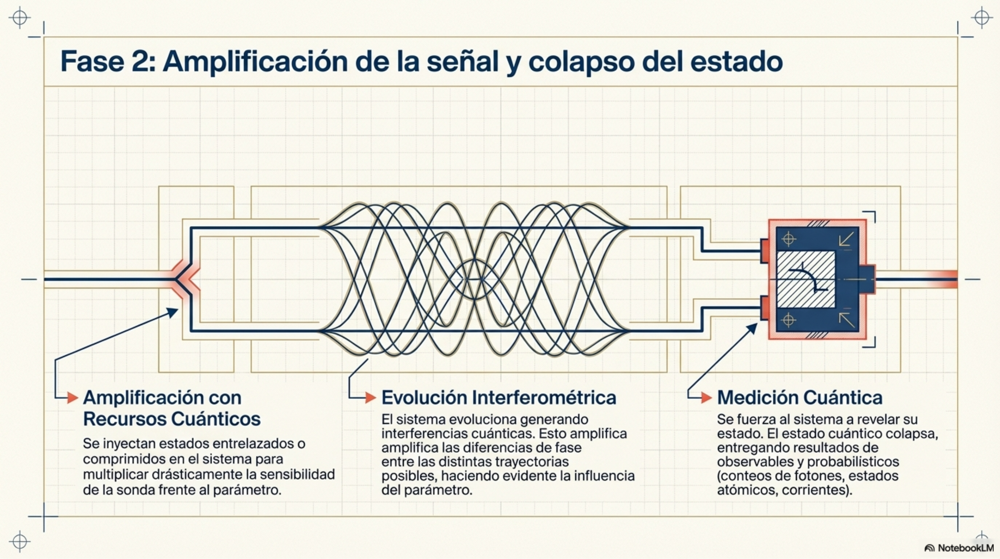

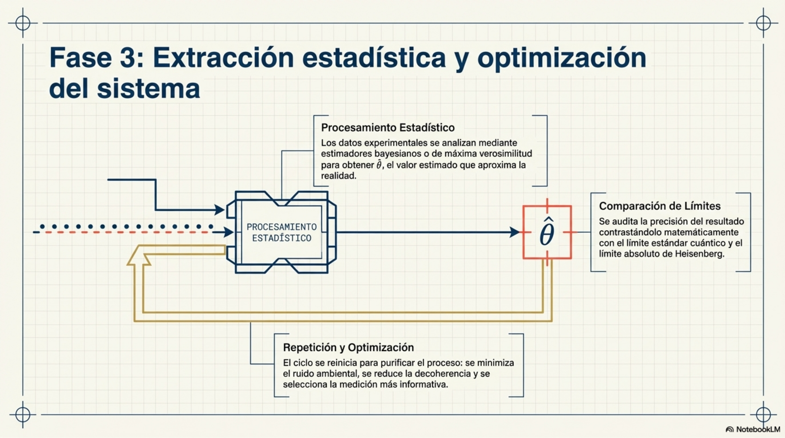

**Arquitectura informacional común en la metrología cuántica, la
criptografía cuántica y los experimentos de Bell**

La metrología cuántica, la criptografía cuántica y los experimentos de
Bell pueden verse como tres aplicaciones diferentes de una misma
arquitectura informacional basada en la preparación de estados cuánticos
y en la manipulación o interacción controlada, así como en la medición y
el análisis estadístico de los resultados. Son aplicaciones que
representan un mismo procesamiento de información diseñado para resolver
tres tipos de problemas: la medición ultra precisa, la comunicación
segura y la realización de pruebas fundamentales acerca de la realidad
física. Aunque los objetivos son distintos, las tres actividades siguen
el mismo flujo lógico de procesamiento de información cuántica; lo que
cambia son sus objetivos y los tipos de aplicaciones tecnológicas que
propician.

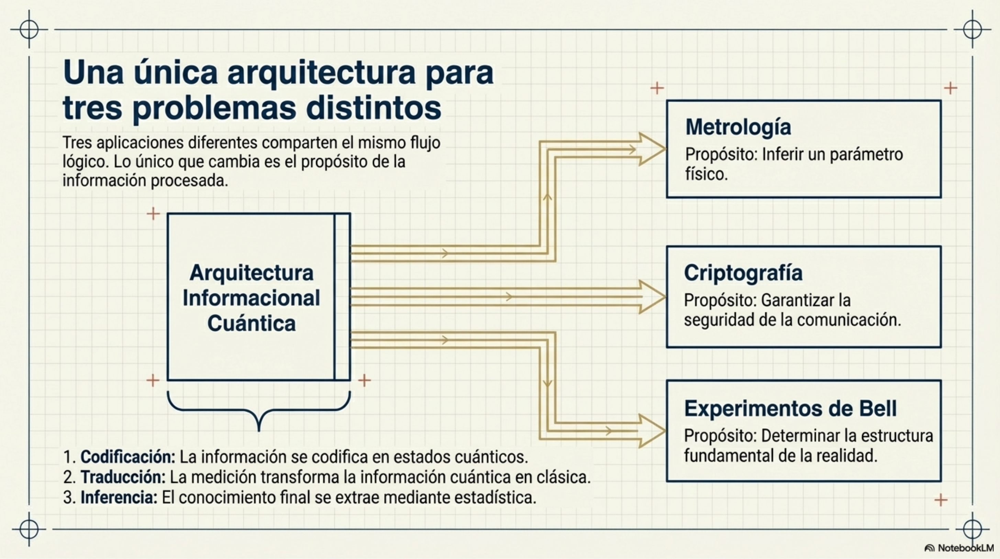

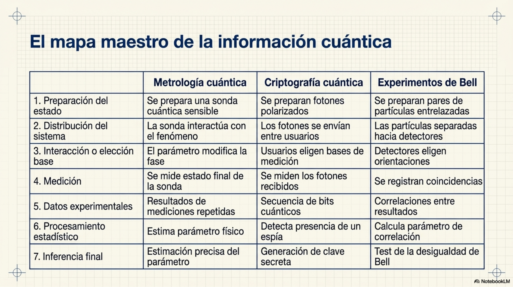

**Aplicaciones tecnológicas**

Entre las tecnologías que mayor desarrollo e impacto han tenido en la
segunda revolución cuántica destacan los relojes atómicos, los sensores
cuánticos y los detectores de ondas gravitacionales. Todos estos
dispositivos utilizan los mismos recursos cuánticos fundamentales, cada
uno de los cuales tiene una función específica: la superposición para la
codificación de la información, la coherencia para la evolución del
sistema, la interferencia para la conversión de fases en señales, la
medición cuántica para la extracción de información y la estadística
cuántica para la estimación de parámetros.

<u>Relojes atómicos</u>

Un reloj atómico es un dispositivo de medición del tiempo que utiliza la
frecuencia extremadamente estable de una transición energética entre los
estados cuánticos de un átomo. En lugar de depender de engranajes
mecánicos o de osciladores electrónicos convencionales, el reloj atómico
se sincroniza con una frecuencia natural de la materia, lo que permite
una precisión extraordinaria (errores menores a 1 segundo en millones o
incluso miles de millones de años).

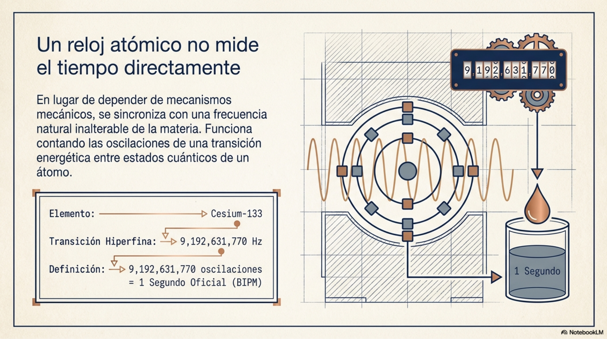

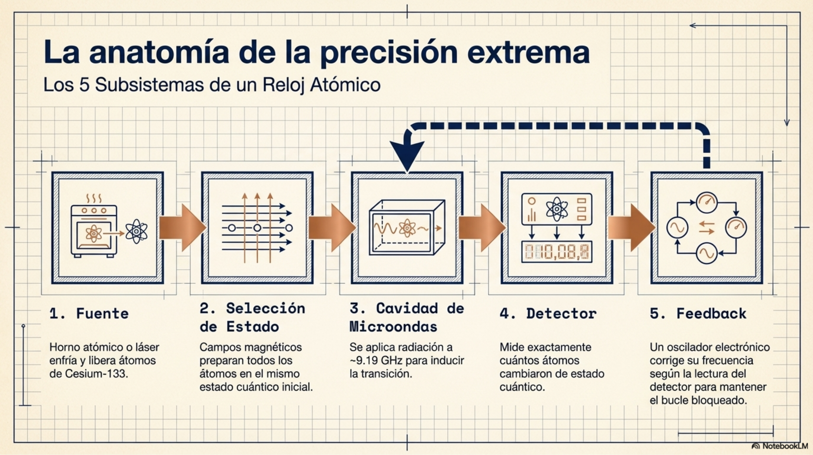

<u>Sensores cuánticos</u>

El principio físico de la mayoría de los sensores cuánticos indica que
una magnitud externa modifica la fase de un estado cuántico coherente y
para ello se crea una superposición cuántica; después la magnitud física
en cuestión cambia la fase del sistema, la cual se mide mediante
interferencia. Entre los sensores más utilizados están los magnetómetros
empleados en neurociencias, geofísica y detección de materiales; los
gravímetros aplicados en la exploración geológica y las mediciones
geodésicas, así como los acelerómetros que son útiles para la navegación
sin Global Positioning System (GPS).

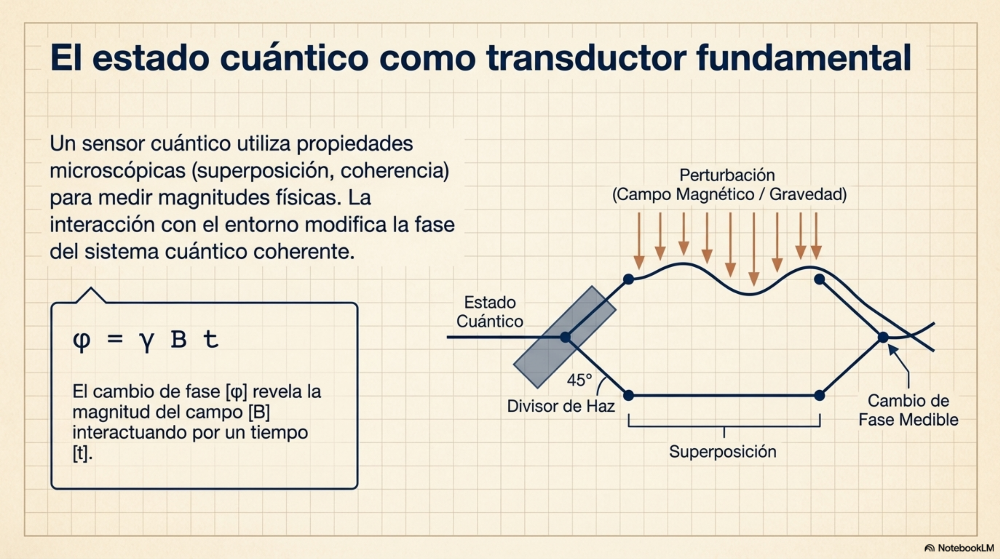

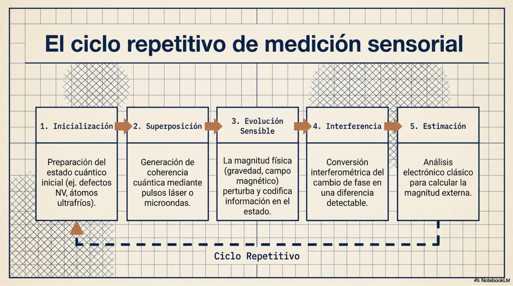

<table>
<colgroup>
<col style="width: 100%" />
</colgroup>
<thead>
<tr class="header">
<th>
<u>Detector LIGO de ondas gravitacionales</u>

Para que funcione el interferómetro utilizado en el proyecto LIGO
(Laser Interferometer Gravitational-Wave Observatory) tienen que
cumplirse las siguientes etapas:

(1) Preparación de un estado físico sensible: entrada de un haz láser
coherente.

(2) Interacción física: la onda gravitacional modifica los brazos del
interferómetro;

(3) Codificación de la información: la deformación del espacio-tiempo
produce un cambio en la fase óptica de los haces de luz que recorren los
brazos del interferómetro de longitud ligeramente distinta por efecto de
la llegada de la onda gravutacional.

(4) Medición: interferencia de los haces láser que se recombinan en
el detector y

(5) Extracción de información: reconstrucción de la señal de la onda
gravitacional. LIGO mide la tensión (strain) gravitacional h = ΔL/L
donde ΔL representa el efecto del paso de la onda gravitacional y L = 4
km es la longitud de cada brazo del interferómetro.
</th>
</tr>
</thead>
<tbody>
</tbody>
</table>

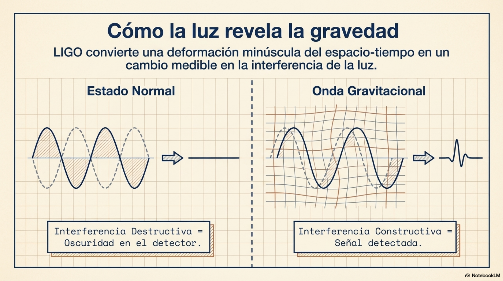

| 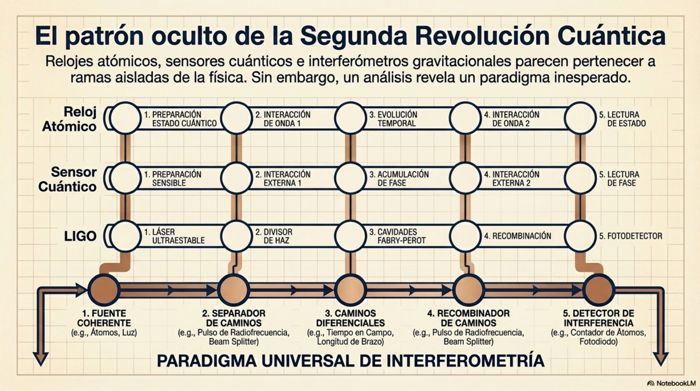                    |     |     |     |
|---------------------------------------------------------------|-----|-----|-----|

**El entrelazamiento cuántico en el desarrollo de la Segunda Revolución
Cuántica**

El entrelazamiento cuántico ha pasado de ser una “paradoja” conceptual
para convertirse en un recurso operativo central en el desarrollo de la
Segunda Revolución Cuántica. Como componente final de esta sección 5.3,
consideraremos la evolución de tal trayectoria cognitiva en términos de
cuatro ejes de análisis: como ingrediente de explicación científica,
como etapa de cálculo cuántico, como elemento en la observación y la
medición y como factor de desarrollo tecnológico. Aplicaremos este
análisis a tres manifestaciones de la Segunda revolución Cuántica: las
computadoras cuánticas, las comunicaciones encriptadas y la metrología
cuántica.

<u>El entrelazamiento en la computación cuántica</u>

Inicialmente el entrelazamiento era un fenómeno extraño difícil de
explicar, pero se ha transformado en un recurso físico explotable que
permite procesar, transmitir y proteger información de maneras
imposibles en la física clásica. El siguiente cuadro muestra las
principales etapas de su evolución en relación con la computación
cuántica

| Etapa                         | Función del entrelazamiento         |
|-------------------------------|-------------------------------------|
| 1935 (Schrödinger)            | Concepto teórico                    |
| 1964 (Bell)                   | Criterio físico verificable         |
| 1970–80 (Aspect, Clauser)     | Evidencia experimental              |
| 1990–2000 (Zeilinger y otros) | Recurso manipulable                 |
| Actualidad                    | Recurso tecnológico y computacional |

Eje 1: la explicación científica

El entrelazamiento ha proporciona la base física de la no localidad,
formalizada por John Stewart Bell, para explicar por qué los sistemas
cuánticos no pueden describirse como suma de partes independientes y
para señalar la parte central de lo que pueda llamarse la ventaja de lo
cuántico en relación con el hecho de que ciertas correlaciones no pueden
simularse eficientemente con sistemas clásicos.

En computación cuántica, lo anterior implica que un sistema de *n*
qubits entrelazados contiene información no factorizable, distribuida
globalmente y además, que la potencia computacional no está en cada
qubit individual, sino en sus correlaciones**.**

Eje 2: el cálculo cuántico

El entrelazamiento es como un combustible para el cómputo en los
procesos de generación, procesamiento y consumo. En computación cuántica
basada en mediciones (*measurement-based quantum computing*) se prepara
primero un estado altamente entrelazado (cluster state) y luego se
procede a hacer el cálculo a partir de mediciones locales.

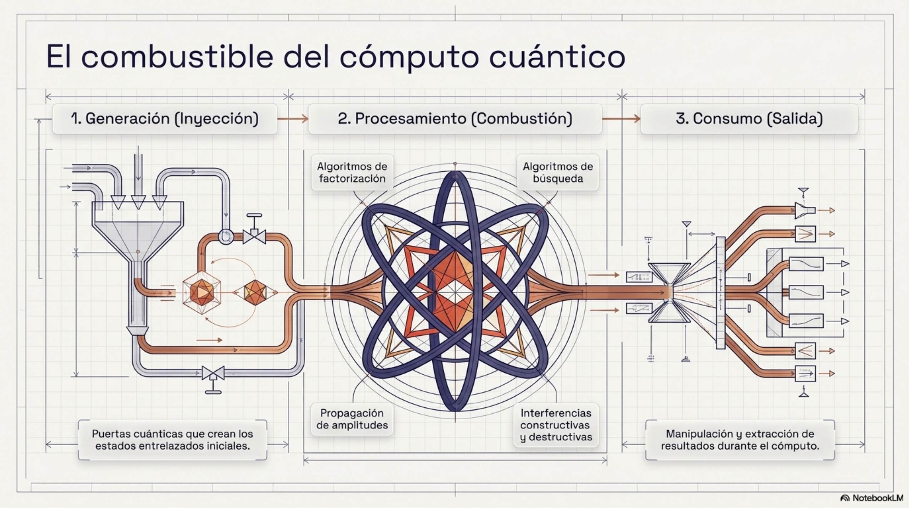

Eje 3: la observación y la medición

El entrelazamiento juega un papel clave en cómo se extrae información en
casos como los siguientes: en el colapso y redistribución del estado
global, en la teleportación cuántica y en la corrección de errores.

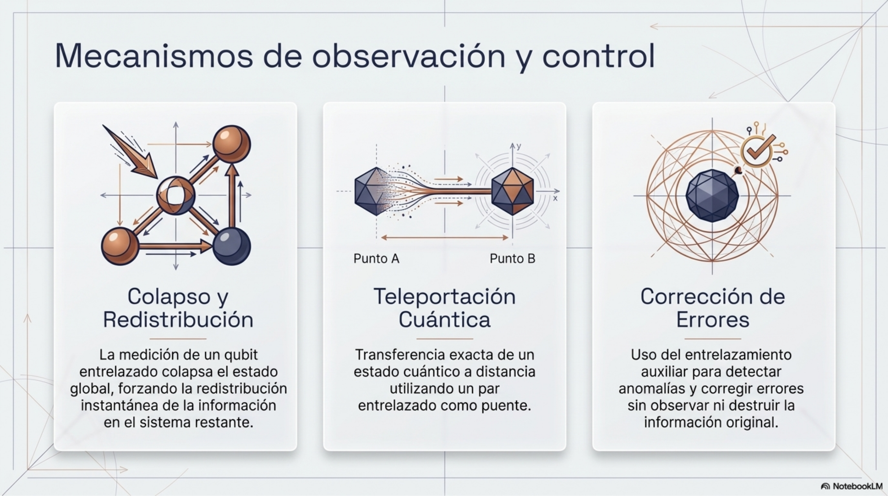

Eje 4: el desarrollo tecnológico

El entrelazamiento ha impulsado el desarrollo de tecnologías tales como:
las computadoras cuánticas (desarrollo de plataformas, diseño de
hardware para generar entrelazamiento controlado o mantener coherencia
el mayor tiempo posible ); las comunicaciones cuánticas (establecer
redes cuánticas, realizar funciones criptográficas, distribución de
claves cuánticas y de repetidores cuánticos); la metrología cuántica
(generar sensores ultra para su uso en relojes atómicos y en
interferometría) y proyectos para el internet cuántico.

<u>El entrelazamiento en las comunicaciones encriptadas</u>

El entrelazamiento transformó la criptografía de un problema matemático
en un fenómeno físico verificable; mientras que en criptografía clásica
la seguridad dependía de la dificultad computacional, en la criptografía
cuántica la seguridad depende de la estructura de la realidad física. El
siguiente cuadro muestra las principales etapas de su evolución en
relación con la criptografía cuántica

| Nivel       | Función del entrelazamiento      |
|-------------|----------------------------------|
| Explicación | Fundamenta la seguridad física   |
| Operación   | Genera correlaciones para claves |
| Medición    | Detecta espionaje                |
| Tecnología  | Permite redes cuánticas seguras  |

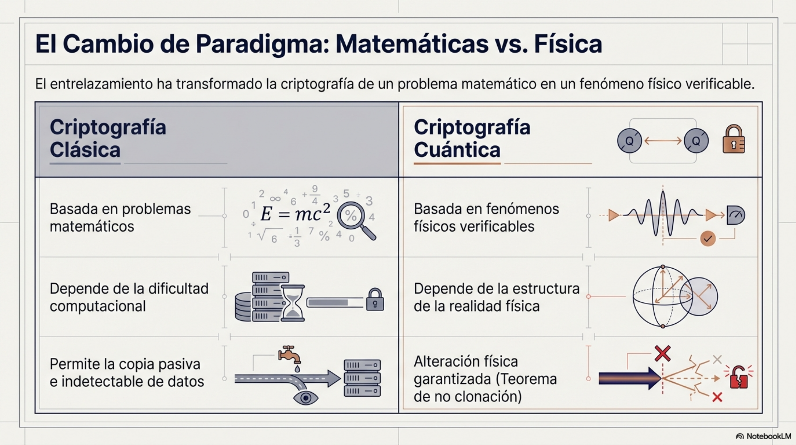

Eje 1: la explicación científica

El entrelazamiento ha servido para entender por qué es posible una
seguridad “física”: las correlaciones entre partículas entrelazadas no
pueden explicarse mediante teorías locales (según John Stewart Bell) y
estas correlaciones son no clonables y no copiables sin perturbación
(teorema de no clonación). Lo anterior implica que cualquier intento de
espionaje altera el sistema; la seguridad no depende de algoritmos, sino
de leyes físicas.

Eje 2: el cálculo cuántico

El entrelazamiento es una fuente de correlación y un mecanismo de
verificación de seguridad que se utiliza directamente en protocolos de
distribución de claves para generar pares de fotones entrelazados,
constatar que las correlaciones verifican la violación de desigualdades
de Bell o construir claves secretas a partir de los resultados.

Eje 3: la observación y la medición

El entrelazamiento transforma el papel de la medición en sistemas
entrelazados que están correlacionadas no localmente y permiten detectar
inconsistencias estadísticas. La seguridad se verifica
experimentalmente, no solo matemáticamente: permite la detección del
espionaje. Si un espía interviene para realizar alguna medición o
interaccionar con el sistema para buscar o alterar algo de información,
se rompe el entrelazamiento, se reduce o elimina la violación de
desigualdades de Bell y se producen errores medibles.

Eje 4: el desarrollo tecnológico

El entrelazamiento ha impulsado una nueva infraestructura de
comunicaciones en campos como los siguientes: la distribución cuántica
de claves para redes bancarias y comunicaciones gubernamentales; las
comunicaciones satelitales para la distribución de entrelazamiento a
miles de km con el fin de establecer una internet cuántica global; los
repetidores cuánticos para evitar que el entrelazamiento se degrade con
la distancia, así como en proyectos de teleportación cuántica.

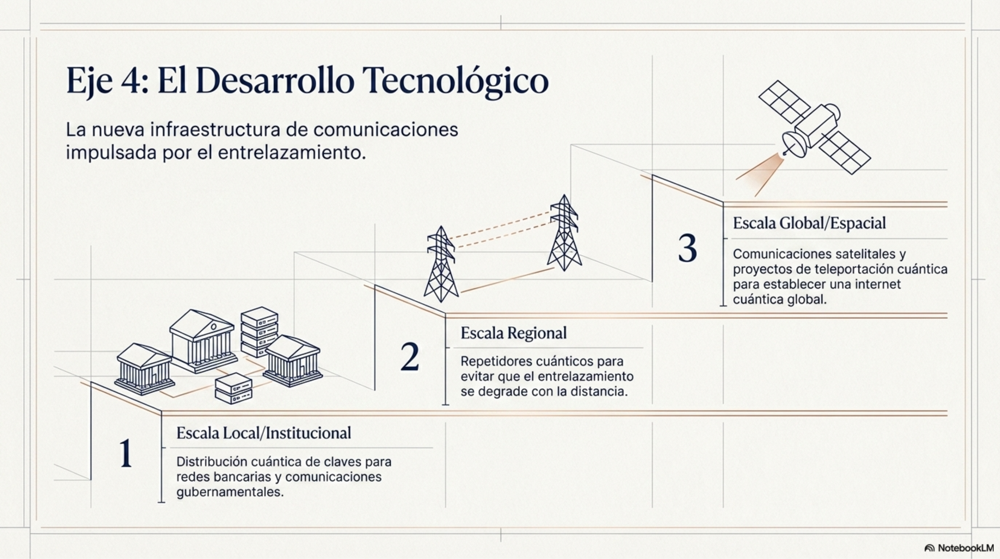

<u>El entrelazamiento en la metrología cuántica</u>

El entrelazamiento cuántico es un recurso que permite superar límites
clásicos de sensibilidad; ha convertido el ruido cuántico, que antes era
una limitación, en un recurso explotable para aumentar la precisión.
Mientras que la metrología clásica mide con sistemas independientes, la
metrología cuántica mide con sistemas colectivamente correlacionados. El
siguiente cuadro muestra las principales etapas de su evolución en
relación con la metrología cuántica

| Nivel       | Función del entrelazamiento          |
|-------------|--------------------------------------|
| Explicación | Supera el límite estándar cuántico   |
| Operación   | Prepara estados sensibles            |
| Medición    | Mejora la extracción de información  |
| Tecnología  | Permite sensores de nueva generación |

Eje 1: la explicación científica

En metrología clásica, la precisión está limitada por el llamado límite
estándar cuántico (*standard quantum limit*), el cual es creado por el
ruido estadístico independiente entre partículas (ley de los grandes
números). Por el contrario, el entrelazamiento permite trascender este
límite al introducir correlaciones cuánticas colectivas y reducir las
fluctuaciones relevantes para la medición. En consecuencia, se puede
alcanzar el límite de Heisenberg, donde la precisión escala como $1/N$en
lugar de $1/\sqrt{N}$.

Eje 2: el cálculo cuántico

El entrelazamiento se utiliza activamente en protocolos de medición: en
la preparación de estados altamente entrelazados, en la evolución
relacionada con la amplificación de la sensibilidad del sistema y en la
lectura de la medición colectiva del sistema.

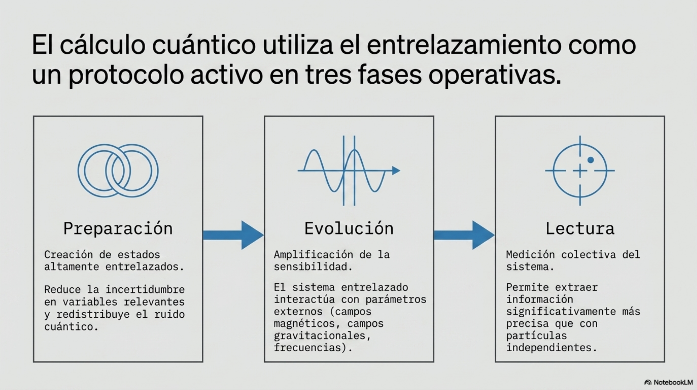

Eje 3: la observación y la medición

El entrelazamiento mejora directamente la capacidad de observación en
interferometría cuántica como la usada en la detección de ondas
gravitacionales donde se emplean estados comprimidos de luz
(relacionados con entrelazamiento); en relojes atómicos donde los átomos
entrelazados reducen el ruido de fase para conseguir mejorar la
precisión en la medición del tiempo (utilizan GPS y sincronización
global) y en sensores cuánticos empleados en magnetómetros,
acelerómetros y gravímetros para detectar variaciones extremadamente
pequeñas en campos físicos.

Eje 4: el desarrollo tecnológico

El entrelazamiento ha impulsado nuevas tecnologías de medición
utilizadas en metrología cuántica avanzada donde se han establecido
nuevos estándares de medición basados en constantes fundamentales y se
han introducido mejoras en la redefinición del Sistema Internacional de
Medidas (SIM), así como en el desarrollo de tecnologías emergentes
relacionadas con sensores cuánticos ultraprecisos, imagen cuántica
(quantum imaging) y microscopía con resolución mejorada. También se han
realizado aplicaciones prácticas en la navegación sin GPS, la
exploración geofísica y el diagnóstico médico avanzado.

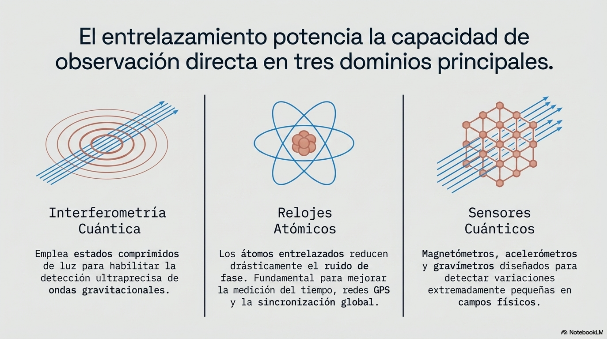
