

  
## 2.2. Espacios antropológicos de la inteligencia colectiva

La inteligencia colectiva coordina inteligencias distribuidas para
producir comprensión y acción colectiva. Se basa en la cooperación y el
intercambio abierto de saberes; se expresa en términos de creatividad
colectiva, aprendizaje mutuo, construcción compartida de significados y
funcionamiento de redes colaborativas.

La creación y evolución del proceso de desarrollo de la inteligencia
colectiva constituye una trayectoria que comprende transiciones entre
cuatro espacios antropológicos representativos de diversos escenarios
relacionales, comunicativos, cognitivos, simbólicos y culturales, así
como físicos y tecnológicos. En estos escenarios las personas
interactúan, comparten información, construyen conocimiento, coordinan
acciones, desarrollan identidades y producen formas de organización
social. Es en tales escenarios donde cobran vida y evolucionan los
espacios antropológicos.

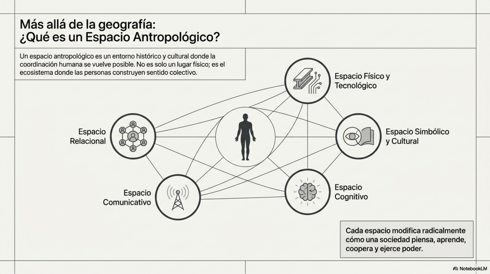

La secuencia histórica del desarrollo de los espacios antropológicos no
sigue un orden cronológico; debe entenderse como una transformación
progresiva de la manera en que la humanidad organiza, aunque no
simultáneamente, la coexistencia de cuatro estratos de convivencia para
el conocimiento, el poder, la comunicación y la inteligencia colectiva.
Los estratos geográficos son los escenarios históricos, son los espacios
antropológicos.

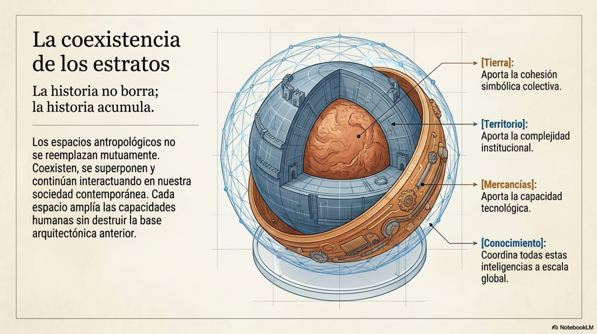

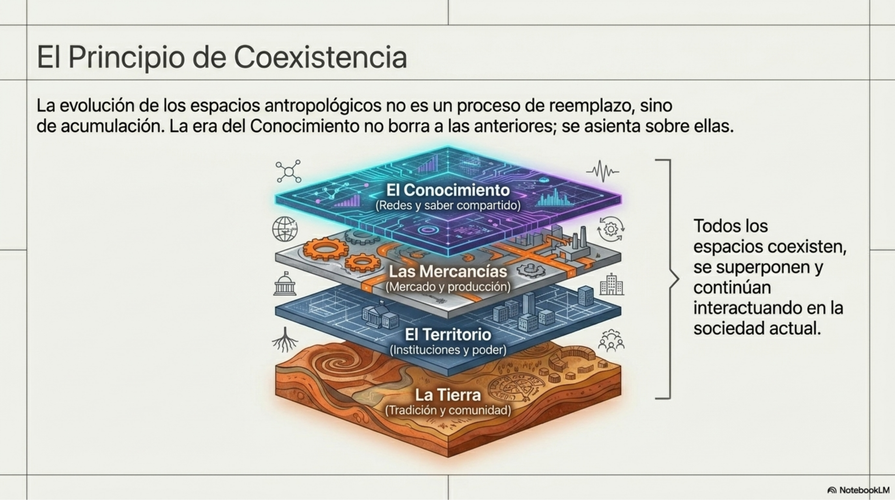

Cada espacio antropológico modifica la manera en que una sociedad
piensa, aprende, coopera, ejerce poder, transmite conocimiento y
contribuye al desarrollo de la inteligencia colectiva. Cada espacio
antropológico amplía las capacidades humanas: La Tierra desarrolla la
memoria simbólica colectiva, el Territorio organiza la complejidad
institucional, las Mercancías potencian la capacidad tecnológica y
productiva y el Conocimiento busca coordinar inteligencias distribuidas
a escala global. Tales espacios o estratos constan de capas y contienen
pilares por medio de los cuales se representan distintas visiones de la
evolución del ser humano.

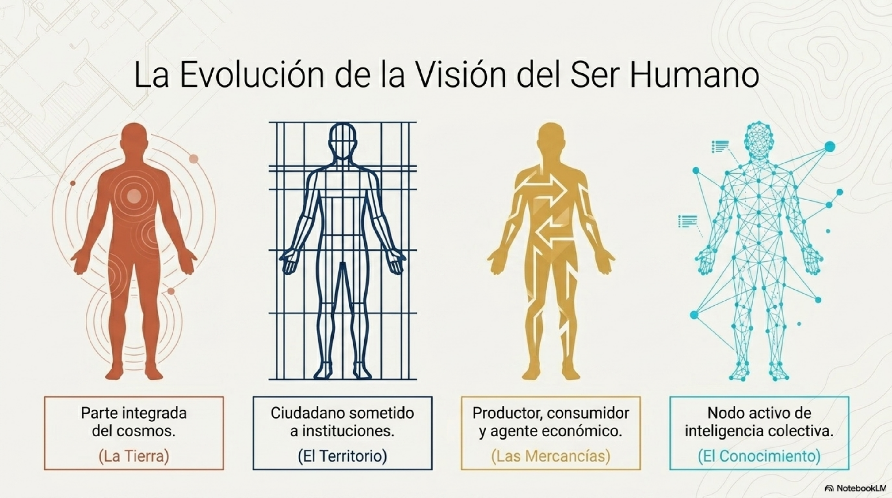

**La Tierra: Memoria comunitaria - Tradición y mito**

El espacio antropológico de la Tierra (Estrato I) es el primero de los
grandes escenarios históricos propuestos para explicar cómo la humanidad
organiza su existencia colectiva, su conocimiento y sus formas de
convivencia. Identifica a una humanidad que se comprende a sí misma como
parte viva del cosmos donde no existe una separación radical entre el
ser humano y su entorno. La naturaleza no es un objeto externo que debe
dominarse; es un organismo vivo y una red de fuerzas espirituales donde
los fenómenos naturales participan en una totalidad cósmica que expresa
sus cosmovisiones propias y construye los códigos que estructuran su
pensamiento mítico.

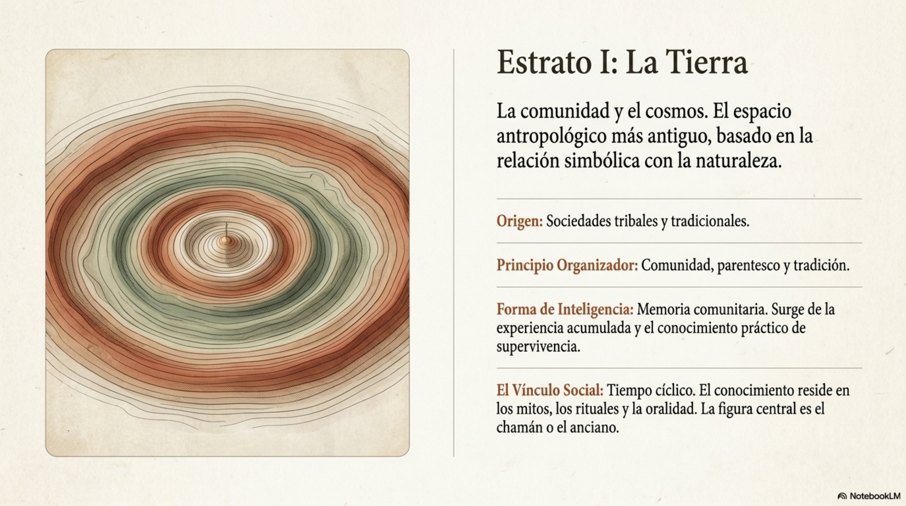

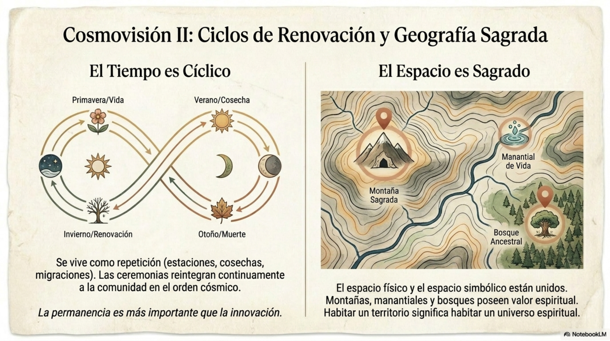

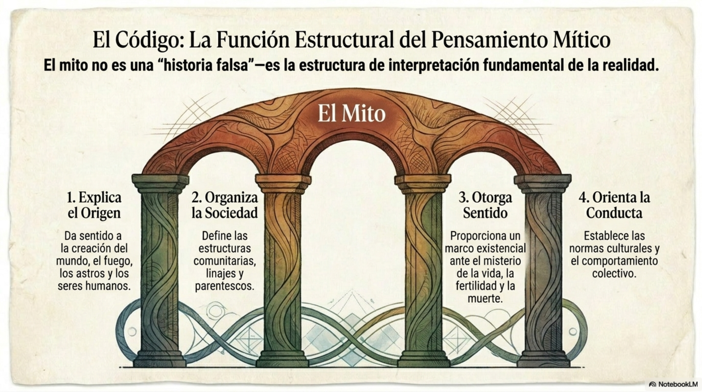

**El Territorio: Organización política - Instituciones y escritura**

El espacio antropológico del Territorio (Estrato II) surge cuando las
sociedades humanas dejan de organizarse principalmente alrededor de la
tradición oral, los vínculos tribales y la integración mítica con la
naturaleza; corresponde al momento en que la inteligencia funciona como
capacidad organizada de coordinación social donde opera y evoluciona una
estructura de tres capas: la infraestructura, la gobernanza y la
mentalidad cultural.

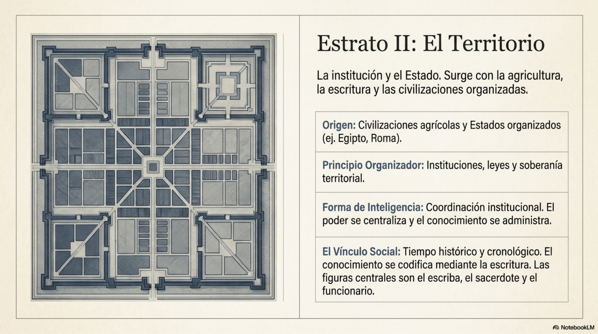

En la primera capa se define una infraestructura que consta de dos
elementos: la escritura y el espacio urbano. La escritura conduce a la
elaboración de protocolos para el manejo datos que representan en forma
diagramática tareas cognitivas de descarga o transferencia (cognitive
offloading diagram) y los espacios urbanos son los nodos de un diagrama
que muestra cómo un elemento central (hub) se conecta mediante ramas
(spokes) con elementos periféricos que cumplen diversas funciones.

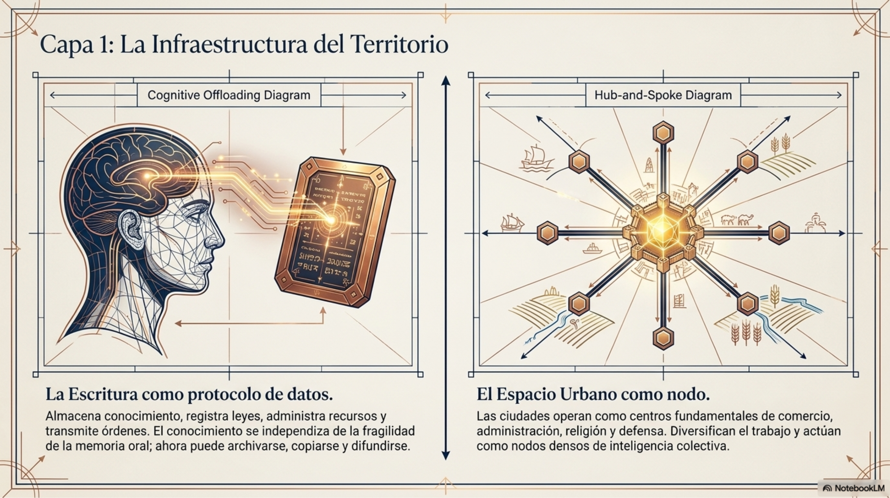

En la segunda capa se construye el concepto de gobernanza en tanto
conjunto de principios, estructuras, procesos y mecanismos mediante los
cuales una organización, comunidad o sociedad dirige, coordina, toma
decisiones y supervisa sus actividades para alcanzar objetivos comunes
de manera eficaz, transparente y responsable**.** En tales condiciones,
la escritura hace posible la ley, la ley genera burocracias estatales,
el Estado proporciona el financiamiento de las ciudades y las ciudades
propician la hiperespecialización del conocimiento.

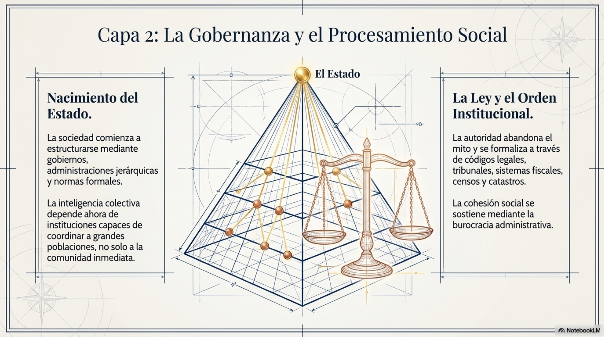

En la tercera capa se alcanza una nueva mentalidad cultural que
representa el nacimiento de la civilización organizada y del poder
institucional donde se definen otras cronologías, aparece la
especialización y las personas desarrollan su propia identidad
territorial.

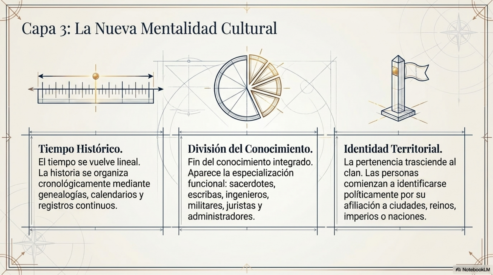

**Las Mercancías: Innovación económica - Mercado y producción**

El espacio antropológico de las Mercancías (Estrato III) surge con el
desarrollo del comercio mundial, el capitalismo, la industrialización,
la expansión tecnológica, la economía de mercado y la aceleración de los
flujos de producción e información. Representa una humanidad organizada
por los flujos de producción, intercambio, tecnología e información. El
correspondiente sistema global consta de tres capas que, en términos
anatómicos, funcionan como motor, acelerador y sistema operativo.

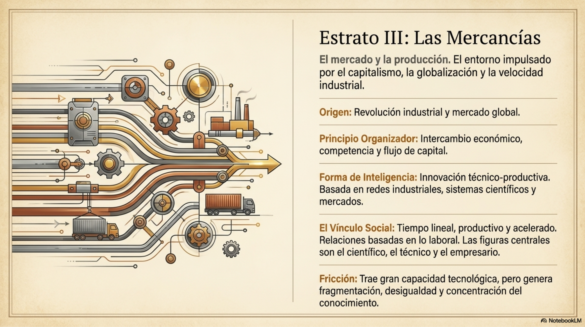

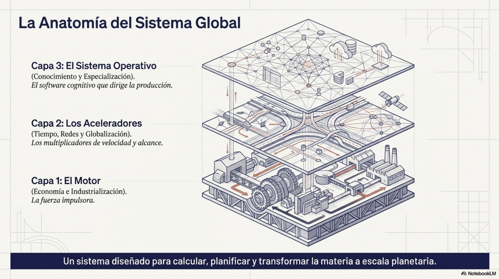

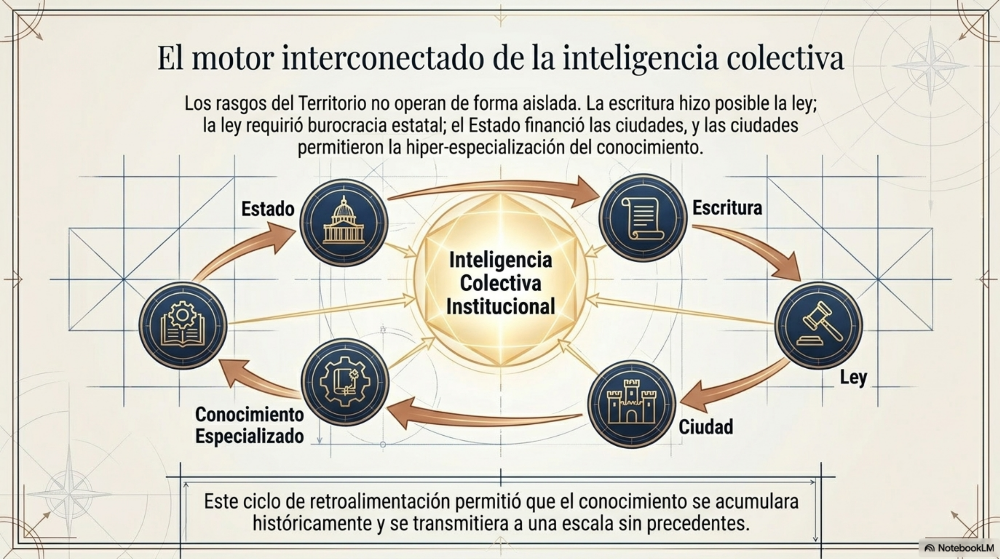

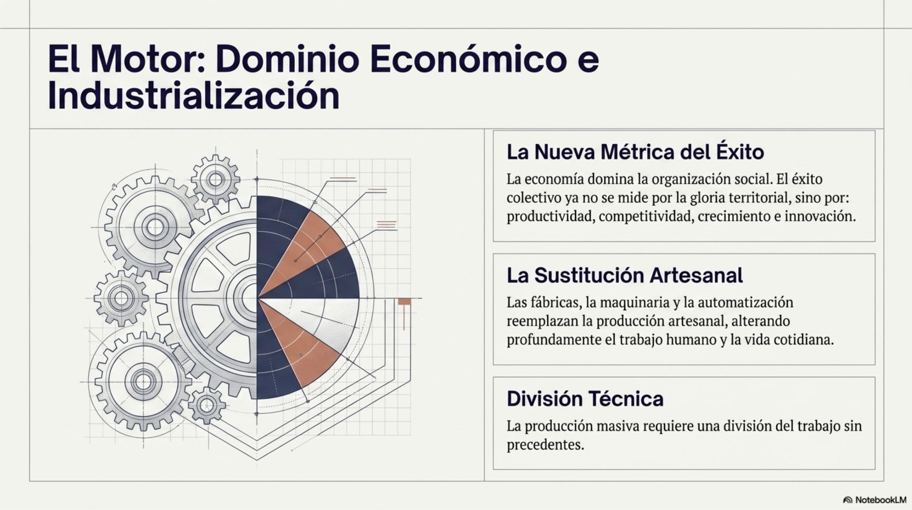

Para que el conocimiento se transforme en capital intelectual y funcione
como herramienta de producción estratégica necesariamente deben
incrementarse las velocidades y los alcances con las que operan las
instituciones, lo cual se expresa en la forma como se modifica la
rentabilidad corporativa y se propicia el desarrollo industrial. Aparece
la hiper-especialización y la fragmentación cognitiva, pero domina lo
micro a costa de perder la visión global como características de un
sistema operativo donde se contraponen progreso contra dominación.

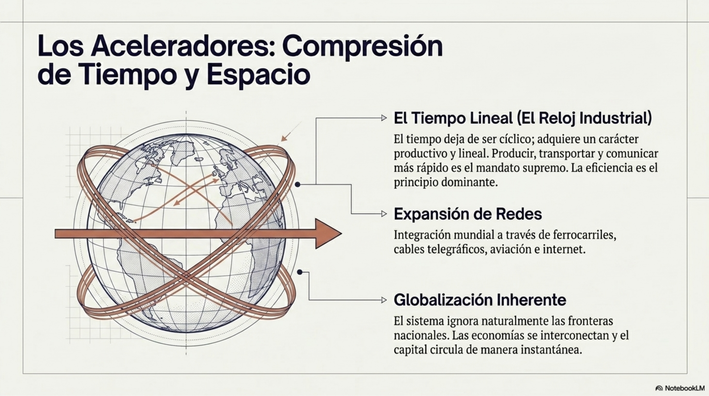

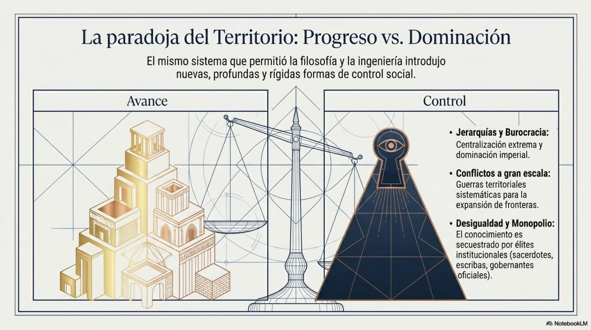

**El Conocimiento: Inteligencia distribuida - Redes y colaboración**

El espacio antropológico del Conocimiento (Estrato IV) constituye el
núcleo de la teoría de la inteligencia colectiva que opera con
efectividad y eficiencia cuando la principal riqueza humana consiste en
construir la capacidad colectiva de crear significado, compartir
saberes, cooperar, aprender continuamente e innovar juntos. La
construcción de tal riqueza humana se apoya en tres pilares anatómicos:
la interconexión, la colaboración y la transformación.

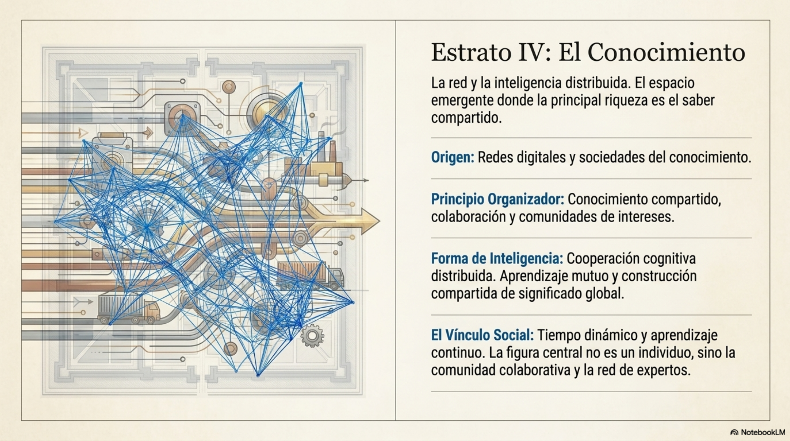

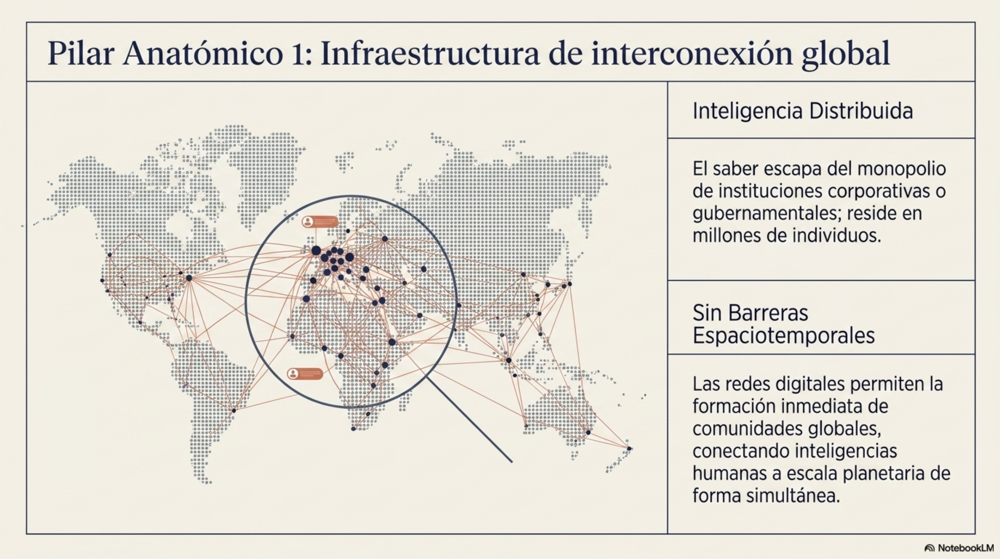

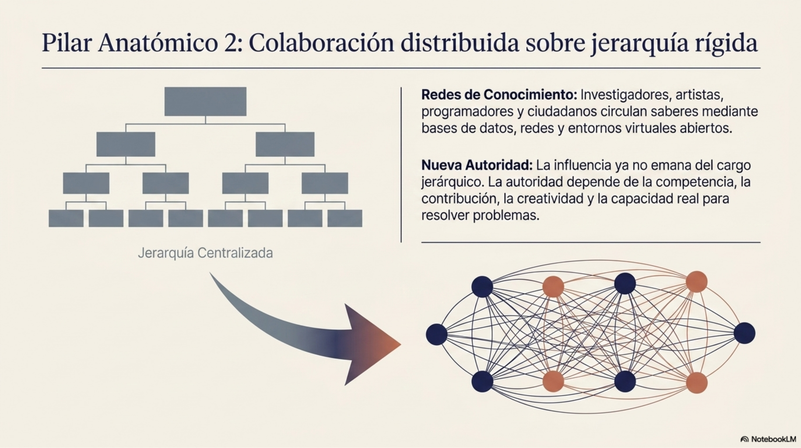

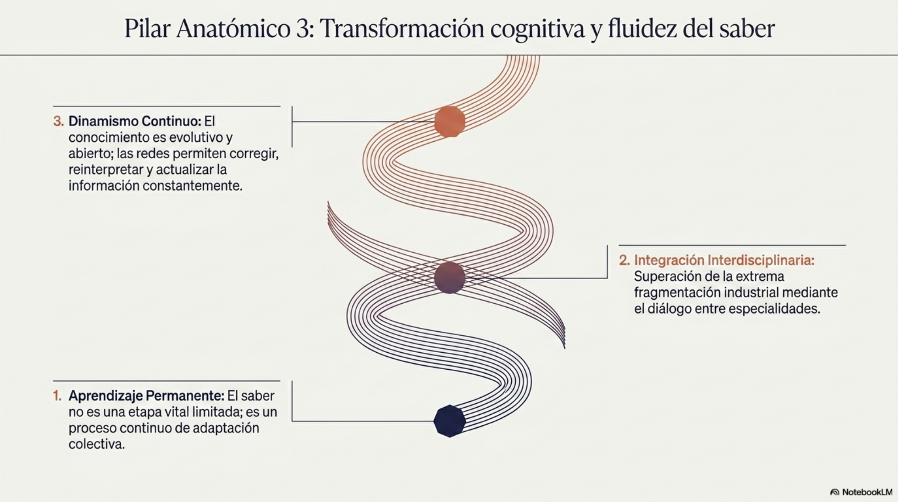

Los espacios antropológicos son fases (etapas) en la evolución de una
humanidad capaz de coordinar inteligencias distribuidas mediante el
desarrollo de aprendizajes colectivos y la construcción de un sistema
cognitivo que comprende:

- inteligencia distribuida (capacidades coordinadas)

- redes de conocimiento (comunidades globales)

- colaboración abierta (fin de las jerarquías rígidas)

- aprendizaje permanente (proceso continuo)

- interconexión global (sin barreras espaciotemporales)

- dinamismo (reconstrucción de la información evolutiva y permanente)

- integración de saberes (interdisciplinariedad)

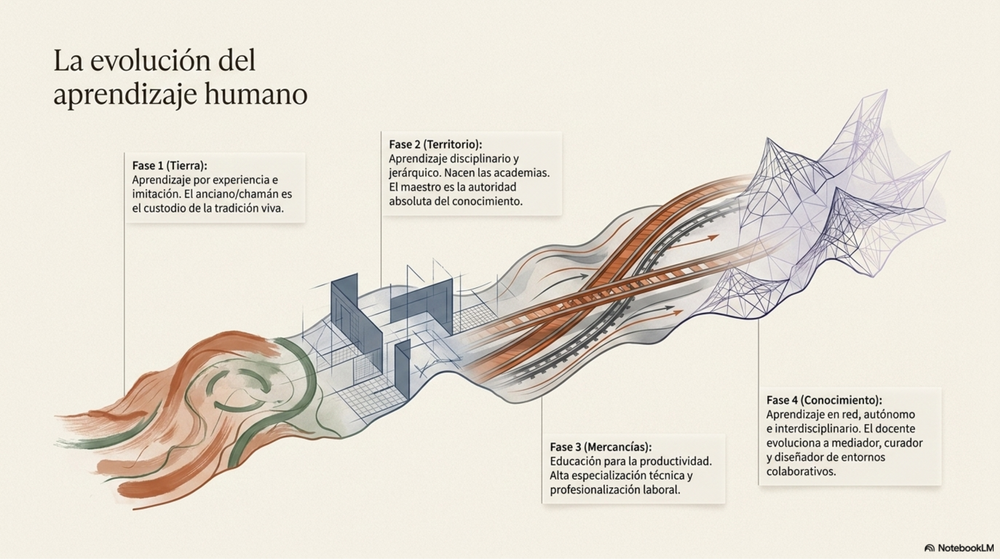

  <table style="font-family: Arial, Helvetica, sans-serif; font-size: 12px; max-width: 1000px; width: 100%; border-collapse: collapse; margin: 20px 0; border: 2px solid #333333; font-weight: normal;">
    <thead>
      <!-- Título principal -->
      <tr style="background-color: #f6f8fa;">
        <th colspan="5" style="text-align: center; padding: 10px; font-size: 12px; font-weight: normal; border-bottom: 2px solid #333333;">
          Tabla 2.2. Comparaciones entre los cuatro espacios antropológicos
        </th>
      </tr>
      <!-- Encabezados de columnas -->
      <tr style="background-color: #f0f2f5; text-align: center;">
        <th style="padding: 10px; width: 20%; text-align: center; font-size: 12px; font-weight: normal; border-right: 2px solid #333333; border-bottom: 2px solid #333333;">
          Aspecto
        </th>
        <th style="padding: 10px; width: 20%; text-align: center; font-size: 12px; font-weight: normal; border-right: 2px solid #333333; border-bottom: 2px solid #333333;">
          Espacio de la Tierra
        </th>
        <th style="padding: 10px; width: 20%; text-align: center; font-size: 12px; font-weight: normal; border-right: 2px solid #333333; border-bottom: 2px solid #333333;">
          Espacio del Territorio
        </th>
        <th style="padding: 10px; width: 20%; text-align: center; font-size: 12px; font-weight: normal; border-right: 2px solid #333333; border-bottom: 2px solid #333333;">
          Espacio de las Mercancías
        </th>
        <th style="padding: 10px; width: 20%; text-align: center; font-size: 12px; font-weight: normal; border-bottom: 2px solid #333333;">
          Espacio del Conocimiento
        </th>
      </tr>
    </thead>
    <tbody>
      <tr>
        <td style="padding: 8px; vertical-align: top; line-height: 1.4; border-right: 2px solid #333333; border-bottom: 2px solid #333333;">Base histórica</td>
        <td style="padding: 8px; vertical-align: top; line-height: 1.4; border-right: 2px solid #333333; border-bottom: 2px solid #333333;">Sociedades tribales y tradicionales</td>
        <td style="padding: 8px; vertical-align: top; line-height: 1.4; border-right: 2px solid #333333; border-bottom: 2px solid #333333;">Civilizaciones agrícolas y Estados organizados</td>
        <td style="padding: 8px; vertical-align: top; line-height: 1.4; border-right: 2px solid #333333; border-bottom: 2px solid #333333;">Capitalismo industrial y mercado global</td>
        <td style="padding: 8px; vertical-align: top; line-height: 1.4; border-bottom: 2px solid #333333;">Redes digitales y sociedades del conocimiento</td>
      </tr>
      <tr>
        <td style="padding: 8px; vertical-align: top; line-height: 1.4; border-right: 2px solid #333333; border-bottom: 2px solid #333333;">Principio organizador</td>
        <td style="padding: 8px; vertical-align: top; line-height: 1.4; border-right: 2px solid #333333; border-bottom: 2px solid #333333;">Comunidad y naturaleza</td>
        <td style="padding: 8px; vertical-align: top; line-height: 1.4; border-right: 2px solid #333333; border-bottom: 2px solid #333333;">Instituciones y soberanía territorial</td>
        <td style="padding: 8px; vertical-align: top; line-height: 1.4; border-right: 2px solid #333333; border-bottom: 2px solid #333333;">Producción, intercambio y mercado</td>
        <td style="padding: 8px; vertical-align: top; line-height: 1.4; border-bottom: 2px solid #333333;">Conocimiento compartido y redes colaborativas</td>
      </tr>
      <tr>
        <td style="padding: 8px; vertical-align: top; line-height: 1.4; border-right: 2px solid #333333; border-bottom: 2px solid #333333;">Forma dominante de vínculo social</td>
        <td style="padding: 8px; vertical-align: top; line-height: 1.4; border-right: 2px solid #333333; border-bottom: 2px solid #333333;">Parentesco y tradición</td>
        <td style="padding: 8px; vertical-align: top; line-height: 1.4; border-right: 2px solid #333333; border-bottom: 2px solid #333333;">Ciudadanía y pertenencia política</td>
        <td style="padding: 8px; vertical-align: top; line-height: 1.4; border-right: 2px solid #333333; border-bottom: 2px solid #333333;">Relaciones económicas y laborales</td>
        <td style="padding: 8px; vertical-align: top; line-height: 1.4; border-bottom: 2px solid #333333;">Conexiones en red y comunidades de aprendizaje</td>
      </tr>
      <tr>
        <td style="padding: 8px; vertical-align: top; line-height: 1.4; border-right: 2px solid #333333; border-bottom: 2px solid #333333;">Relación con el espacio</td>
        <td style="padding: 8px; vertical-align: top; line-height: 1.4; border-right: 2px solid #333333; border-bottom: 2px solid #333333;">Espacio sagrado y vivido</td>
        <td style="padding: 8px; vertical-align: top; line-height: 1.4; border-right: 2px solid #333333; border-bottom: 2px solid #333333;">Territorio delimitado y administrado</td>
        <td style="padding: 8px; vertical-align: top; line-height: 1.4; border-right: 2px solid #333333; border-bottom: 2px solid #333333;">Espacio global de circulación</td>
        <td style="padding: 8px; vertical-align: top; line-height: 1.4; border-bottom: 2px solid #333333;">Espacio virtual y redes interconectadas</td>
      </tr>
      <tr>
        <td style="padding: 8px; vertical-align: top; line-height: 1.4; border-right: 2px solid #333333; border-bottom: 2px solid #333333;">Relación con el tiempo</td>
        <td style="padding: 8px; vertical-align: top; line-height: 1.4; border-right: 2px solid #333333; border-bottom: 2px solid #333333;">Tiempo cíclico</td>
        <td style="padding: 8px; vertical-align: top; line-height: 1.4; border-right: 2px solid #333333; border-bottom: 2px solid #333333;">Tiempo histórico y cronológico</td>
        <td style="padding: 8px; vertical-align: top; line-height: 1.4; border-right: 2px solid #333333; border-bottom: 2px solid #333333;">Tiempo productivo y acelerado</td>
        <td style="padding: 8px; vertical-align: top; line-height: 1.4; border-bottom: 2px solid #333333;">Tiempo dinámico para el aprendizaje continuo</td>
      </tr>
      <tr>
        <td style="padding: 8px; vertical-align: top; line-height: 1.4; border-right: 2px solid #333333; border-bottom: 2px solid #333333;">Forma principal de conocimiento</td>
        <td style="padding: 8px; vertical-align: top; line-height: 1.4; border-right: 2px solid #333333; border-bottom: 2px solid #333333;">Mito, tradición y experiencia oral</td>
        <td style="padding: 8px; vertical-align: top; line-height: 1.4; border-right: 2px solid #333333; border-bottom: 2px solid #333333;">Escritura, leyes y conocimiento institucional</td>
        <td style="padding: 8px; vertical-align: top; line-height: 1.4; border-right: 2px solid #333333; border-bottom: 2px solid #333333;">Ciencia aplicada y tecnología productiva</td>
        <td style="padding: 8px; vertical-align: top; line-height: 1.4; border-bottom: 2px solid #333333;">Inteligencia distribuida y conocimiento colaborativo</td>
      </tr>
      <tr>
        <td style="padding: 8px; vertical-align: top; line-height: 1.4; border-right: 2px solid #333333; border-bottom: 2px solid #333333;">Modo de transmisión del conocimiento</td>
        <td style="padding: 8px; vertical-align: top; line-height: 1.4; border-right: 2px solid #333333; border-bottom: 2px solid #333333;">Oralidad y ritual</td>
        <td style="padding: 8px; vertical-align: top; line-height: 1.4; border-right: 2px solid #333333; border-bottom: 2px solid #333333;">Escritura y educación formal</td>
        <td style="padding: 8px; vertical-align: top; line-height: 1.4; border-right: 2px solid #333333; border-bottom: 2px solid #333333;">Medios técnicos e instituciones industriales</td>
        <td style="padding: 8px; vertical-align: top; line-height: 1.4; border-bottom: 2px solid #333333;">Redes digitales e interacción colectiva</td>
      </tr>
      <tr>
        <td style="padding: 8px; vertical-align: top; line-height: 1.4; border-right: 2px solid #333333; border-bottom: 2px solid #333333;">Figura central del conocimiento</td>
        <td style="padding: 8px; vertical-align: top; line-height: 1.4; border-right: 2px solid #333333; border-bottom: 2px solid #333333;">Chamán, anciano, narrador</td>
        <td style="padding: 8px; vertical-align: top; line-height: 1.4; border-right: 2px solid #333333; border-bottom: 2px solid #333333;">Escriba, sacerdote, funcionario, maestro</td>
        <td style="padding: 8px; vertical-align: top; line-height: 1.4; border-right: 2px solid #333333; border-bottom: 2px solid #333333;">Técnico, científico, empresario</td>
        <td style="padding: 8px; vertical-align: top; line-height: 1.4; border-bottom: 2px solid #333333;">Comunidad colaborativa y redes de expertos</td>
      </tr>
      <tr>
        <td style="padding: 8px; vertical-align: top; line-height: 1.4; border-right: 2px solid #333333; border-bottom: 2px solid #333333;">Tipo de inteligencia colectiva</td>
        <td style="padding: 8px; vertical-align: top; line-height: 1.4; border-right: 2px solid #333333; border-bottom: 2px solid #333333;">Memoria comunitaria</td>
        <td style="padding: 8px; vertical-align: top; line-height: 1.4; border-right: 2px solid #333333; border-bottom: 2px solid #333333;">Coordinación institucional</td>
        <td style="padding: 8px; vertical-align: top; line-height: 1.4; border-right: 2px solid #333333; border-bottom: 2px solid #333333;">Innovación técnico-productiva</td>
        <td style="padding: 8px; vertical-align: top; line-height: 1.4; border-bottom: 2px solid #333333;">Cooperación cognitiva distribuida</td>
      </tr>
      <tr>
        <td style="padding: 8px; vertical-align: top; line-height: 1.4; border-right: 2px solid #333333; border-bottom: 2px solid #333333;">Estructura social predominante</td>
        <td style="padding: 8px; vertical-align: top; line-height: 1.4; border-right: 2px solid #333333; border-bottom: 2px solid #333333;">Clan, tribu, comunidad</td>
        <td style="padding: 8px; vertical-align: top; line-height: 1.4; border-right: 2px solid #333333; border-bottom: 2px solid #333333;">Estado, ciudad, imperio</td>
        <td style="padding: 8px; vertical-align: top; line-height: 1.4; border-right: 2px solid #333333; border-bottom: 2px solid #333333;">Empresa, industria, mercado</td>
        <td style="padding: 8px; vertical-align: top; line-height: 1.4; border-bottom: 2px solid #333333;">Redes, comunidades y plataformas colaborativas</td>
      </tr>
      <tr>
        <td style="padding: 8px; vertical-align: top; line-height: 1.4; border-right: 2px solid #333333; border-bottom: 2px solid #333333;">Tecnología dominante</td>
        <td style="padding: 8px; vertical-align: top; line-height: 1.4; border-right: 2px solid #333333; border-bottom: 2px solid #333333;">Herramientas tradicionales</td>
        <td style="padding: 8px; vertical-align: top; line-height: 1.4; border-right: 2px solid #333333; border-bottom: 2px solid #333333;">Escritura, arquitectura, administración</td>
        <td style="padding: 8px; vertical-align: top; line-height: 1.4; border-right: 2px solid #333333; border-bottom: 2px solid #333333;">Máquinas, fábricas, telecomunicaciones</td>
        <td style="padding: 8px; vertical-align: top; line-height: 1.4; border-bottom: 2px solid #333333;">Computación, Internet e inteligencia en red</td>
      </tr>
      <tr>
        <td style="padding: 8px; vertical-align: top; line-height: 1.4; border-right: 2px solid #333333; border-bottom: 2px solid #333333;">Relación con la naturaleza</td>
        <td style="padding: 8px; vertical-align: top; line-height: 1.4; border-right: 2px solid #333333; border-bottom: 2px solid #333333;">Integración simbólica con el cosmos</td>
        <td style="padding: 8px; vertical-align: top; line-height: 1.4; border-right: 2px solid #333333; border-bottom: 2px solid #333333;">Dominio y organización del entorno</td>
        <td style="padding: 8px; vertical-align: top; line-height: 1.4; border-right: 2px solid #333333; border-bottom: 2px solid #333333;">Explotación productiva de recursos</td>
        <td style="padding: 8px; vertical-align: top; line-height: 1.4; border-bottom: 2px solid #333333;">Gestión inteligente y conciencia global</td>
      </tr>
      <tr>
        <td style="padding: 8px; vertical-align: top; line-height: 1.4; border-right: 2px solid #333333; border-bottom: 2px solid #333333;">Forma de autoridad</td>
        <td style="padding: 8px; vertical-align: top; line-height: 1.4; border-right: 2px solid #333333; border-bottom: 2px solid #333333;">Tradición y sabiduría ancestral</td>
        <td style="padding: 8px; vertical-align: top; line-height: 1.4; border-right: 2px solid #333333; border-bottom: 2px solid #333333;">Ley, jerarquía e instituciones</td>
        <td style="padding: 8px; vertical-align: top; line-height: 1.4; border-right: 2px solid #333333; border-bottom: 2px solid #333333;">Capital económico y poder industrial</td>
        <td style="padding: 8px; vertical-align: top; line-height: 1.4; border-bottom: 2px solid #333333;">Competencia, participación y reconocimiento colectivo</td>
      </tr>
      <tr>
        <td style="padding: 8px; vertical-align: top; line-height: 1.4; border-right: 2px solid #333333; border-bottom: 2px solid #333333;">Modelo educativo</td>
        <td style="padding: 8px; vertical-align: top; line-height: 1.4; border-right: 2px solid #333333; border-bottom: 2px solid #333333;">Aprendizaje comunitario y experiencial</td>
        <td style="padding: 8px; vertical-align: top; line-height: 1.4; border-right: 2px solid #333333; border-bottom: 2px solid #333333;">Educación formal y disciplinaria</td>
        <td style="padding: 8px; vertical-align: top; line-height: 1.4; border-right: 2px solid #333333; border-bottom: 2px solid #333333;">Formación técnica y profesional</td>
        <td style="padding: 8px; vertical-align: top; line-height: 1.4; border-bottom: 2px solid #333333;">Aprendizaje colaborativo y permanente</td>
      </tr>
      <tr>
        <td style="padding: 8px; vertical-align: top; line-height: 1.4; border-right: 2px solid #333333; border-bottom: 2px solid #333333;">Economía predominante</td>
        <td style="padding: 8px; vertical-align: top; line-height: 1.4; border-right: 2px solid #333333; border-bottom: 2px solid #333333;">Subsistencia comunitaria</td>
        <td style="padding: 8px; vertical-align: top; line-height: 1.4; border-right: 2px solid #333333; border-bottom: 2px solid #333333;">Agricultura organizada e impuestos</td>
        <td style="padding: 8px; vertical-align: top; line-height: 1.4; border-right: 2px solid #333333; border-bottom: 2px solid #333333;">Producción industrial y consumo masivo</td>
        <td style="padding: 8px; vertical-align: top; line-height: 1.4; border-bottom: 2px solid #333333;">Economía del conocimiento e innovación</td>
      </tr>
      <tr>
        <td style="padding: 8px; vertical-align: top; line-height: 1.4; border-right: 2px solid #333333; border-bottom: 2px solid #333333;">Ventaja principal</td>
        <td style="padding: 8px; vertical-align: top; line-height: 1.4; border-right: 2px solid #333333; border-bottom: 2px solid #333333;">Cohesión simbólica y sentido comunitario</td>
        <td style="padding: 8px; vertical-align: top; line-height: 1.4; border-right: 2px solid #333333; border-bottom: 2px solid #333333;">Organización social compleja y estabilidad</td>
        <td style="padding: 8px; vertical-align: top; line-height: 1.4; border-right: 2px solid #333333; border-bottom: 2px solid #333333;">Gran capacidad tecnológica y productiva</td>
        <td style="padding: 8px; vertical-align: top; line-height: 1.4; border-bottom: 2px solid #333333;">Creatividad colectiva y cooperación global</td>
      </tr>
      <tr>
        <td style="padding: 8px; vertical-align: top; line-height: 1.4; border-right: 2px solid #333333; border-bottom: 2px solid #333333;">Problemas característicos</td>
        <td style="padding: 8px; vertical-align: top; line-height: 1.4; border-right: 2px solid #333333; border-bottom: 2px solid #333333;">Limitación técnica y aislamiento</td>
        <td style="padding: 8px; vertical-align: top; line-height: 1.4; border-right: 2px solid #333333; border-bottom: 2px solid #333333;">Centralización y burocracia</td>
        <td style="padding: 8px; vertical-align: top; line-height: 1.4; border-right: 2px solid #333333; border-bottom: 2px solid #333333;">Desigualdad, fragmentación y mercantilización</td>
        <td style="padding: 8px; vertical-align: top; line-height: 1.4; border-bottom: 2px solid #333333;">Sobrecarga informativa y control algorítmico</td>
      </tr>
      <tr>
        <td style="padding: 8px; vertical-align: top; line-height: 1.4; border-right: 2px solid #333333; border-bottom: 2px solid #333333;">Ejemplos históricos</td>
        <td style="padding: 8px; vertical-align: top; line-height: 1.4; border-right: 2px solid #333333; border-bottom: 2px solid #333333;">Pueblos originarios y sociedades tribales</td>
        <td style="padding: 8px; vertical-align: top; line-height: 1.4; border-right: 2px solid #333333; border-bottom: 2px solid #333333;">Egipto, Grecia, Roma, China imperial</td>
        <td style="padding: 8px; vertical-align: top; line-height: 1.4; border-right: 2px solid #333333; border-bottom: 2px solid #333333;">Revolución industrial y capitalismo global</td>
        <td style="padding: 8px; vertical-align: top; line-height: 1.4; border-bottom: 2px solid #333333;">Internet, ciencia colaborativa y redes abiertas</td>
      </tr>
      <tr>
        <td style="padding: 8px; vertical-align: top; line-height: 1.4; border-right: 2px solid #333333; border-bottom: 2px solid #333333;">Tipo de identidad</td>
        <td style="padding: 8px; vertical-align: top; line-height: 1.4; border-right: 2px solid #333333; border-bottom: 2px solid #333333;">Comunitaria y ancestral</td>
        <td style="padding: 8px; vertical-align: top; line-height: 1.4; border-right: 2px solid #333333; border-bottom: 2px solid #333333;">Nacional o territorial</td>
        <td style="padding: 8px; vertical-align: top; line-height: 1.4; border-right: 2px solid #333333; border-bottom: 2px solid #333333;">Profesional y económica</td>
        <td style="padding: 8px; vertical-align: top; line-height: 1.4; border-bottom: 2px solid #333333;">Múltiple, dinámica y conectada</td>
      </tr>
      <tr>
        <td style="padding: 8px; vertical-align: top; line-height: 1.4; border-right: 2px solid #333333;">Visión del ser humano</td>
        <td style="padding: 8px; vertical-align: top; line-height: 1.4; border-right: 2px solid #333333;">Parte integrada del cosmos</td>
        <td style="padding: 8px; vertical-align: top; line-height: 1.4; border-right: 2px solid #333333;">Ciudadano sometido a instituciones</td>
        <td style="padding: 8px; vertical-align: top; line-height: 1.4; border-right: 2px solid #333333;">Productor, consumidor y agente económico</td>
        <td style="padding: 8px; vertical-align: top; line-height: 1.4;">Nodo activo de la inteligencia colectiva</td>
      </tr>
    </tbody>
  </table>

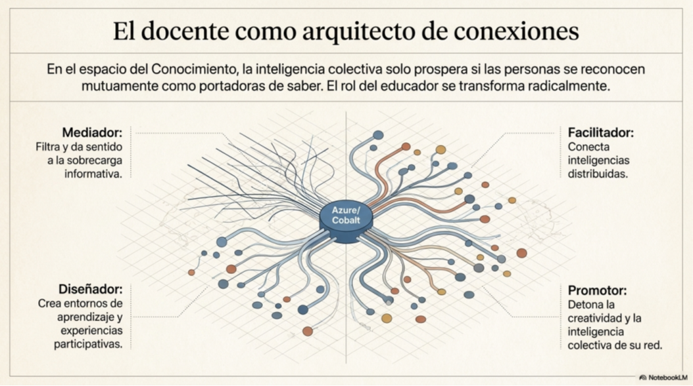 
