

  
# Capítulo 2: Inteligencia Colectiva y Propiedades del Electrón

La construcción y circulación del conocimiento se da en el espacio cognitivo de las ideas, los razonamientos y las pruebas que posibilitan el desarrollo y aplicación de teorías y experimentos. Este es un proceso creativo que refleja el desarrollo de la inteligencia colectiva.
Inteligencia colectiva significa construir la capacidad de un grupo, comunidad o sociedad para pensar, comprender y resolver problemas de manera conjunta. Según Paul Lévy*, el desarrollo de la inteligencia colectiva requiere reconocer que el conocimiento humano es un producto social y que las sociedades avanzan cuando logran coordinar creativamente las capacidades de muchos para transformar y fortalecer la cooperación y el compromiso de todos.
Dos elementos clave en la descripción de la inteligencia colectiva son la puesta en práctica de sus fases de desarrollo (escuchar, expresar, decidir, organizar, conectar, evaluar y mostrar visión) y la comprensión de sus espacios antropológicos (la Tierra, el Territorio, las Mercancías y el Conocimiento).
En relación con el conocimiento científico, éste avanza cuando las aportaciones teóricas y los desarrollos experimentales se enriquecen mutuamente, lo cual implica, para empezar, comprender y hacer funcionar adecuadamente cuatro regiones de realización de las actividades experimentales: Preparación, Transformación, Detección y Medición). 

Como ejemplo de aplicación práctica, aplicamos la descripción de las regiones de realización de actividades experimentales al análisis de tres experimentos que condujeron al descubrimiento del electrón y permitieron calcular los valores de su relación carga/masa y de su carga eléctrica, así como demostrar la existencia de niveles energéticos discretos. En este capítulo consideramos la relación entre tales regiones de realización de las actividades experimentales con las etapas de producción de las fases del desarrollo de la inteligencia colectiva. Las fases de Escuchar y Expresar corresponden a la etapa de Percepción e Intercambio, las fases de Decidir y Organizar a la etapa de Gestión y Acción y las fases de Conectar, Evaluar y Mostrar Visión a la etapa de Evolución y Sentido.
 

* Lévy Paul. <i>L'intelligence collective: Pour une anthropologie du cyberspace.</i> Paris: La <i>Découverte.</i> (1994).

&nbsp;Lévy Paul. <i>Collective Intelligence: Mankind's Emerging World in Cyberspace</i> (Trad. Robert Bononno). New York: Plenum Trade. (1997).

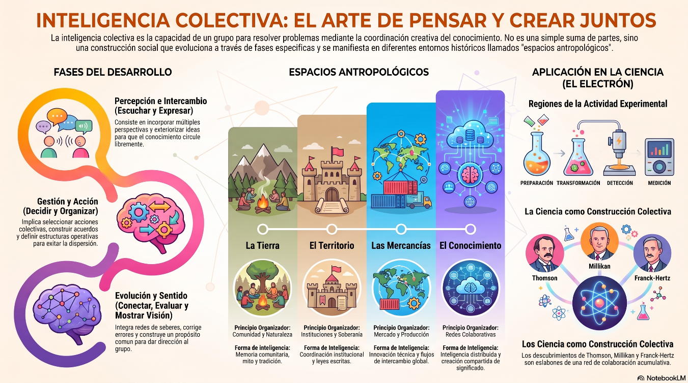

**OBJETIVOS Y CONTENIDOS DE LAS SECCIONES**

  
## 2.1.  Fases del desarrollo de la inteligencia colectiva

Analizar las características y funciones de cada fase y su participación en la integración de las correspondientes etapas de producción del conocimiento científico. Explicar cómo las etapas de producción y las fases de desarrollo expresan interacciones colectivas entre las cuales fluye y se transforma la inteligencia colectiva.

Descripción de las fases del desarrollo de la inteligencia colectiva
   Etapa de Percepción e Intercambio
1.	Escuchar: atención activa para incorporar perspectivas 
2.	Expresar: posicionamiento para compartir conocimientos
   Etapa de Gestión y Acción
3.	Decidir: responsabilidad para seleccionar acciones
4.	Organizar: coordinación para distribuir procesos
   Etapa de Evolución y Sentido
5.	Conectar: integración de redes cognitivas
6.	Evaluar: calibración para aprender y corregir 
7.	Mostrar visión: dar coherencia, dirección y sentido a la perspectiva colectiva

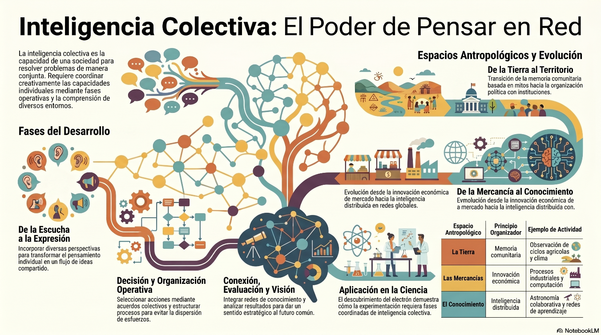

## 2.2.  Espacios antropológicos de la inteligencia colectiva

Describir las siguientes características de cada espacio antropológico: el espacio de la Tierra crea cosmovisiones y construye códigos; el espacio del Territorio requiere para su funcionamiento de infraestructura, gobernanza y mentalidad cultural; el espacio de las Mercancías funciona como estructura global que contiene motores, aceleradores y sistemas operativos y el espacio del Conocimiento se apoya en tres pilares que son la interconexión, la colaboración y la transformación.  

La Tierra: Memoria comunitaria - Tradición y mito
El Territorio: Organización política - Instituciones y escritura
Las Mercancías: Innovación económica - Mercado y producción
El Conocimiento: Inteligencia distribuida - Redes y colaboración

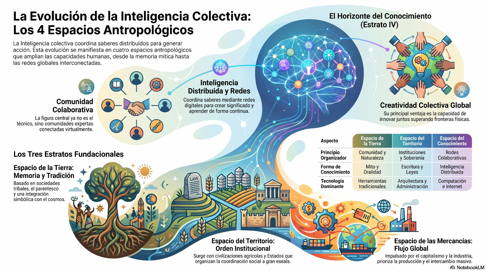

## 2.3. Experimentos acerca del electrón

Explicar qué ocurre en cada una de las regiones de realización de las actividades experimentales en los siguientes casos: el descubrimiento del electrón y el cálculo de los valores de su relación carga/masa, el cálculo de su carga eléctrica y la demostración de la existencia de niveles energéticos discretos. Describir el contenido de las Conferencias Nobel dictadas por los autores de los experimentos considerados.  Analizar cómo en la descripción de las regiones de realización de cada una de las correspondientes actividades experimentales se expresan las fases del desarrollo de la inteligencia colectiva en tanto elementos de las etapas de producción del conocimiento.
Regiones de realización de las actividades experimentales
Tres experimentos revolucionarios acerca del electrón
Experimentos para descubrir el electrón por Thomson
Experimentos para medir la carga eléctrica elemental del electrón por Millikan.
Experimentos para demostrar la existencia de niveles de energía electrónica estacionaria por Franck y Hertz
Relaciones entre las regiones de realización de las actividades experimentales y las fases de desarrollo de la inteligencia colectiva. 

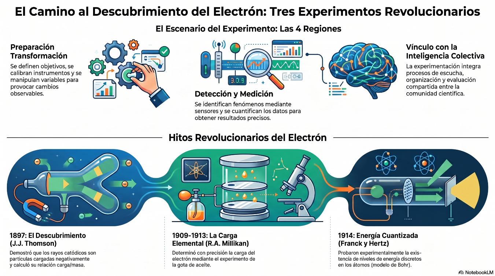

<table>
<colgroup>
<col style="width: 30%" />
<col style="width: 33%" />
<col style="width: 35%" />
</colgroup>
<thead>
<tr class="header">
<th colspan="3">Tabla 2.1. Actividades experimentales en cuatro espacios
antropológicos</th>
</tr>
</thead>
<tbody>
<tr class="odd">
<td colspan="3">La Tierra: Memoria comunitaria - Tradición y mito</td>
</tr>
<tr class="even">
<td>OBSERVACIONES</td>
<td>MEDICIONES</td>
<td>EXPERIMENTOS</td>
</tr>
<tr class="odd">
<td><ul>
<li><blockquote>

estaciones del año

</blockquote></li>
<li><blockquote>

comportamiento del clima

</blockquote></li>
<li><blockquote>

ciclos agrícolas

</blockquote></li>
</ul></td>
<td><ul>
<li><blockquote>

terrenos agrícolas

</blockquote></li>
<li><blockquote>

tiempo mediante ciclos lunares

</blockquote></li>
<li>
distancias y tamaños usando partes del cuerpo humano
</li>
</ul></td>
<td><ul>
<li>
efectos del fuego
</li>
<li>
fermentación de bebidas y alimentos
</li>
<li>
materiales de construcción
</li>
</ul></td>
</tr>
</tbody>
</table>

<table>
<colgroup>
<col style="width: 30%" />
<col style="width: 33%" />
<col style="width: 35%" />
</colgroup>
<thead>
<tr class="header">
<th colspan="3">El Territorio: Organización política - Instituciones y
escritura</th>
</tr>
</thead>
<tbody>
<tr class="odd">
<td>OBSERVACIONES</td>
<td>MEDICIONES</td>
<td>EXPERIMENTOS</td>
</tr>
<tr class="even">
<td><ul>
<li><blockquote>

geometría de terrenos

</blockquote></li>
<li>
evolución de enfermedades
</li>
<li>
sistemas de irrigación
</li>
</ul></td>
<td><ul>
<li>
tiempo con relojes solares
</li>
<li><blockquote>

masas con balanzas

</blockquote></li>
<li><blockquote>

pulsos y respiraciones

</blockquote></li>
</ul></td>
<td><ul>
<li>
con poleas y palancas
</li>
<li><blockquote>

reacciones químicas artesanales

</blockquote></li>
<li><blockquote>

características de suelos y cultivos

</blockquote></li>
</ul></td>
</tr>
</tbody>
</table>

<table>
<colgroup>
<col style="width: 30%" />
<col style="width: 33%" />
<col style="width: 35%" />
</colgroup>
<thead>
<tr class="header">
<th colspan="3">Las Mercancías: Innovación económica - Mercado y
producción</th>
</tr>
</thead>
<tbody>
<tr class="odd">
<td>OBSERVACIONES</td>
<td>MEDICIONES</td>
<td>EXPERIMENTOS</td>
</tr>
<tr class="even">
<td><ul>
<li><blockquote>

registro digital con telescopios

</blockquote></li>
<li><blockquote>

imágenes diagnósticas en medicina

</blockquote></li>
<li>
procesos industriales automatizados
</li>
</ul></td>
<td><ul>
<li>
composición química con espectroscopios
</li>
<li>
tamaños y distancias con instrumentos de alta precisión
</li>
<li>
posicionamientos y orientaciones con satélites
</li>
</ul></td>
<td><ul>
<li>
en física nuclear
</li>
<li>
en manipulación genética y molecular
</li>
<li>
en computación e inteligencia artificial
</li>
</ul></td>
</tr>
</tbody>
</table>

<table>
<colgroup>
<col style="width: 30%" />
<col style="width: 30%" />
<col style="width: 38%" />
</colgroup>
<thead>
<tr class="header">
<th colspan="3">El Conocimiento: Inteligencia distribuida - Redes y
colaboración</th>
</tr>
</thead>
<tbody>
<tr class="odd">
<td>OBSERVACIONES</td>
<td>MEDICIONES</td>
<td>EXPERIMENTOS</td>
</tr>
<tr class="even">
<td><ul>
<li>
en astronomía colaborativa global
</li>
<li><blockquote>

en tratamientos médicos

</blockquote></li>
<li><blockquote>

en contaminación ambiental

</blockquote></li>
</ul></td>
<td><ul>
<li><blockquote>

cambio climático

</blockquote></li>
<li><blockquote>

secuencias genéticas

</blockquote></li>
<li>
comunicaciones en tiempo real
</li>
</ul></td>
<td><ul>
<li>
en genética colaborativa
</li>
<li>
en estudios computacionales del clima
</li>
<li>
en ambientes virtuales y comunidades de aprendizaje
</li>
</ul></td>
</tr>
</tbody>
</table>

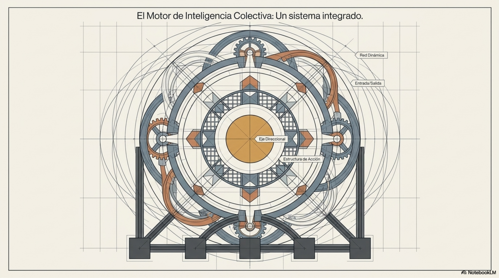

**2.1. Fases del desarrollo de la inteligencia colectiva**

La inteligencia colectiva es la capacidad de un grupo humano para pensar
conjuntamente, coordinar conocimientos, resolver problemas, crear
soluciones, aprender colectivamente y producir resultados superiores a
los que lograría cada individuo por separado. Su desarrollo no ocurre de
manera instantánea ni corresponde a una secuencia rígida y progresiva
para que las personas pasen de estar simplemente reunidas a convertirse
en una comunidad capaz de construir conocimiento y acción colectiva.

Aunque un grupo divida tareas, trabaje en paralelo y sume resultados
individuales, no todo grupo desarrolla inteligencia colectiva. Esta
inteligencia evoluciona cuando el grupo logra escuchar múltiples voces,
expresar conocimientos diversos, decidir colectivamente, organizar
recursos y acciones, conectar saberes y personas, evaluar críticamente
sus procesos y construir una visión compartida del futuro. El desarrollo
de la inteligencia colectiva implica integración cognitiva, creación
comunitraria, emergencia de nuevas capacidades y producción compartida
de conocimiento. Significa abandonar los sistemas tradicionales y
comprometerse para cumplir con otros paradigmas.

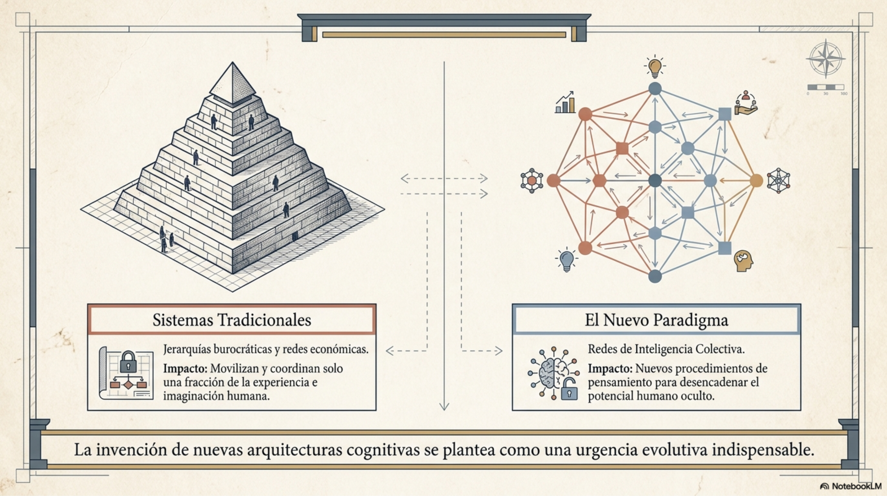

Paul Lévy considera que la inteligencia colectiva surge cuando el
conocimiento está distribuido, las personas se conectan en red, existe
reconocimiento mutuo y las tecnologías facilitan la colaboración.
Obtener resultados entre todos que superen la simple suma de
aportaciones individuales requiere comprender y aplicar las siguientes
leyes fundamentales.

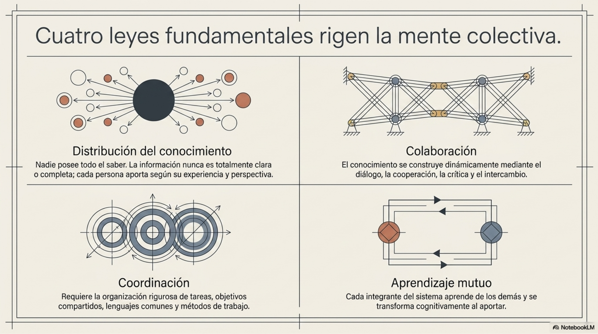

**Descripción de las fases del desarrollo de la inteligencia colectiva**

Cada una de las siete fases del desarrollo de la inteligencia colectiva
cumple una función específica en la evolución del trabajo colectivo y en
la creación de conocimiento distribuido. No son etapas completamente
rígidas o lineales; muchas veces se superponen, retroalimentan y
reaparecen durante todo el proceso colaborativo. Organizaremos estas
fases en tres etapas de producción: a la etapa de Percepción e
Intercambio corresponden las fases de Escuchar y Expresar, a la etapa de
Gestión y Acción las fases de Decidir y Organizar y a la etapa de
Evolución y Sentido las fases de Conectar, Evaluar y Mostrar Visión.

**Etapa de Percepción e Intercambio**

## **Fase 1: Escuchar** (atención activa para incorporar perspectivas)

Constituye el fundamento inicial de todo desarrollo de la inteligencia
colaborativa; consiste en la capacidad del grupo para participar y
aprender a captar hechos y propuestas desde la singularidad, así como
comprender necesidades y reconocer experiencias ajenas, evitando la
suspensión temporal de juicios prematuros. Es una especie de embudo de
entrada (input funnel) que recibe todo aquello que habrá de procesarse.

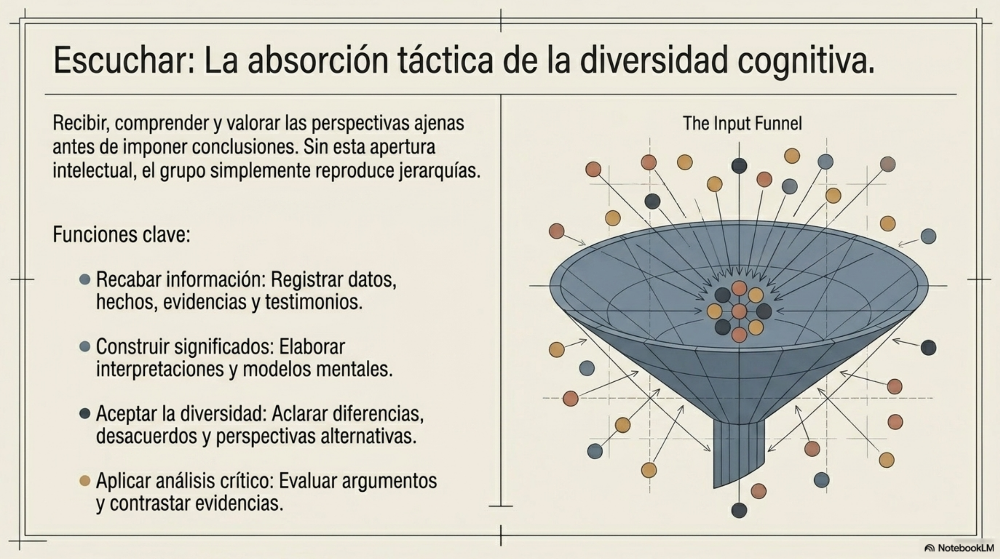

## **Fase 2: Expresar (**posicionamiento para compartir conocimientos)

Responde a la necesidad de exteriorizar ideas y conocimientos y exponer
problemas abiertamente. Se caracteriza por la claridad conceptual, la
argumentación clara y concisa desde la pluralidad para explorar
soluciones colectivas, así como para intercambiar ideas que provoquen la
circulación de argumentos y la producción discursiva pertinente y
oportuna. Es una especie de embudo de salida (output funnel) que muestra
como el pensamiento se transforma en conocimiento.

## 

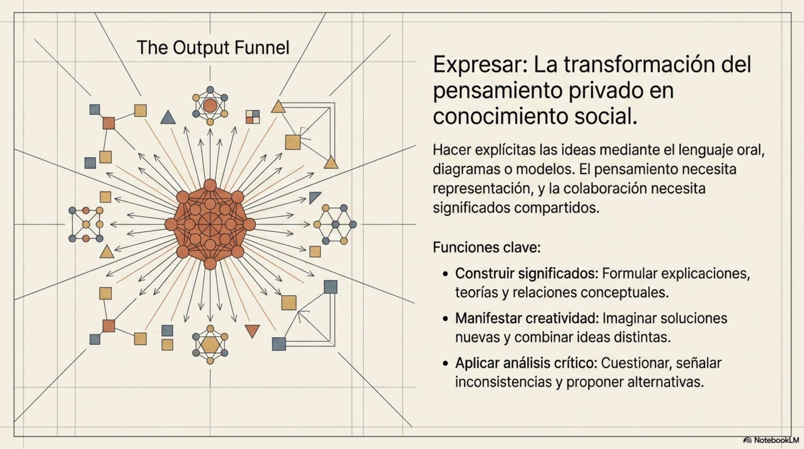

## 

**Etapa de Gestión y Acción**

**Fase 3: Decidir** (responsabilidad para seleccionar acciones)

Para que exista colaboración, el intercambio de ideas debe conducir a la
acción y hacer visibles los efectos de las decisiones que han de
tomarse, analizar críticamente expectativas, prioridades, posibilidades
y consecuencias. También deberán evaluarse alternativas y resolverse
tensiones y conflictos con el fin de negociar oportunamente para
construir acuerdos.

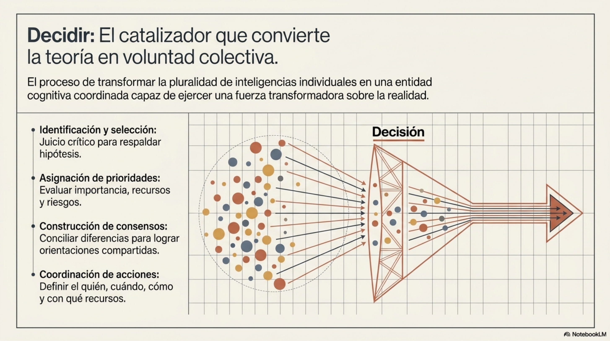

## 

## **Fase 4: Organizar** (coordinación para distribuir procesos)

Esta fase es esencial para construir estructuras operativas para evitar
que la colaboración se disperse y pierda eficacia. Consiste en definir
funciones, coordinar tareas, administrar recursos, definir
procedimientos, reagrupar competencias y estructurar procesos de
trabajo. Se caracteriza por la definición de roles y tareas, la
coordinación de tiempos y la gestión de información, la estructuración
de procesos y la integración funcional en lo social.

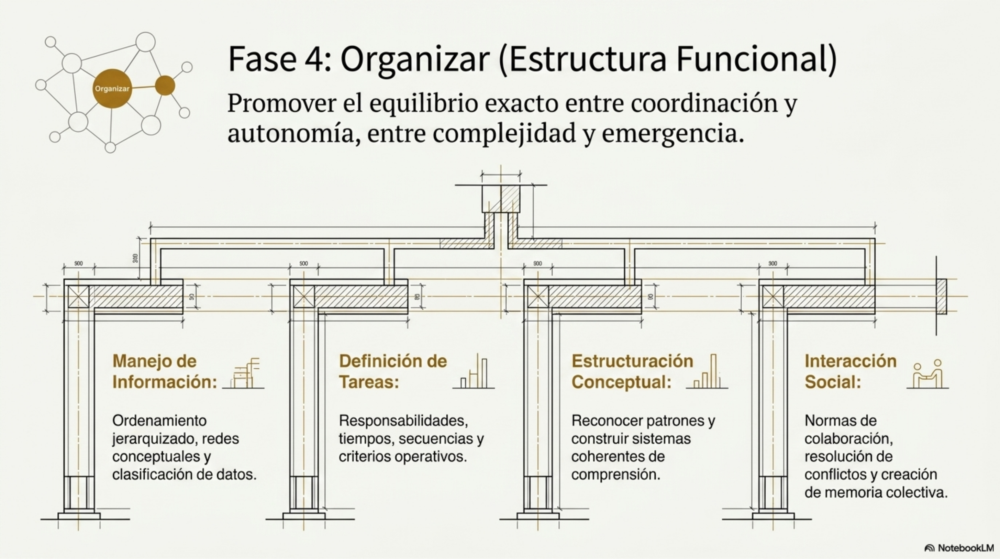

**Etapa de Evolución y Sentido**

## **Fase 5: Conectar** (integración de redes cognitivas)

Consiste en establecer vínculos directos en relaciones entre personas,
ideas, conocimientos, experiencias, disciplinas, recursos y sistemas
tecnológicos. Se caracteriza por interdependencia, creatividad, redes de
interacción, flujo de información, integración multidisciplinaria y
conectividad tecnológica. La inteligencia colectiva emerge de las
conexiones

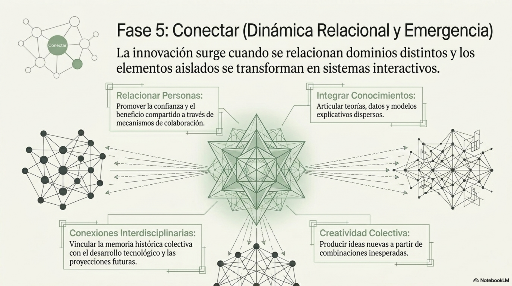

## **Fase 6: Evaluar** (calibración para aprender y corregir)

Consiste en analizar resultados, detectar errores, medir avances,
valorar procesos, comparar objetivos con logros y generar
retroalimentación. Se caracteriza por la reflexión metacognitiva y
crítica, la autoevaluación, la retroalimentación, la medición de
resultados y el ajuste de estrategias. Se concreta en aprender, criticar
y contrastar.

## 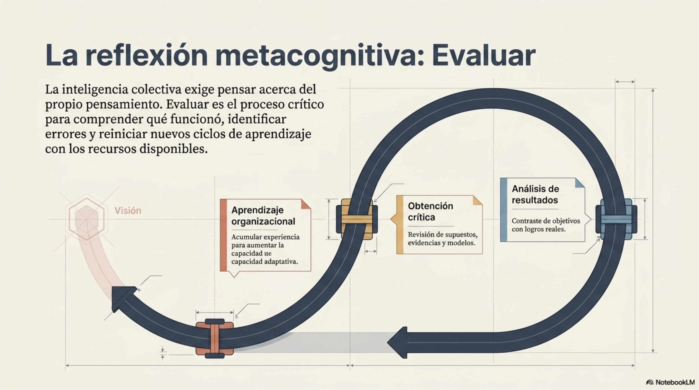

## 

## 

**Fase 7: Mostrar visión** (dar coherencia, dirección y sentido a la
perspectiva colectiva)

Consiste en construir y comunicar una comprensión compartida del futuro
y para ello el grupo desarrolla metas comunes, sentido de colectividad,
identidad compartida, orientación estratégica y propósito común. Se
caracteriza por la proyección estratégica, la imaginación colectiva, la
identidad grupal y la motivación compartida. La visión compartida da
coherencia y dirección a la inteligencia colaborativa.

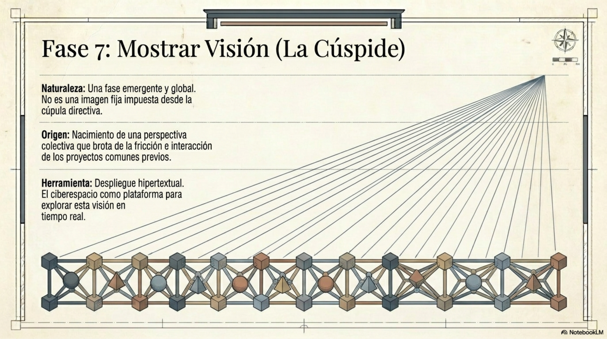

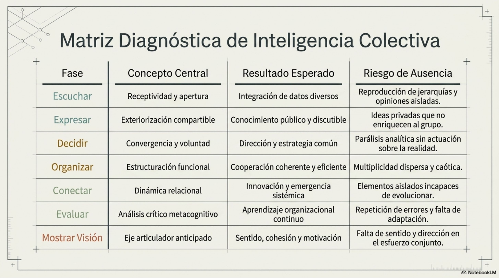

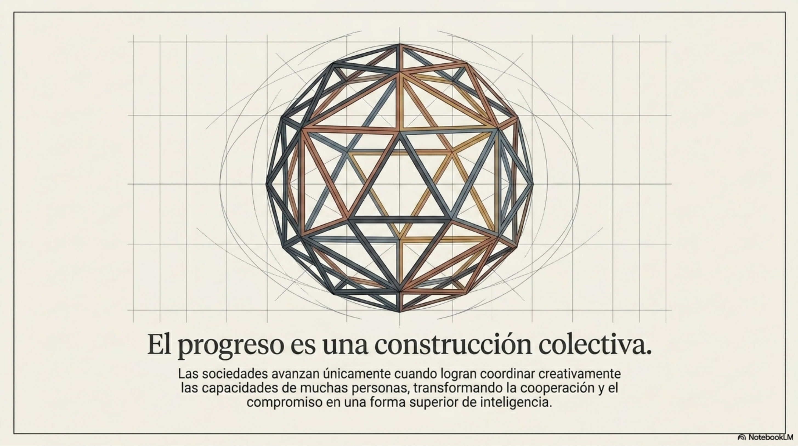

**2.2. Espacios antropológicos de la inteligencia colectiva**

La inteligencia colectiva coordina inteligencias distribuidas para
producir comprensión y acción colectiva. Se basa en la cooperación y el
intercambio abierto de saberes; se expresa en términos de creatividad
colectiva, aprendizaje mutuo, construcción compartida de significados y
funcionamiento de redes colaborativas,

La creación y evolución del proceso de desarrollo de la inteligencia
colectiva constituye una trayectoria que comprende transiciones entre
cuatro espacios antropológicos representativos de diversos escenarios
relacionales, comunicativos, cognitivos, simbólicos y culturales, así
como físicos y tecnológicos. En estos escenarios las personas
interactúan, comparten información, construyen conocimiento, coordinan
acciones, desarrollan identidades y producen formas de organización
social. Es en tales escenarios donde cobran vida y evolucionan los
espacios antropológicos.

La secuencia histórica del desarrollo de los espacios antropológicos no
sigue un orden cronológico; debe entenderse como una transformación
progresiva de la manera en que la humanidad organiza, aunque no
simultáneamente, la coexistencia de cuatro estratos de convivencia para
el conocimiento, el poder, la comunicación y la inteligencia colectiva.
Los estratos geográficos son los escenarios históricos, son los espacios
antropológicos.

Cada espacio antropológico modifica la manera en que una sociedad
piensa, aprende, coopera, ejerce poder, transmite conocimiento y
contribuye al desarrollo de la inteligencia colectiva. Cada espacio
antropológico amplía las capacidades humanas: La Tierra desarrolla la
memoria simbólica colectiva, el Territorio organiza la complejidad
institucional, las Mercancías potencian la capacidad tecnológica y
productiva y el Conocimiento busca coordinar inteligencias distribuidas
a escala global. Tales espacios o estratos constan de capas y contienen
pilares por medio de los cuales se representan distintas visiones de la
evolución del ser humano.

**La Tierra: Memoria comunitaria - Tradición y mito**

El espacio antropológico de la Tierra (Estrato I) es el primero de los
grandes escenarios históricos propuestos para explicar cómo la humanidad
organiza su existencia colectiva, su conocimiento y sus formas de
convivencia. Identifica a una humanidad que se comprende a sí misma como
parte viva del cosmos donde no existe una separación radical entre el
ser humano y su entorno. La naturaleza no es un objeto externo que debe
dominarse; es un organismo vivo y una red de fuerzas espirituales donde
los fenómenos naturales participan en una totalidad cósmica que expresa
sus cosmovisiones propias y construye los códigos que estructuran su
pensamiento mítico.

**El Territorio: Organización política - Instituciones y escritura**

El espacio antropológico del Territorio (Estrato II) surge cuando las
sociedades humanas dejan de organizarse principalmente alrededor de la
tradición oral, los vínculos tribales y la integración mítica con la
naturaleza; corresponde al momento en que la inteligencia funciona como
capacidad organizada de coordinación social donde opera y evoluciona una
estructura de tres capas: la infraestructura, la gobernanza y la
mentalidad cultural.

En la primera capa se define una infraestructura que consta de dos
elementos: la escritura y el espacio urbano. La escritura conduce a la
elaboración de protocolos para el manejo datos que representan en forma
diagramática tareas cognitivas de descarga o transferencia (cognitive
offloading diagram) y los espacios urbanos son los nodos de un diagrama
que muestra cómo un elemento central (hub) se conecta mediante ramas
(spokes) con elementos periféricos que cumplen diversas funciones.

En la segunda capa se construye el concepto de gobernanza en tanto
conjunto de principios, estructuras, procesos y mecanismos mediante los
cuales una organización, comunidad o sociedad dirige, coordina, toma
decisiones y supervisa sus actividades para alcanzar objetivos comunes
de manera eficaz, transparente y responsable**.** En tales condiciones,
la escritura hace posible la ley, la ley genera burocracias estatales,
el Estado proporciona el financiamiento de las ciudades y las ciudades
propician la hiperespecialización del conocimiento.

En la tercera capa se alcanza una nueva mentalidad cultural que
representa el nacimiento de la civilización organizada y del poder
institucional donde se definen otras cronologías, aparece la
especialización y las personas desarrollan su propia identidad
territorial.

**Las Mercancías: Innovación económica - Mercado y producción**

El espacio antropológico de las Mercancías (Estrato III) surge con el
desarrollo del comercio mundial, el capitalismo, la industrialización,
la expansión tecnológica, la economía de mercado y la aceleración de los
flujos de producción e información. Representa una humanidad organizada
por los flujos de producción, intercambio, tecnología e información. El
correspondiente sistema global consta de tres capas que, en términos
anatómicos, funcionan como motor, acelerador y sistema operativo.

Para que el conocimiento se transforme en capital intelectual y funcione
como herramienta de producción estratégica necesariamente deben
incrementarse las velocidades y los alcances con las que operan las
instituciones, lo cual se expresa en la forma como se modifica la
rentabilidad corporativa y se propicia el desarrollo industrial. Aparece
la hiper-especialización y la fragmentación cognitiva, pero domina lo
micro a costa de perder la visión global como características de un
sistema operativo donde se contraponen progreso contra dominación.

**El Conocimiento: Inteligencia distribuida - Redes y colaboración**

El espacio antropológico del Conocimiento (Estrato IV) constituye el
núcleo de la teoría de la inteligencia colectiva que opera con
efectividad y eficiencia cuando la principal riqueza humana consiste en
construir la capacidad colectiva de crear significado, compartir
saberes, cooperar, aprender continuamente e innovar juntos. La
construcción de tal riqueza humana se apoya en tres pilares anatómicos:
la interconexión, la colaboración y la transformación.

Los espacios antropológicos son fases (etapas) en la evolución de una
humanidad capaz de coordinar inteligencias distribuidas mediante el
desarrollo de aprendizajes colectivos y la construcción de un sistema
cognitivo que comprende:

- inteligencia distribuida (capacidades coordinadas)

- redes de conocimiento (comunidades globales)

- colaboración abierta (fin de las jerarquías rígidas)

- aprendizaje permanente (proceso continuo)

- interconexión global (sin barreras espaciotemporales)

- dinamismo (reconstrucción de la información evolutiva y permanente)

- integración de saberes (interdisciplinariedad)

| Tabla 2.2. Comparaciones entre los cuatro espacios antropológicos |                                           |                                                |                                               |                                                       |
|-------------------------------------------------------------------|-------------------------------------------|------------------------------------------------|-----------------------------------------------|-------------------------------------------------------|
| Aspecto                                                           | Espacio de la Tierra                      | Espacio del Territorio                         | Espacio de las Mercancías                     | Espacio del Conocimiento                              |
| Base histórica                                                    | Sociedades tribales y tradicionales       | Civilizaciones agrícolas y Estados organizados | Capitalismo industrial y mercado global       | Redes digitales y sociedades del conocimiento         |
| Principio organizador                                             | Comunidad y naturaleza                    | Instituciones y soberanía territorial          | Producción, intercambio y mercado             | Conocimiento compartido y redes colaborativas         |
| Forma dominante de vínculo social                                 | Parentesco y tradición                    | Ciudadanía y pertenencia política              | Relaciones económicas y laborales             | Conexiones en red y comunidades de aprendizaje        |
| Relación con el espacio                                           | Espacio sagrado y vivido                  | Territorio delimitado y administrado           | Espacio global de circulación                 | Espacio virtual y redes interconectadas               |
| Relación con el tiempo                                            | Tiempo cíclico                            | Tiempo histórico y cronológico                 | Tiempo productivo y acelerado                 | Tiempo dinámico para el aprendizaje continuo          |
| Forma principal de conocimiento                                   | Mito, tradición y experiencia oral        | Escritura, leyes y conocimiento institucional  | Ciencia aplicada y tecnología productiva      | Inteligencia distribuida y conocimiento colaborativo  |
| Modo de transmisión del conocimiento                              | Oralidad y ritual                         | Escritura y educación formal                   | Medios técnicos e instituciones industriales  | Redes digitales e interacción colectiva               |
| Figura central del conocimiento                                   | Chamán, anciano, narrador                 | Escriba, sacerdote, funcionario, maestro       | Técnico, científico, empresario               | Comunidad colaborativa y redes de expertos            |
| Tipo de inteligencia colectiva                                    | Memoria comunitaria                       | Coordinación institucional                     | Innovación técnico-productiva                 | Cooperación cognitiva distribuida                     |
| Estructura social predominante                                    | Clan, tribu, comunidad                    | Estado, ciudad, imperio                        | Empresa, industria, mercado                   | Redes, comunidades y plataformas colaborativas        |
| Tecnología dominante                                              | Herramientas tradicionales                | Escritura, arquitectura, administración        | Máquinas, fábricas, telecomunicaciones        | Computación, Internet e inteligencia en red           |
| Relación con la naturaleza                                        | Integración simbólica con el cosmos       | Dominio y organización del entorno             | Explotación productiva de recursos            | Gestión inteligente y conciencia global               |
| Forma de autoridad                                                | Tradición y sabiduría ancestral           | Ley, jerarquía e instituciones                 | Capital económico y poder industrial          | Competencia, participación y reconocimiento colectivo |
| Modelo educativo                                                  | Aprendizaje comunitario y experiencial    | Educación formal y disciplinaria               | Formación técnica y profesional               | Aprendizaje colaborativo y permanente                 |
| Economía predominante                                             | Subsistencia comunitaria                  | Agricultura organizada e impuestos             | Producción industrial y consumo masivo        | Economía del conocimiento e innovación                |
| Ventaja principal                                                 | Cohesión simbólica y sentido comunitario  | Organización social compleja y estabilidad     | Gran capacidad tecnológica y productiva       | Creatividad colectiva y cooperación global            |
| Problemas característicos                                         | Limitación técnica y aislamiento          | Centralización y burocracia                    | Desigualdad, fragmentación y mercantilización | Sobrecarga informativa y control algorítmico          |
| Ejemplos históricos                                               | Pueblos originarios y sociedades tribales | Egipto, Grecia, Roma, China imperial           | Revolución industrial y capitalismo global    | Internet, ciencia colaborativa y redes abiertas       |
| Tipo de identidad                                                 | Comunitaria y ancestral                   | Nacional o territorial                         | Profesional y económica                       | Múltiple, dinámica y conectada                        |
| Visión del ser humano                                             | Parte integrada del cosmos                | Ciudadano sometido a instituciones             | Productor, consumidor y agente económico      | Nodo activo de la inteligencia colectiva              |

**2.3. Experimentos acerca del electrón**

El electrón es uno de los más importantes componentes de la materia:
forma parte de átomos y moléculas, interviene en los enlaces químicos,
es responsable de la corriente eléctrica e interacciona constantemente
con otras partículas elementales. Además, participa en múltiples
procesos producidos y/o controlados por radiaciones electromagnéticas.

Aquí nos ocuparemos de describir los diseños experimentales que
propiciaron su descubrimiento, detección y control, para lo cual
proponemos considerar cuatro regiones de realización de actividades
experimentales: Preparación, Transformación, Detección y Medición. Al
final comentaremos cómo estas regiones de realización de las actividades
experimentales se relacionan con las fases de desarrollo de la
inteligencia colectiva que se han considerado previamente en la sección
2.1.

En esta sección describimos el contenido de las Conferencias Nobel
presentadas por quienes fueron los autores de tres experimentos
revolucionarios acerca del electrón: su descubrimiento por Joseph John
Thomson (1856-1940), la determinación de su carga eléctrica elemental
por Robert Andrews Millikan (1868-1953) y la demostración de la
existencia de niveles electrónicos de energía cuantizada por James
Franck (1882-1964) y Gustav Ludwig Hertz (1987-1975).

En lo que sigue, indicamos el año en que se concedió el Premio Nobel, la
razón por la cual el Comité Nobel de Física les otorgó tales
reconocimientos y los títulos de sus respectivas Conferencias Nobel.
También incluimos sus fotografías, tomadas de los archivos de la
Fundación Nobel.

J. Thomson en [1906](https://www.nobelprize.org/prizes/physics/1906/)
"en reconocimiento a los grandes méritos de sus investigaciones teóricas
y experimentales sobre la conducción de la electricidad por gases".
Conferencia Nobel: *Portadores de la electricidad negativa.*

R. A. Millikan en 1923 "por su trabajo sobre la carga elemental de la
electricidad y sobre el efecto fotoeléctrico". Conferencia Nobel*: El
electrón y la luz-cuantitativo desde el punto de vista experimental.*

J. Franck y G.L. Hertz en 1925 "por su descubrimiento de las leyes que
rigen el impacto de un electrón sobre un átomo". Conferencia Nobel de
Franck*: Transformación de la energía cinética de electrones libres en
energía de excitación de átomos por impactos.* Conferencia Nobel de
Hertz*: Los resultados de las pruebas de impacto electrónico a la luz de
la teoría de los átomos de Bohr.*

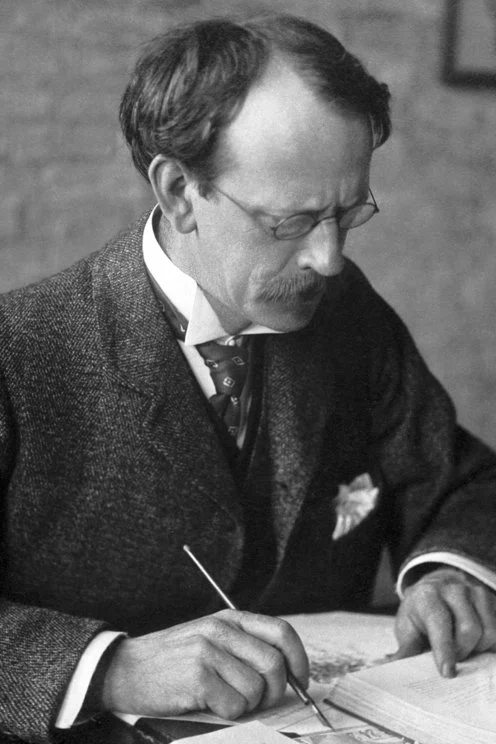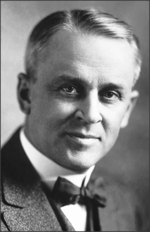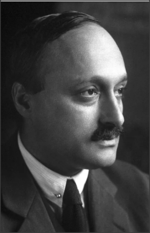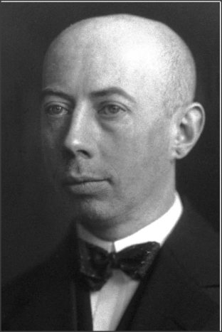

Fotografías de Thomson, Millikan, Franck y Hertz (archivos de la
Fundación Nobel)

**Regiones de realización de las actividades experimentales**

Experimentar consiste en formular preguntas concretas a la naturaleza y
resolverlas con la ayuda de aparatos y dispositivos. Para entender en
qué consiste un experimento en ciencias naturales, en física en
particular, conviene visualizar su diseño y ejecución en términos de las
acciones que se realizan en cuatro regiones de realización de
actividades experimentales: la región de inicio de Preparación, la
región intermedia de Transformación, la región crítica de Detección y la
región final de Medición.

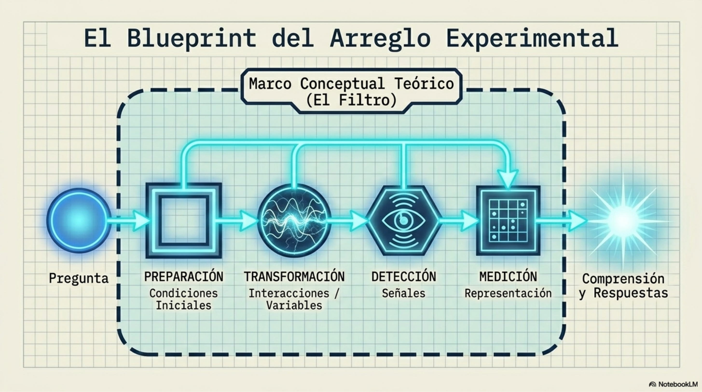

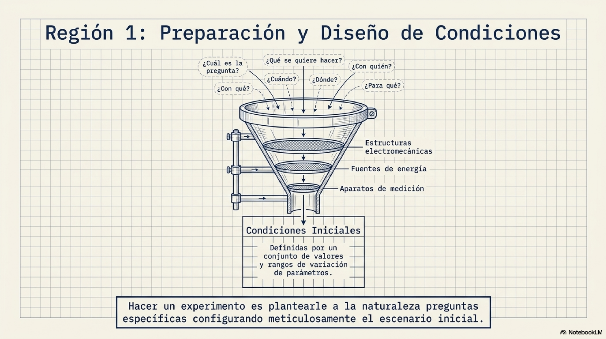

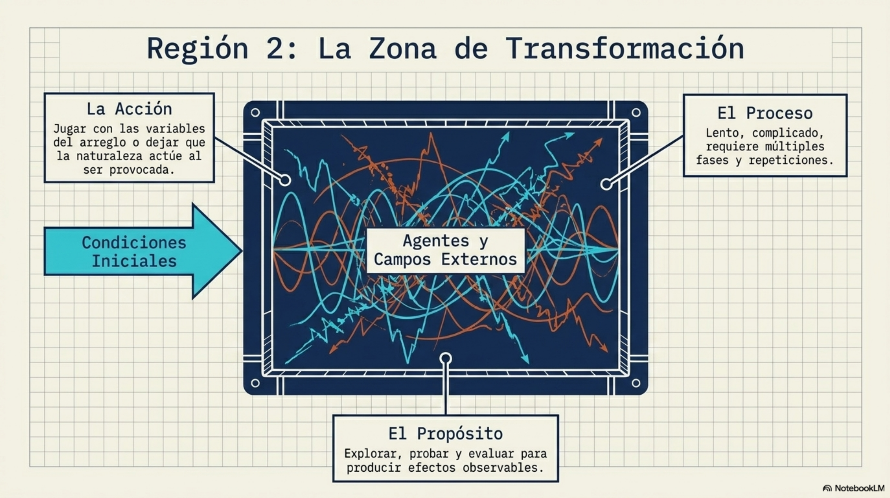

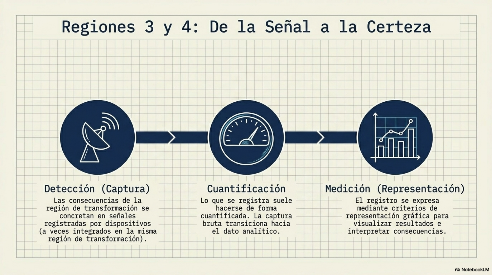

La siguiente Tabla 2.3 describe cómo se relacionan cada una de las
cuatro regiones de realización de actividades experimentales con tres
aspectos que las caracterizan: en qué consiste la acción principal,
cuáles son los dispositivos o aparatos básicos requeridos y qué tipo de
resultados se esperan.

<table>
<colgroup>
<col style="width: 19%" />
<col style="width: 19%" />
<col style="width: 20%" />
<col style="width: 19%" />
<col style="width: 19%" />
</colgroup>
<thead>
<tr class="header">
<th colspan="5">Tabla 2.3. Regiones de realización y componentes de las
actividades experimentales</th>
</tr>
</thead>
<tbody>
<tr class="odd">
<td>Componentes de la actividad</td>
<td>Región de Preparación</td>
<td>Región de Transformación</td>
<td>Región de Detección</td>
<td>Región de Medición</td>
</tr>
<tr class="even">
<td>Acción principal</td>
<td>Organizar e integrar</td>
<td>Producir interacciones</td>
<td>Registrar señales</td>
<td>Representar gráficamente</td>
</tr>
<tr class="odd">
<td>Aparatos requeridos</td>
<td>
Fuentes de energía

Controladores
</td>
<td>
Campos externos

variables
</td>
<td>
Sensores

Aparatos de captura
</td>
<td>
Graficadores

Registradoras de datos
</td>
</tr>
<tr class="even">
<td>Resultados esperados</td>
<td>Condiciones iniciales fijas</td>
<td>Efectos observables generados</td>
<td>Señales concretas capturadas</td>
<td>Consecuencias interpretables</td>
</tr>
</tbody>
</table>

Habrá experimentos que funcionen dentro del ámbito de lo que se entiende
o se sospecha, pero podrán aparecer dudas y nuevas interrogantes, así
como sorpresas inesperadas. La conceptualización de ideas y la
visualización de acciones dependen tanto de lo que sabe el
experimentador como de lo que ignora; se apoya en la existencia de un
marco conceptual teórico que explica intenciones y proporciona
significados.

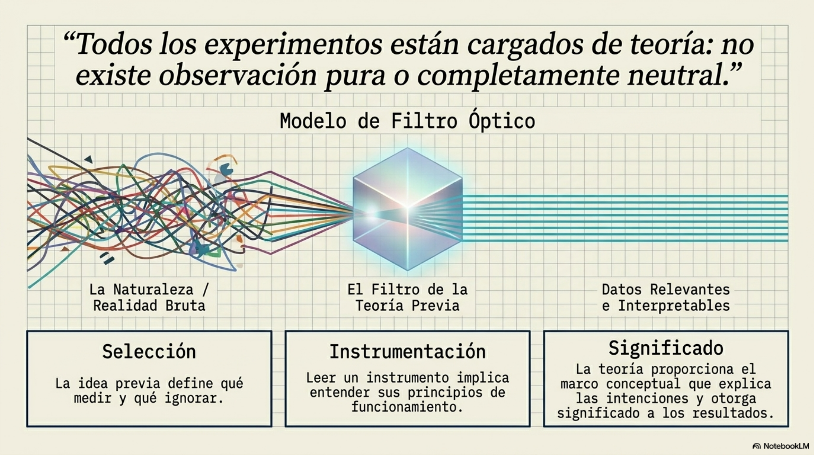

**Tres experimentos revolucionarios acerca del electrón**

El término electrón proviene del griego ἤλεκτρον (ēlektron), que
significa ámbar. Durante siglos, el término *ēlektron* se usó para
describir fenómenos eléctricos, pero fue hasta 1891 cuando el físico
George Johnstone Stoney (1826 - 1911) propuso el nombre “electrón” para
referirse a la unidad fundamental de carga eléctrica. Tres experimentos
pioneros permitieron obtener los conocimientos básicos de sus
principales características: su descubrimiento como partícula elemental
por J. J. Thomson, la determinación de su carga eléctrica por R.A.
Millikan y la demostración de la existencia de niveles energéticos
cuantizados por J. Franck y G. L. Hertz.

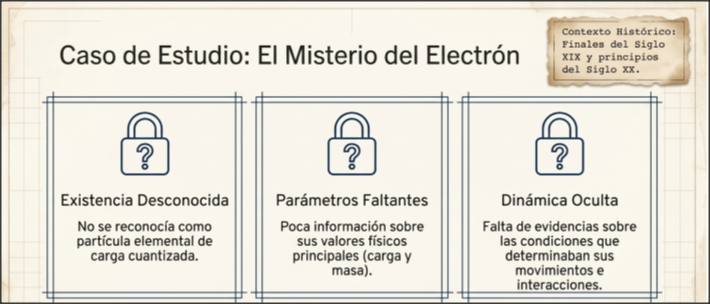

### La descripción de los experimentos antes mencionados comprende dos partes:

### 

### La discusión del experimento: explicación de la estructura del dispositivo experimental y de las etapas de su operación en términos de su paso por las cuatro regiones de realización de las actividades experimentales de Preparación, Transformación, Detección y Medición. Cada experimento incluye un dibujo o esquema ilustrativo.

### 

### La descripción de las contribuciones de Thomson, Millikan, Franck y Hertz comprende dos partes: la primera parte es la traducción de un documento llamado *WORK* (OBRA) que explica muy brevemente las razones por las cuales se le ha otorgado el Premio Nobel de Física; la segunda parte contiene diapositivas de una presentación obtenida con ayuda del programa NotebookLM, a partir de la traducción de lo que cada uno de los premiados ha escrito en su Conferencia Nobel. En el caso de Millikan, al final de su Conferencia comenta los diez años en que sometió a prueba la validez de la ecuación de Einstein acerca del efecto fotoeléctrico.

### 

### <u>Experimentos para descubrir el electrón por Thomson</u>

### 

### A partir de 1897 Joseph John Thomson (1856-1940) realizó una secuencia de tres tipos de experimentos: el primero para describir cuándo salía del átomo una partícula cargada desconocida; el segundo para determinar que esas partículas tenían carga eléctrica negativa y el tercero para calcular el valor de su relación carga/masa. 

### 

### Thomson publicó sus resultados en el artículo titulado *[Cathode Rays](http://web.lemoyne.edu/~GIUNTA/archemc.html#cathoderay) de* la revista *Philosophical Magazine*, 44, 293 (1897). La siguiente Figura 2.1 es una adaptación de la original tomada del artículo de Thomson y describe las regiones de realización de las correspondientes actividades experimentales.

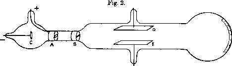

Figura 2.1. Aparato utilizado por Thomson. (Las barras verticales en
azul marcan las divisiones entre las regiones de realización del
experimento.

Fuente: adaptación del autor de la imagen tomada de
\<https://www.escuelapedia.com/wp-content/uploads/Experimento-de-Thomson.jpg\>

En la Figura anterior las letras indican las siguientes variables:

(*d*) es la distancia recorrida por el electrón dentro de las placas del
condensador donde se aplica un campo eléctrico externo (***E***). Es en
esta región donde se aplicará un campo magnético externo (***B)*** en el
tercer tipo de experimentos.

(*s*) es la distancia recorrida por el electrón cuando sale del
condensador y choca con una pantalla fosforescente al final del tubo.
Cuando no se aplican campos externos, no hay desviación de la
trayectoria.

*(l*) es la distancia en la pantalla entre la posición de llegada del
electrón cuando no se aplican campos externos y la posición de llegada
cuando se aplica un campo eléctrico (***E***).

(*θ*) es el ángulo que indica la separación entre la posición de llegada
del electrón a la pantalla cuando no hay campo externo y la posición
correspondiente cuando si se aplica el campo el campo eléctrico. Este
ángulo de deflexión *θ* es tal que *tan(θ) = l/s*.

La región de <u>Preparación</u> comprende un tubo al vacío que contiene
un cátodo negativo (C), un ánodo positivo (A) y una rendija (S): cuando
C se calienta emite una radiación atraída por A y la rendija colimadora
S. Las condiciones iniciales son las siguientes: una partícula de masa
*m* y carga *q* sale del cátodo y llega al condensador con una velocidad
horizontal vhorizontal = v0 en una dirección
paralela a las placas D y E.

La región de <u>Transformación</u> se ubica en el interior de un
condensador de placas metálicas cargadas (D y E) donde se aplicarán los
campos eléctricos y magnéticos externos. Cuando actúa la fuerza
electrostática *Felectric = qE* se genera una aceleración
transversal en una dirección perpendicular al haz incidente *a
transversal *= *at = qE/m*. Dicha fuerza actúa
durante el tiempo *t = d*/v0, requerido para recorrer la
distancia *d* dentro del condensador con una velocidad transversal
$v_{transversal} = \ \left( a_{t} \right)(t) = \ \left( \frac{qE}{m} \right)\left( \frac{d}{v_{0}} \right) = \ \frac{qEd}{mv_{0}}$.

Dentro de esta región de <u>Transformación</u>, el desplazamiento de la
partícula tiene dos componentes: la componente horizontal *x =*
v0t debida a la velocidad constante v0 y la
componente vertical variable *y = 1/2(at)t2*
producida por la aceleración transversal *at*. Teniendo en
cuenta estas dos componentes del desplazamiento, la ecuación resultante
de la trayectoria dentro del condensador es una parábola de la forma *y
= Ax2*

$y = \ ½\left( a_{t} \right)t^{2} = \ ½\left( \frac{qE}{m} \right)\left\lbrack \left( \frac{x}{v_{0}} \right)^{2} \right\rbrack = \ ½\left( \frac{qE}{m{v_{0}}^{2}} \right)\left( x^{2} \right).$.

Las regiones de <u>Detección y Medición</u> están activas cuando el
electrón sale del condensador y llega a la pantalla. Para calcular el
ángulo de deflexión cuando la partícula sale del condensador en
$\lbrack\theta\rbrack$*x = d* debemos calcular la derivada de
la parábola *(dy/dx)* en ese punto:
${\tan(\theta)}{= \ \frac{dy}{dx}} = \ {\left\lceil ½\left( \frac{qE}{m{v_{0}}^{2}} \right)(2x) \right\rceil\ }_{x = d} = \left( \frac{qEd}{m{v_{0}}^{2}} \right)$;
además$\mathbf{\ }\tan(\theta) = \frac{l}{s}\ $. En consecuencia
$\left( \frac{qEd}{m{v_{0}}^{2}} \right) = \ \frac{l}{s}$, de donde
$\left( \frac{q}{m} \right) = \ \frac{(l)\left\lbrack \left( v_{0} \right)^{2} \right\rbrack}{(Eds)}$.

La ecuación anterior indica que la relación *q/m* podrá calcularse si se
conocen los valores de las distancias *d, l* y *s*, la intensidad del
campo eléctrico *E* y la velocidad inicial v0. Para calcular
v0, Thomson realizó el tercer tipo de experimento: en la
región de Transformación aplicó un segundo campo externo, un campo
magnético ***B*** en una dirección perpendicular a ***E***.

Igualando las magnitudes de ambas fuerzas: *Fmagnética =
qv0B* y *Feléctrica = qE* se obtiene que
v0 *= E/B* y sustituyendo este valor en
$\left( \frac{q}{m} \right) = \ \frac{(l)\left\lbrack \left( v_{0} \right)^{2} \right\rbrack}{(Eds)}$
resulta finalmente que

$$\left( \frac{q}{m} \right) = \ \frac{El}{B^{2}ds}$$

Es interesante observar que en esta ecuación la relación de dos
cantidades muy pequeñas y desconocidas (*q/m*) puede calcularse midiendo
tres distancias (*l*, s, d) y la intensidad de dos campos (E y B). Estos
experimentos permitieron convertir una pregunta muy difícil en un
procedimiento factible y relevante.

<u>PREMIO NOBEL DE FÍSICA DE 1906</u>

**Joseph John Thomson**

OBRA: “La idea de que la electricidad se transmite por una diminuta
partícula relacionada con el átomo se propuso por primera vez en la
década de 1830. En la década de 1890, J.J. Thomson logró estimar su
magnitud realizando experimentos con partículas cargadas en gases. En
1897 demostró que los rayos catódicos (radiación emitida cuando se
aplica un voltaje entre dos placas metálicas dentro de un tubo de vidrio
lleno de gas a baja presión) están formados por partículas — electrones
— que conducen electricidad. Thomson también concluyó que los electrones
forman parte de los átomos.”

J.J. Thomson – Hechos. NobelPrize.org. Alcance del Premio Nobel AB 2023.
Mié 1 de marzo de 2023.
\<https://www.nobelprize.org/prizes/physics/1906/thomson/facts/\>

**Conferencia Nobel: *Portadores de la electricidad negativa.***

J.J. Thomson – Conferencia Nobel. NobelPrize.org. Alcance del Premio
Nobel AB 2023. Mié 1 de marzo de 2023.
\<https://www.nobelprize.org/prizes/physics/1906/thomson/lecture/\>

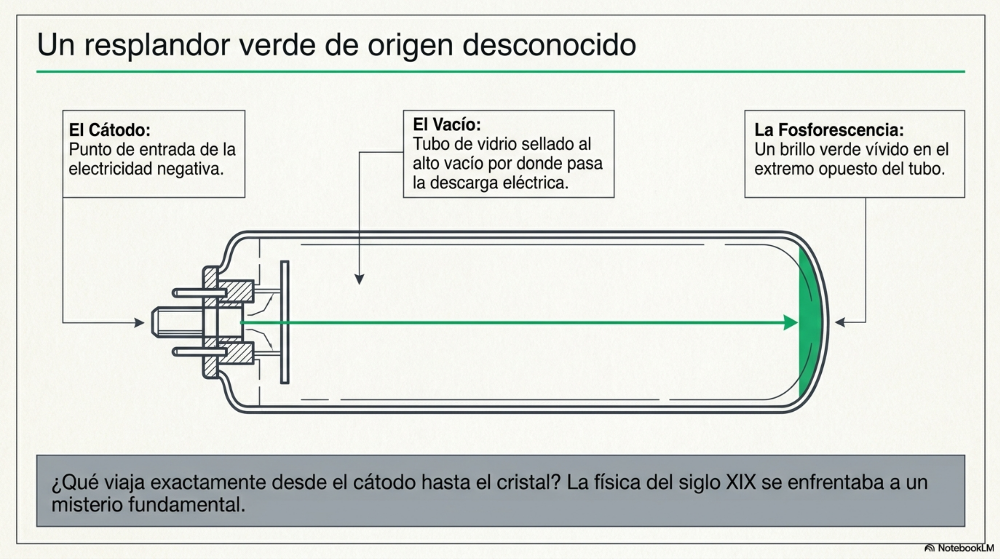

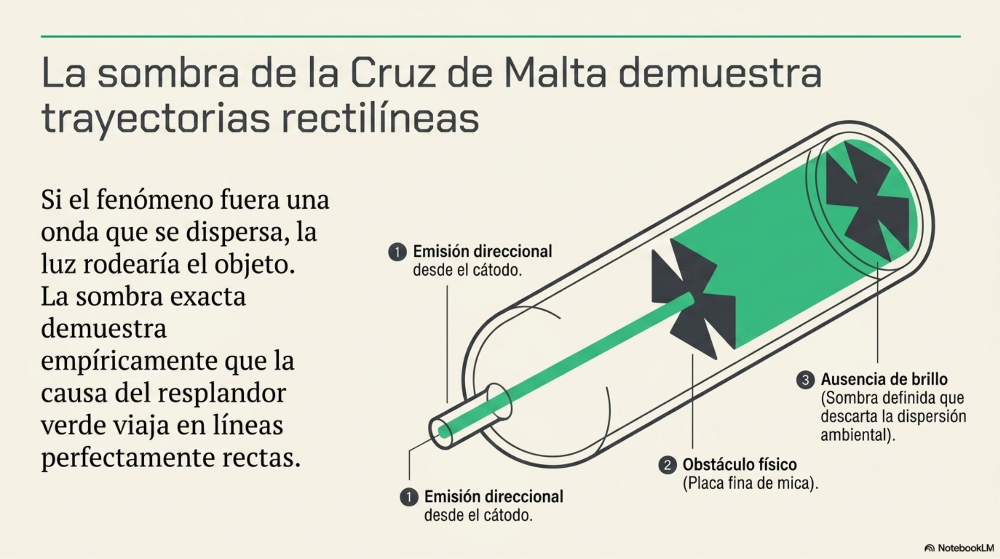

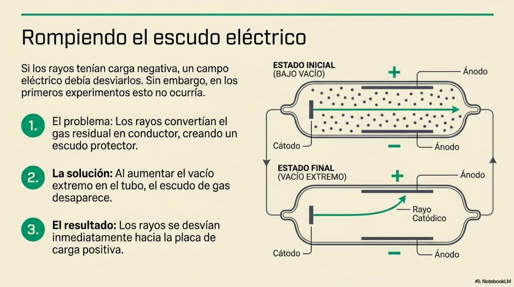

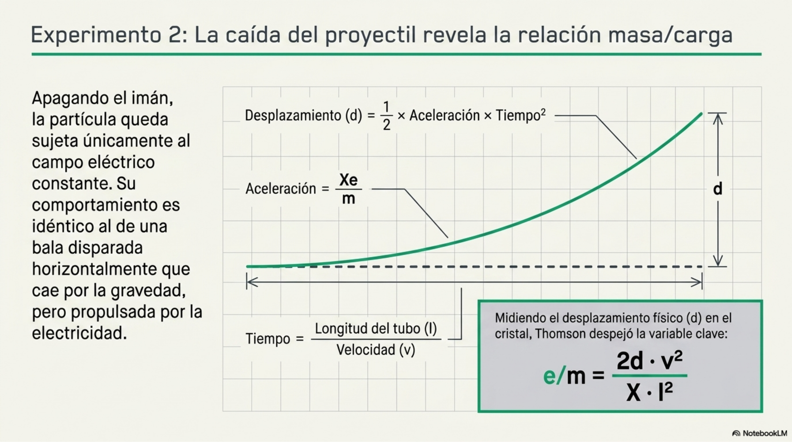

La diapositiva anterior contiene la nomenclatura utilizada originalmente
por Thomson: *m* es la masa del electrón, *e* corresponde a la carga del
electrón *q*, *X* a la intensidad del campo eléctrico *E* e *I* a la
intensidad del campo magnético *B*.

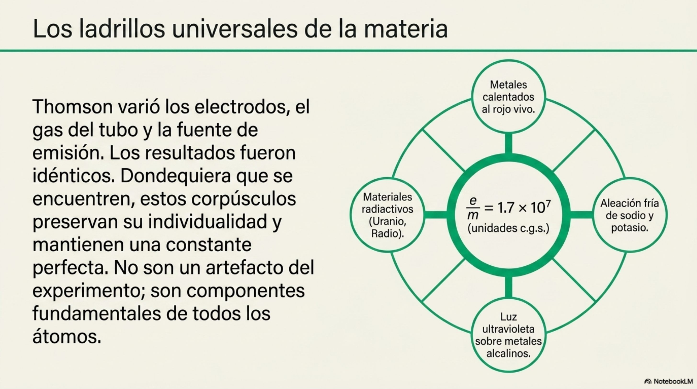

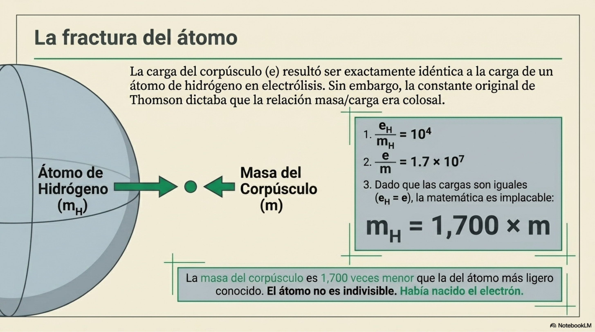

<u>Experimentos para medir la carga eléctrica elemental del electrón por
Millikan</u>

A partir de 1907, Robert Andrews Millikan (1868 -
[1953](http://es.wikipedia.org/wiki/1953)) y su alumno [Harvey
Fletcher](http://es.wikipedia.org/w/index.php?title=Harvey_Fletcher&action=edit&redlink=1)
(1884 – 1981) buscaron un procedimiento para determinar el valor de la
carga de un electrón. Primero experimentaron con gotas de agua y después
con gotas de aceite. Su dispositivo experimental se describe a
continuación e ilustra en las Figuras 2.3a y 2.3b.

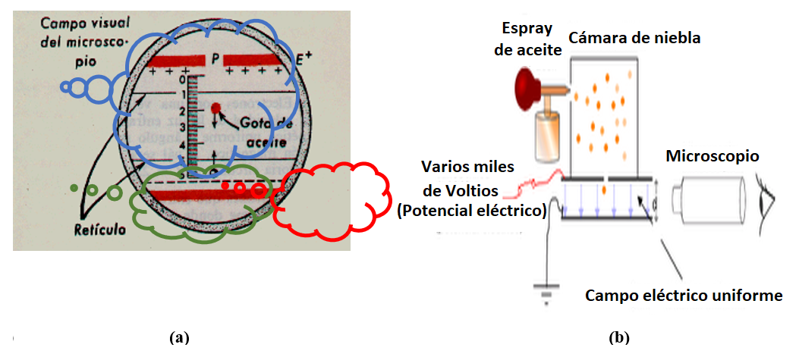
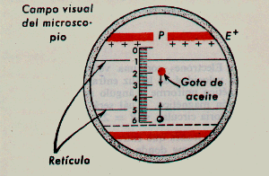

Figura 2.3. Dispositivo del experimento de la gota de aceite (a) y vista
amplificada de una gota dentro del microscopio (b). En 2.2a la región de
Preparación está en azul, la región de Transformación en verde y la
región de Detección en rojo.; la región de Medición se muestra aparte en
2.2b.

Fuente: adaptación de imagen tomada de

http://3.bp.blogspot.com/\_xfoymkZ4PVw/R7tU2NwpDhI/AAAAAAAAACc/hzVF6hfLeA8/s1600-h/Simplified_Millikan_oil_drop.PNG

En la región de <u>Preparación</u>, un atomizador produce gotas que
atraviesan un orificio en una placa metálica que cubre una cámara
cilíndrica.

En la región de <u>Transformación</u>, dentro de la cámara está un
condensador de dos placas metálicas separadas por una distancia *d;* la
tapa superior del cilindro tiene cuatro orificios, tres de ellos
iluminan el interior de las placas y el cuatro orificio es para medir
con un microscopio las posiciones de la gota cuando viaja entre las
placas del condensador. Una fuente externa de rayos X sirve para cargar
las gotas de aceite ionizándolas. Dentro de la cámara, un potencial *V*
generado por una batería externa produce un campo eléctrico uniforme de
intensidad *E = V/d*. Los cambios en la polaridad de esta batería harán
que las gotas cargadas bajen o suban.

En las regiones de <u>Detección y Medición</u> un microscopio externo
mide en una regla graduada la posición de las gotas cuando viajan entre
las placas.

Dentro de la cámara, la gota experimenta tres fuerzas (Figura 2.2b): el
peso debido a su masa *m* (fuerza de gravedad *F = mg*), la fuerza de
arrastre viscosa (*Fviscosidad*) producida por la fricción
con el aire dentro de la cámara, y la fuerza eléctrica *Fcampo
eléctrico = qE* ejercida por el campo externo *E*.

Según la ley de Stokes, la fuerza de fricción del fluido es
*Fviscosidad = κηvt*, donde: *vt *es la
velocidad terminal, *η* es la viscosidad del aire, κ = 6πr es un
coeficiente de resistencia y *r* es la radio de una gota esférica*.* En
consecuencia *vt = (Fviscosidad)/κη.* Si el campo
externo E es nulo, la fuerza *Fcampo eléctrico = 0*. Para que
al caer la gota se mantenga estacionaria, la fuerza resultante debe ser
cero y, por tanto, *Fviscosidad =
Fgravedad = mg*. Entonces, en ausencia de un campo externo la
velocidad terminal es *vt = v a = mg/(κη).* Esta
es la velocidad de caída libre cuando el campo eléctrico es nulo (está
apagado).

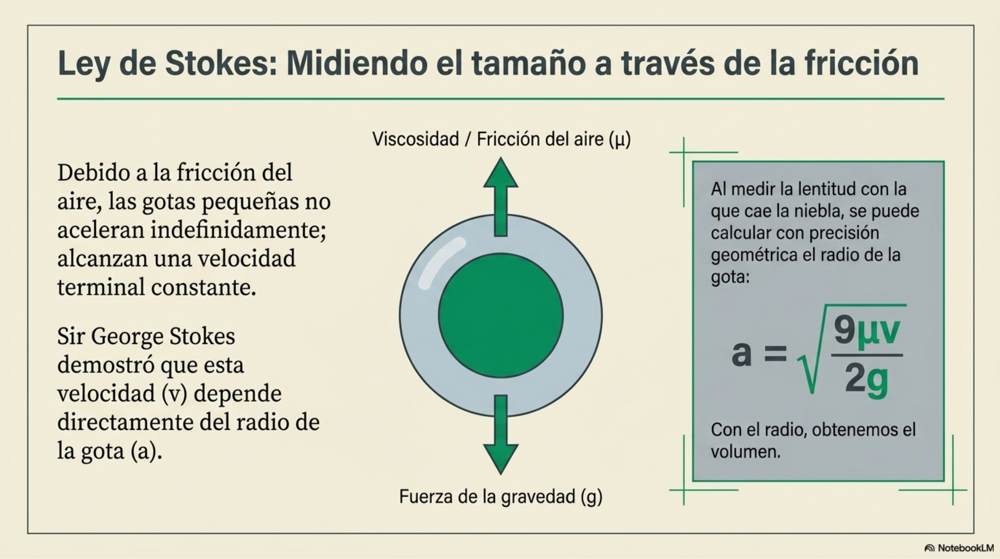

Sin embargo, cuando el campo externo no es cero la fuerza neta
*Fviscosidad = qE - mg* y, por tanto, la velocidad terminal
en presencia del campo es *vp = (qE – mg)/(κη).* Tras sumar
estas velocidades obtenemos *q = \[(va + vp)κη\]/E
= \[(va + vp)(6πrη)\]/E*. Cuando se consideran
variaciones en la velocidad terminal Δva, los cambios en la
carga resultan ser *Δq = \[(6πrη)/E*\](Δva).

Las velocidades terminales va y vp se determinan
midiendo el tiempo que tarda la gota en recorrer una distancia
determinada que está marcada en la regla graduada que puede verse a
través del microscopio (Figura 2.2b). Para calcular la radio *r* de una
gota de masa *m* se supone que la gota tiene una forma esférica y que su
densidad es uniforme *ρ = m/\[4/3πr3\].* Por lo tanto, la
velocidad terminal en ausencia de campo externo puede medirse como
va *= mg/(κη),* con *κ = 6πr;* entonces *r2 =
(9/2)(η*va*)/(ρg).*

**PREMIO NOBEL DE FÍSICA DE 1923**

**Robert Andrews Millikan**

OBRA: “Durante la década de 1890 se aceptó la teoría de que la
electricidad se transmitía mediante una unidad minúscula, el electrón.
En 1910, Robert Millikan logró determinar con precisión la magnitud de
la carga del electrón. Pequeñas gotas de aceite cargadas eléctricamente
se suspendían entre dos placas metálicas, donde eran sometidas a la
fuerza descendente de la gravedad y a la atracción hacia arriba de un
campo eléctrico. Al medir cómo se movían las distintas gotas de aceite,
Millikan demostró que su carga siempre era múltiplo de una carga
determinada: la carga del electrón.”

Robert A. Millikan – Hechos. NobelPrize.org. Alcance del Premio Nobel AB
2023. Jueves. 2 de marzo de 2023.
<https://www.nobelprize.org/prizes/physics/1923/millikan/facts/>

**Conferencia Nobel*: El electrón y el cuanto de luz desde el punto de
vista experimental***

Robert A. Millikan – Conferencia Nobel. NobelPrize.org. Alcance del
Premio Nobel AB 2023. Juegue. 2 de marzo de 2023.
<https://www.nobelprize.org/prizes/physics/1923/millikan/lecture/>

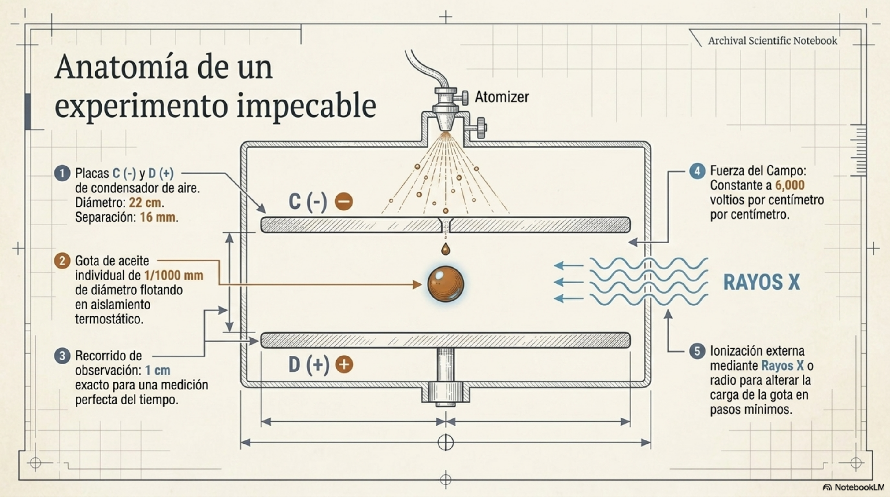

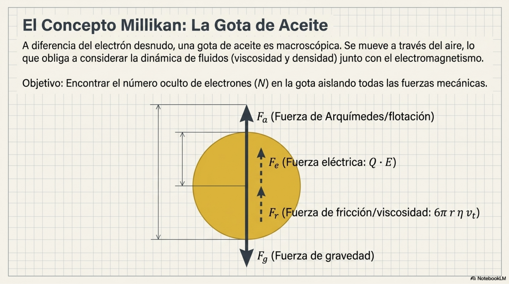

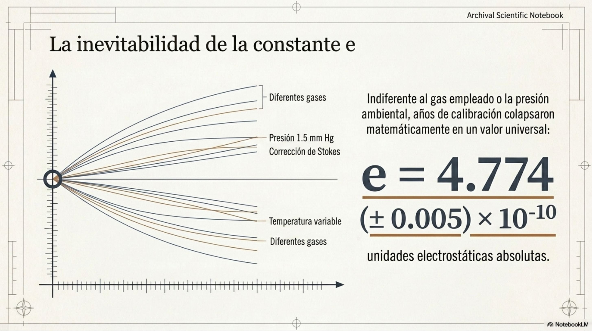

Además de explicar en qué consiste su experimento, en su Conferencia
Nobel Millikan comenta acerca de las pruebas que realizó para verificar
si era correcta la ecuación de Einstein acerca del efecto fotoeléctrico.

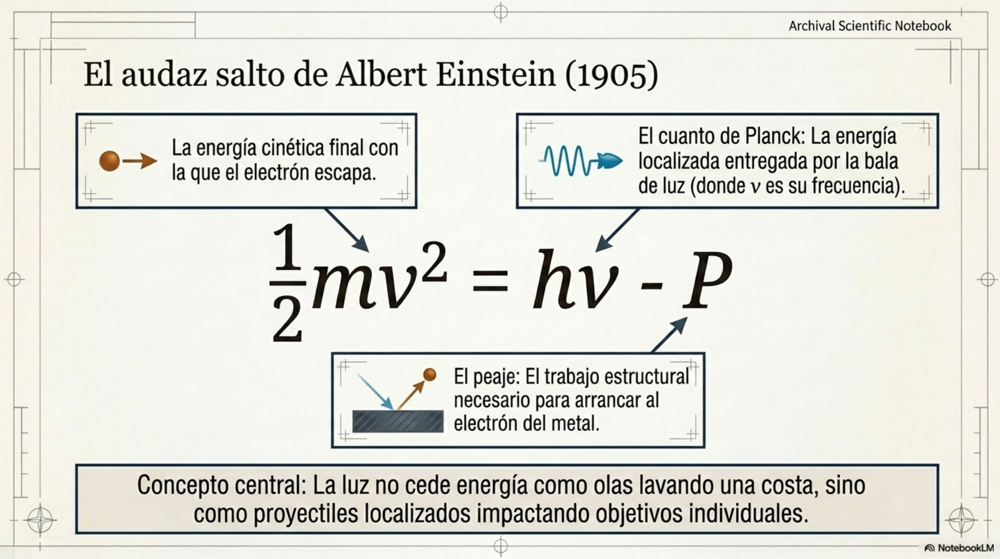

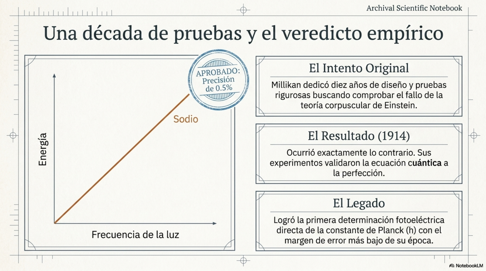

<u>Experimentos para demostrar la existencia de niveles de energía
electrónica estacionaria por Franck y Hertz</u>

Las líneas de los espectros atómicos son observables debido a que se han
producido transiciones entre niveles electrónicos discretos. Al
respecto, a principios del siglo pasado se presentaba la siguiente
cuestión: tales líneas espectrales existen porque los niveles
electrónicos están cuantizados y se observan transiciones que
corresponden efectivamente a la emisión o a la absorción de fotones, o
bien porque dicha cuantización es un requisito teórico para explicar la
existencia de espectros que manifiestan una propiedad cuantizada de los
electrones.

En 1914 James Franck (1882-1964) y Gustav Ludwig Hertz (1887-1975)
proporcionaron pruebas experimentales de la existencia de niveles de
energía electrónica estacionarios, sin considerar ninguna radiación
incidente como causa del comportamiento cuantizado de los niveles
energéticos del electrón. Las separaciones medidas entre los niveles de
energía electrónica concordaron con los valores de tales niveles
obtenidos por medios espectroscópicos, confirmando las predicciones del
modelo de Bohr. Sin embargo, según este modelo los niveles de energía
cuantizados eran mera hipótesis pero no hechos probados
experimentalmente. Los experimentos de Franck y Hertz demostraron que no
se trataba de suposiciones.

El entorno experimental utilizado por Franck y Hertz se describe a
continuación en términos de las regiones de Preparación (en azul),
Transformación (en verde) y Detección y Medición (en rojo). (Figura
2.4a).

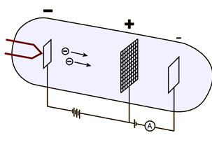
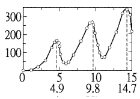

Figure 2.4. Aparato utilizado por Franck y Hertz (a) y gráfica de
resultados (b).

Fuente: adaptación del autor de imágenes obtenidas en CC Wikimedia
Commons

La región de <u>Preparación</u> contiene un filamento (FC) que emite
electrones cuando se calienta, un cátodo negativo (C), un ánodo colector
(AC) y entre ellos una rejilla polarizada (G).

La región de <u>Transformación</u> es el espacio que rodea FC y G y está
lleno de átomos de vapor de mercurio. Un potencial variable externo (V)
acelera los electrones que se producen en FC y se dirigen hacia G,
provocando múltiples colisiones con otros electrones pertenecientes a
los átomos de mercurio. Además, un pequeño potencial de retardación (VR)
se aplica entre G y AC.

Las regiones de <u>Detección y Medición</u> comprenden un galvanómetro
externo (GALV) para registrar las variaciones de la intensidad de la
corriente I generada por aquellos electrones que llegan a AC tras
colisionar con los electrones dentro de los átomos. Para ser detectados
por el galvanómetro, los electrones excitados deben tener una energía
cinética superior a VR.

En condiciones normales, los electrones de un átomo se encuentran en su
estado de energía más bajo; alcanzan un nivel de energía más alto cuando
reciben energía adicional. Franck y Hertz lograron este efecto generando
colisiones inelásticas entre dos tipos de electrones: los electrones
externos producidos por el filamento FC que han sido acelerados por el
potencial V y los electrones internos pertenecientes a los átomos de
mercurio contenidos dentro del tríodo. El experimento consistió en
cambiar el voltaje de aceleración (V) y luego medir en el galvanómetro
(GALV) la intensidad de la corriente (I) producida por los electrones
generados en FC que llegan al ánodo AC (Figura 2.4b).

Lo que observaron en el experimento Franck y Hertz fue lo siguiente:
cuando el potencial acelerador V empieza a aumentar la corriente I
también crece, pero al llegar a un valor crítico Vc = 4,9 voltios la
corriente disminuye bruscamente. Cuando la tensión aumenta de nuevo, la
corriente también aumenta y al llegar a un nuevo valor crítico 2Vc = 9,8
voltios, se observa la misma disminución abrupta de la corriente. Estas
observaciones pueden interpretarse de la siguiente manera:

- Cuando V \< Vc = 4,9 volts, los electrones acelerados que salen de FC
  tienen baja energía cinética y sus colisiones con los átomos de
  mercurio son elásticas porque la masa del electrón es mucho menor que
  la del átomo y el electrón incidente rebota sin ceder energía a los
  electrones del átomo.

- Cuando V = Vc, el átomo de mercurio recibe la cantidad exacta de
  energía necesaria para excitar sus electrones a niveles de energía más
  altos. La colisión es inelástica porque el electrón entrante perdió la
  energía que ha cedido a los electrones del átomo de mercurio y la
  corriente disminuye.

- Si ahora V \> Vc la corriente, I aumenta hasta V = 2Vc y las
  colisiones vuelven a ser inelásticas. Estas fluctuaciones en la
  corriente se repiten cuando el voltaje V alcanza un valor múltiple de
  Vc.

Es interesante señalar que en el átomo de mercurio la diferencia entre
el nivel de energía más bajo y el primer nivel de energía excitada
corresponde a una línea espectral cuya longitud de onda es λ = 2536 Å.
Se sabe que para los fotones *E = hν = hc/λ*, si ahora hacemos *E = qVc*
donde *q* es la carga del electrón, se obtiene *λ = (hc)/(qVc*) que
corresponde justamente al valor de 2.536 x 10-10 m = 2.536 Å.

**PREMIO NOBEL DE FÍSICA DE 1925**

**James Franck**

OBRA: “Tras la publicación de la teoría de Niels Bohr sobre la
estructura del átomo, James Franck y Gustav Hertz realizaron un
experimento en 1913 para verificarla. Se aplicó una diferencia de
potencial a un tubo que contenía un gas a baja presión. Cuando aumentaba
la diferencia de potencial, la corriente que circulaba por el tubo
también se incrementaba hasta alcanzar cierto voltaje, momento en el que
disminuía repentinamente. El resultado apoyó la teoría de Bohr, en la
que los electrones solo pueden tener energías específicas y discretas.
La diferencia de potencial aumentaba la movilidad de los electrones
libres hasta que, a cierto nivel de energía, los electrones ligados
saltaban a una órbita de mayor energía.”

James Franck – Hechos. NobelPrize.org. Alcance del Premio Nobel AB 2023.
Jueves 2 de marzo de 2023.
<https://www.nobelprize.org/prizes/physics/1925/franck/facts/>

## **Conferencia Nobel*: Transformación de la energía cinética de electrones libres en energía de excitación de átomos por impactos.***

James Franck – Conferencia Nobel. NobelPrize.org. Alcance del Premio
Nobel AB 2023. Viernes 3 de marzo de 2023.
<https://www.nobelprize.org/prizes/physics/1925/franck/lecture/>

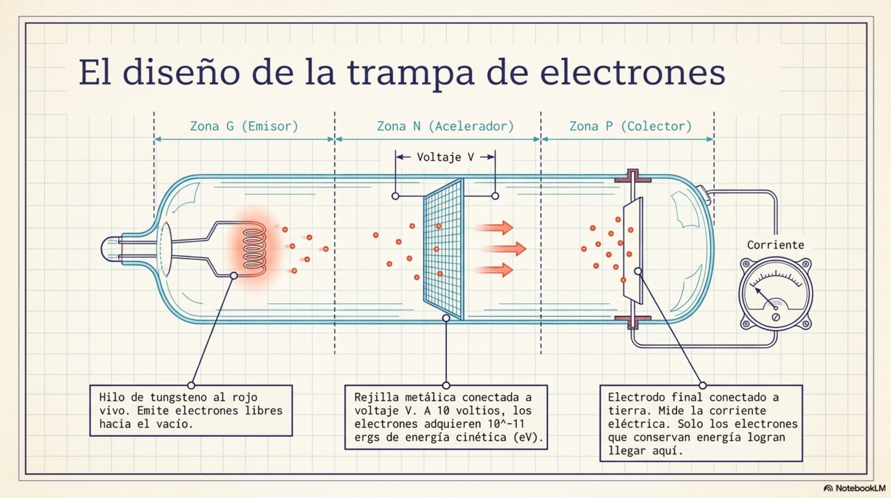

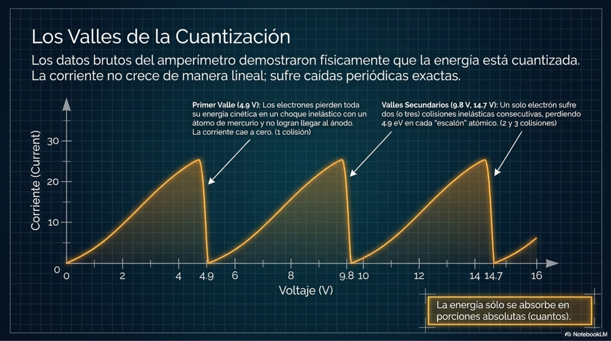

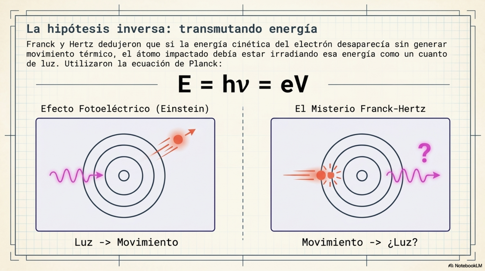

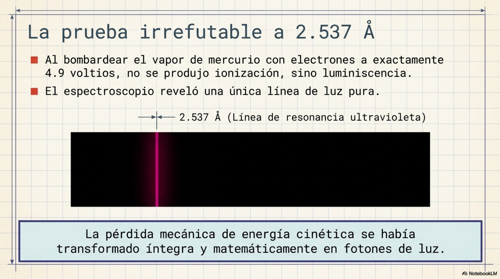

**Gustav Ludwig Hertz**

OBRA: “Tras la publicación de la teoría de Niels Bohr sobre la
estructura del átomo, Gustav Hertz y James Franck realizaron un
experimento en 1913 para verificarla. Se aplicó una diferencia de
potencial a un tubo que contenía un gas a baja presión. Cuando aumentaba
la diferencia de potencial, la corriente que circulaba por el tubo
también se incrementaba hasta alcanzar cierto voltaje, momento en el que
disminuía repentinamente. El resultado apoyó la teoría de Bohr, en la
que los electrones solo pueden tener energías específicas y discretas.
La diferencia de potencial aumentaba la movilidad de los electrones
libres hasta que, a cierto nivel de energía, los electrones ligados
saltaban a una órbita de mayor energía.”

Gustav Hertz – Hechos. NobelPrize.org. Alcance del Premio Nobel AB 2023.
Jueves. 2 de marzo de 2023. https://www.nobel
prize.org/prizes/physics/1925/hertz/facts/

## **Conferencia Nobel*: Los resultados de las pruebas de impacto electrónico a la luz de la teoría de los átomos de Bohr.***

Gustav Hertz – Conferencia Nobel. NobelPrize.org. Alcance del Premio
Nobel AB 2023. Jueves. 2 de marzo de 2023.
\<https://www.nobelprize.org/prizes/physics/1925/hertz/lecture/

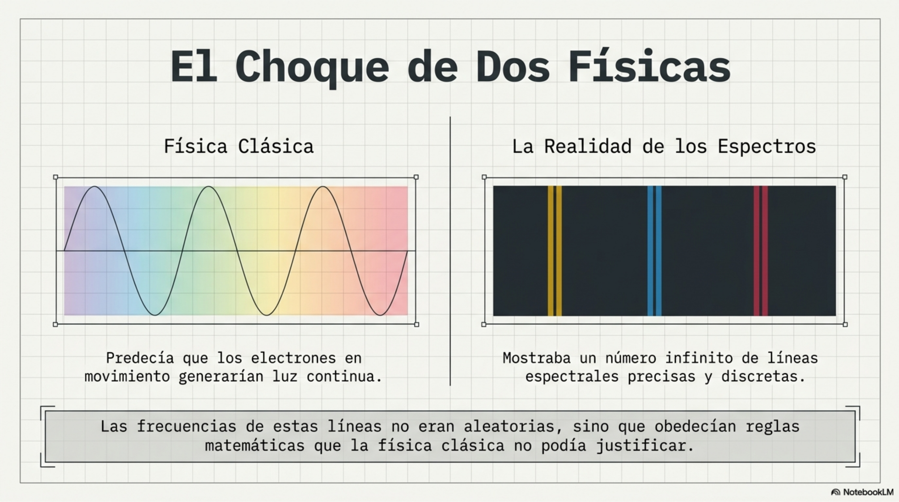

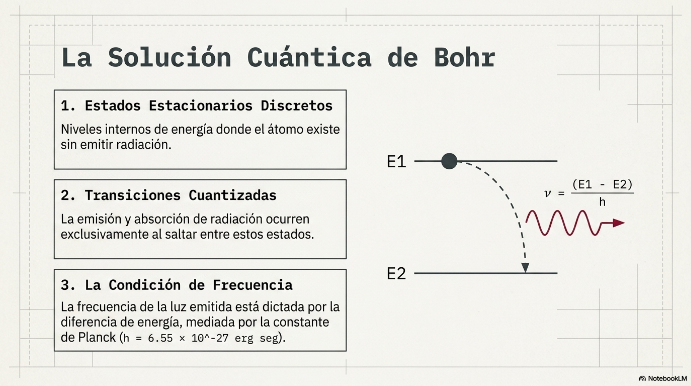

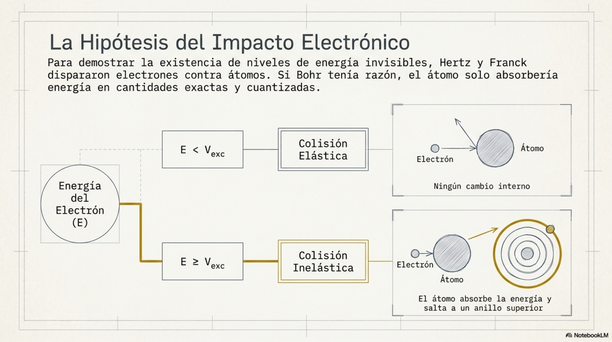

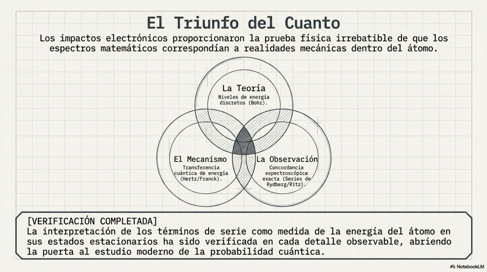

**Relaciones entre las regiones de realización de actividades
experimentales y las fases de desarrollo de la inteligencia colectiva**

Anteriormente, en la sección 2.1 consideramos las siete fases del
desarrollo de la inteligencia colectiva mediante las cuales una
comunidad construye conocimiento compartido: escuchar, expresar,
decidir, organizar, conectar, evaluar y mostrar visión. Estas fases
conforman tres etapas de producción del conocimiento: la etapa de
percepción e intercambio (fases de Escuchar y Expresar), la etapa de
gestión y acción (fases de Decidir y Organizar) y la etapa de evolución
y sentido (fases de Conectar, Evaluar y Mostrar Visión).

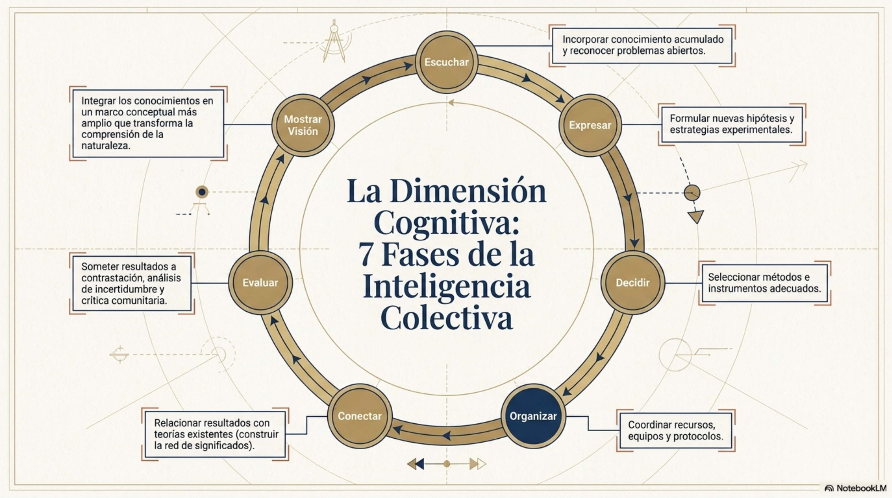

Posteriormente, en esta misma sección 2.3 hemos descrito tres
experimentos acerca del electrón en término de las correspondientes
regiones de realización de las actividades experimentales que describen
los escenarios físicos y operativos donde el conocimiento puede
producirse, transformarse y aplicarse. Estas son las regiones de
Preparación, Transformación, Detección y Medición.

Las cuatro regiones de realización de las actividades experimentales
describen la dimensión física, instrumental y metodológica de la
producción de conocimiento. Definen su arquitectura material y explican
cómo fluyen y se transforman los procesos de representación e
interpretación que tratan de fenómenos, instrumentos, señales,
observaciones, mediciones y datos experimentales. Constituyen el ámbito
material donde se generan evidencias cuando se logra la interacción
exitosa de sujetos, instrumentos, objetos de estudio y procedimientos
técnicos. Las principales actividades realizadas en cada una de estas
regiones son las siguientes:

En la región de Preparación: diseñar el experimento, formular las
preguntas de investigación y seleccionar los instrumentos y calibrarlos.

En la región de Transformación: manipular en forma controlada los
dispositivos experimentales para provocar cambios observables.

En la región de Detección: registrar los cambios provocados previamente
en la región de Transformación utilizando sensores, detectores o la
percepción asistida por instrumentos.

En la región de Medición: cuantificar los cambios registrados y estimar
sus incertidumbres, así como tabular y/o graficar los datos e
interpretar los resultados.

Por otra parte, las siete fases del desarrollo de la inteligencia
colectiva representan su dimensión cognitiva, comunicativa y social. Su
propósito es describir cómo una comunidad humana percibe, transmite,
coordina, organiza, interpreta y proyecta conocimiento compartido.
Expresan la dinámica colectiva que permite interpretar y dar sentido a
las evidencias experimentales porque las transforman en conocimiento.

La generación y aplicación del conocimiento que se da en la realización
de todo experimento no dependen únicamente de la obtención de datos ni
es el resultado aislado del trabajo de un solo investigador. También
dependen de los mecanismos de comunicación, deliberación, coordinación y
reflexión colectiva que implican el tránsito por las siete fases de
realización de actividades experimentales.

La siguiente Tabla 2.4 propone una correspondencia funcional entre las
regiones de realización de las actividades experimentales y las etapas
de producción del conocimiento que contienen a las fases del desarrollo
de la inteligencia colectiva.

<table>
<colgroup>
<col style="width: 26%" />
<col style="width: 42%" />
<col style="width: 30%" />
</colgroup>
<thead>
<tr class="header">
<th colspan="3"><blockquote>

Tabla 2. 4. Relaciones entre regiones y fases

</blockquote></th>
</tr>
</thead>
<tbody>
<tr class="odd">
<td>Regiones de realización de actividades experimentales</td>
<td>Etapas de producción del conocimiento</td>
<td>Fases de la inteligencia colectiva</td>
</tr>
<tr class="even">
<td rowspan="2">Preparación</td>
<td rowspan="2">Percepción e Intercambio</td>
<td><ol type="1">
<li>
Escuchar
</li>
</ol></td>
</tr>
<tr class="odd">
<td><ol start="2" type="1">
<li><blockquote>

Expresar

</blockquote></li>
</ol></td>
</tr>
<tr class="even">
<td rowspan="2">Transformación</td>
<td rowspan="2">Gestión y Acción</td>
<td><ol start="3" type="1">
<li>
Decidir
</li>
</ol></td>
</tr>
<tr class="odd">
<td>4. Organizar</td>
</tr>
<tr class="even">
<td rowspan="2">Detección</td>
<td rowspan="3">Evolución y Sentido</td>
<td>5. Conectar</td>
</tr>
<tr class="odd">
<td><ol start="6" type="1">
<li>
Evaluar
</li>
</ol></td>
</tr>
<tr class="even">
<td>Medición</td>
<td><ol start="7" type="1">
<li>
Mostrar Visión
</li>
</ol></td>
</tr>
</tbody>
</table>

Las interacciones entre las regiones de realización de actividades
experimentales y las fases de la inteligencia colectiva configuran un
ecosistema dinámico en el cual se genera un proceso colaborativo de
construcción colectiva del conocimiento. Esta circunstancia nos ha
permitido interpretar tres experimentos revolucionarios de la física
moderna como aportaciones pioneras en cuanto a logros metodológicos y
tecnológicos, pero también como ejemplos particularmente fructíferos del
desarrollo de la inteligencia colectiva.

Las siguientes tres tablas describen para cada uno de los experimentos
en cuestión las contribuciones de cada fase del desarrollo de la
inteligencia colectiva, agrupadas según su correspondiente etapa de
producción del conocimiento.

| Tabla 2.5. Etapa de Percepción e Intercambio     |                                                                                               |                                                                                            |                                                                                            |
|--------------------------------------------------|-----------------------------------------------------------------------------------------------|--------------------------------------------------------------------------------------------|--------------------------------------------------------------------------------------------|
| Fase del desarrollo de la inteligencia colectiva | Experimentos de Thomson                                                                       | Experimentos de Millikan                                                                   | Experimentos de Franck y Hertz                                                             |
| Escuchar                                         | Analizar trabajos europeos previos acerca de descargas eléctricas en gases y rayos catódicos. | Estudiar investigaciones sobre electrones, ionización y los resultados previos de Thomson. | Revisar el modelo de Bohr y los espectros atómicos conocidos.                              |
| Expresar                                         | Formular la hipótesis: los rayos catódicos son partículas con carga negativa.                 | Proponer un método inédito que usa gotas de aceite para medir la carga elemental.          | Diseñar un experimento para verificar empíricamente la cuantización de la energía atómica. |

| Tabla 2.6. Etapa de Gestión y Acción             |                                                                                |                                                                                                       |                                                                                      |
|--------------------------------------------------|--------------------------------------------------------------------------------|-------------------------------------------------------------------------------------------------------|--------------------------------------------------------------------------------------|
| Fase del desarrollo de la inteligencia colectiva | Experimentos de Thomson                                                        | Experimentos de Millikan                                                                              | Experimentos de Franck y Hertz                                                       |
| Decidir                                          | Seleccionar tubos de descarga y campos electromagnéticos.                      | Escoger las gotas de aceite, el campo eléctrico uniforme y la regla de observación en el microscopio. | Elegir el gas (vapor de mercurio) y las técnicas de medición de la corriente.        |
| Organizar                                        | Construir el aparato y calibrarlo. Repetir sistemáticamente las observaciones. | Realizar con rigor miles de mediciones y aplicar el control absoluto de variables.                    | Estabilizar las condiciones del tubo experimental para obtener curvas reproducibles. |

| Tabla 2.7. Etapa de Evolución y Sentido          |                                                                                                   |                                                                                                                              |                                                                                                                |
|--------------------------------------------------|---------------------------------------------------------------------------------------------------|------------------------------------------------------------------------------------------------------------------------------|----------------------------------------------------------------------------------------------------------------|
| Fase del desarrollo de la inteligencia colectiva | Experimentos de Thomson                                                                           | Experimentos de Millikan                                                                                                     | Experimentos de Franck y Hertz                                                                                 |
| Conectar                                         | Integrar los datos obtenidos a la teoría electromagnética y explicar naturaleza de la materia.    | Relacionar directamente la medición de la carga con el cociente e/m obtenido por Thomson para calcular la masa del electrón. | Vincular las transiciones de energía observadas en espectroscopía con las predicciones del modelo de Bohr.     |
| Evaluar                                          | Comparar con otros resultados alternativos y debatir sobre la universalidad del electrón.         | Analizar la estadística, la estimación de errores y la identificación del valor constante de la carga elemental.             | Verificar la reproducibilidad de máximos y mínimos de la corriente y contrastar con las predicciones teóricas. |
| Mostrar Visión                                   | Consolidar el hecho de que el electrón es un constituyente universal. Inaugurar una nueva física. | Establecer una constante universal fundamental. Fortalecer el modelo del electrón.                                           | Confirmar que los niveles de energía están cuantizados. Consolidar la física cuántica emergente.               |

Planear, realizar e interpretar experimentos contribuye al desarrollo de
la inteligencia colectiva porque cuando el experimentador provoca y
controla el recorrido por las cuatro regiones de descripción de las
actividades experimentales, el experimentador transita por las etapas de
producción del conocimiento que comprenden a las siete fases del
desarrollo de la inteligencia colectiva.

La planeación y realización de los tres experimentos antes considerados
ilustra el desarrollo gradual de una inteligencia colectiva acumulativa
que muestra cómo se genera y evoluciona el conocimiento científico. El
desarrollo de estos tres experimentos constituye una secuencia histórica
que resultó ser fundamental en la creación de la física moderna. Son
eslabones de una red de colaboración, validación y construcción
compartida del conocimiento.

Los experimentos de J. J. Thomson (1897) demostraron la existencia del
electrón y determinaron la relación $e/m$; además, establecieron que los
rayos catódicos son partículas con una relación de carga/masa muy
superior a la de los iones conocidos.

Los experimentos de Robert A. Millikan (1909–1913) determinaron la carga
elemental $e$; utilizar este valor en la relación de $e/m\ $obtenida por
Thomson permitió calcular con precisión la masa del electrón.

Los experimentos de James Franck y Gustav Hertz (1914) mostraron
directamente que los átomos absorben energía en cantidades discretas,
proporcionando una confirmación decisiva del modelo de niveles de
energía estacionarios propuesto por Bohr.

Los tres experimentos revolucionarios fueron realizados por Thomson a
finales del Siglo XIX y por Millikan y por Franck y Hertz a principios
del Siglo XX. Aunque los tres experimentos se ubican dentro del espacio
antropológico de las Mercancías, sería interesante analizar en qué
medida los científicos involucrados vivieron la necesidad de avanzar
hacia el espacio antropológico del conocimiento (Ver la Tabla 2.2.
Comparaciones entre los cuatro espacios antropológicos, Sección 2.2).

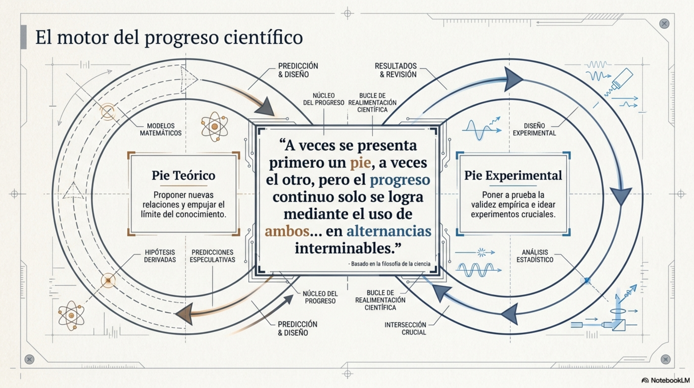
