## 3.1. Descripción del proceso de la visión

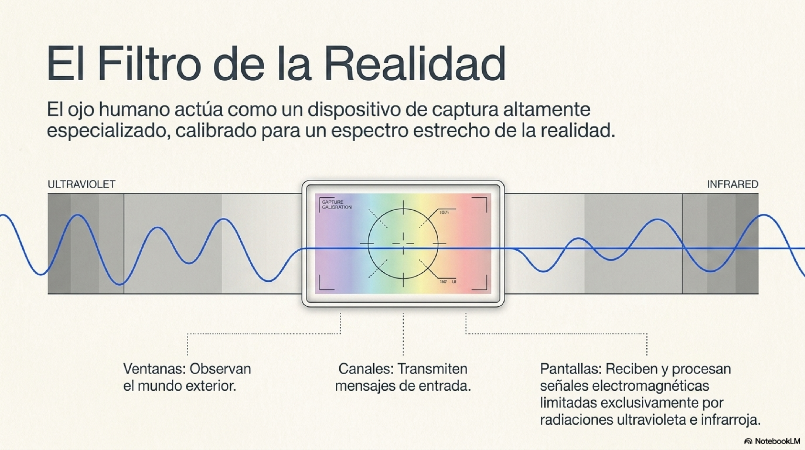

**Componentes de la visión**

La visión humana es un proceso biológico, físico y cognitivo que hace
posible captar la luz y lo iluminado, para transformarlo en señales
nerviosas que son captadas e interpretadas como imágenes cerebrales.
Este proceso funciona porque existe un sistema óptico que contiene un
receptor, un transmisor y un intérprete.

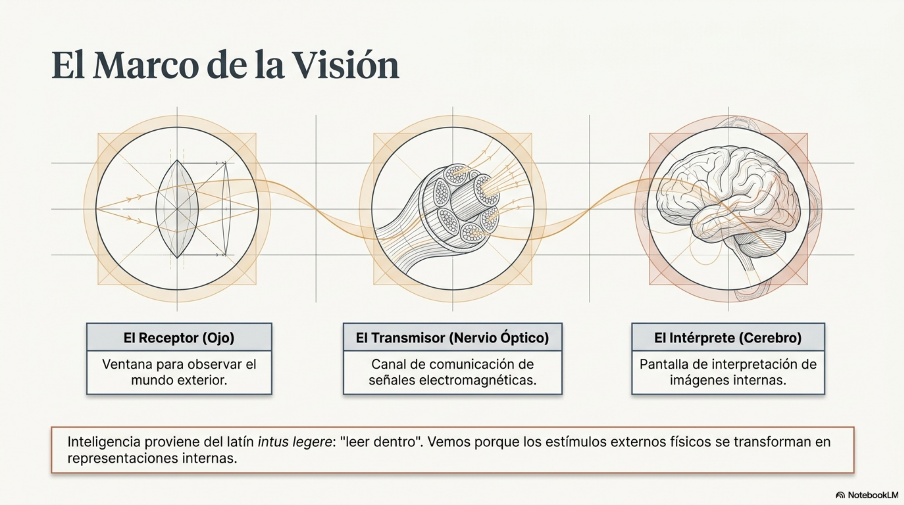

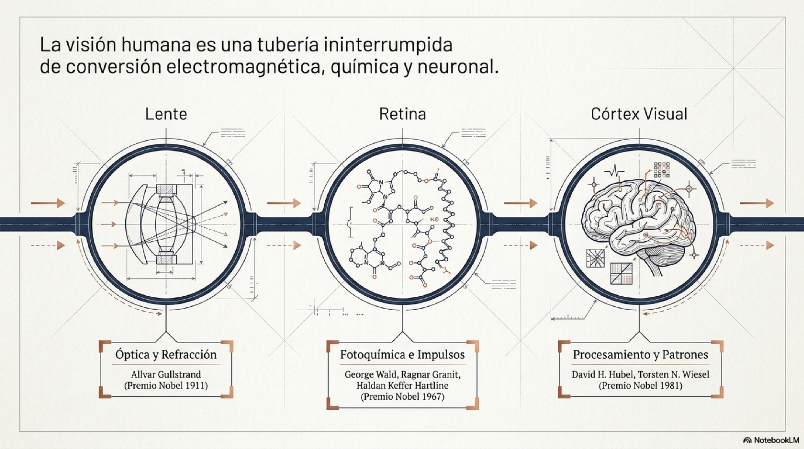

El receptor (el ojo) es una ventana de observación que consta de: la
córnea, que es una capa transparente frontal que protege y por
refracción, enfoca todo lo que entra; la pupila, que es la abertura
central del iris donde se regula la luz que entra, dilatándose en la
oscuridad y contrayéndose si por el contrario hay mucha luz; el iris,
que es la parte coloreada del ojo que controla el tamaño de la pupila;
el cristalino, que es una lente flexible que por acomodación ajusta el
enfoque según que los objetos vistos se encuentren cerca o lejos; la
retina, que es una capa de células sensibles a la luz ubicada en el
fondo del ojo. El cristalino descompone y proyecta la luz, la retina la
transforma en impulsos nerviosos y el nervio óptico los conduce al
cerebro.

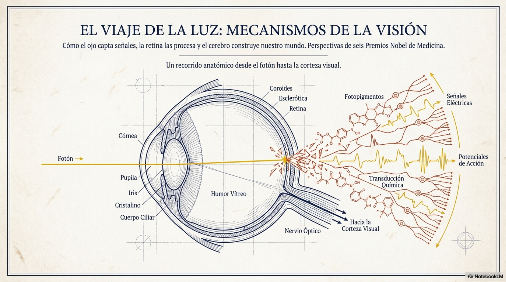

El transmisor es un canal de comunicación de señales (el nervio óptico)
está formado por dos tipos de células fotosensibles localizadas en la
retina: los bastones capaces de ver en condiciones oscuras detectan
movimientos y perciben formas generales y los conos que si están bien
iluminados permiten ver detalles finos y percibir colores; hay conos
sensibles al rojo, al verde y al azul. Cuando la luz llega a los
fotorreceptores: los pigmentos visuales absorben los fotones incidentes
y se producen reacciones químicas que generan impulsos eléctricos. El
viaje de estos impulsos por las neuronas de la retina hasta llegar al
nervio óptico es lo que se llama fototransducción.

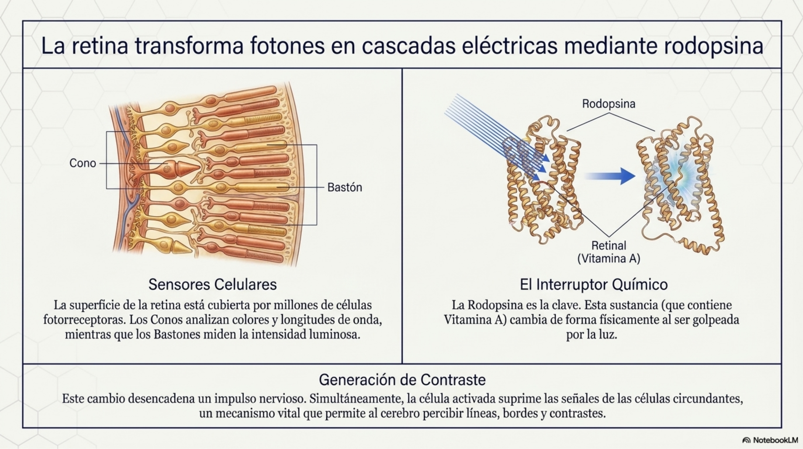

El intérprete es una pantalla de interpretación de imágenes (el
cerebro), especialmente en la corteza visual del lóbulo occipital. Es el
centro coordinador que interpreta formas, reconoce rostros, calcula
profundidades, detecta movimientos, integra colores, compara recuerdos y
construye significados. No son copias de la realidad: son construcciones
personales basadas en información sensorial que operan con una sinergia
cognitiva que construye mapas y procesa el navegar entre percepciones,
conceptualizaciones y razonamientos.

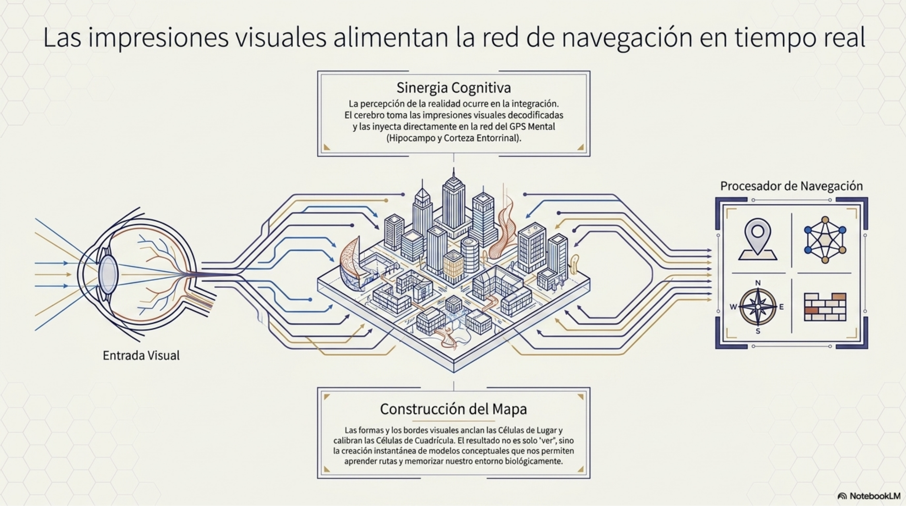

**Desarrollo de la Oftalmología**

La Oftalmología es la rama de la medicina dedicada al estudio de la
anatomía del ojo, el funcionamiento de la visión, el tratamiento de las
enfermedades oculares y el desarrollo de métodos de diagnóstico,
curación y tratamiento.

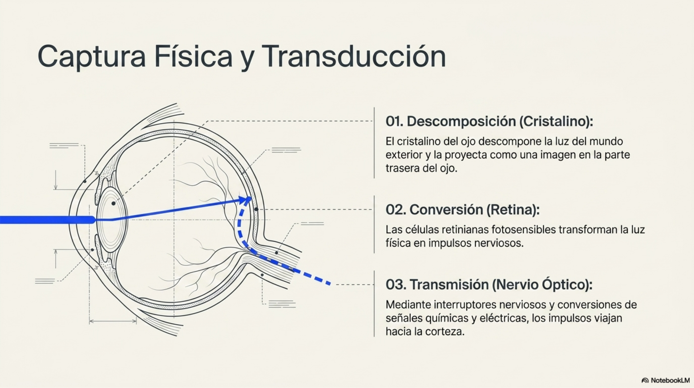

En esta sección nos limitaremos a reseñar el trabajo de los seis
pioneros que dieron profundidad científica al estudio del sistema óptico
y que por las consecuencias de sus descubrimientos recibieron Premios
Nobel en Fisiología o Medicina. A continuación, hacemos una breve
presentación de las contribuciones de cada uno de estos científicos e
incluimos la fotografía del laureado, la traducción del texto denominado
WORK donde la Fundación Nobel informa de la razón por la cual se le
concedió el Premio y el título de la correspondiente Conferencia Nobel.
Se indican las referencias del caso.

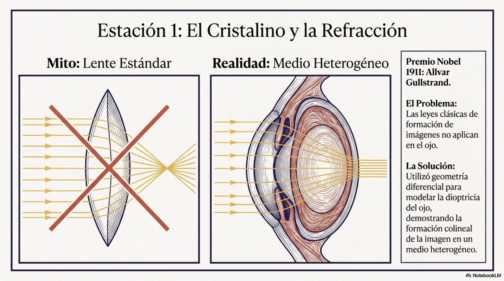

**Premio Nobel de Fisiología o Medicina de 1911**

<table>
<colgroup>
<col style="width: 77%" />
<col style="width: 23%" />
</colgroup>
<tbody>
<tr class="odd">
<td>

<strong>Allvar Gullstrand (1862-1930)</strong>

Estudió la forma en que el ojo refracta y enfoca la luz; para ello, construyó un modelo matemático del ojo humano que le permitió calcular la formación de imágenes, determinar las aberraciones ópticas y comprender el proceso de acomodación visual, mediante el cual el cristalino modifica su curvatura, cambia su poder refractivo y ajusta la convergencia de la luz sobre la retina. Además, inventó instrumentos oftalmológicos como la lámpara de hendidura (slit lamp).

</td>
<td style="vertical-align: top;">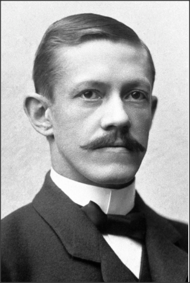</td>
</tr>
<tr class="even">
<td colspan="2">
WORK: “Nuestra visión se basa en que el cristalino del ojo descompone la luz del exterior y la convierte en una imagen en la parte trasera del ojo. A partir de aquí, las células fotosensibles de la retina convierten la luz en impulsos nerviosos que finalmente se transforman en imágenes visuales. Son muy complicados los cálculos del camino que siguen los rayos de luz al atravesar el ojo y de la creación de la imagen porque el cristalino del ojo está formado por diferentes capas que refractan la luz en distintos grados. Además, la lente también cambia de forma. Sin embargo, Allvar Gullstrand logró precisamente eso en la década de 1890 utilizando matemáticas avanzadas.”
</td>
</tr>
<tr class="odd">
<td colspan="2">
Fuentes. Photo: Florman Ateljé. Nobel Foundation archive

<a href="https://www.nobelprize.org/prizes/medicine/1911/gullstrand/facts/">https://www.nobelprize.org/prizes/medicine/1911/gullstrand/facts/</a>
</td>
</tr>
<tr class="even">
<td colspan="2">
NOBEL LECTURE: <em>How I Found the Mechanism of Intracapsular Accomodation</em> .

<a href="https://www.nobelprize.org/prizes/medicine/1911/gullstrand/lecture/"><u>https://www.nobelprize.org/prizes/medicine/1911/gullstrand/lecture/</u></a>
</td>
</tr>
</tbody>
</table>

<table>
<colgroup>
<col style="width: 77%" />
<col style="width: 22%" />
</colgroup>
<thead>
<tr class="header">
<th>
<strong>Allvar Gullstrand (1862-1930)</strong>

Estudió la forma en que el ojo refracta y enfoca la luz; para ello,
construyó un modelo matemático del ojo humano que le permitió calcular
la formación de imágenes, determinar las aberraciones ópticas y
comprender el proceso de acomodación visual, mediante el cual el
cristalino modifica su curvatura, cambia su poder refractivo y ajusta la
convergencia de la luz sobre la retina. Además, inventó instrumentos
oftalmológicos como la lámpara de hendidura (slit lamp).
</th>
<th></th>
</tr>
</thead>
<tbody>
<tr class="odd">
<td colspan="2">WORK: “Nuestra visión se basa en que el cristalino del
ojo descompone la luz del exterior y la convierte en una imagen en la
parte trasera del ojo. A partir de aquí, las células fotosensibles de la
retina convierten la luz en impulsos nerviosos que finalmente se
transforman en imágenes visuales. Son muy complicados los cálculos del
camino que siguen los rayos de luz al atravesar el ojo y de la creación
de la imagen porque el cristalino del ojo está formado por diferentes
capas que refractan la luz en distintos grados. Además, la lente también
cambia de forma. Sin embargo, Allvar Gullstrand logró precisamente eso
en la década de 1890 utilizando matemáticas avanzadas.”</td>
</tr>
<tr class="even">
<td colspan="2">
Fuentes. Photo: Florman Ateljé. Nobel Foundation
archive

<a
href="https://www.nobelprize.org/prizes/medicine/1911/gullstrand/facts/">https://www.nobelprize.org/prizes/medicine/1911/gullstrand/facts/</a>
</td>
</tr>
<tr class="odd">
<td colspan="2">
NOBEL LECTURE: <em>How I Found the Mechanism of
Intracapsular Accomodation</em> .

<a
href="https://www.nobelprize.org/prizes/medicine/1911/gullstrand/lecture/"><u>https://www.nobelprize.org/prizes/medicine/1911/gullstrand/lecture/</u></a>
</td>
</tr>
</tbody>
</table>

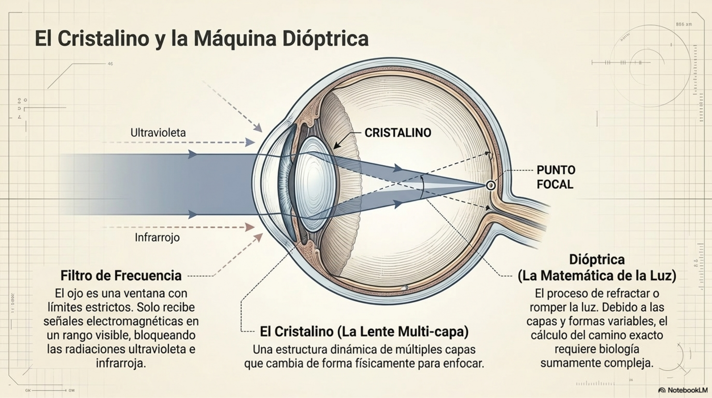

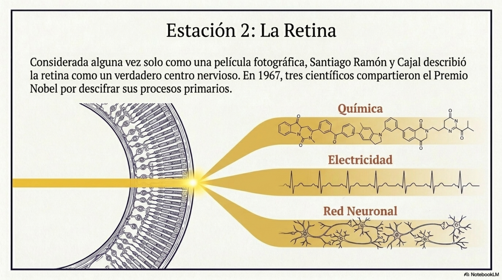

**Premio Nobel de Fisiología o Medicina de 1967**

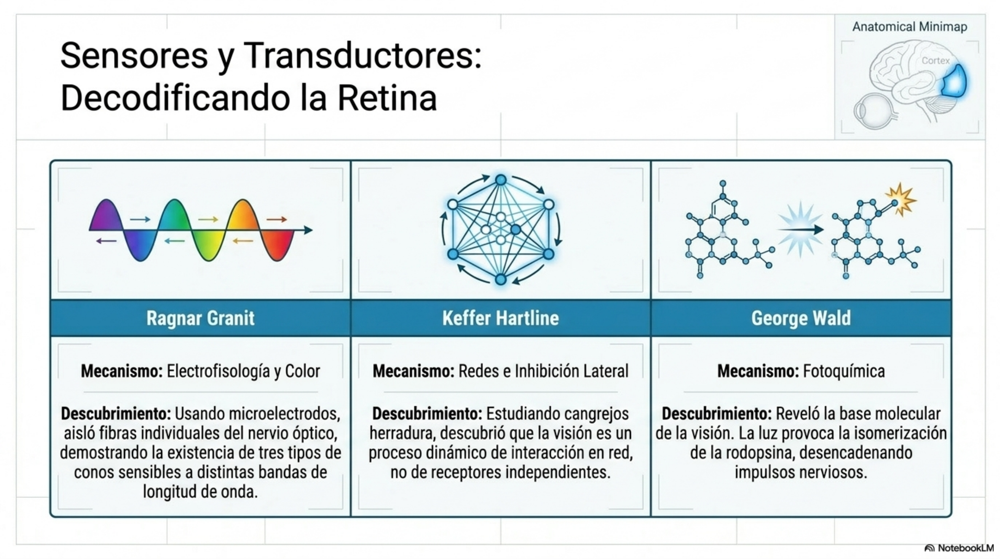

<table>
<colgroup>
<col style="width: 75%" />
<col style="width: 24%" />
</colgroup>
<thead>
<tr class="header">
<th>
<strong>Ragnar Granit (1900-1991)</strong>

Desarrolló la electrofisiología de la retina y por medio
microelectrodos muy sensibles registró impulsos nerviosos, señales
eléctricas retinales y respuestas del nervio óptico ante la luz.
Demostró experimentalmente que existen distintos tipos de conos
retinales especializados en diferentes longitudes de onda y que la
retina no sólo transmite señales excitatorias, sino también señales
inhibitorias. Además, contribuyó al desarrollo de nuevas técnicas de
registro eléctrico mediante microelectrodos.
</th>
<th>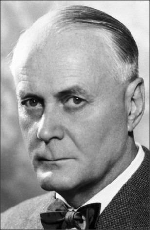</th>
</tr>
</thead>
<tbody>
<tr class="odd">
<td colspan="2">WORK: “Nuestra visión funciona porque la luz que nos
rodea es capturada por un gran número de células fotosensibles situadas
en las retinas de la parte posterior de nuestros ojos. Tras una serie de
interruptores nerviosos y conversiones de señales químicas y eléctricas,
esto da lugar a impresiones visuales. Utilizando electrodos muy
sofisticados, Ragnar Granit pudo estudiar los impulsos eléctricos de las
células de la retina. En estudios realizados desde los años 30 hasta los
50, demostró que existen diferentes tipos de conos (las células que
permiten la visión del color) y que estos son sensibles a la luz de tres
longitudes de onda distintas.”</td>
</tr>
<tr class="even">
<td colspan="2">
Fuentes: Photo: Wilma Björling. Nobel Foundation
archive

&lt;https://www.nobelprize.org/prizes/medicine/1967/granit/facts/&gt;
</td>
</tr>
<tr class="odd">
<td colspan="2">
NOBEL LECTURE: <em>The Development of Retinal
Neurophysiology</em> 

<a
href="https://www.nobelprize.org/prizes/medicine/1967/granit/lecture/">https://www.nobelprize.org/prizes/medicine/1967/granit/lecture/</a>
</td>
</tr>
</tbody>
</table>

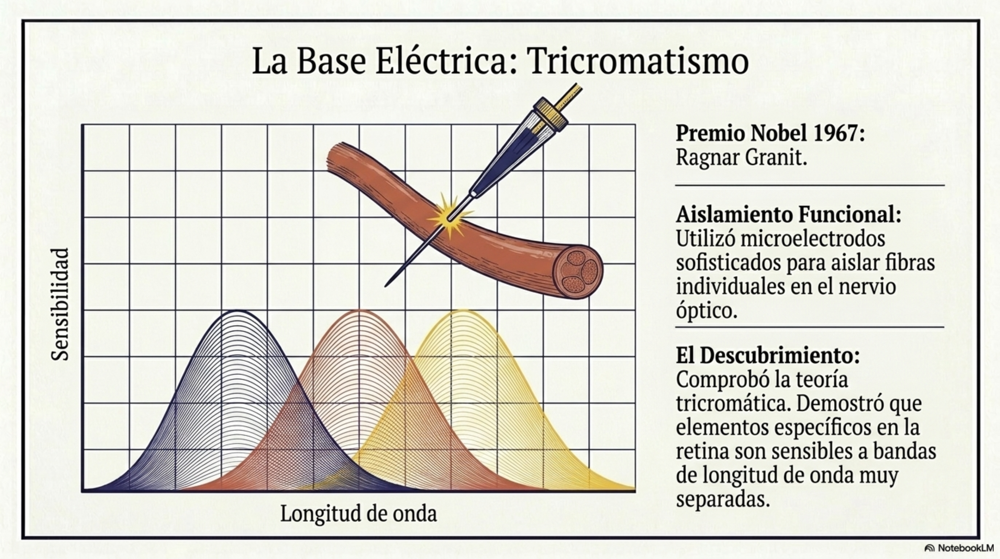

<table>
<colgroup>
<col style="width: 72%" />
<col style="width: 27%" />
</colgroup>
<thead>
<tr class="header">
<th>
<strong>Haldan Keffer Hartline (1903 – 1983)</strong>

Mostró que la retina analiza información, compara señales, inhibe
respuestas y extrae contrastes visuales. Descubrió los campos receptivos
retinales que significan que cada neurona visual responde solamente a
estímulos luminosos provenientes de una región específica del campo
visual. Además, demostró la existencia de la inhibición lateral según la
cual cuando una neurona retinal es estimulada por la luz puede inhibir
la actividad de neuronas vecinas.
</th>
<th>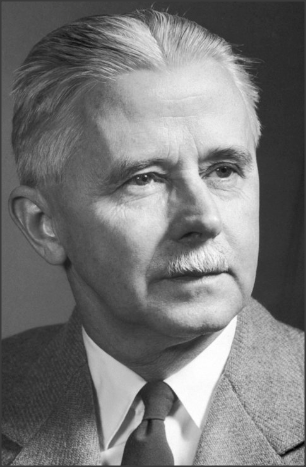</th>
</tr>
</thead>
<tbody>
<tr class="odd">
<td colspan="2">WORK: “Nuestra visión funciona porque la luz del mundo
que la rodea es capturada por muchas células sensibles a la luz en la
retina, situada en la parte posterior del ojo. Una serie de reconexiones
y transformaciones de señales químicas y eléctricas finalmente resultan
en impresiones visuales. En estudios sobre el cangrejo herradura
alrededor de 1950, Keffer Hartline analizó cómo las señales primarias de
las células visuales se procesan en una red de células nerviosas. Entre
otras cosas, demostró que cuando una célula es estimulada, las señales
de las células circundantes se suprimen. Esto facilita la comprensión
del concepto de contrastes.”</td>
</tr>
<tr class="even">
<td colspan="2">
Fuentes: Photo:Rockefeller University. Nobel
Foundation archive

&lt;https://www.nobelprize.org/prizes/medicine/1967/hartline/facts/&gt;
</td>
</tr>
<tr class="odd">
<td colspan="2">
<em>NOBEL LECTURE: Visual Receptors and Retinal
Interaction</em> 

<a
href="https://www.nobelprize.org/prizes/medicine/1967/hartline/lecture/">https://www.nobelprize.org/prizes/medicine/1967/hartline/lecture/</a>
</td>
</tr>
</tbody>
</table>

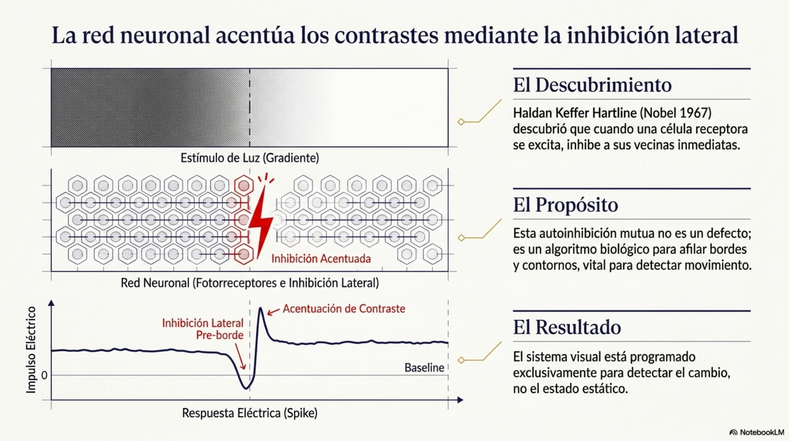

<table>
<colgroup>
<col style="width: 74%" />
<col style="width: 25%" />
</colgroup>
<thead>
<tr class="header">
<th>
<strong>George Wald (1906 – 1997)</strong>

Explicó cómo la luz interactúa con moléculas visuales; descubrió los
pigmentos visuales que son moléculas fotosensibles que absorben luz y
desencadenan cambios químicos que luego producen señales nerviosas.
También demostró que la vitamina A es esencial para la visión porque su
deficiencia altera la formación de rodopsina y produce ceguera
nocturna.
</th>
<th>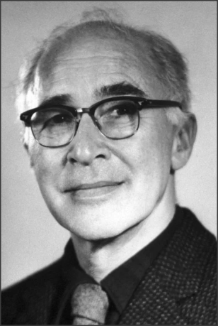</th>
</tr>
</thead>
<tbody>
<tr class="odd">
<td colspan="2">WORK: “Nuestra visión funciona porque la luz del mundo
que la rodea es capturada por muchas células sensibles a la luz en la
retina, situada en la parte posterior del ojo. George Wald descubrió que
la vitamina A es un componente importante en la rodopsina, una sustancia
fotosensible en la retina, y explicó en una serie de estudios desde los
años 30 hasta los 60 cómo la luz hace que la rodopsina cambie de forma y
se convierta. Esta conversión da lugar a señales en una compleja red de
células nerviosas mediante las cuales se producen varias reconexiones y
transformaciones antes de que las señales finalmente se transformen en
impresiones visuales en el cerebro.”</td>
</tr>
<tr class="even">
<td colspan="2">
Fuentes: Photo from the Nobel Foundation archive.

&lt;https://www.nobelprize.org/prizes/medicine/1967/wald/facts/&gt;
</td>
</tr>
<tr class="odd">
<td colspan="2">
NOBEL LECTURE: <em>The Molecular Basis of Visual
Excitation</em> 

<a
href="https://www.nobelprize.org/prizes/medicine/1967/wald/lecture/">https://www.nobelprize.org/prizes/medicine/1967/wald/lecture/</a>
</td>
</tr>
</tbody>
</table>

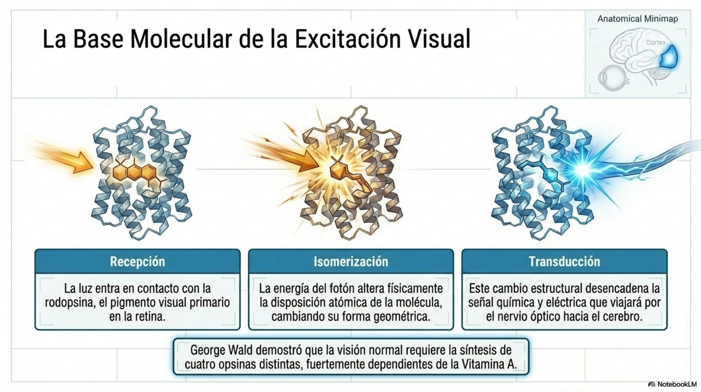

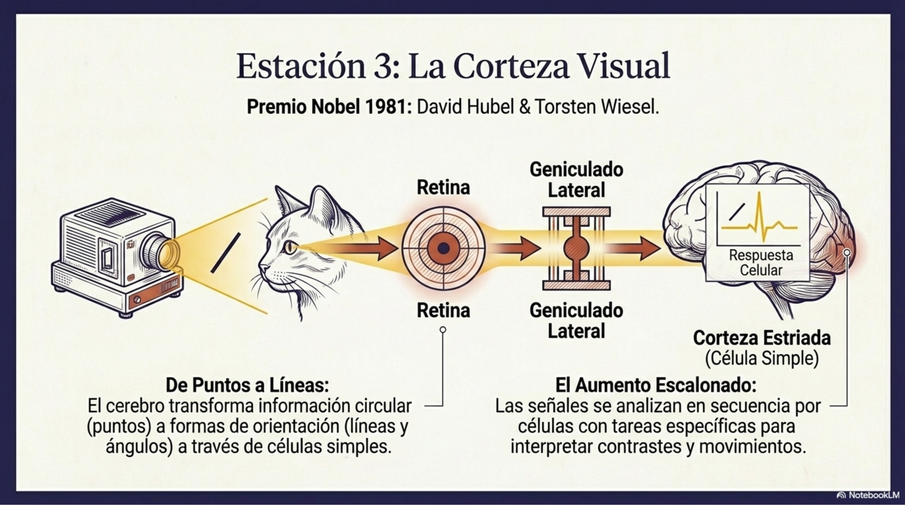

**Premio Nobel de Fisiología o Medicina de 1981**

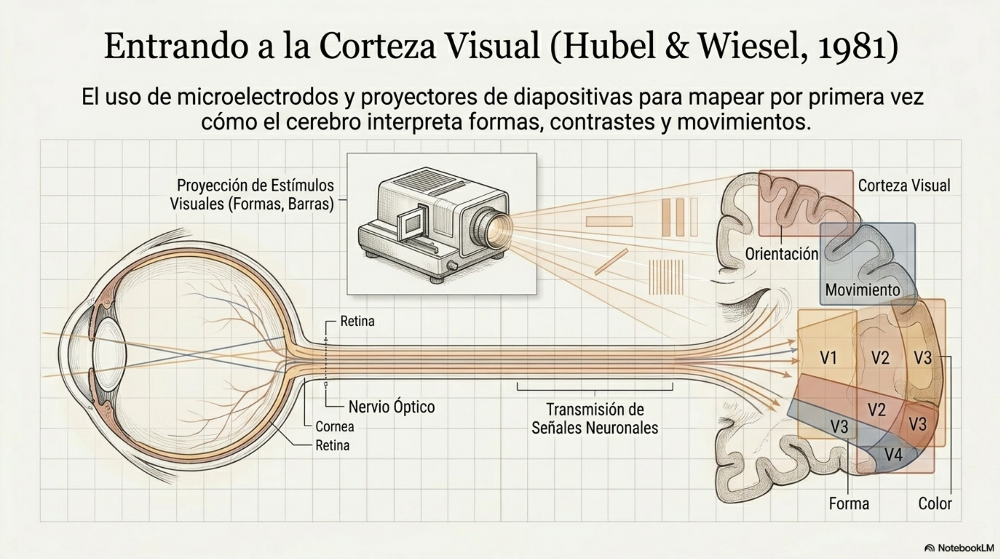

<table>
<colgroup>
<col style="width: 46%" />
<col style="width: 53%" />
</colgroup>
<thead>
<tr class="header">
<th>
<strong>David H. Hubel (1926 – 2013)</strong>

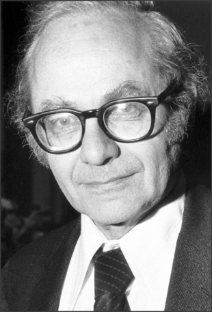
</th>
<th>
<strong>Torsten N. Wiesel (1924 – XX)</strong>

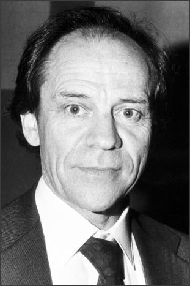
</th>
</tr>
</thead>
<tbody>
<tr class="odd">
<td colspan="2"><blockquote>

Hubel y Wiesel utilizaron microelectrodos muy finos para registrar la
actividad eléctrica de neuronas individuales en la corteza visual
primaria para estudiar cómo responden las neuronas a distintos estímulos
visuales. Trabajando juntos descubrieron las llamadas células simples
que responden preferentemente a orientaciones específicas y las células
complejas que responden tanto a la orientación como al movimiento y a la
dirección del desplazamiento. Demostraron que la visión se procesa en
etapas jerárquicas porque la información visual pasa progresivamente
desde la retina, al núcleo geniculado lateral, luego a la corteza visual
primaria y después llega a áreas visuales superiores. También
demostraron que las neuronas corticales responden selectivamente a la
orientación, al movimiento, a los bordes, a los contrastes y a los y
patrones espaciales.

</blockquote></td>
</tr>
<tr class="even">
<td colspan="2">WORK: “Nuestra visión funciona porque la luz que nos
rodea es capturada por un gran número de células fotosensibles situadas
en las retinas de la parte posterior de nuestros ojos. La luz se
convierte en señales que se envían al cerebro y luego se transforman en
impresiones visuales. David Hubel y Torsten Wiesel aclararon cómo
funciona este proceso durante los años 60: en la corteza cerebral, las
señales son analizadas en secuencia por células con tareas específicas
de interpretar contrastes, patrones y movimientos. También demostraron
que esta capacidad se desarrolla en los niños durante el periodo inicial
tras el nacimiento.”</td>
</tr>
<tr class="odd">
<td colspan="2">
Fuentes: Photo from the Nobel Foundation archive.

&lt;https://www.nobelprize.org/prizes/medicine/1981/hubel/facts/&gt;
</td>
</tr>
<tr class="even">
<td colspan="2">
HUBEL NOBEL LECTURE: <em>Evolution of ideas on the
primary visual cortex, 1955-1978: a biased historical account</em> 

<a
href="https://www.nobelprize.org/prizes/medicine/1981/hubel/lecture/">https://www.nobelprize.org/prizes/medicine/1981/hubel/lecture/</a>

WIESEL NOBEL LECTURE: <em>The postnatal development of the visual
cortex and the influence of environment</em> 

<a
href="https://www.nobelprize.org/prizes/medicine/1981/wiesel/lecture/">https://www.nobelprize.org/prizes/medicine/1981/wiesel/lecture/</a>
</td>
</tr>
</tbody>
</table>

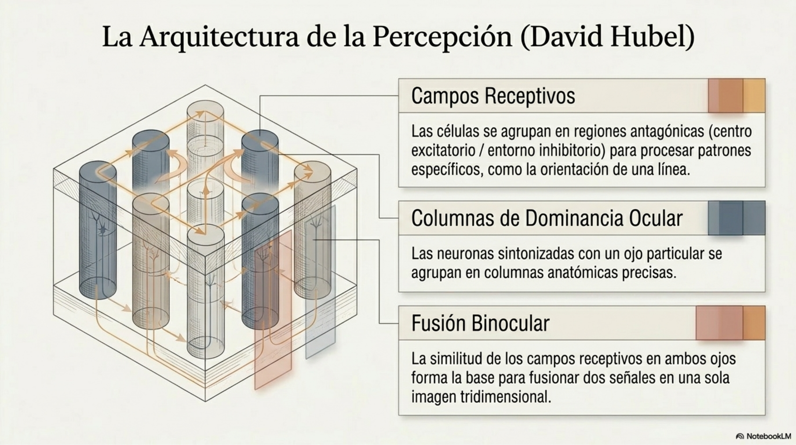

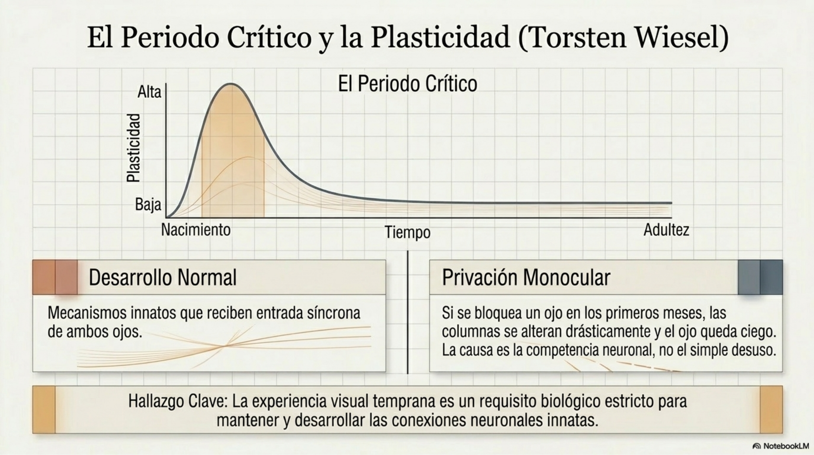

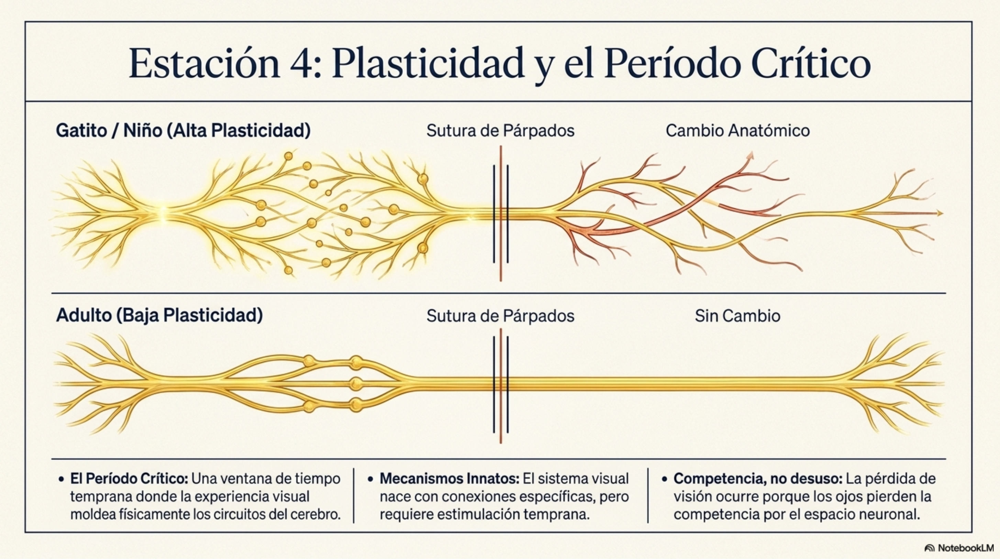

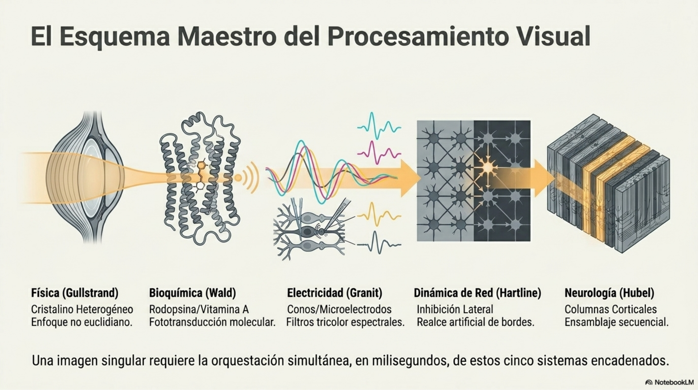

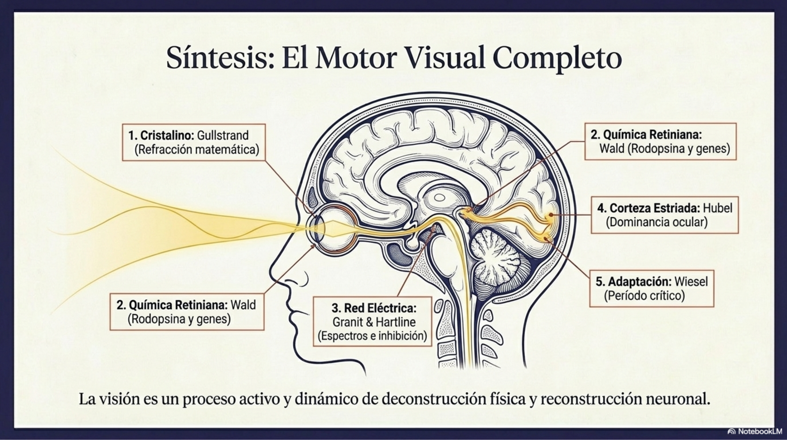

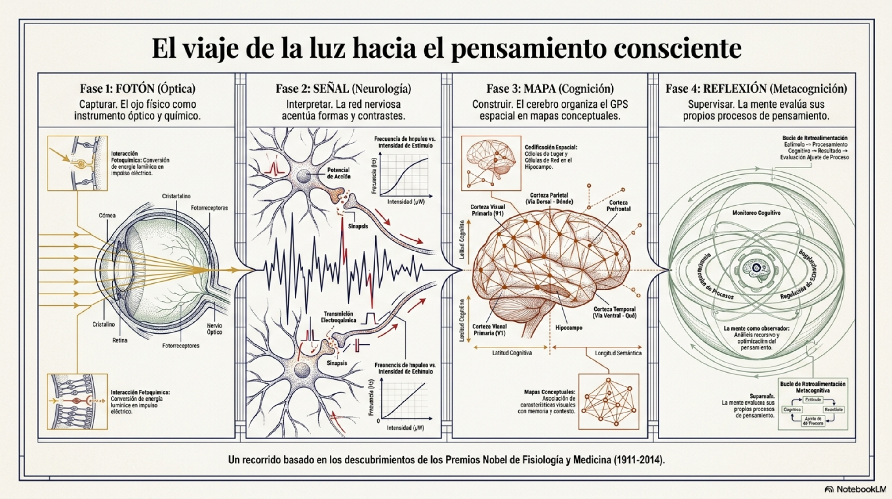
