## 4.1. Trayectorias conceptuales relacionadas con las condiciones
iniciales de los autores

Esta sección 4.1 se refiere a dos trayectorias del conocimiento
conectadas con las condiciones iniciales que describen dos
características de los cuatro físicos considerados: las preguntas que se
hicieron y las premisas en las cuales confiaron. En la siguiente sección
4.2 tratamos acerca de las condiciones en la frontera de la disciplina
que conciernen a la relación teoría – experimento y el papel de las
matemáticas. Todas las imágenes que acompañan el texto han sido
generadas por el programa Notebook LM.

Para empezar, sin pretender entrar en definiciones de diccionarios o de
tratados filosóficos, a continuación indicamos qué entenderemos por
conocimiento.

Adquirir y desarrollar conocimientos no consiste en la acumulación de
datos o información. El conocimiento es una construcción activa de
significados; es una creencia verdadera que está suficientemente
justificada por razones objetivamente suficientes.

El conocimiento es una representación comprensiva de la realidad que una
persona o una comunidad construye mediante la experiencia, la reflexión,
la investigación y la interacción social; permite interpretar, explicar
y actuar sobre el mundo.

El conocimiento es la acción y el efecto del acto de conocer. Conocer es
entender la naturaleza, las cualidades y las relaciones de las cosas.
Conocer implica y con frecuencia integra, procesos tales como observar,
comparar, analizar, inferir, explicar, relacionar conceptos, evaluar
evidencias y finalmente, reflexionar sobre lo aprendido, que en eso
consiste la metacognición.

Como referencia obligada del tema, recomendamos el libro de Luis Villoro
*Creer, saber, conocer*\*\*, dedicado justamente al conocimiento. En
particular, conviene citar el párrafo donde aclara las diferencias entre
filosofía y ciencia (p. 12): “*Porque la filosofía no es una ciencia. La
filosofía no descubre nuevos hechos ni propone leyes que expliquen su
comportamiento. La filosofía analiza, clarifica y sistematiza conceptos.
Al hacerlo, pone en cuestión las creencias recibidas, reordena nuestros
saberes y puede reformar nuestros marcos conceptuales. El análisis de
los conceptos epistémicos es tarea de la filosofía, la explicación de
los hechos de conocimiento, asunto de la ciencia; la pregunta por la
verdad y justificación de nuestras creencias compete a la filosofía, la
pregunta por su génesis y resultados, a la ciencia.”*

\*\* Luis Villoro, *Creer, saber, conocer*. Siglo XXI Editores, México,
Primera edición (1989).

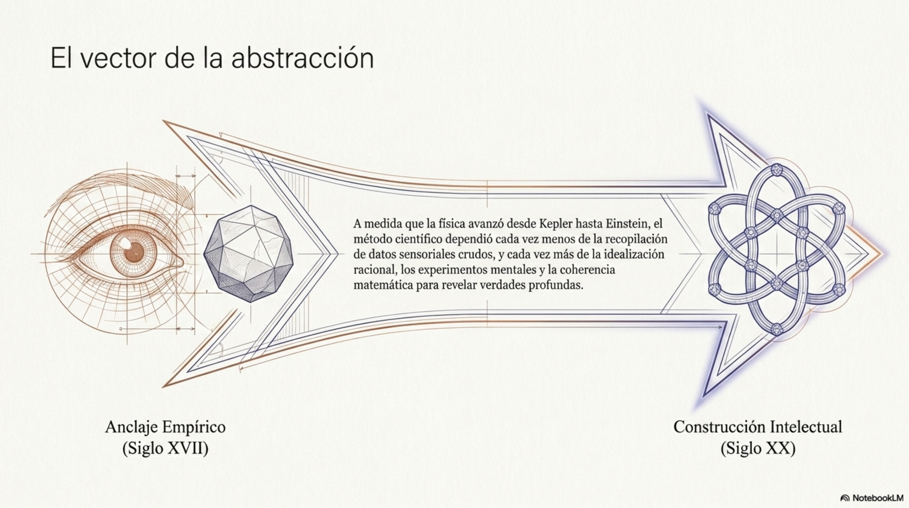

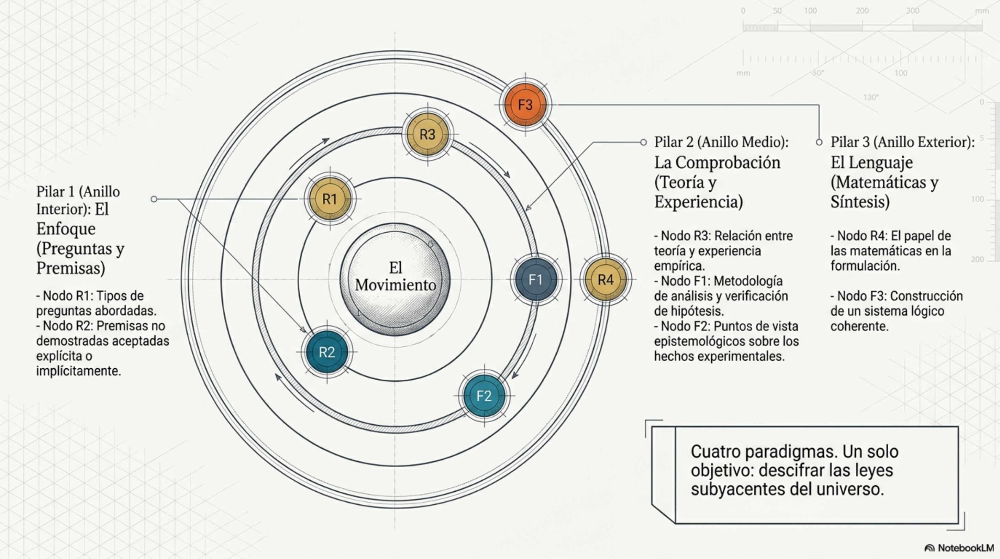

**Descripción de trayectorias conceptuales**

En este capítulo nos concentraremos en las trayectorias conceptuales
conectadas con los conocimientos acerca del movimiento que en su momento
recorrieron Johannes Kepler (1571-1630), Galileo Galilei (1564-1642),
Isaac Newton (1643-1727) y Albert Einstein (1879-1955).

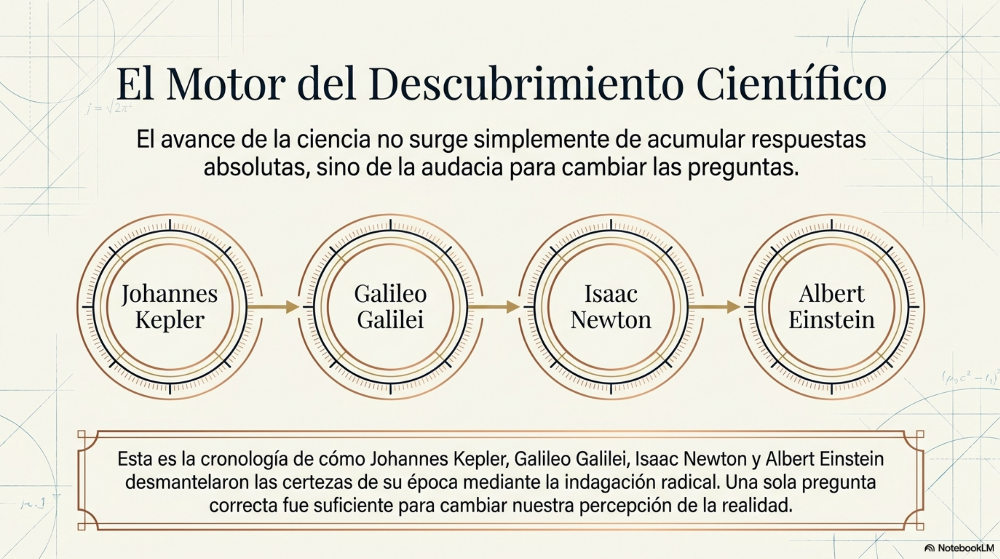

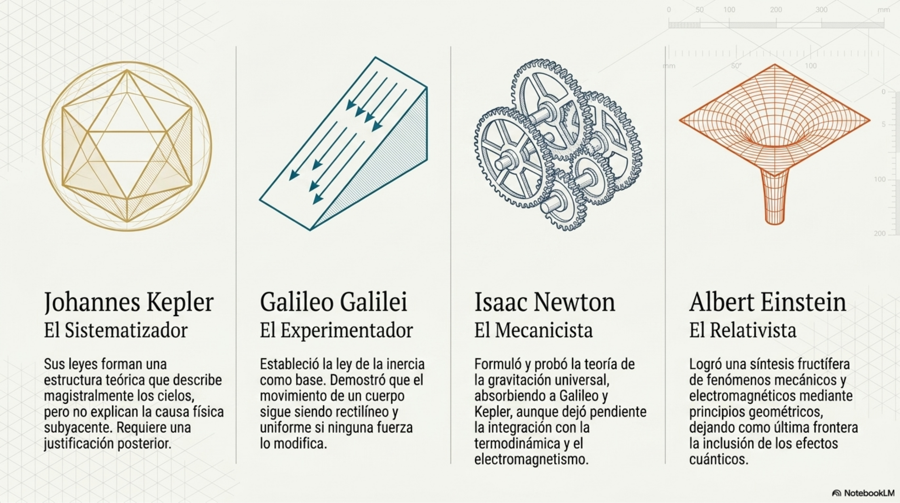

Las trayectorias conceptuales que pudieron haber recorrido tales
científicos fueron moduladas por las propias visiones de la realidad
física y por los paradigmas vigentes que se aplicaron en la época para
explicar los movimientos en la naturaleza.

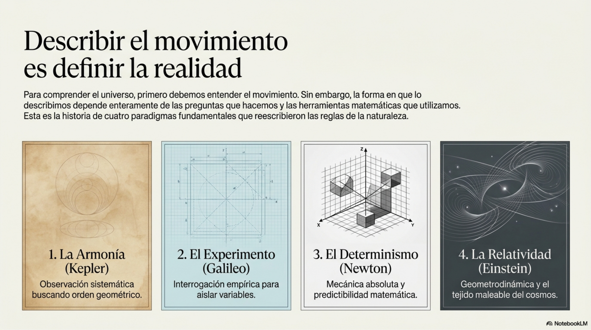

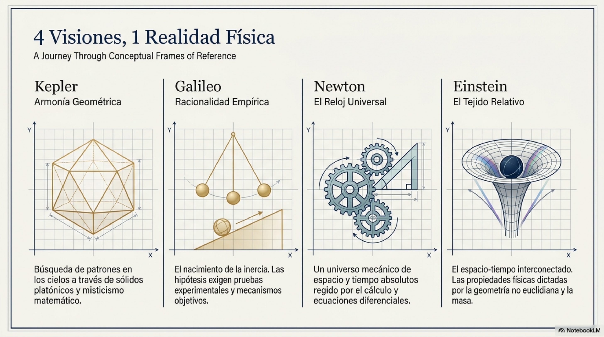

COLOCAR EL SIGUIENTE CUADRO CON LA TRADUCCIÓN .ENCIMA DE LA FRASE EN
INGLÉS

Las dos primeras secciones de este capítulo tratan de la evolución en
los conocimientos acerca del movimiento de una cuarteta de científicos
(Kepler, Galileo, Newton y Einstein) y describen esas evoluciones en
relación con cuatro pilares del marco de análisis. Estos pilares se
refieren a las preguntas fundamentales planteadas y a las premisas
consideradas válidas (que se verán en esta sección 4.1) así como a las
trayectorias que relacionan teoría – experimento y consideran el papel
de las matemáticas (que se verán en la siguiente sección 4.2).

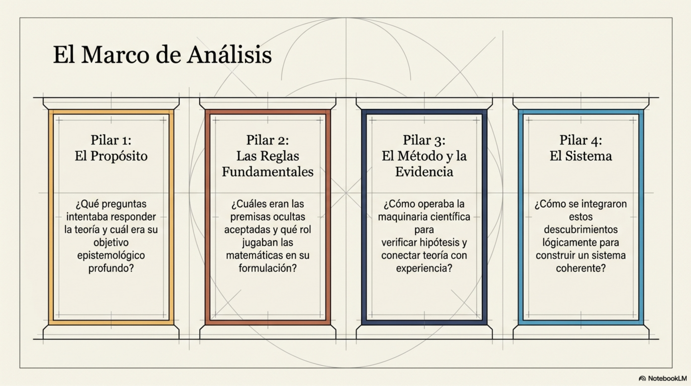

Las cuatro trayectorias que serán analizadas según su correspondiente
pilar darán una visión de cómo evolucionó en cada físico su comprensión
y puesta en práctica del sentido y alcances de lo que son la explicación
y los descubrimientos científicos.

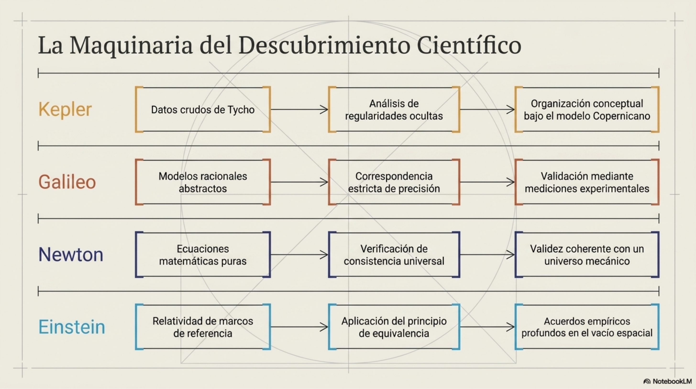

Las comparaciones entre las 16 trayectorias analizadas sirven para
caracterizar la obra de cada científico: Kepler por su mística
geométrica, Galileo por su rigor empírico, Newton por su determinismo
dinámico y Einstein por su relatividad estructural.

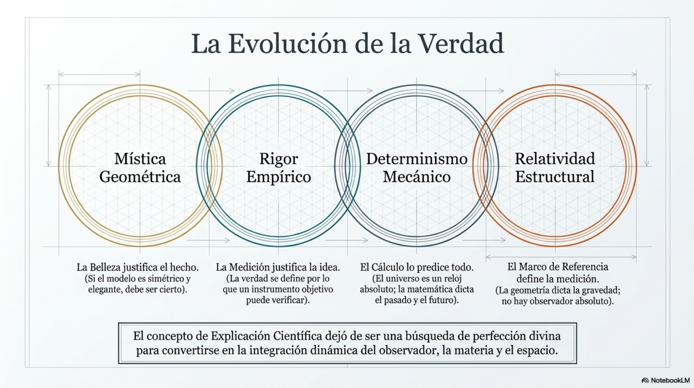

**Preguntas fundamentales planteadas**

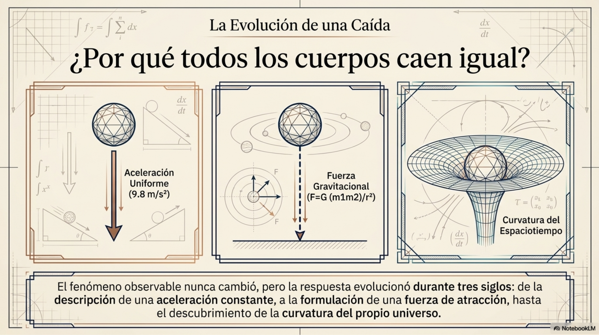

La siguiente Tabla 4.2 presenta en forma sintética lo que pudieron
haberse preguntado cada uno de los cuatro científicos respecto del
movimiento. Es una comparación de cuatro formas diferentes de contestar
una misma pregunta ¿qué estoy tratando de entender?

<table>
<colgroup>
<col style="width: 25%" />
<col style="width: 25%" />
<col style="width: 25%" />
<col style="width: 25%" />
</colgroup>
<thead>
<tr class="header">
<th colspan="4">Tabla 4.2. Preguntas fundamentales</th>
</tr>
</thead>
<tbody>
<tr class="odd">
<td>Kepler</td>
<td>Galileo</td>
<td>Newton</td>
<td>Einstein</td>
</tr>
<tr class="even">
<td>
¿Cuál es la verdadera trayectoria de los planetas?

¿Por qué los planetas cambian de velocidad?

¿Qué relación existe entre los planetas?

¿Qué causa el movimiento planetario?

¿Cómo conciliar matemáticas y realidad física?
</td>
<td>
¿Cómo caen los cuerpos?

¿Qué significa que un cuerpo se acelere?

¿Qué ocurre cuando no actúan obstáculos?

¿Cómo se combinan los distintos movimientos?

¿Puede la naturaleza describirse matemáticamente?

¿Qué papel tiene el experimento en la ciencia?
</td>
<td>
¿Qué causa los cambios de movimiento?

¿Por qué los planetas permanecen en órbita?

¿Existe una ley universal de la gravitación?

¿Cómo se relacionan fuerza, masa y aceleración?

¿Por qué persiste el movimiento?

¿Cómo interactúan mutuamente los cuerpos?
</td>
<td>
¿Cómo se ve la luz desde distintos sistemas en movimiento?

¿Son absolutos el espacio y el tiempo?

¿Qué permanece invariante en la naturaleza?

¿Cómo se relacionan masa y energía?

¿Qué es realmente la gravedad?

¿Qué ocasiona la caída de los cuerpos?

¿Puede la geometría describir la gravitación?
</td>
</tr>
</tbody>
</table>

A continuación, presentamos las aportaciones al conocimiento de la
mecánica clásica de Kepler, Galileo y Newton y después las aportaciones
de Einstein, ya en el contexto de la física moderna.

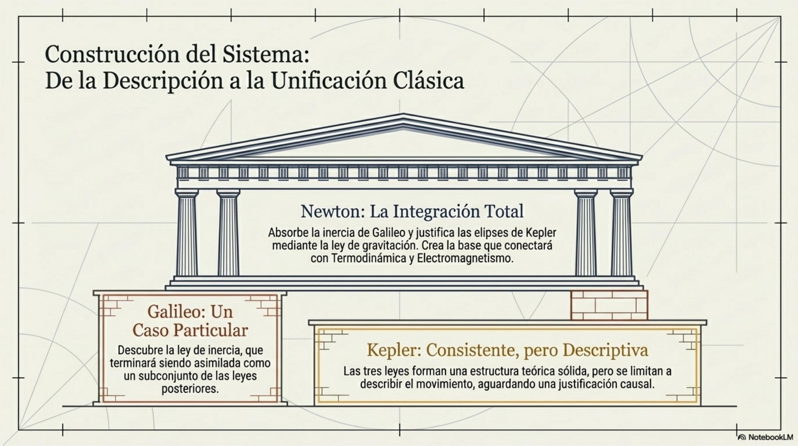

**Johannes Kepler** partió de las observaciones realizadas por Tycho
Brahe para luego formular sus tres leyes: de las órbitas, de las áreas y
de los períodos. Seguramente se preguntó si los planetas realmente
describían ciclos y epiciclos o si existían otras curvas matemáticas que
representaran mejor esas trayectorias alrededor del Sol. Además, como
los planetas parecían moverse con mayor rapidez en ciertas regiones,
sería cuestión de averiguar si existía alguna relación entre la
velocidad de traslación y la distancia al Sol de cada planeta. Se
preguntó qué tipo de fuerza producía el movimiento de los planetas y si
existía un orden universal que respondiera a una armonía matemática; de
esa manera se demostraría qué la geometría expresaba la estructura real
del universo.

**Galileo Galilei** cuestionó la idea aristotélica de que los cuerpos
pesados caen más rápido que los ligeros y por eso buscó una descripción
cuantitativa del movimiento de caída libre. También se preguntó cómo
sería el movimiento de un cuerpo sin fricción y cómo se combinan los
desplazamientos verticales y horizontales de un proyectil en movimiento
parabólico. Concluyó que el libro de la naturaleza está escrito en
lenguaje matemático y que ciertas regularidades observadas podían
explicarse midiendo primero y luego usando la geometría. Al preguntarse
cómo verificar si una idea física era correcta, inauguró la era de la
física experimental propiamente dicha y para ello desarrolló
experimentos con planos inclinados, péndulos, esferas rodantes, …

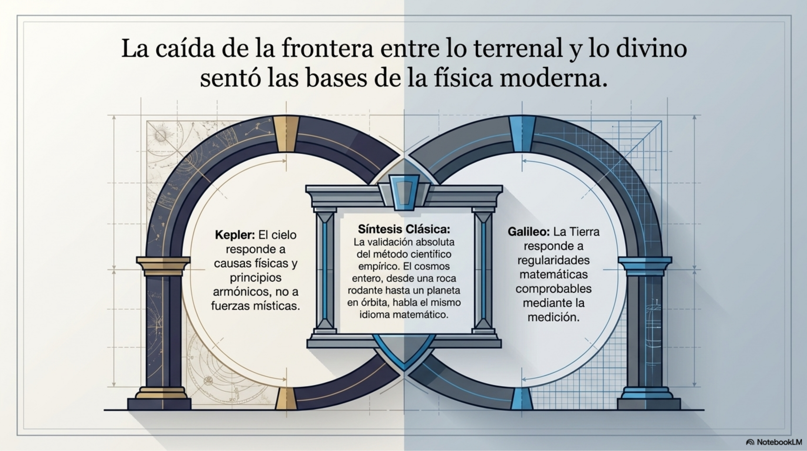

**Isaac Newton** pudo haberse preguntado cuál es la causa de la
aceleración y si existía alguna relación cuantitativa entre fuerza y
cambio de velocidad. Indagó en las causas de movimientos tales como el
de la Luna alrededor de la Tierra y de los planetas alrededor del Sol.
Buscó formular una ley matemática universal, la ley de gravitación
universal, para expresar la atracción entre dos cuerpos depende de la
distancia que les separa y de sus masas. Cuestionó las condiciones para
que un cuerpo siga moviéndose después de que cesa la acción de fuerzas
externas. También indagó acerca de la existencia de una relación de
reciprocidad en las interacciones mutuas entre dos cuerpos.

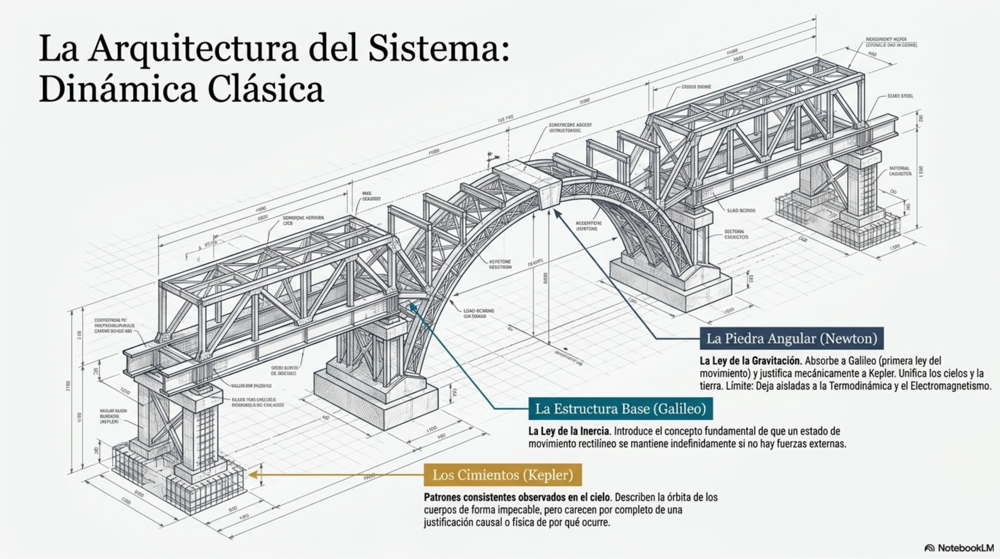

**Albert Einstein** se preguntó cómo describir el movimiento para
velocidades cercanas a la de la luz y si la gravitación tendría que
integrarse a una nueva geometría del espacio y del tiempo. Indagó si la
velocidad de la luz dependía del movimiento del observador y en
consecuencia si el espacio y el tiempo tendrían que ser relativos.
Averiguó si las leyes del electromagnetismo eran diferentes al cambiar
de sistema de referencia y tomó en cuenta nuevas relaciones de
transformación de las coordenadas de espacio y tiempo para asegurarse
que tales leyes resultaran invariantes frente a tales cambios.
Estableció la equivalencia entre masa y energía. Buscó la existencia de
la relación entre inercia y gravitación que le llevaría al principio de
equivalencia. Propuso que la velocidad de la luz en el vacío es
constante para todos los observadores inerciales y geometrizó la
mecánica.

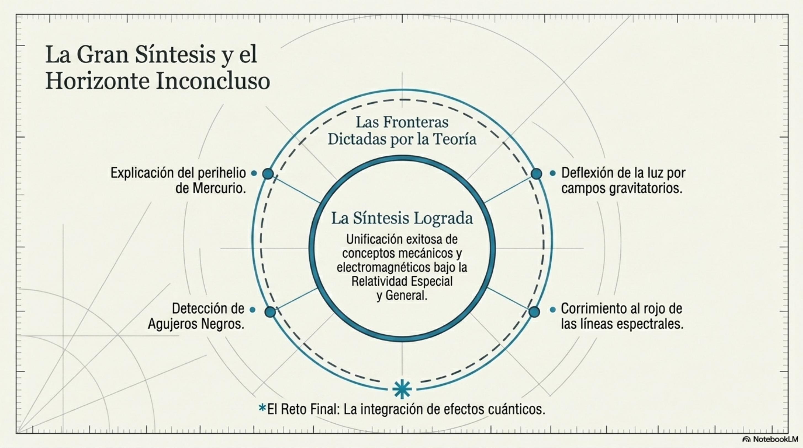

Lo anterior puede resumirse en el siguiente cuadro y en un diagrama que
representa la evolución del pensamiento acerca del movimiento.

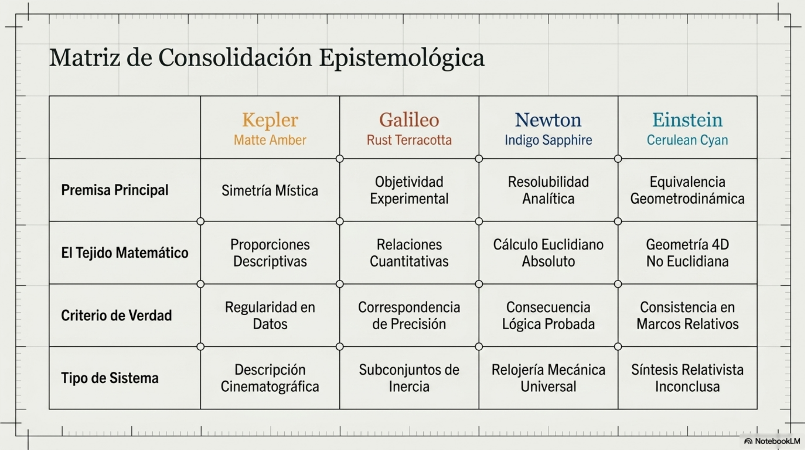

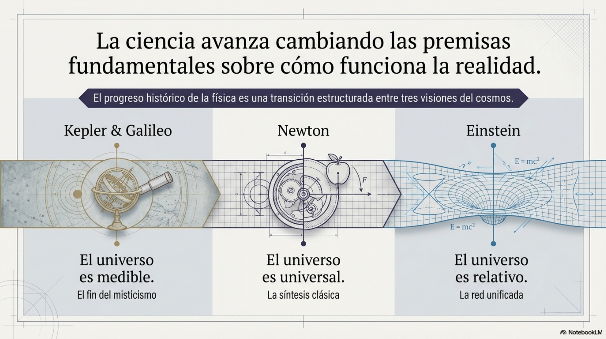

**Premisas consideradas válidas**

Preguntarse qué creía cada uno de los físicos en cuestión antes de hacer
sus cálculos requiere averiguar que premisas consideraron válidas, lo
cual se muestra esquemáticamente en la Tabla 4.3.

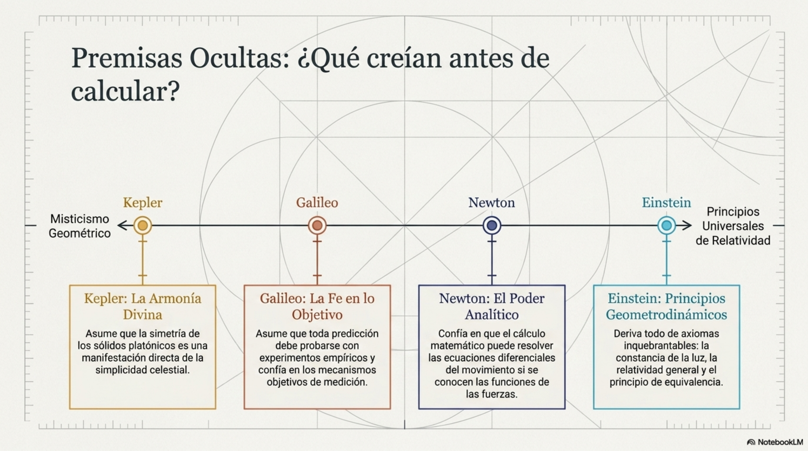

<table>
<colgroup>
<col style="width: 23%" />
<col style="width: 25%" />
<col style="width: 26%" />
<col style="width: 23%" />
</colgroup>
<thead>
<tr class="header">
<th colspan="4">Tabla 4.3. Premisas asumidas como válidas</th>
</tr>
</thead>
<tbody>
<tr class="odd">
<td>Kepler</td>
<td>Galileo</td>
<td>Newton</td>
<td>Einstein</td>
</tr>
<tr class="even">
<td>
El universo posee un orden matemático.

El Sol ocupa una posición privilegiada.

Las observaciones precisas tienen prioridad sobre las ideas
preconcebidas.

El movimiento celeste tiene causas físicas.

La naturaleza actúa mediante principios simples y armónicos.
</td>
<td>
La naturaleza posee regularidades matemáticas.

La observación y el experimento tienen prioridad sobre la opinión de
los expertos.

El movimiento puede estudiarse aisladamente.

El reposo y el movimiento uniforme son estados equivalentes.

Las mismas leyes físicas valen en la Tierra y en el cielo.

El conocimiento científico debe construirse a partir de
mediciones.
</td>
<td>
La naturaleza está gobernada por leyes matemáticas
universales.

Las mismas leyes valen en la Tierra y en el cielo.

El espacio y el tiempo existen objetivamente.

El movimiento puede describirse en términos de acciones de
fuerzas.

Los fenómenos complejos pueden reducirse a principios simples.

La experimentación y la observación son esenciales.
</td>
<td>
Las leyes físicas deben ser las mismas para todos los
observadores inerciales.

La velocidad de la luz es constante.

El espacio y el tiempo forman una unidad.

La geometría tiene realidad física.

La gravitación no es una fuerza ordinaria es una propiedad del
espacio tiempo.

La experiencia física debe ser coherente para todos los
observadores.

La física debe poseer unidad conceptual.
</td>
</tr>
</tbody>
</table>

En lo que sigue comentamos algunas consideraciones individuales respecto
de lo que cada uno pudo haber supuesto.

**Kepler** supuso la existencia de una naturaleza organizada
racionalmente y de unas relaciones matemáticas que revelaban el plan del
cosmos; además, aceptaba el modelo heliocéntrico de Nicolaus Copernicus.
Consideró que una teoría debe modificarse si hay contradicción en los
datos, que el cosmos estaba regido por relaciones armónicas y que los
movimientos planetarios no eran construcciones geométricas sino
fenómenos físicos reales que requerían explicación causal. Detrás de su
complejidad aparente debía existir una simplicidad matemática profunda.

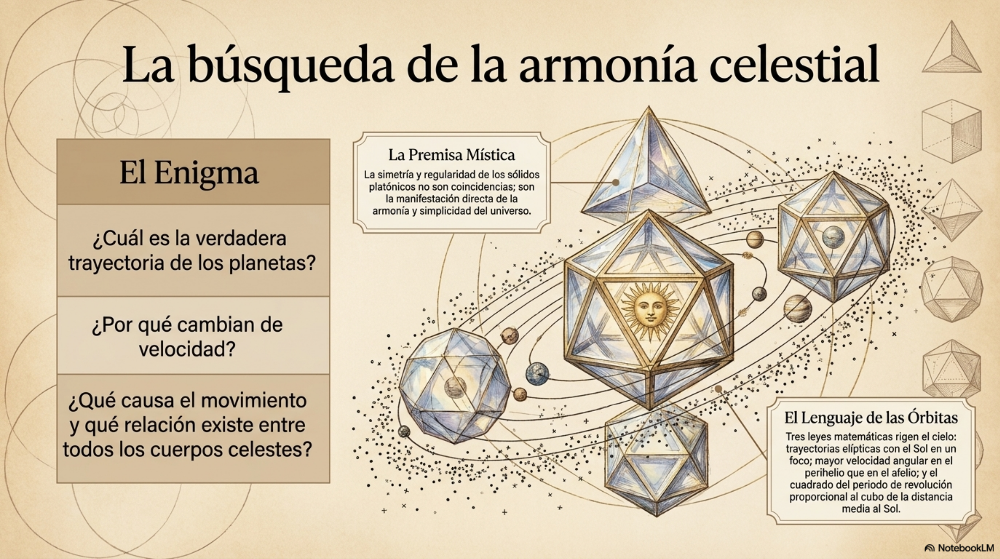

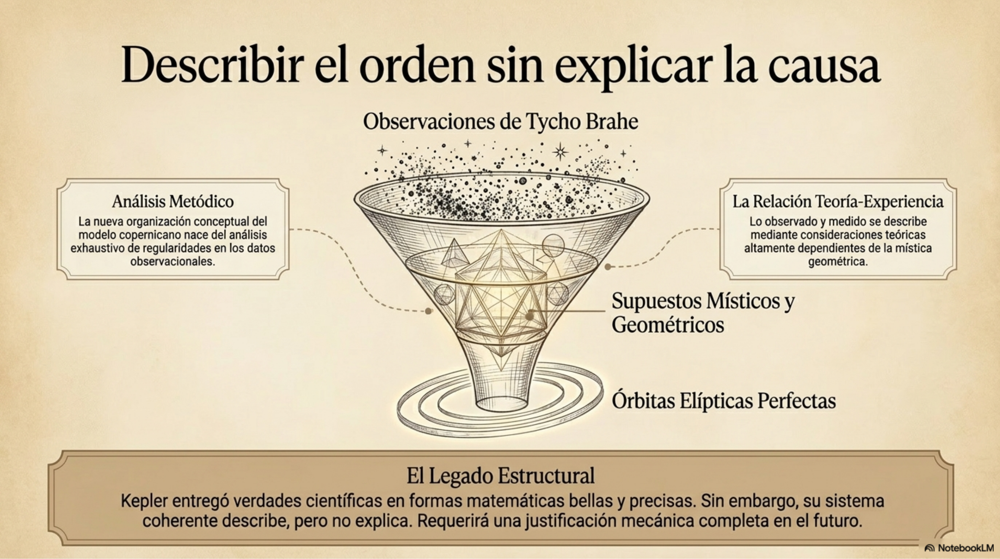

**Galileo** afirmó que los fenómenos físicos obedecen leyes
cuantificables que se expresan mediante relaciones matemáticas; medir
resultaba ser esencial. Consideró que la verdad física no dependía de
autoridades sino de la experiencia observable y verificable y que para
ello debían analizarse experiencias en condiciones aproximadas de mayor
simplificación como la eliminación de fricciones y resistencias. Pensó
que un cuerpo puede continuar moviéndose indefinidamente sin necesidad
de fuerza adicional y que no había separación entre los movimientos
terrestres y los celestes porque todos los movimientos obedecen
principios comunes.

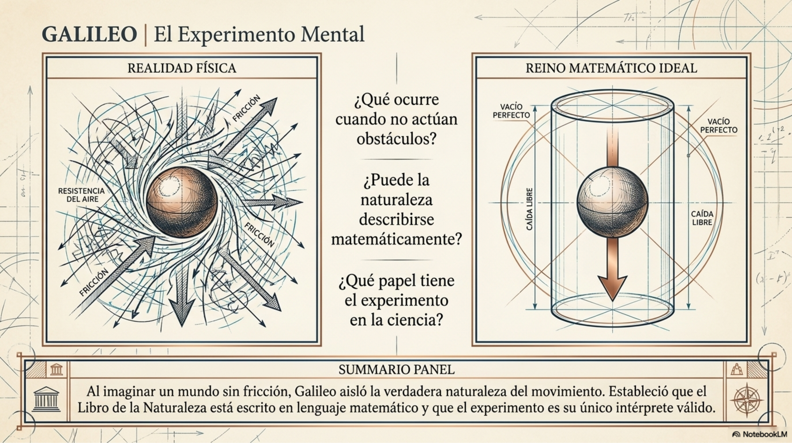

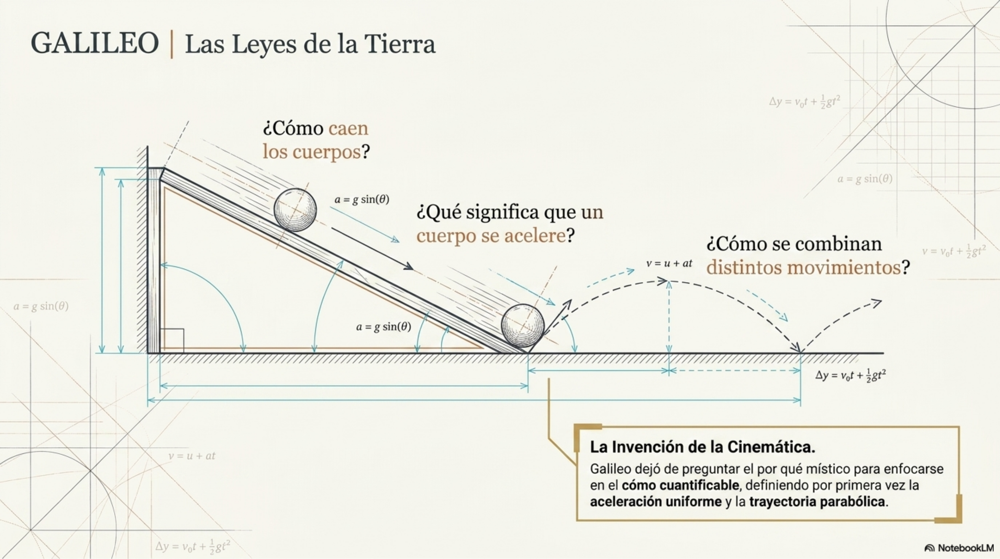

**Newton** consideró la existencia de un orden racional en un universo
en el que las matemáticas describen exactamente algunas leyes físicas
universales y necesarias. Supuso que espacio y tiempo eran absolutos e
independientes, que todo cambio en el estado de movimiento era debido a
la acción de fuerzas y que un gran número de fenómenos naturales podían
explicarse en términos de pocas leyes fundamentales. Además, pensó que
las leyes deben concordar con la experiencia, evitando toda hipótesis
que no sea verificable, con lo cual rechazaba las especulaciones
metafísicas no comprobables.

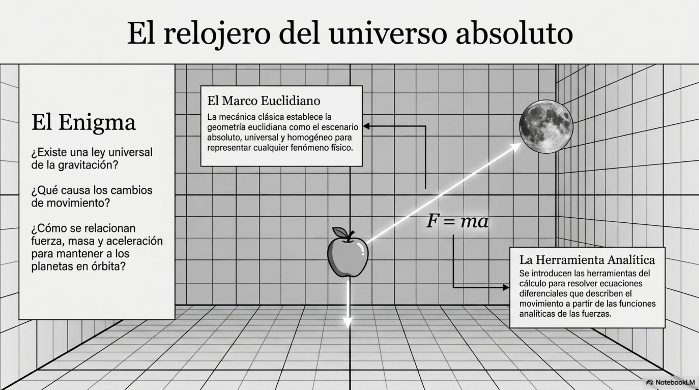

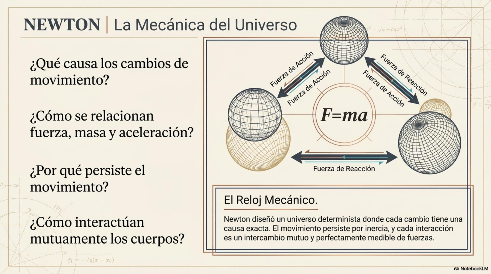

**Einstein** conservó y amplió el principio de relatividad de Galileo
estableciendo la condición de que ningún sistema inercial era
privilegiado. Además, redefinió espacio y tiempo y postuló que todos los
observadores deberán medir la misma velocidad de la luz,
independientemente de su movimiento relativo. Consideró que la fuerza de
gravedad se debía a la deformación del espacio-tiempo causada por
grandes concentraciones de masa. Buscó la unificación de diversos
fenómenos bajo principios generales, tanto entre la mecánica y el
electromagnetismo (relatividad especial) como entre la gravitación y la
geometría (relatividad general).

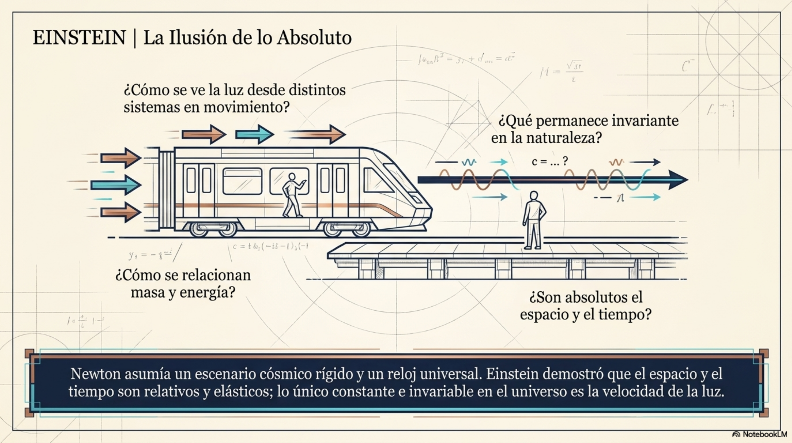

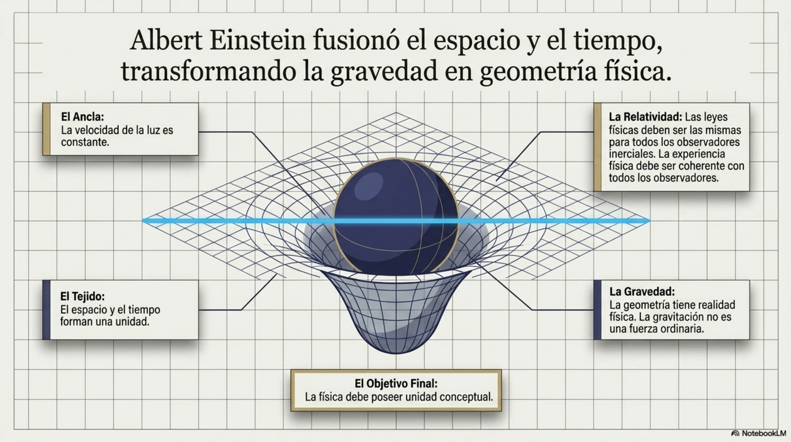

La siguiente diapositiva expresa la última etapa en la construcción del
edificio conceptual de la mecánica.

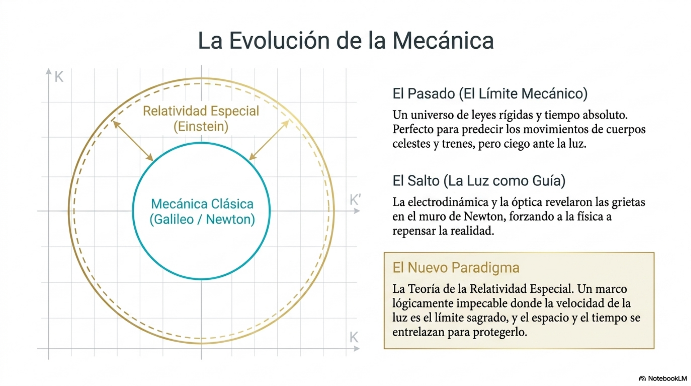

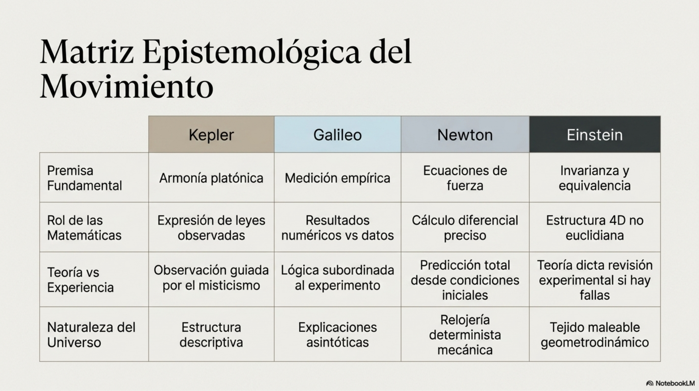

