**4.2. Trayectorias conceptuales relacionadas con las condiciones en la
frontera de la disciplina**

Esta sección 4.2 se refiere a las trayectorias conceptuales que tienen
que ver con las condiciones en la frontera de la disciplina, las cuales
conciernen a la relación teoría – experimento y al papel de las
matemáticas. De manera análoga a la sección anterior, esta sección
comprende una tabla que contiene una selección de puntos de vista
respecto del tema al que se refiere cada trayectoria y una serie de
imágenes conectadas con observaciones que pudieron haber emitido cada
uno de los científicos respecto del tema en consideración. Las tablas
comparan trayectorias conceptuales individuales, las imágenes aportan
detalles de trayectorias propias por separado.

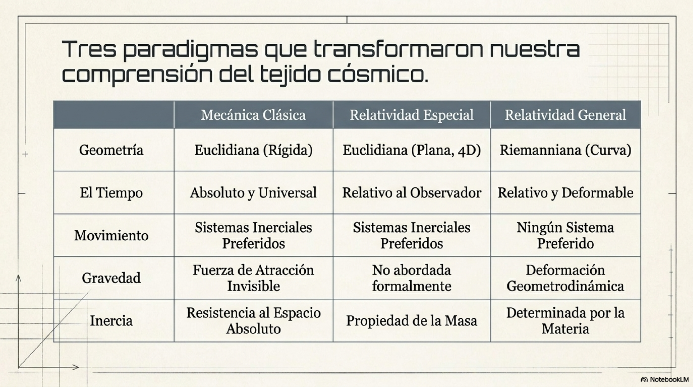

**La relación teoría – experimento**

La siguiente Tabla 4.4 contiene posibles opiniones de los cuatro
científicos respecto de la relación teoría – experimento y algunas
referencias específicas a trabajos propios de cada uno de los cuatro
científicos considerados. Más adelante trataremos de la trayectoria
conceptual conectada con la importancia de las matemáticas.

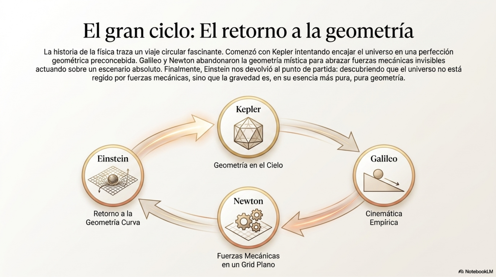

<table>
<colgroup>
<col style="width: 24%" />
<col style="width: 22%" />
<col style="width: 26%" />
<col style="width: 25%" />
</colgroup>
<thead>
<tr class="header">
<th colspan="4">Tabla 4.4. Relación entre teoría y experimento</th>
</tr>
</thead>
<tbody>
<tr class="odd">
<td>Kepler</td>
<td>Galileo</td>
<td>Newton</td>
<td>Einstein</td>
</tr>
<tr class="even">
<td>
La teoría debe ajustarse a los hechos observados.

La observación puede obligar a abandonar ideas tradicionales.

La teoría debe buscar causas reales.

Existe una interacción constante entre hipótesis y
observación.
</td>
<td>
El experimento es el criterio de validez de la teoría.

La experiencia debe organizarse racionalmente.

La teoría guía la observación.

El experimento permite descubrir regularidades ocultas.

La física debe estudiar fenómenos idealizados.
</td>
<td>
La teoría debe derivarse de fenómenos observables.

El experimento permite descubrir relaciones universales.

La teoría organiza y unifica los fenómenos.

Existe una interacción continua entre observación y deducción.

El experimento verifica consecuencias matemáticas.
</td>
<td>
La experiencia es el criterio final de validez.

La teoría guía profundamente la observación.

Los conceptos físicos son construcciones intelectuales.

Los experimentos mentales son herramientas fundamentales.

La teoría debe buscar coherencia y simplicidad.

El experimento puede obligar a transformar conceptos
fundamentales.
</td>
</tr>
</tbody>
</table>

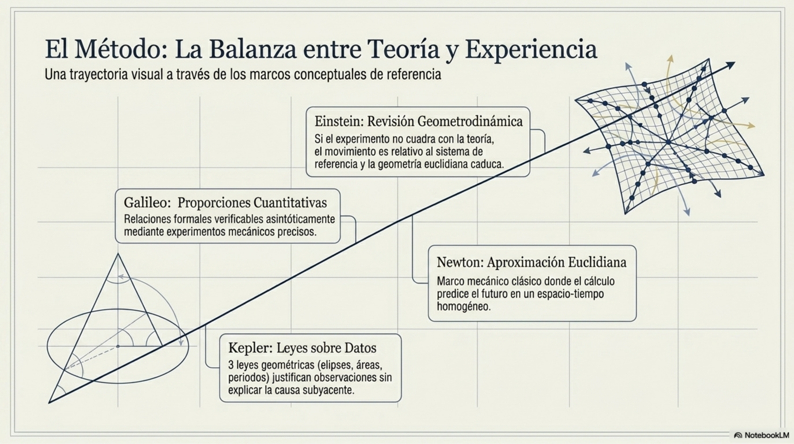

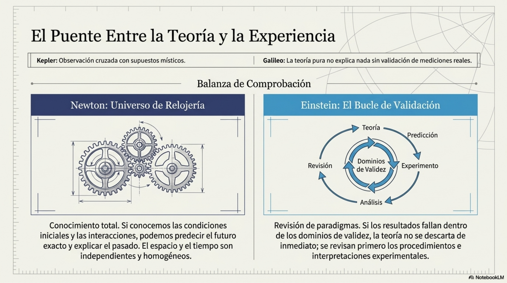

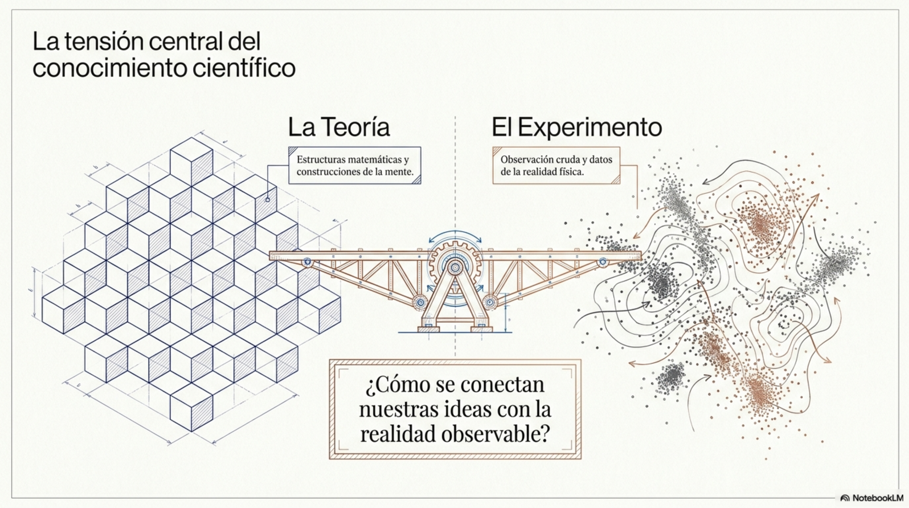

**Kepler** no veía la astronomía como una simple técnica de cálculo,
sino como un intento de descubrir la estructura real y racional del
cosmos. No realizó experimentos en el sentido de Galileo; en cambio hizo
observaciones y mediciones astronómicas extremadamente precisas. Usó los
datos de Tycho Brahe y encontró pequeñas discrepancias entre las órbitas
circulares predichas y las posiciones observadas de planetas como Marte.
Esto lo llevó a pensar en la elipse cómo trayectoria más apropiada para
describir las órbitas planetarias. Dejó de ver los modelos matemáticos
como herramientas predictivas y optó por una estrategia diferente según
la cual la teoría guía la interpretación de los datos y éstos a su vez
corrigen la teoría.

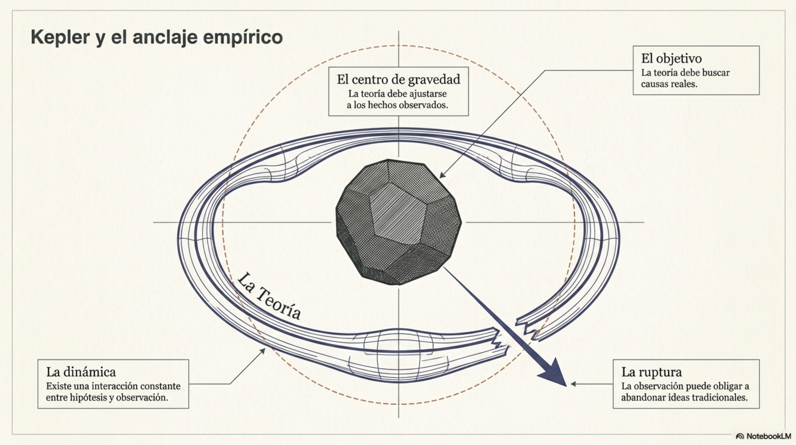

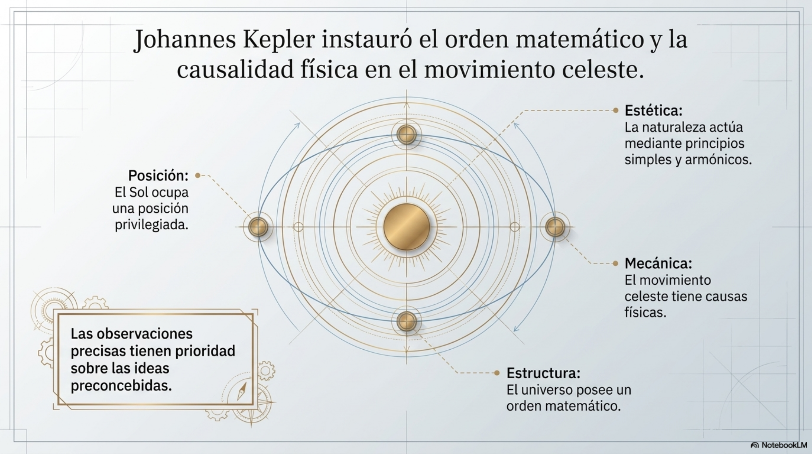

**Galileo** sostuvo que el conocimiento del movimiento debe construirse
mediante la observación controlada, la experimentación, la idealización,
la medición y la formulación matemática. Introdujo idealizaciones
teóricas tales como las superficies sin fricción, la caída sin
resistencia del aire y el movimiento perfectamente uniforme. Resolvió
situaciones en que parecía que los cuerpos pesados caían más rápido y
que todo objeto necesitaba de alguna fuerza continua para moverse.
Consideró que el experimentador debe producir situaciones controladas,
aislar variables, simplificar fenómenos y medir cuantitativamente.
También necesita seleccionar lo que ha de medir, diseñar el experimento,
interpretar los resultados y formular la hipótesis que habrá de probar.

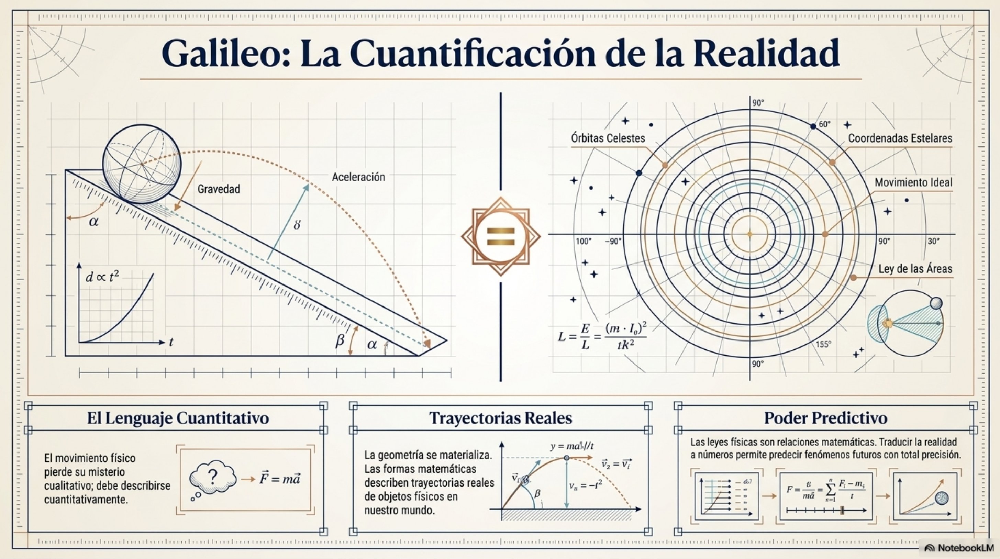

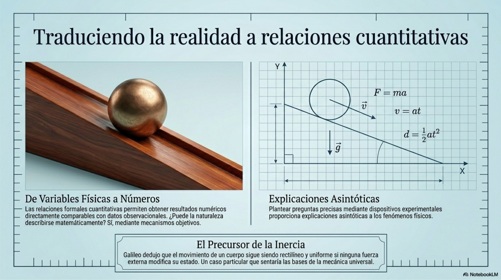

**Newton,** construyó una teoría universal del movimiento basado en la
observación, la experimentación, la deducción matemática y la
formulación de leyes universales. No aceptaba explicaciones sin
fundamento empírico suficiente y suponía que detrás de fenómenos
aparentemente distintos existían principios comunes, como fue el caso de
la caída de los cuerpos, las órbitas planetarias, el movimiento de
proyectiles y las mareas. Combinó el método inductivo (partir de
observaciones para inferir leyes generales) con el método deductivo
(partir de leyes matemáticas para predecir nuevos fenómenos). Fue así
como a partir de observaciones astronómicas formuló la ley de la
gravitación universal y dedujo matemáticamente órbitas, trayectorias y
perturbaciones.

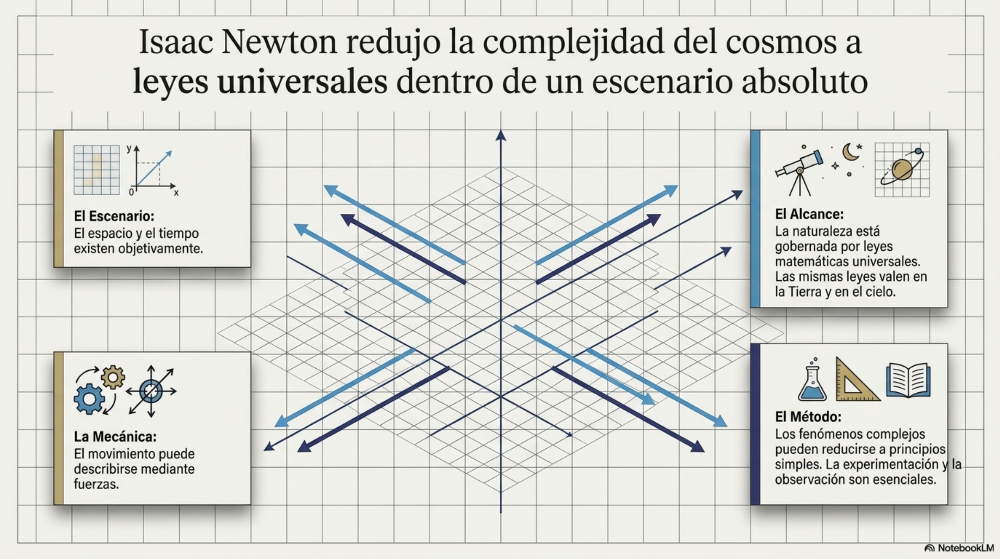

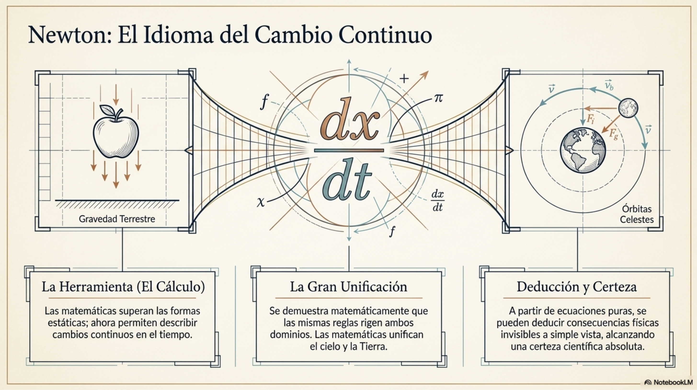

**Einstein** pensaba que la ciencia no surge únicamente de acumular
observaciones, sino de una interacción creativa entre la experiencia
física, la construcción conceptual, los principios teóricos, la
imaginación y la formulación matemática. Supuso que toda buena teoría
debería poder revelar principios profundos de la naturaleza y poseer
coherencia lógica, simplicidad conceptual, universalidad y poder
explicativo. Sus teorías permitieron dar explicaciones y hacer
predicciones comprobables, como el efecto fotoeléctrico y la
condensación de Bose Einstein (fenómenos cuánticos), así como la
desviación de la luz por gravedad, el corrimiento gravitacional, la
precesión del perihelio de la órbita de Mercurio y las ondas
gravitacionales (fenómenos relativistas). Utilizó los llamados
experimentos mentales para plantearse problemas e imaginar soluciones de
trenes en movimiento, montarse en un haz de luz, subir en ascensores
acelerados y colocar observadores en distintos marcos de referencia.

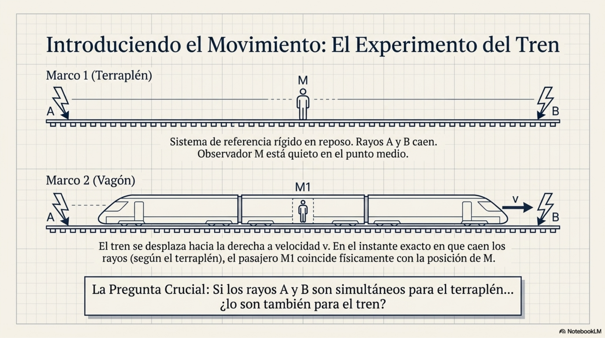

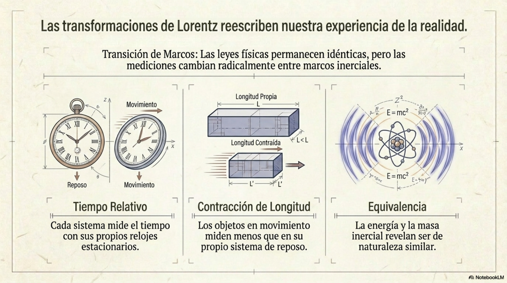

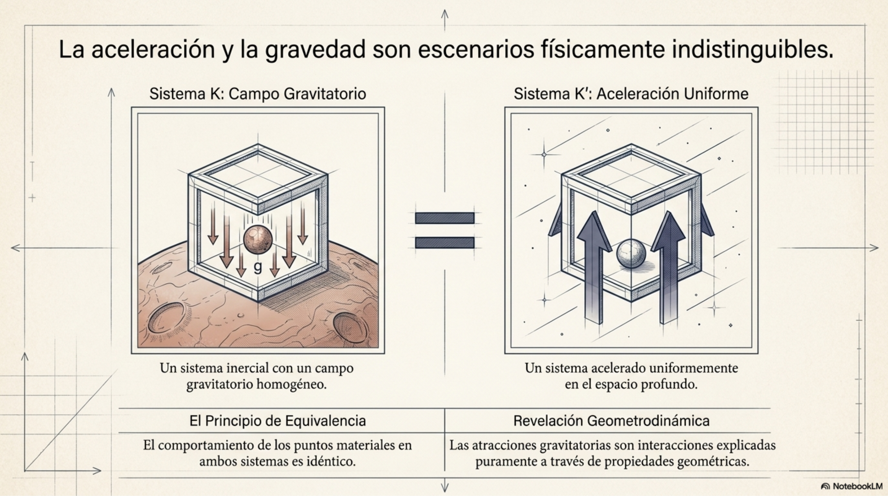

**La importancia de las matemáticas**

A continuación, presentamos un par de diapositivas que tratan de la
evolución de las matemáticas. Posteriormente, la Tabla 4.5 compara
posibles opiniones de los cuatro científicos respecto de la importancia
que tuvieron las matemáticas en el desarrollo de sus trabajos. Después
consideramos la manera en la que cada científico pudo haber sentido,
creado y utilizado las matemáticas.

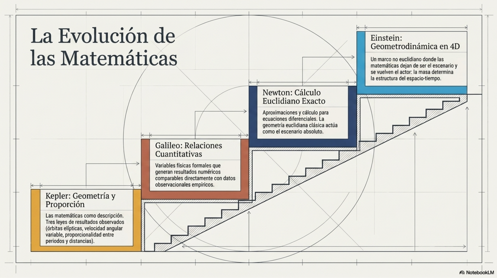

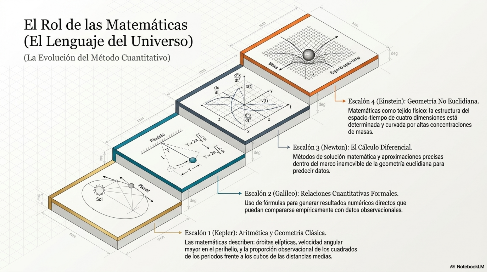

<table>
<colgroup>
<col style="width: 24%" />
<col style="width: 22%" />
<col style="width: 26%" />
<col style="width: 25%" />
</colgroup>
<thead>
<tr class="header">
<th colspan="4">Tabla 4.5. Papel de las matemáticas</th>
</tr>
</thead>
<tbody>
<tr class="odd">
<td>Kepler</td>
<td>Galileo</td>
<td>Newton</td>
<td>Einstein</td>
</tr>
<tr class="even">
<td>
Las matemáticas revelan la estructura del universo.

El movimiento planetario obedece leyes matemáticas precisas.

La geometría permite describir físicamente el cosmos.

Las matemáticas conectan armonía y causalidad.
</td>
<td>
Las matemáticas permiten descubrir leyes universales.

El movimiento debe describirse cuantitativamente.

Las leyes físicas son relaciones matemáticas.

La geometría describe trayectorias reales.

Las matemáticas permiten predecir fenómenos.
</td>
<td>
Las matemáticas expresan las leyes de la naturaleza.

Las matemáticas sirven para describir cambios continuos.

Las matemáticas permiten deducir consecuencias físicas.

La geometría y el cálculo describen el espacio físico real.

Las matemáticas unifican el cielo y la Tierra.

Las matemáticas permiten alcanzar certeza científica.
</td>
<td>
Las matemáticas ayudan a formular leyes invariantes.

Las matemáticas revelan estructuras ocultas de la realidad.

Las matemáticas permiten generalizar principios físicos.

Las matemáticas unifican fenómenos distintos.

Las matemáticas sirven para deducir nuevas predicciones físicas.

La belleza matemática posee valor heurístico.
</td>
</tr>
</tbody>
</table>

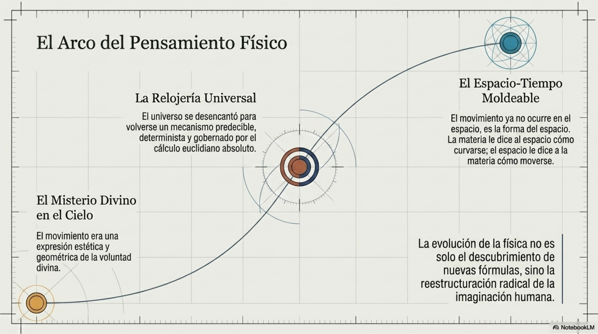

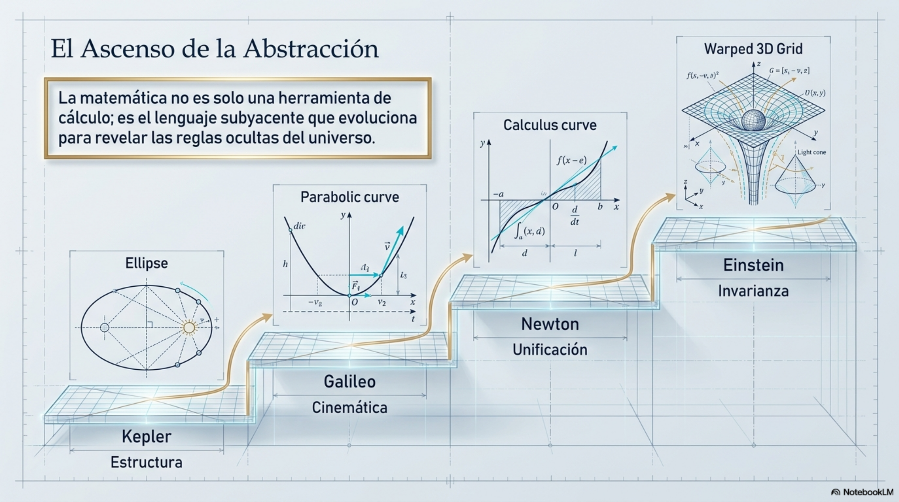

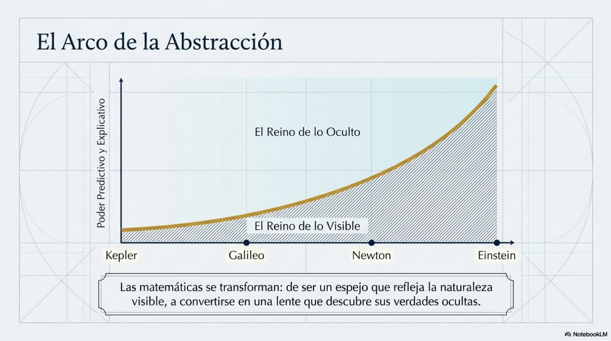

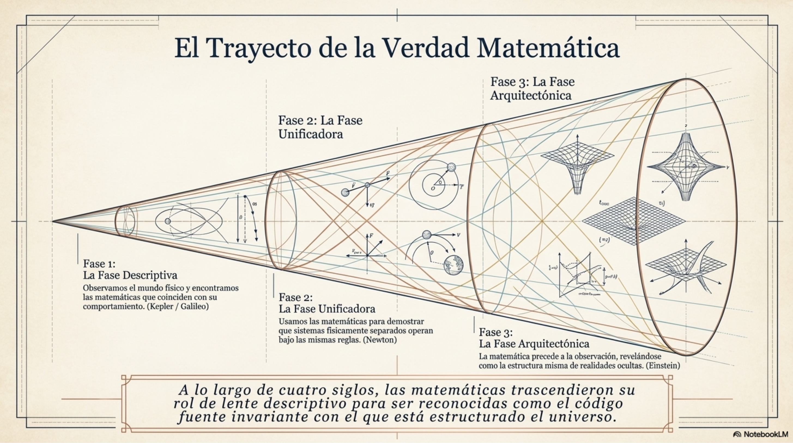

**Kepler** pensaba que las matemáticas constituyen el lenguaje de la
realidad cósmica que se expresa en términos de proporciones, simetrías,
armonías y relaciones numéricas. Además, las figuras geométricas son
expresiones reales de la organización del universo; ayudan a descifrar
el enigma del cielo. Las matemáticas le sirvieron para encontrar
regularidades cuantitativas universales como las que expresan sus tres
leyes: de las órbitas, de las áreas y de las proporciones. Buscó
encontrar y compartir una música del universo basada en proporciones
matemáticas.

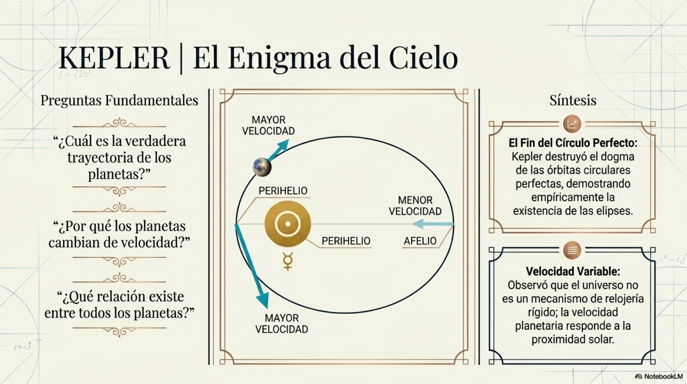

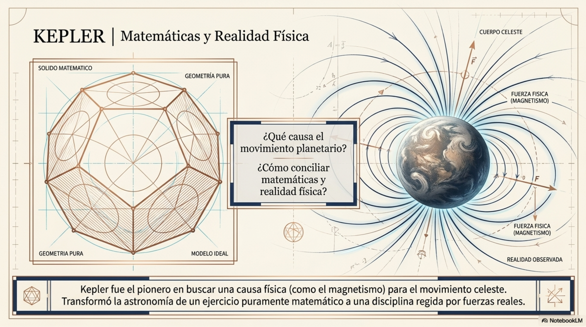

**Galileo** dijo que *El libro de la naturaleza está escrito en lenguaje
matemático.* Pensaba que sólo las matemáticas pueden expresar con
precisión las regularidades cuantificables que caracterizan al
movimiento y que comprender una ley significa poder calcular y prever
comportamientos futuros. Introdujo magnitudes medibles para el tiempo,
la velocidad, la aceleración y las trayectorias; descubrió que la caída
de los cuerpos sigue relaciones numéricas precisas. Además, mostró que
el movimiento parabólico de los proyectiles se debía a la combinación de
dos movimientos: un movimiento horizontal uniforme y otro de caída
vertical acelerada.

**Newton** consideró a las matemáticas como el instrumento indispensable
para formular las leyes universales del movimiento: las relaciones
físicas poseen una estructura matemática objetiva y las leyes
matemáticas correctamente confirmadas poseen enorme poder explicativo y
predictivo. A partir de unas pocas leyes generales calculó órbitas
planetarias, trayectorias de cometas, movimiento de proyectiles, mareas
y diversas perturbaciones gravitacionales. Utilizó la geometría y el
cálculo para demostrar propiedades dinámicas y mostró como las figuras
matemáticas permiten representar trayectorias y movimientos reales.
Mostró matemáticamente que las leyes que gobiernan la caída de una
piedra son las mismas que gobiernan las órbitas planetarias.

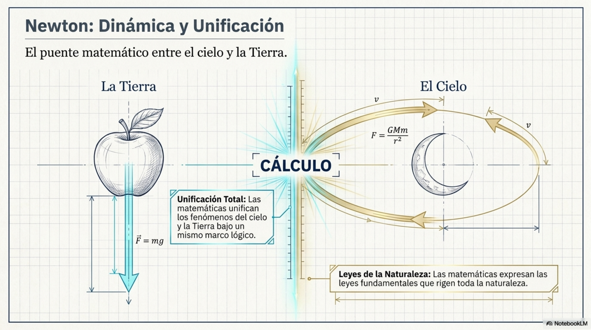

**Einstein** quería encontrar leyes válidas que permanecieran
invariantes frente a transformaciones en los sistemas de referencia.
Buscó una interacción continua entre la coherencia conceptual y la
verificación empírica. En la teoría de la relatividad especial encontró
una relación universal entre masa y energía; en la teoría de la
relatividad general demostró que la materia curva el espacio-tiempo y
que tal curvatura determina el movimiento. Las ecuaciones relativistas
condujeron a predicciones como los agujeros negros, la expansión del
universo, las ondas gravitacionales y la dilatación del tiempo. Esta
dilatación se manifiesta como un efecto del movimiento en relatividad
especial y un efecto gravitacional en relatividad general.

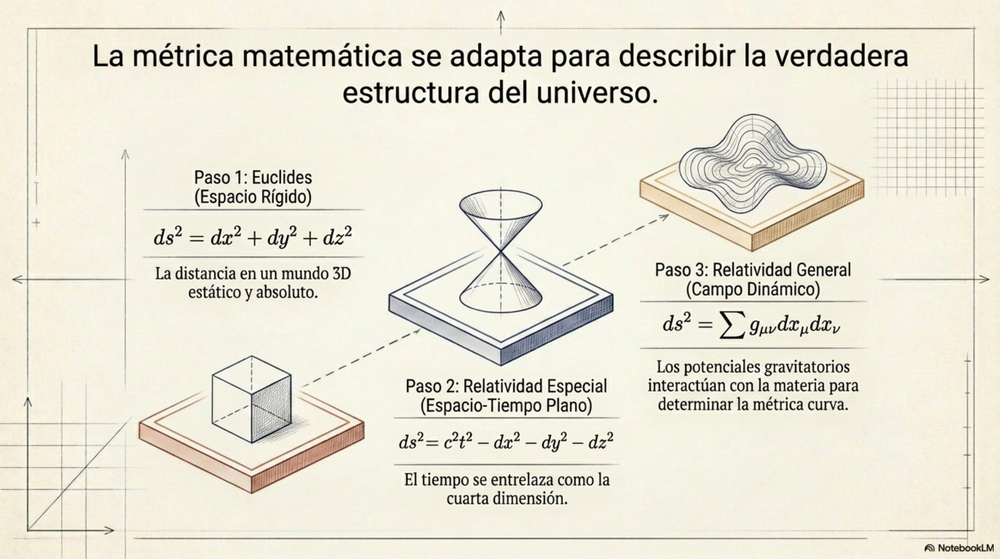

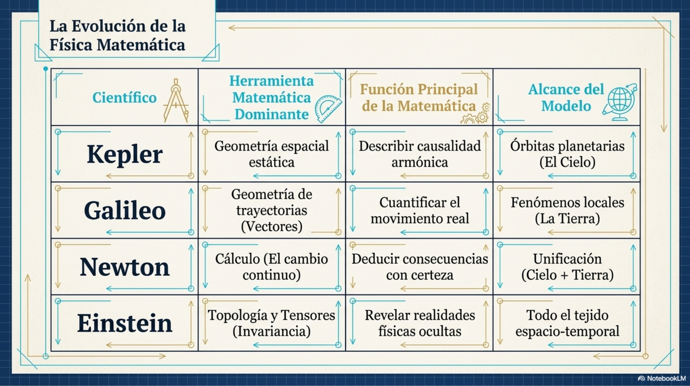

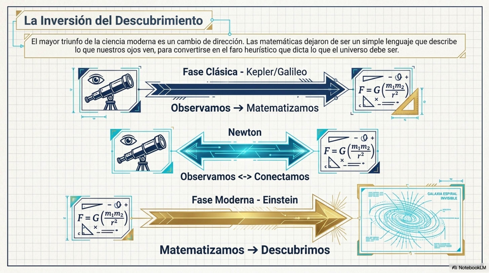

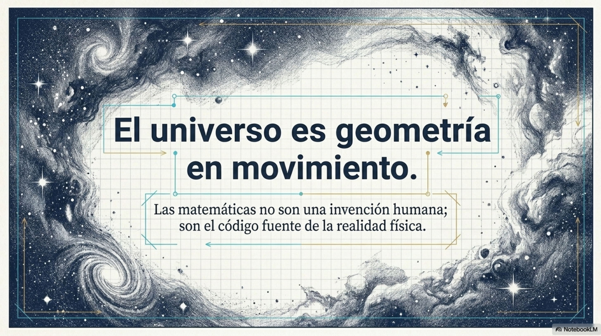

