**4.3. Avance del perihelio de la órbita del planeta Mercurio**

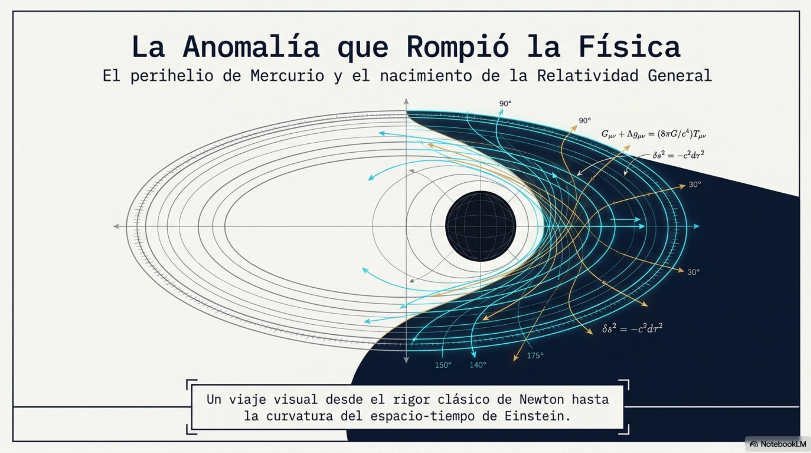

Según las leyes de Newton, un planeta en órbita alrededor del Sol que
está sujeto a la acción de una fuerza central proporcional a
1/r2 debe seguir una trayectoria que corresponde a una curva
cónica. De acuerdo con el valor de su excentricidad (e) esa curva
corresponderá a un círculo (e = 0), una elipse (0 \< e \< 1), una
parábola (e = 1) o una hipérbola (e \> 1).

La excentricidad mide qué tan alejada está una órbita elíptica de una
circunferencia perfecta (que tan alargada es). Se define como
$e = \frac{c}{a},$ donde $a$ es el semieje mayor de la elipse y $c\ $es
la distancia entre el centro de la elipse y uno de sus focos.

Mercurio es el planeta más cercano al Sol; tarda 88 días terrestres en
una traslación completa. Por otra parte, su órbita es la más excéntrica
en todo el sistema planetario solar; tiene un valor medio de
$e = 0.205630\ \ $(el valor más grande entre todos los planetas).

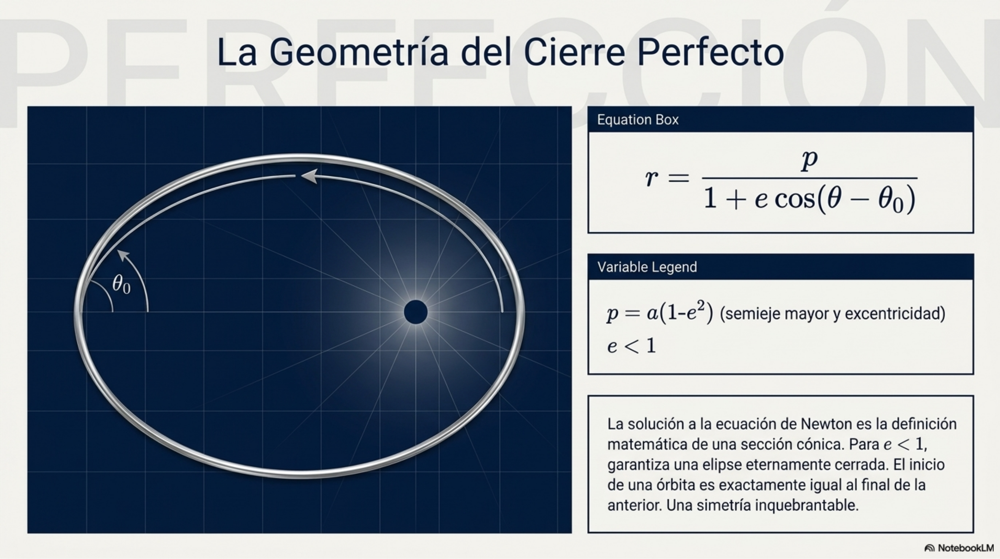

**Observación de la anomalía en la órbita de Mercurio**

Durante más de un siglo las observaciones astronómicas mostraron que la
elipse de la órbita de Mercurio no estaba estática, giraba lentamente
alrededor del Sol en cada revolución. De esta manera, el perihelio
avanzaba un poco en cada revolución, fenómeno que se denomina precesión
(cambio de orientación de la curva después da cada revolución). Los
cambios lentos de orientación de la órbita pueden deberse a las
influencias gravitacionales producidas por otros planetas del sistema y,
en particular, a la curvatura del espacio-tiempo descrita por la
relatividad general.

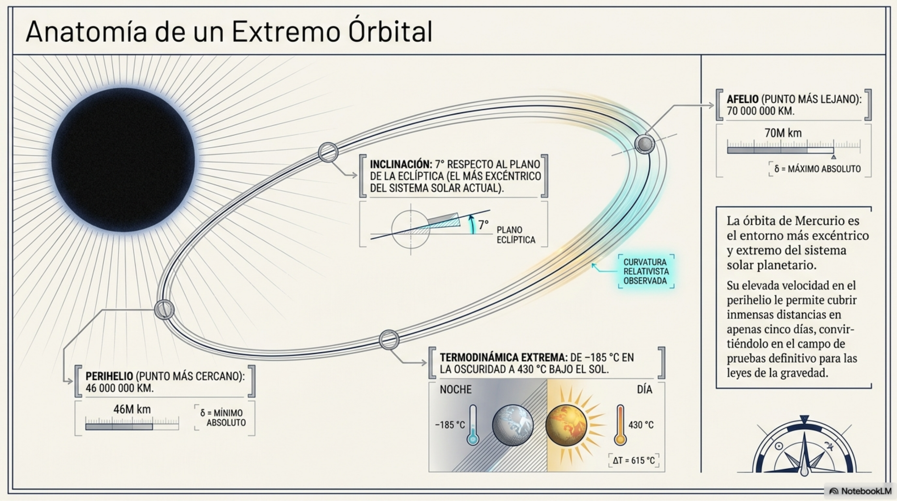

El avance del perihelio de Mercurio fue observado por primera vez en el
siglo XIX; se conjeturó que otro planeta desconocido en una órbita más
interior al Sol era el causante de las perturbaciones observadas. Sin
embargo, durante mucho tiempo siguió registrándose un exceso de
aproximadamente 43 segundos de arco por siglo, mismo que no podía
explicarse con la mecánica newtoniana.

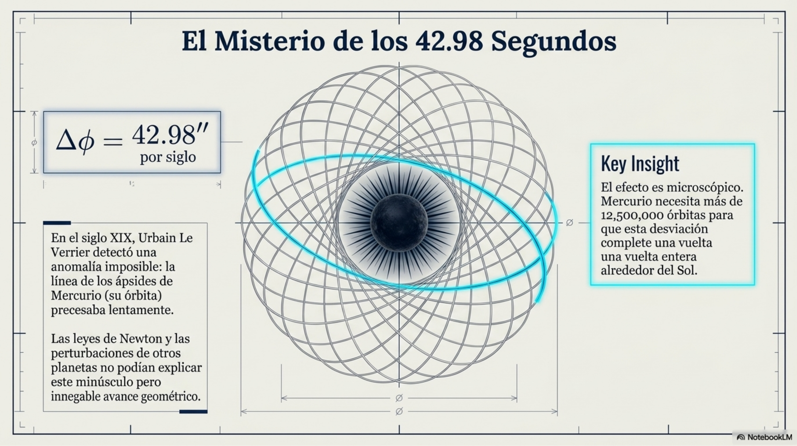

En la teoría de la relatividad general la gravedad no es, como diría
Newton, la fuereza atractiva instantánea que ejercen dos masas aisladas
colocadas a cierta distancia. Es el efecto geométrico, como diría
Einstein, de una curvatura del espacio-tiempo producida por una gran
concentración de materia. En esas condiciones el planeta se ve obligado
a seguir en ese espacio la trayectoria más rectilínea posible (la
geodésica).

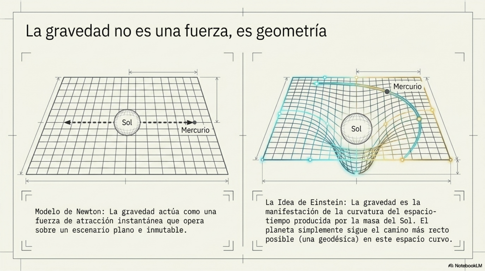

Para obtener la forma de la órbita planetaria es necesario partir de la
ecuación de movimiento y resolverla. La ecuación relativista de la
órbita planetaria no se obtiene al añadir arbitrariamente un término de
corrección a la ecuación newtoniana, sino al deducir que el movimiento
de un planeta corresponde a una geodésica en el espacio-tiempo curvo
generado por el Sol.

La geodésica es la trayectoria más natural o "más recta posible" entre
dos puntos en un espacio geométrico. En un espacio plano, como el de la
geometría euclidiana, una geodésica es simplemente una línea recta. En
términos matemáticos, una geodésica es una curva que localmente minimiza
(hace estacionaria) la distancia entre dos puntos.

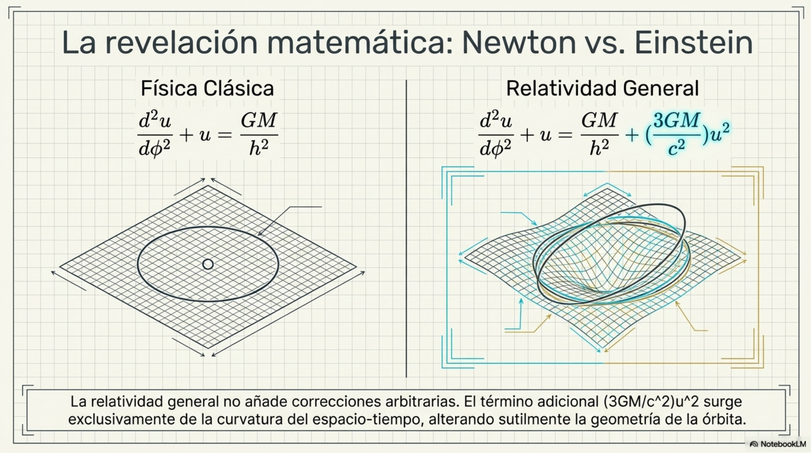

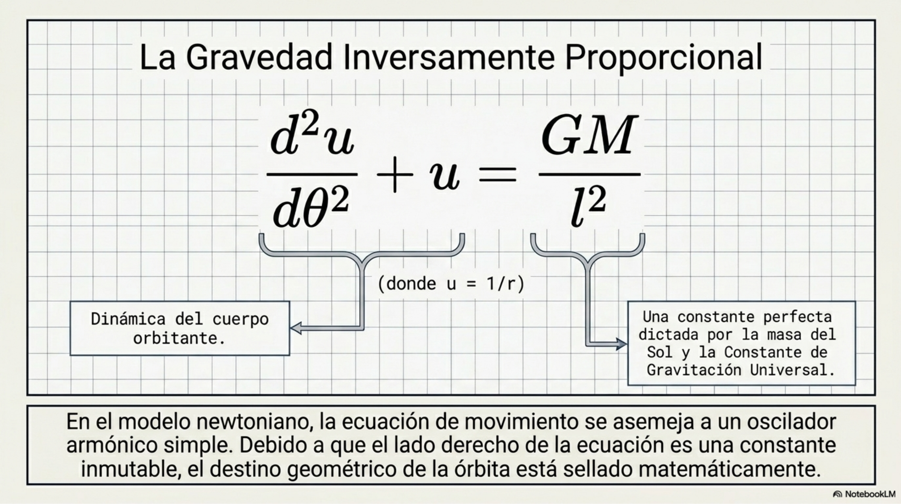

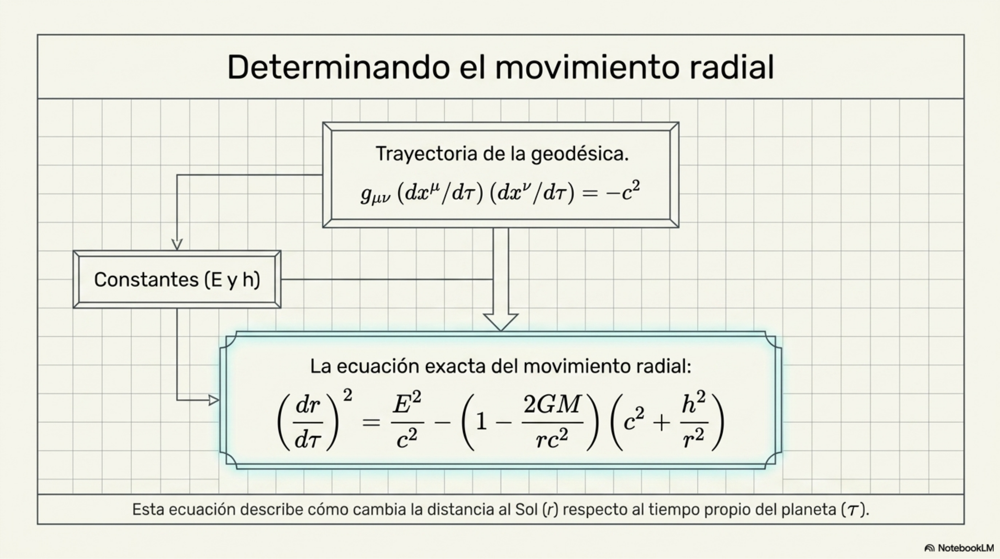

**Determinación de la precesión de la órbita**

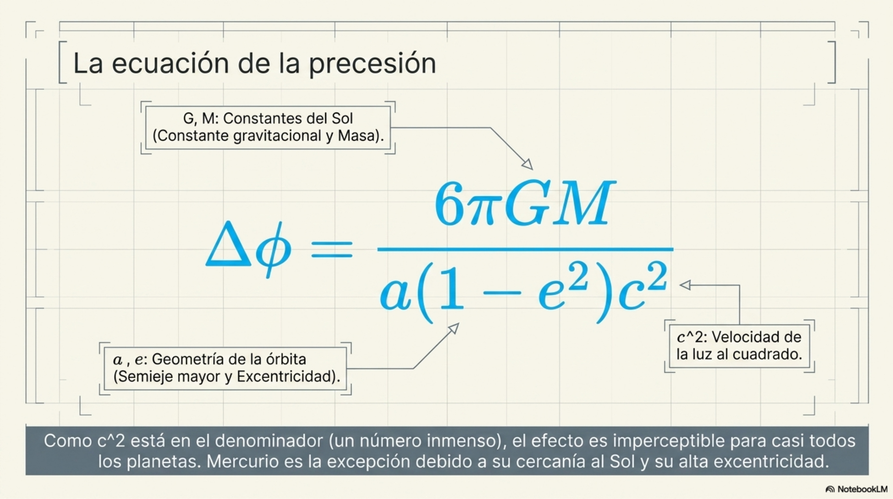

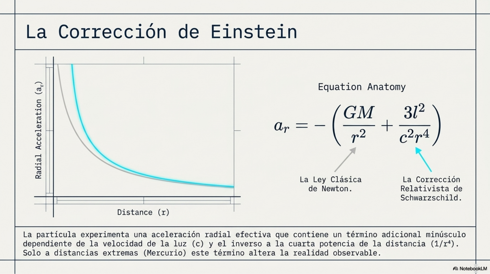

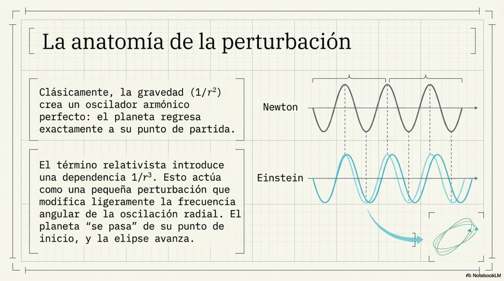

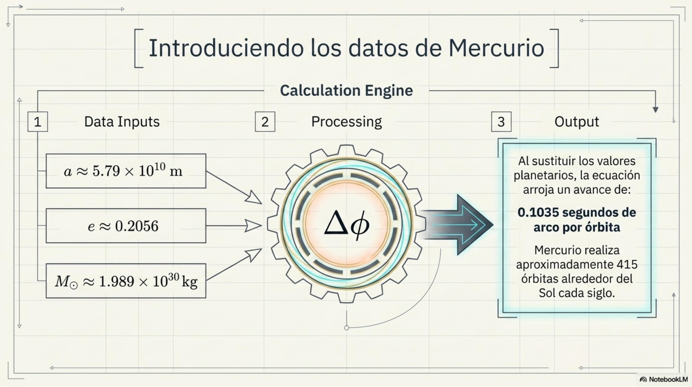

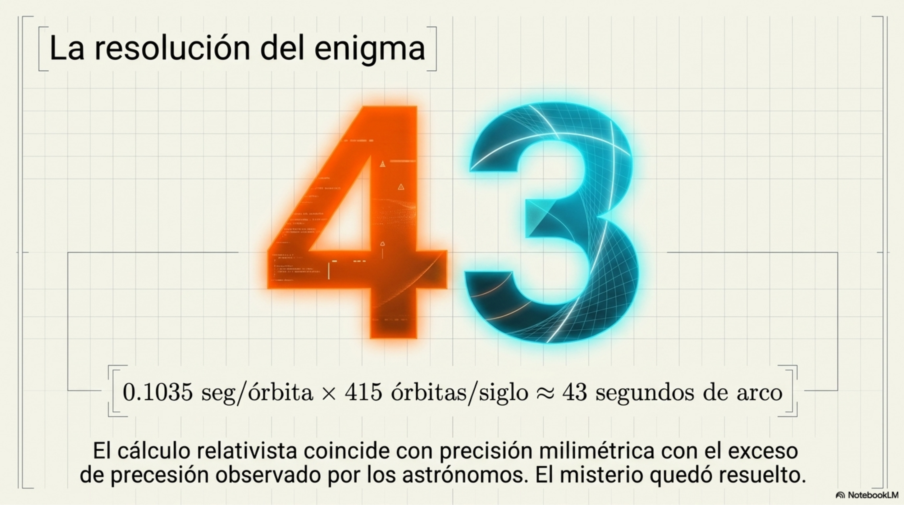

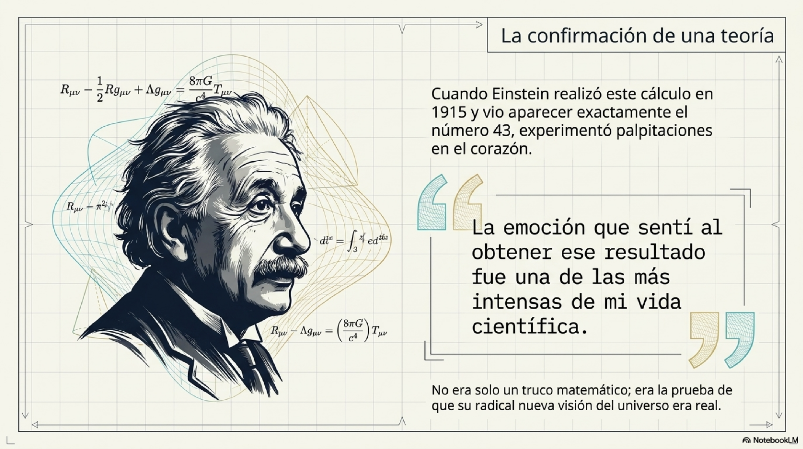

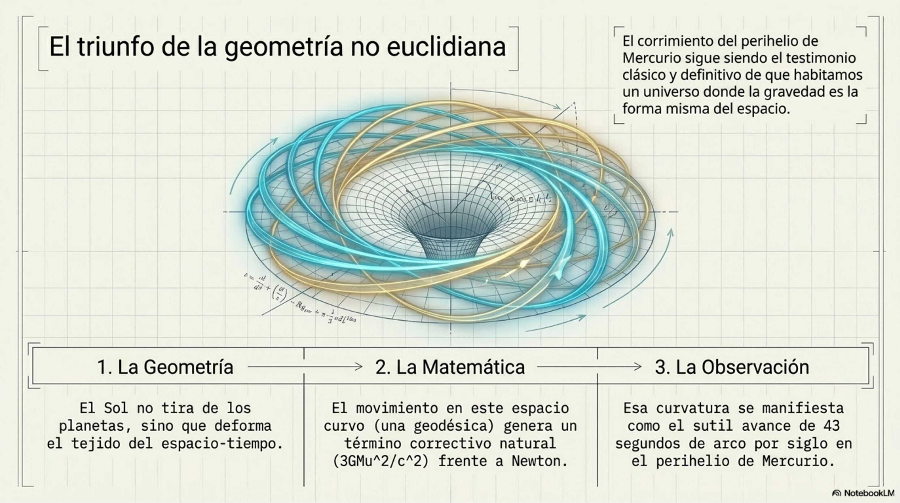

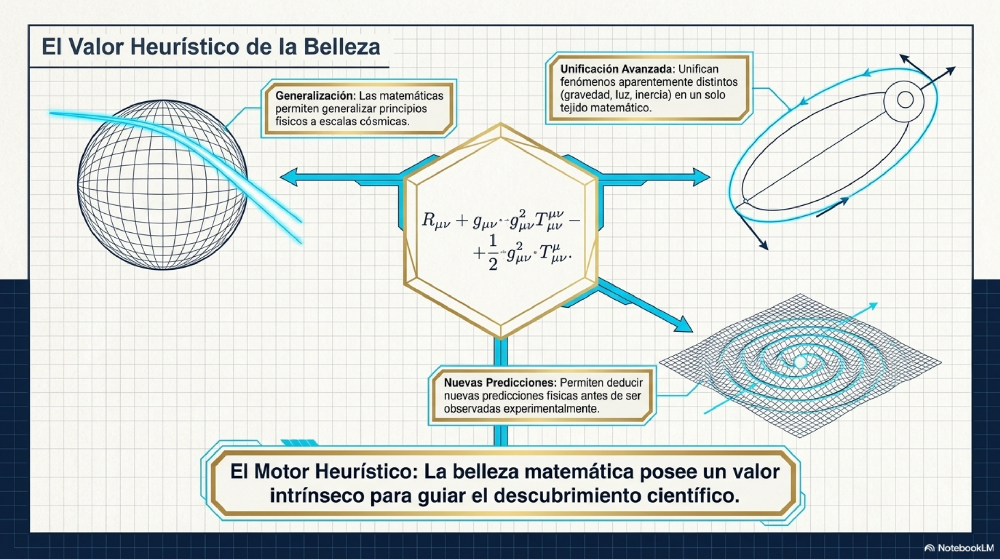

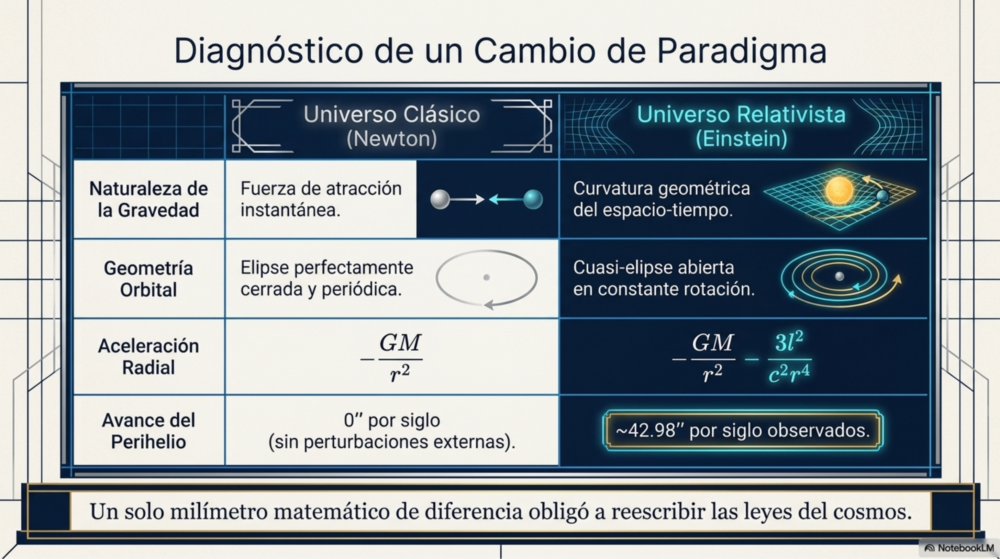

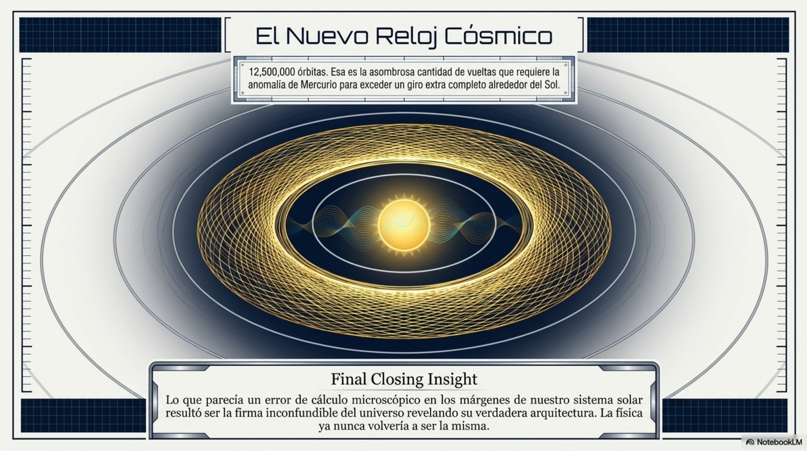

