Este capítulo es una invitación para explorar las trayectorias
conceptuales recorridas por cuatro científicos: Johannes Kepler, Galileo
Galilei, Isaac Newton y Albert Einstein. Las trayectorias en cuestión
tienen que ver con la evolución de sus conocimientos acerca del
movimiento. Tales conocimientos se refieren a dos tipos de condiciones:
las condiciones iniciales de los autores en relación con las preguntas
fundamentales que pudieron haber formulado cada uno de ellos y las
premisas que plantearon como válidas, así como las condiciones en la
frontera de la disciplina que cultivan (la física), en conexión con las
relaciones teoría – experimento y el papel de las matemáticas.

El conocimiento sirve para describir, explicar y predecir; para
representar e interpretar y para transformar e innovar; es generador de
nuevas ideas, razonamientos, pruebas y demostraciones. Promueve el
mejoramiento de productos y servicios, transforma estructuras y afina
procedimientos; es factor de progreso en ciencia, tecnología,
matemáticas, educación y cultura.

Para cada trayectoria conceptual considerada presentamos una tabla
comparativa de lo que pudieron haber sido, primero las respuestas a las
preguntas planteadas y las premisas aceptadas (condiciones iniciales de
los científicos) y segundo, las observaciones a las relaciones teoría –
experimento y el papel de las matemáticas (condiciones en la frontera de
la disciplina).

Como ejemplo práctico del recorrido de una trayectoria conceptual
consideramos el cálculo de órbitas planetarias desde los puntos de vista
de Newton y Einstein. El cálculo del avance del perihelio de la órbita
de Mercurio ha servido para demostrar que la estructura geométrica del
espacio tiempo gobierna el comportamiento físico del movimiento de la
materia en el universo.

Todas las imágenes incluidas en este capítulo han sido generadas por el
Programa NotebookLM basadas en fuentes generadas por el autor.

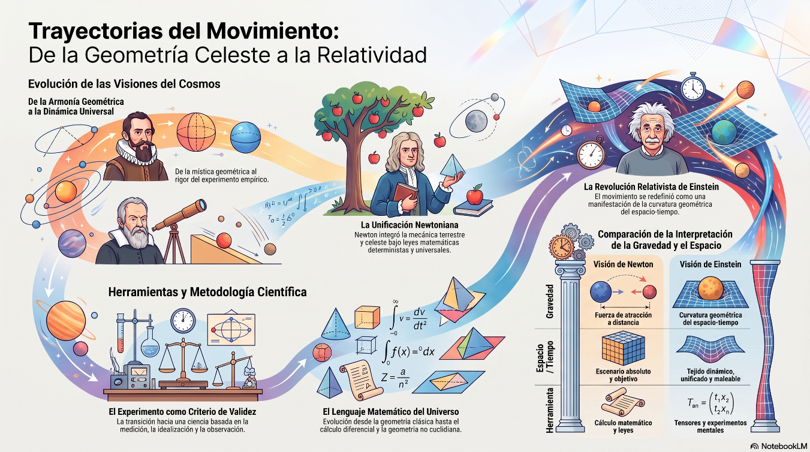

**OBJETIVOS Y CONTENIDOS DE LAS SECCIONES**

**4.1. Trayectorias conceptuales relacionadas con las condiciones
iniciales de los autores**

Describir las trayectorias conceptuales acerca del movimiento que se
conectan con las preguntas que se hicieron Kepler, Galileo, Newton y
Einstein y las premisas en las cuales confiaron.

Descripción de trayectorias conceptuales

Preguntas fundamentales planteadas

Premisas consideradas válidas

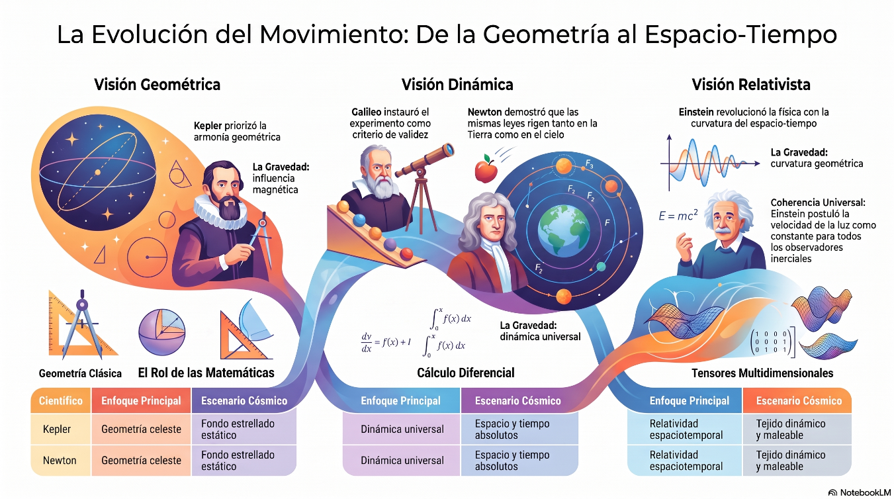

**4.2. Trayectorias conceptuales relacionadas con las condiciones en la
frontera de la disciplina**

Describir las trayectorias conceptuales acerca del movimiento que se
conectan con las interacciones entre la teoría y el experimento y con el
uso de las matemáticas.

La relación teoría – experimento

La importancia de las matemáticas

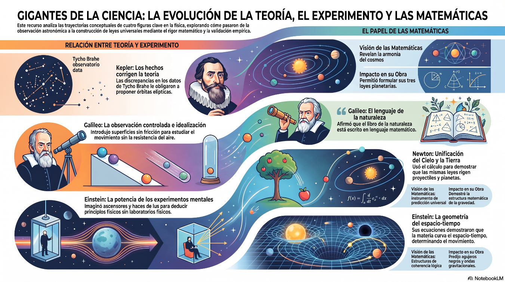

**4.3. Avance del perihelio de la órbita del planeta Mercurio**

Describir las trayectorias conceptuales recorridas por Newton y por
Einstein para explicar la órbita de Mercurio, como ejemplo ilustrativo
de cómo evolucionaron la relación teoría – experimento y la importancia
de las matemáticas en el proceso de geometrización de la mecánica
planetaria.

Observación de la anomalía en la órbita de Mercurio

Determinación de la precesión de la órbita

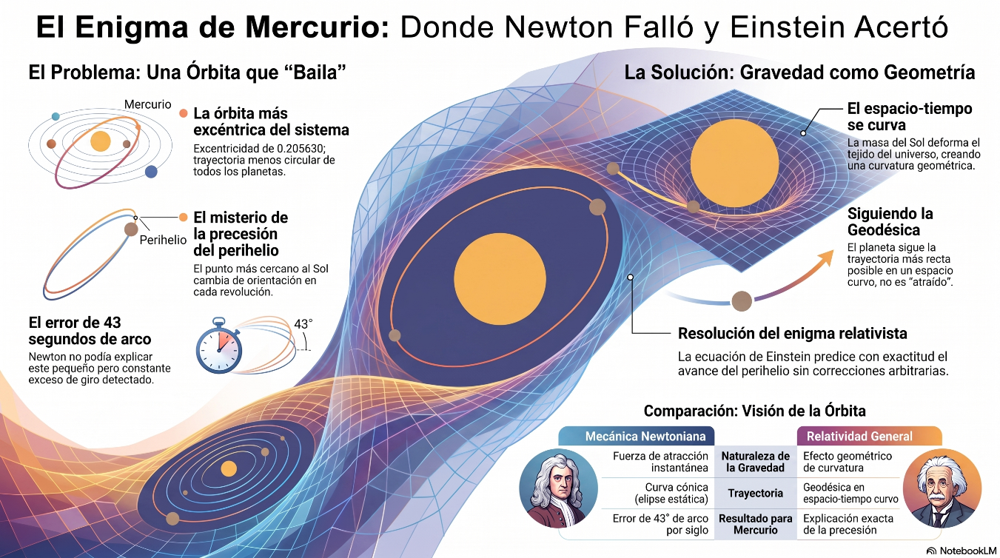

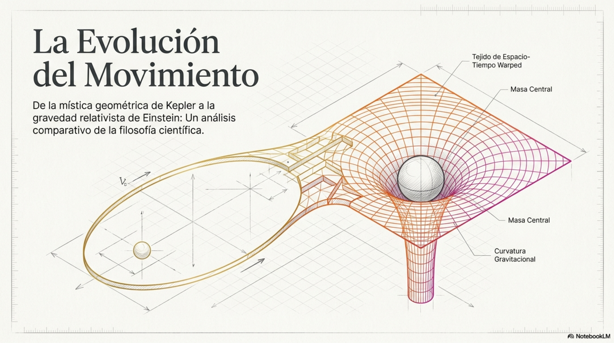

<table>
<colgroup>
<col style="width: 16%" />
<col style="width: 20%" />
<col style="width: 19%" />
<col style="width: 20%" />
<col style="width: 22%" />
</colgroup>
<tbody>
<tr class="odd">
<td colspan="5"><blockquote>

Tabla 4.1. Caracterizaciones de trayectorias conceptuales

</blockquote></td>
</tr>
<tr class="even">
<td>Científico</td>
<td><blockquote>

Kepler

</blockquote></td>
<td><blockquote>

Galileo

</blockquote></td>
<td><blockquote>

Newton

</blockquote></td>
<td><blockquote>

Einstein

</blockquote></td>
</tr>
<tr class="odd">
<td colspan="5"><blockquote>

Según el paradigma vigente

</blockquote></td>
</tr>
<tr class="even">
<td><blockquote>

Enfoque principal

</blockquote></td>
<td><blockquote>

Geometría celeste

</blockquote></td>
<td><blockquote>

Cinemática terrestre

</blockquote></td>
<td><blockquote>

Dinámica universal

</blockquote></td>
<td><blockquote>

Relatividad

espacio-temporal

</blockquote></td>
</tr>
<tr class="odd">
<td><blockquote>

Visión de la gravedad

</blockquote></td>
<td><blockquote>

Influencia magnética solar

</blockquote></td>
<td><blockquote>

Aceleración local constante

</blockquote></td>
<td><blockquote>

Fuerza de atracción a distancia

</blockquote></td>
<td><blockquote>

Curvatura geométrica del espacio tiempo

</blockquote></td>
</tr>
<tr class="even">
<td><blockquote>

Escenario cósmico

</blockquote></td>
<td><blockquote>

Fondo estrellado estático

</blockquote></td>
<td><blockquote>

Marco de

referencia inercial

</blockquote></td>
<td><blockquote>

Espacio y tiempo absolutos

</blockquote></td>
<td><blockquote>

Tejido dinámico y maleable

</blockquote></td>
</tr>
<tr class="odd">
<td><blockquote>

Herramienta clave

</blockquote></td>
<td><blockquote>

Observación y geometría

</blockquote></td>
<td><blockquote>

El experimento mental

</blockquote></td>
<td><blockquote>

El cálculo matemático

</blockquote></td>
<td><blockquote>

Tensores y experimentos

mentales

</blockquote></td>
</tr>
<tr class="even">
<td colspan="5"><blockquote>

Según la evolución de las premisas

</blockquote></td>
</tr>
<tr class="odd">
<td><blockquote>

Metodología

</blockquote></td>
<td><blockquote>

Observación

empírica e ideas preconcebidas

</blockquote></td>
<td><blockquote>

El experimento es mayor que la autoridad

</blockquote></td>
<td><blockquote>

La

experimentación es esencial

</blockquote></td>
<td><blockquote>

Coherencia para todo observador inercial

</blockquote></td>
</tr>
<tr class="even">
<td><blockquote>

Matemáticas

</blockquote></td>
<td><blockquote>

Orden armónico inherente

</blockquote></td>
<td><blockquote>

Regularidades medibles

</blockquote></td>
<td><blockquote>

Leyes universales deterministas

</blockquote></td>
<td><blockquote>

Búsqueda de unidad conceptual

</blockquote></td>
</tr>
<tr class="odd">
<td><blockquote>

Espacio -Tiempo

</blockquote></td>
<td><blockquote>

Escenario celestial

</blockquote></td>
<td><blockquote>

Escenario físico implícito

</blockquote></td>
<td><blockquote>

Escenario absoluto y objetivo

</blockquote></td>
<td><blockquote>

Tejido unificado e indisoluble

</blockquote></td>
</tr>
<tr class="even">
<td><blockquote>

Dinámica - Gravedad

</blockquote></td>
<td><blockquote>

Las causas físicas mueven a los astros

</blockquote></td>
<td><blockquote>

El reposo es un movimiento uniforme con velocidad nula

</blockquote></td>
<td><blockquote>

El movimiento lo describen las

acciones de las fuerzas

</blockquote></td>
<td><blockquote>

La gravedad es una manifestación de una geometría física

</blockquote></td>
</tr>
<tr class="odd">
<td colspan="5"><blockquote>

Según el diagnóstico epistemológico

</blockquote></td>
</tr>
<tr class="even">
<td><blockquote>

Papel de la teoría

</blockquote></td>
<td><blockquote>

Ajustarse a los hechos

observados

</blockquote></td>
<td><blockquote>

Guiar la observación hacia la

idealización

</blockquote></td>
<td><blockquote>

Organizar y unificar

fenómenos

</blockquote></td>
<td><blockquote>

Construcción

intelectual en busca de coherencia

</blockquote></td>
</tr>
<tr class="odd">
<td><blockquote>

Función del experimento

</blockquote></td>
<td><blockquote>

Obligar a abandonar ideas tradicionales

</blockquote></td>
<td><blockquote>

Criterio de validez

descubridor de regularidades

</blockquote></td>
<td><blockquote>

Descubrir relaciones y verificar matemáticas

</blockquote></td>
<td><blockquote>

Criterio final transformador de conceptos

</blockquote></td>
</tr>
<tr class="even">
<td><blockquote>

Naturaleza de la observación

</blockquote></td>
<td><blockquote>

Interacción

constante con la hipótesis

</blockquote></td>
<td><blockquote>

La organización debe ser racional

</blockquote></td>
<td><blockquote>

Interacción

continua con la deducción

</blockquote></td>
<td><blockquote>

Guía profunda con la teoría

</blockquote></td>
</tr>
<tr class="odd">
<td colspan="5"><blockquote>

Según la visión sintética

</blockquote></td>
</tr>
<tr class="even">
<td><blockquote>

Premisas asumidas

</blockquote></td>
<td><blockquote>

Armonía y simetría platónicas

</blockquote></td>
<td><blockquote>

Mecanismos puramente objetivos

</blockquote></td>
<td><blockquote>

Espacio y tiempo absolutos

</blockquote></td>
<td><blockquote>

Equivalencias y dinámica en 4D

</blockquote></td>
</tr>
<tr class="odd">
<td><blockquote>

Método de validación

</blockquote></td>
<td><blockquote>

Ajuste visual a datos

observacionales

</blockquote></td>
<td><blockquote>

Medición

experimental asintótica

</blockquote></td>
<td><blockquote>

Determinismo y

ecuaciones analíticas

</blockquote></td>
<td><blockquote>

Revisión empírica y constancia de la

velocidad de la luz

</blockquote></td>
</tr>
<tr class="even">
<td><blockquote>

Herramientas matemáticas

</blockquote></td>
<td><blockquote>

Geometría y aritmética

clásicas

</blockquote></td>
<td><blockquote>

Relaciones

algebraicas

</blockquote></td>
<td><blockquote>

Cálculo diferencial euclidiano

</blockquote></td>
<td><blockquote>

Geometría no

euclidiana (cuatro dimensiones)

</blockquote></td>
</tr>
<tr class="odd">
<td><blockquote>

Logros del sistema

</blockquote></td>
<td><blockquote>

Leyes cinemáticas sin causa física

</blockquote></td>
<td><blockquote>

Ley de la inercia y método

científico

</blockquote></td>
<td><blockquote>

Unificación de la mecánica con la gravitación

</blockquote></td>
<td><blockquote>

Relatividad y síntesis

electromecánica

</blockquote></td>
</tr>
</tbody>
</table>

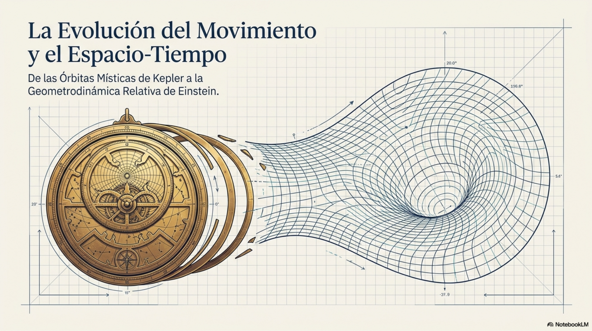

**4.1. Trayectorias conceptuales relacionadas con las condiciones
iniciales de los autores**

Esta sección 4.1 se refiere a dos trayectorias del conocimiento
conectadas con las condiciones iniciales que describen dos
características de los cuatro físicos considerados: las preguntas que se
hicieron y las premisas en las cuales confiaron. En la siguiente sección
4.2 tratamos acerca de las condiciones en la frontera de la disciplina
que conciernen a la relación teoría – experimento y el papel de las
matemáticas. Todas las imágenes que acompañan el texto han sido
generadas por el programa Notebook LM.

Para empezar, sin pretender entrar en definiciones de diccionarios o de
tratados filosóficos, a continuación indicamos qué entenderemos por
conocimiento.

Adquirir y desarrollar conocimientos no consiste en la acumulación de
datos o información. El conocimiento es una construcción activa de
significados; es una creencia verdadera que está suficientemente
justificada por razones objetivamente suficientes.

El conocimiento es una representación comprensiva de la realidad que una
persona o una comunidad construye mediante la experiencia, la reflexión,
la investigación y la interacción social; permite interpretar, explicar
y actuar sobre el mundo.

El conocimiento es la acción y el efecto del acto de conocer. Conocer es
entender la naturaleza, las cualidades y las relaciones de las cosas.
Conocer implica y con frecuencia integra, procesos tales como observar,
comparar, analizar, inferir, explicar, relacionar conceptos, evaluar
evidencias y finalmente, reflexionar sobre lo aprendido, que en eso
consiste la metacognición.

Como referencia obligada del tema, recomendamos el libro de Luis Villoro
*Creer, saber, conocer*\*\*, dedicado justamente al conocimiento. En
particular, conviene citar el párrafo donde aclara las diferencias entre
filosofía y ciencia (p. 12): “*Porque la filosofía no es una ciencia. La
filosofía no descubre nuevos hechos ni propone leyes que expliquen su
comportamiento. La filosofía analiza, clarifica y sistematiza conceptos.
Al hacerlo, pone en cuestión las creencias recibidas, reordena nuestros
saberes y puede reformar nuestros marcos conceptuales. El análisis de
los conceptos epistémicos es tarea de la filosofía, la explicación de
los hechos de conocimiento, asunto de la ciencia; la pregunta por la
verdad y justificación de nuestras creencias compete a la filosofía, la
pregunta por su génesis y resultados, a la ciencia.”*

\*\* Luis Villoro, *Creer, saber, conocer*. Siglo XXI Editores, México,
Primera edición (1989).

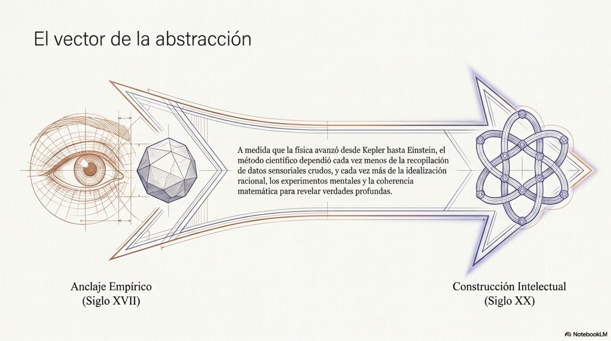

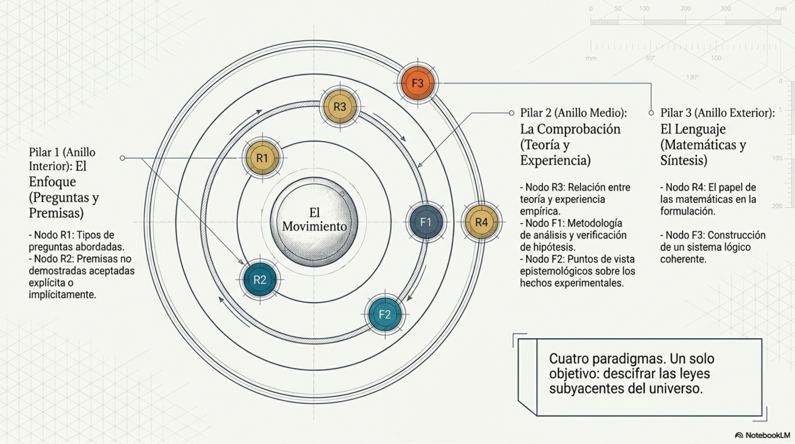

**Descripción de trayectorias conceptuales**

En este capítulo nos concentraremos en las trayectorias conceptuales
conectadas con los conocimientos acerca del movimiento que en su momento
recorrieron Johannes Kepler (1571-1630), Galileo Galilei (1564-1642),
Isaac Newton (1643-1727) y Albert Einstein (1879-1955).

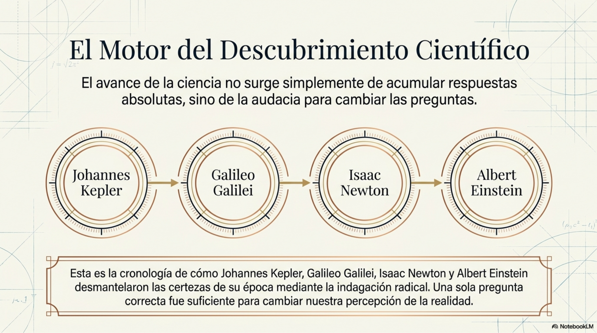

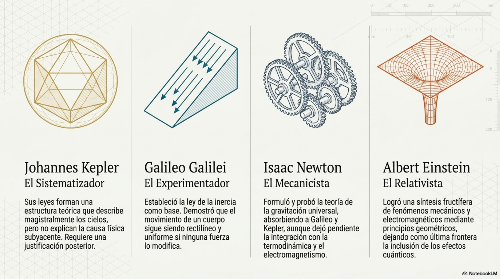

Las trayectorias conceptuales que pudieron haber recorrido tales
científicos fueron moduladas por las propias visiones de la realidad
física y por los paradigmas vigentes que se aplicaron en la época para
explicar los movimientos en la naturaleza.

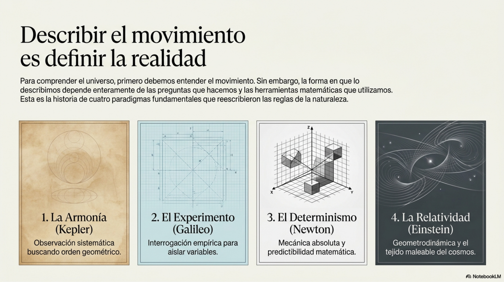

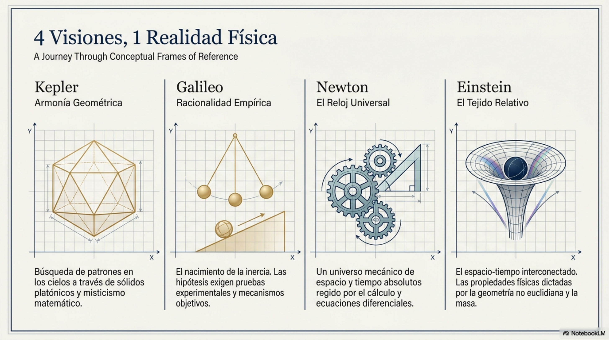

COLOCAR EL SIGUIENTE CUADRO CON LA TRADUCCIÓN .ENCIMA DE LA FRASE EN
INGLÉS

Las dos primeras secciones de este capítulo tratan de la evolución en
los conocimientos acerca del movimiento de una cuarteta de científicos
(Kepler, Galileo, Newton y Einstein) y describen esas evoluciones en
relación con cuatro pilares del marco de análisis. Estos pilares se
refieren a las preguntas fundamentales planteadas y a las premisas
consideradas válidas (que se verán en esta sección 4.1) así como a las
trayectorias que relacionan teoría – experimento y consideran el papel
de las matemáticas (que se verán en la siguiente sección 4.2).

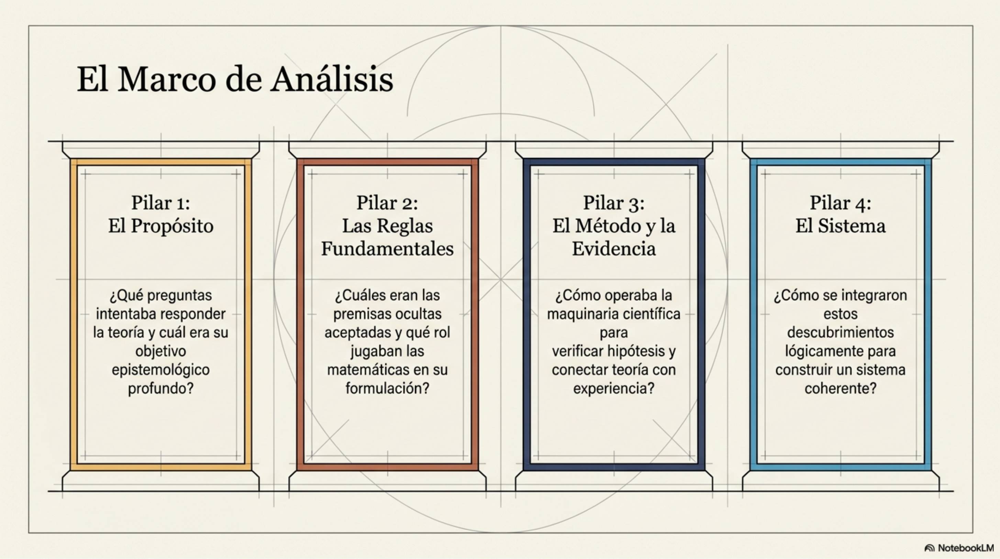

Las cuatro trayectorias que serán analizadas según su correspondiente
pilar darán una visión de cómo evolucionó en cada físico su comprensión
y puesta en práctica del sentido y alcances de lo que son la explicación
y los descubrimientos científicos.

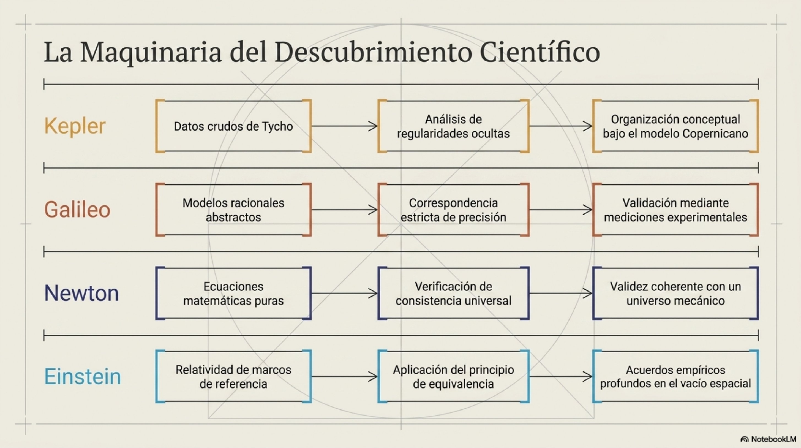

Las comparaciones entre las 16 trayectorias analizadas sirven para
caracterizar la obra de cada científico: Kepler por su mística
geométrica, Galileo por su rigor empírico, Newton por su determinismo
dinámico y Einstein por su relatividad estructural.

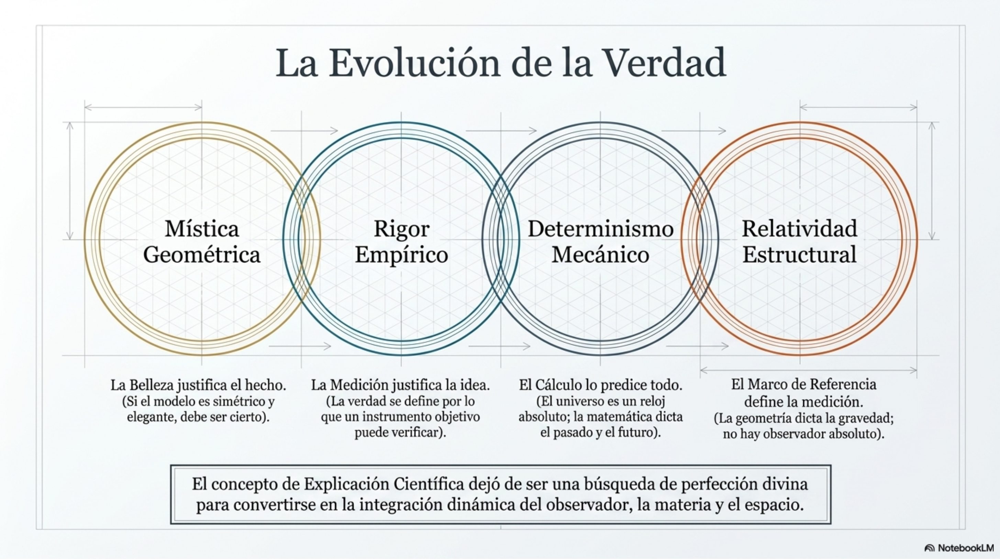

**Preguntas fundamentales planteadas**

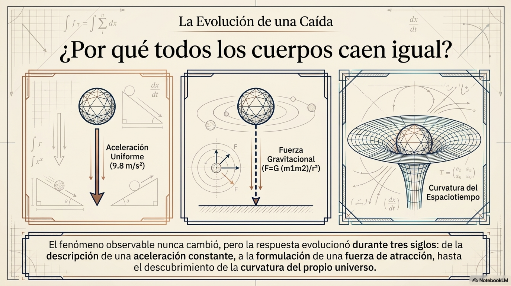

La siguiente Tabla 4.2 presenta en forma sintética lo que pudieron
haberse preguntado cada uno de los cuatro científicos respecto del
movimiento. Es una comparación de cuatro formas diferentes de contestar
una misma pregunta ¿qué estoy tratando de entender?

<table>
<colgroup>
<col style="width: 25%" />
<col style="width: 25%" />
<col style="width: 25%" />
<col style="width: 25%" />
</colgroup>
<thead>
<tr class="header">
<th colspan="4">Tabla 4.2. Preguntas fundamentales</th>
</tr>
</thead>
<tbody>
<tr class="odd">
<td>Kepler</td>
<td>Galileo</td>
<td>Newton</td>
<td>Einstein</td>
</tr>
<tr class="even">
<td>
¿Cuál es la verdadera trayectoria de los planetas?

¿Por qué los planetas cambian de velocidad?

¿Qué relación existe entre los planetas?

¿Qué causa el movimiento planetario?

¿Cómo conciliar matemáticas y realidad física?
</td>
<td>
¿Cómo caen los cuerpos?

¿Qué significa que un cuerpo se acelere?

¿Qué ocurre cuando no actúan obstáculos?

¿Cómo se combinan los distintos movimientos?

¿Puede la naturaleza describirse matemáticamente?

¿Qué papel tiene el experimento en la ciencia?
</td>
<td>
¿Qué causa los cambios de movimiento?

¿Por qué los planetas permanecen en órbita?

¿Existe una ley universal de la gravitación?

¿Cómo se relacionan fuerza, masa y aceleración?

¿Por qué persiste el movimiento?

¿Cómo interactúan mutuamente los cuerpos?
</td>
<td>
¿Cómo se ve la luz desde distintos sistemas en movimiento?

¿Son absolutos el espacio y el tiempo?

¿Qué permanece invariante en la naturaleza?

¿Cómo se relacionan masa y energía?

¿Qué es realmente la gravedad?

¿Qué ocasiona la caída de los cuerpos?

¿Puede la geometría describir la gravitación?
</td>
</tr>
</tbody>
</table>

A continuación, presentamos las aportaciones al conocimiento de la
mecánica clásica de Kepler, Galileo y Newton y después las aportaciones
de Einstein, ya en el contexto de la física moderna.

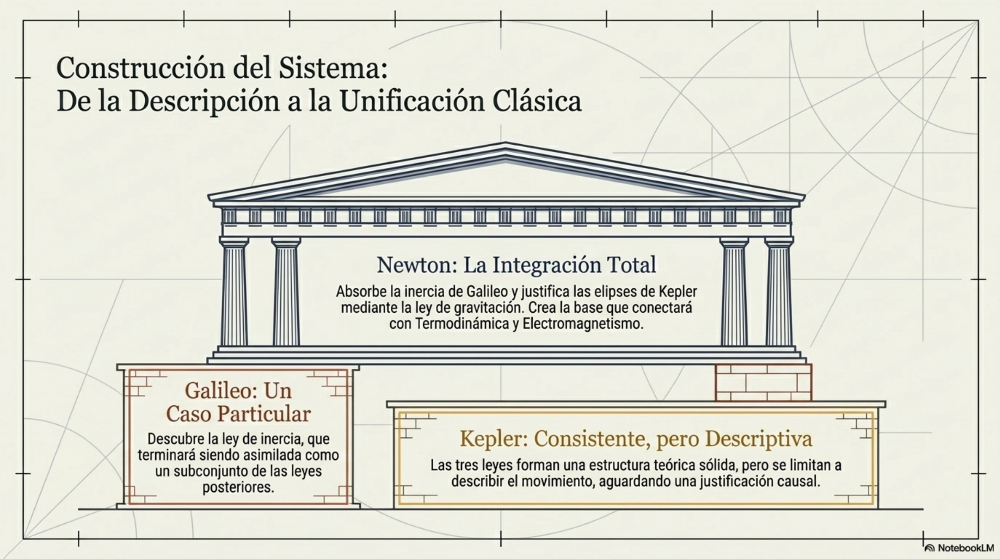

**Johannes Kepler** partió de las observaciones realizadas por Tycho
Brahe para luego formular sus tres leyes: de las órbitas, de las áreas y
de los períodos. Seguramente se preguntó si los planetas realmente
describían ciclos y epiciclos o si existían otras curvas matemáticas que
representaran mejor esas trayectorias alrededor del Sol. Además, como
los planetas parecían moverse con mayor rapidez en ciertas regiones,
sería cuestión de averiguar si existía alguna relación entre la
velocidad de traslación y la distancia al Sol de cada planeta. Se
preguntó qué tipo de fuerza producía el movimiento de los planetas y si
existía un orden universal que respondiera a una armonía matemática; de
esa manera se demostraría qué la geometría expresaba la estructura real
del universo.

**Galileo Galilei** cuestionó la idea aristotélica de que los cuerpos
pesados caen más rápido que los ligeros y por eso buscó una descripción
cuantitativa del movimiento de caída libre. También se preguntó cómo
sería el movimiento de un cuerpo sin fricción y cómo se combinan los
desplazamientos verticales y horizontales de un proyectil en movimiento
parabólico. Concluyó que el libro de la naturaleza está escrito en
lenguaje matemático y que ciertas regularidades observadas podían
explicarse midiendo primero y luego usando la geometría. Al preguntarse
cómo verificar si una idea física era correcta, inauguró la era de la
física experimental propiamente dicha y para ello desarrolló
experimentos con planos inclinados, péndulos, esferas rodantes, …

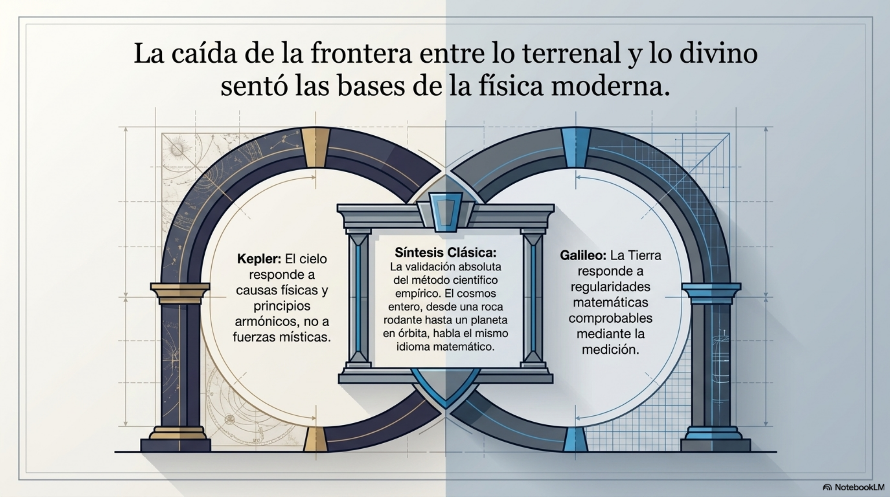

**Isaac Newton** pudo haberse preguntado cuál es la causa de la
aceleración y si existía alguna relación cuantitativa entre fuerza y
cambio de velocidad. Indagó en las causas de movimientos tales como el
de la Luna alrededor de la Tierra y de los planetas alrededor del Sol.
Buscó formular una ley matemática universal, la ley de gravitación
universal, para expresar la atracción entre dos cuerpos depende de la
distancia que les separa y de sus masas. Cuestionó las condiciones para
que un cuerpo siga moviéndose después de que cesa la acción de fuerzas
externas. También indagó acerca de la existencia de una relación de
reciprocidad en las interacciones mutuas entre dos cuerpos.

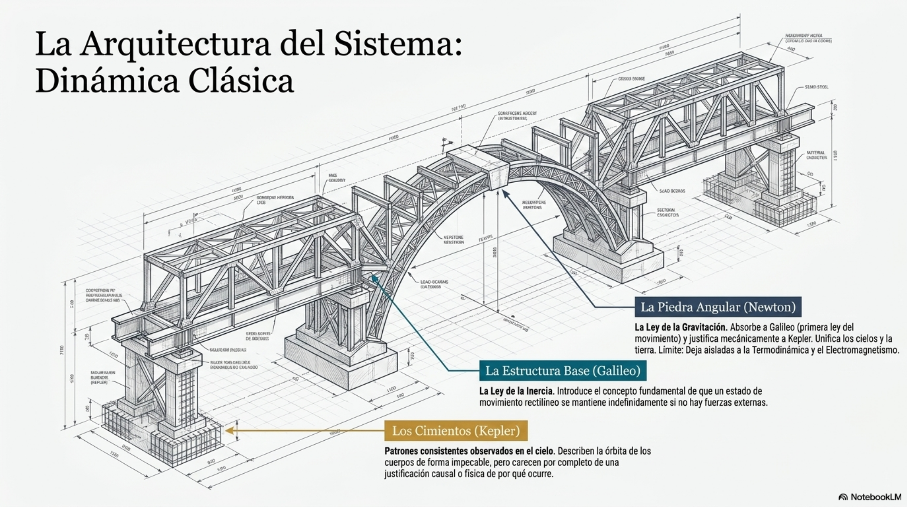

**Albert Einstein** se preguntó cómo describir el movimiento para
velocidades cercanas a la de la luz y si la gravitación tendría que
integrarse a una nueva geometría del espacio y del tiempo. Indagó si la
velocidad de la luz dependía del movimiento del observador y en
consecuencia si el espacio y el tiempo tendrían que ser relativos.
Averiguó si las leyes del electromagnetismo eran diferentes al cambiar
de sistema de referencia y tomó en cuenta nuevas relaciones de
transformación de las coordenadas de espacio y tiempo para asegurarse
que tales leyes resultaran invariantes frente a tales cambios.
Estableció la equivalencia entre masa y energía. Buscó la existencia de
la relación entre inercia y gravitación que le llevaría al principio de
equivalencia. Propuso que la velocidad de la luz en el vacío es
constante para todos los observadores inerciales y geometrizó la
mecánica.

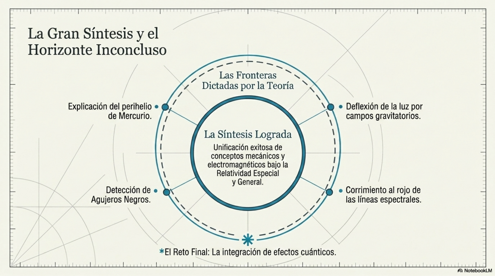

Lo anterior puede resumirse en el siguiente cuadro y en un diagrama que
representa la evolución del pensamiento acerca del movimiento.

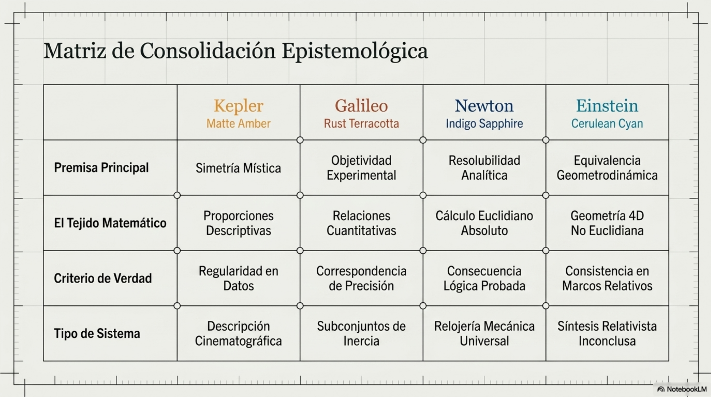

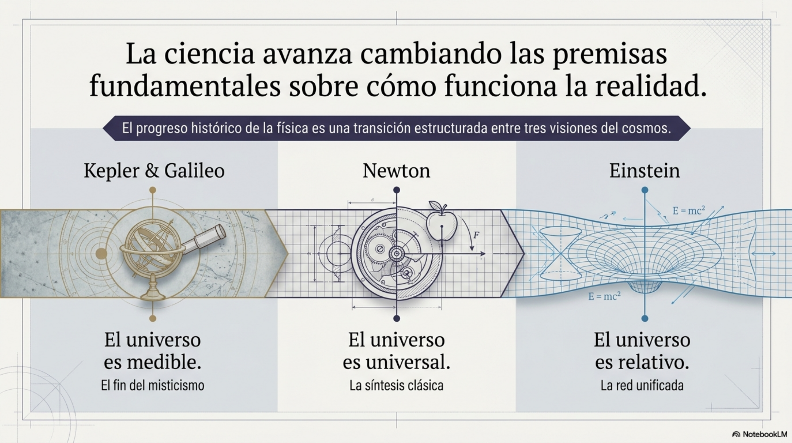

**Premisas consideradas válidas**

Preguntarse qué creía cada uno de los físicos en cuestión antes de hacer
sus cálculos requiere averiguar que premisas consideraron válidas, lo
cual se muestra esquemáticamente en la Tabla 4.3.

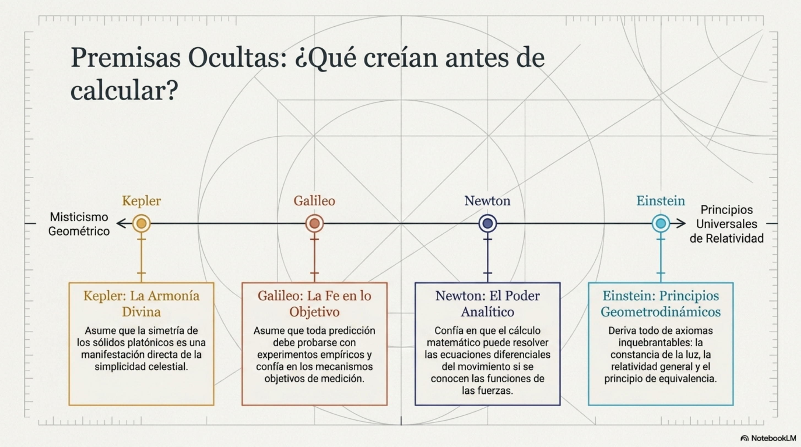

<table>
<colgroup>
<col style="width: 23%" />
<col style="width: 25%" />
<col style="width: 26%" />
<col style="width: 23%" />
</colgroup>
<thead>
<tr class="header">
<th colspan="4">Tabla 4.3. Premisas asumidas como válidas</th>
</tr>
</thead>
<tbody>
<tr class="odd">
<td>Kepler</td>
<td>Galileo</td>
<td>Newton</td>
<td>Einstein</td>
</tr>
<tr class="even">
<td>
El universo posee un orden matemático.

El Sol ocupa una posición privilegiada.

Las observaciones precisas tienen prioridad sobre las ideas
preconcebidas.

El movimiento celeste tiene causas físicas.

La naturaleza actúa mediante principios simples y armónicos.
</td>
<td>
La naturaleza posee regularidades matemáticas.

La observación y el experimento tienen prioridad sobre la opinión de
los expertos.

El movimiento puede estudiarse aisladamente.

El reposo y el movimiento uniforme son estados equivalentes.

Las mismas leyes físicas valen en la Tierra y en el cielo.

El conocimiento científico debe construirse a partir de
mediciones.
</td>
<td>
La naturaleza está gobernada por leyes matemáticas
universales.

Las mismas leyes valen en la Tierra y en el cielo.

El espacio y el tiempo existen objetivamente.

El movimiento puede describirse en términos de acciones de
fuerzas.

Los fenómenos complejos pueden reducirse a principios simples.

La experimentación y la observación son esenciales.
</td>
<td>
Las leyes físicas deben ser las mismas para todos los
observadores inerciales.

La velocidad de la luz es constante.

El espacio y el tiempo forman una unidad.

La geometría tiene realidad física.

La gravitación no es una fuerza ordinaria es una propiedad del
espacio tiempo.

La experiencia física debe ser coherente para todos los
observadores.

La física debe poseer unidad conceptual.
</td>
</tr>
</tbody>
</table>

En lo que sigue comentamos algunas consideraciones individuales respecto
de lo que cada uno pudo haber supuesto.

**Kepler** supuso la existencia de una naturaleza organizada
racionalmente y de unas relaciones matemáticas que revelaban el plan del
cosmos; además, aceptaba el modelo heliocéntrico de Nicolaus Copernicus.
Consideró que una teoría debe modificarse si hay contradicción en los
datos, que el cosmos estaba regido por relaciones armónicas y que los
movimientos planetarios no eran construcciones geométricas sino
fenómenos físicos reales que requerían explicación causal. Detrás de su
complejidad aparente debía existir una simplicidad matemática profunda.

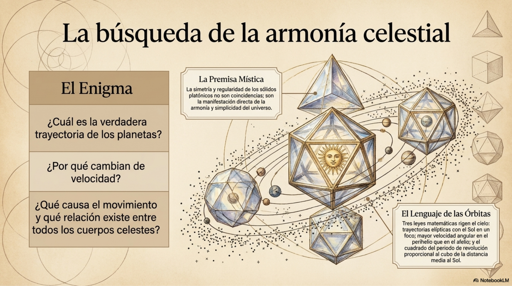

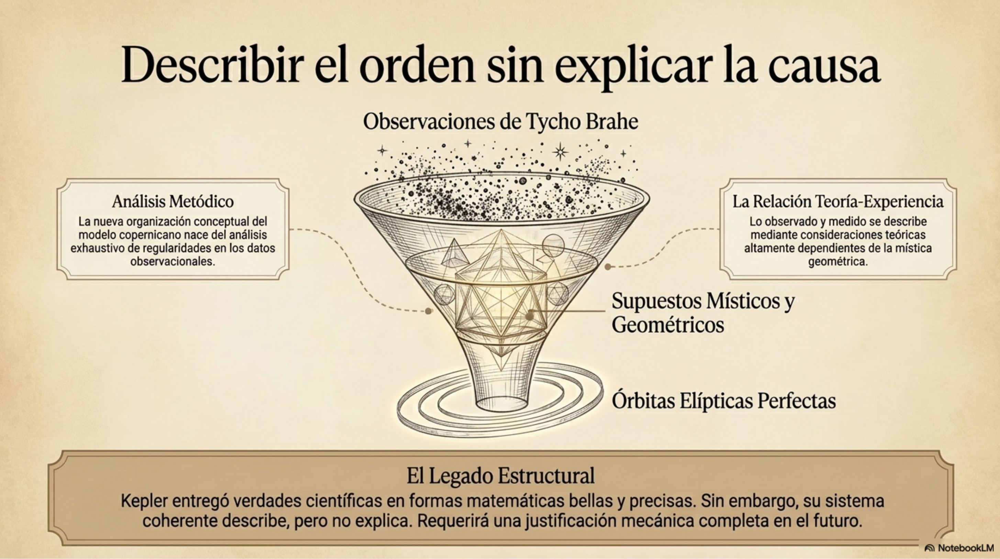

**Galileo** afirmó que los fenómenos físicos obedecen leyes
cuantificables que se expresan mediante relaciones matemáticas; medir
resultaba ser esencial. Consideró que la verdad física no dependía de
autoridades sino de la experiencia observable y verificable y que para
ello debían analizarse experiencias en condiciones aproximadas de mayor
simplificación como la eliminación de fricciones y resistencias. Pensó
que un cuerpo puede continuar moviéndose indefinidamente sin necesidad
de fuerza adicional y que no había separación entre los movimientos
terrestres y los celestes porque todos los movimientos obedecen
principios comunes.

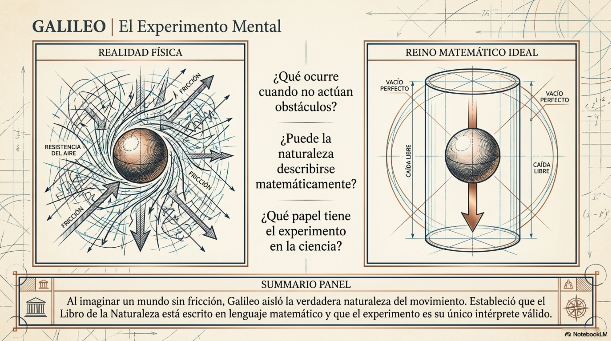

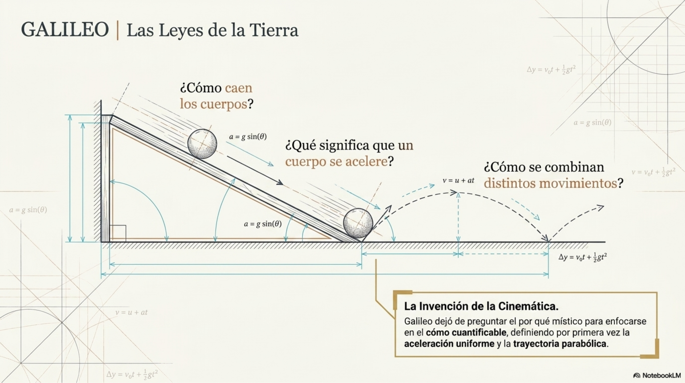

**Newton** consideró la existencia de un orden racional en un universo
en el que las matemáticas describen exactamente algunas leyes físicas
universales y necesarias. Supuso que espacio y tiempo eran absolutos e
independientes, que todo cambio en el estado de movimiento era debido a
la acción de fuerzas y que un gran número de fenómenos naturales podían
explicarse en términos de pocas leyes fundamentales. Además, pensó que
las leyes deben concordar con la experiencia, evitando toda hipótesis
que no sea verificable, con lo cual rechazaba las especulaciones
metafísicas no comprobables.

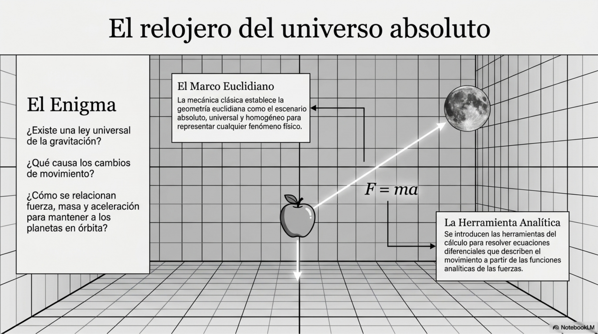

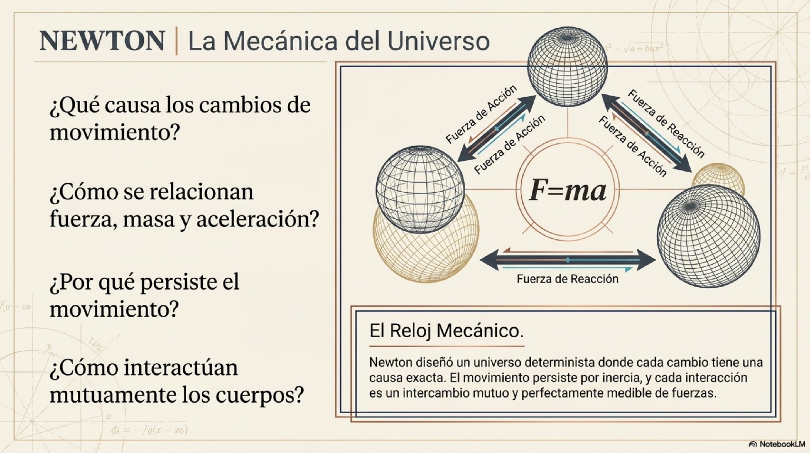

**Einstein** conservó y amplió el principio de relatividad de Galileo
estableciendo la condición de que ningún sistema inercial era
privilegiado. Además, redefinió espacio y tiempo y postuló que todos los
observadores deberán medir la misma velocidad de la luz,
independientemente de su movimiento relativo. Consideró que la fuerza de
gravedad se debía a la deformación del espacio-tiempo causada por
grandes concentraciones de masa. Buscó la unificación de diversos
fenómenos bajo principios generales, tanto entre la mecánica y el
electromagnetismo (relatividad especial) como entre la gravitación y la
geometría (relatividad general).

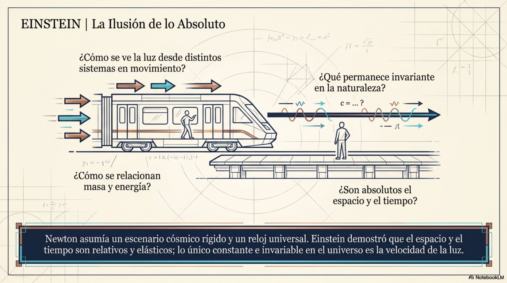

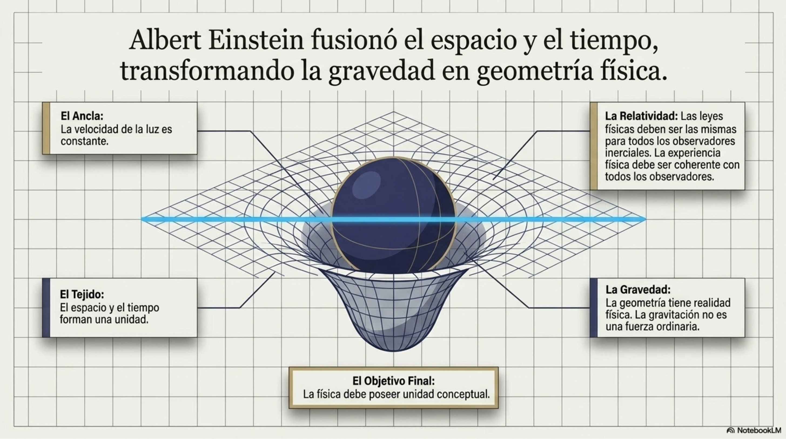

La siguiente diapositiva expresa la última etapa en la construcción del
edificio conceptual de la mecánica.

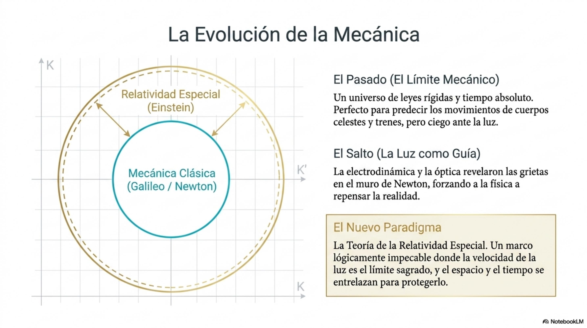

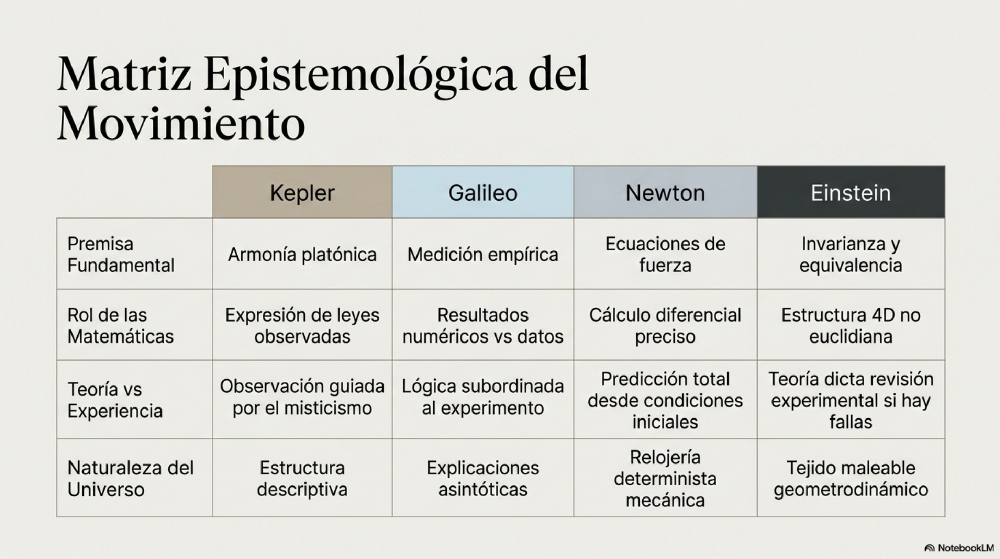

**4.2. Trayectorias conceptuales relacionadas con las condiciones en la
frontera de la disciplina**

Esta sección 4.2 se refiere a las trayectorias conceptuales que tienen
que ver con las condiciones en la frontera de la disciplina, las cuales
conciernen a la relación teoría – experimento y al papel de las
matemáticas. De manera análoga a la sección anterior, esta sección
comprende una tabla que contiene una selección de puntos de vista
respecto del tema al que se refiere cada trayectoria y una serie de
imágenes conectadas con observaciones que pudieron haber emitido cada
uno de los científicos respecto del tema en consideración. Las tablas
comparan trayectorias conceptuales individuales, las imágenes aportan
detalles de trayectorias propias por separado.

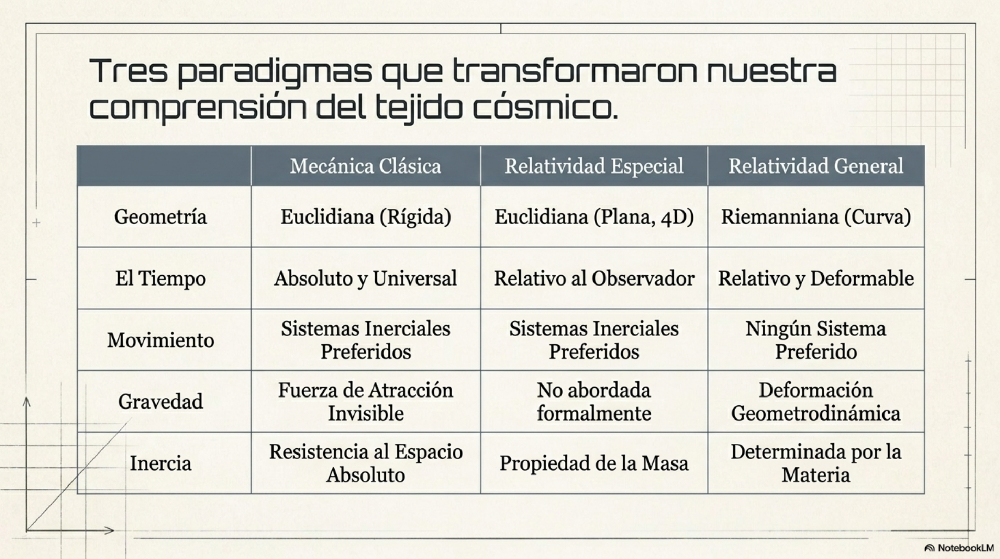

**La relación teoría – experimento**

La siguiente Tabla 4.4 contiene posibles opiniones de los cuatro
científicos respecto de la relación teoría – experimento y algunas
referencias específicas a trabajos propios de cada uno de los cuatro
científicos considerados. Más adelante trataremos de la trayectoria
conceptual conectada con la importancia de las matemáticas.

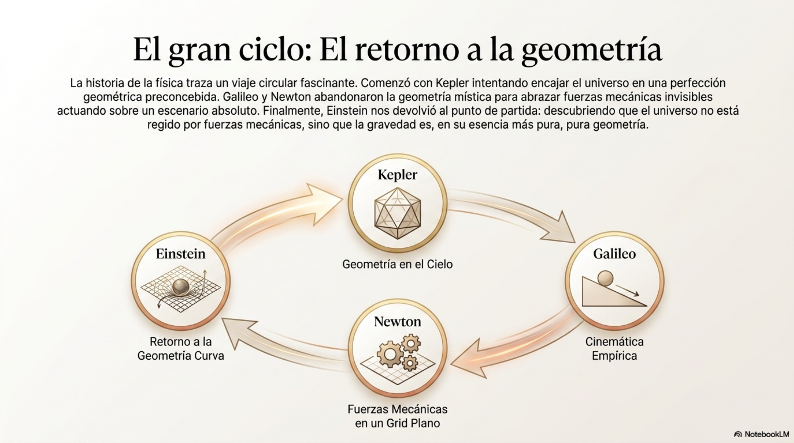

<table>
<colgroup>
<col style="width: 24%" />
<col style="width: 22%" />
<col style="width: 26%" />
<col style="width: 25%" />
</colgroup>
<thead>
<tr class="header">
<th colspan="4">Tabla 4.4. Relación entre teoría y experimento</th>
</tr>
</thead>
<tbody>
<tr class="odd">
<td>Kepler</td>
<td>Galileo</td>
<td>Newton</td>
<td>Einstein</td>
</tr>
<tr class="even">
<td>
La teoría debe ajustarse a los hechos observados.

La observación puede obligar a abandonar ideas tradicionales.

La teoría debe buscar causas reales.

Existe una interacción constante entre hipótesis y
observación.
</td>
<td>
El experimento es el criterio de validez de la teoría.

La experiencia debe organizarse racionalmente.

La teoría guía la observación.

El experimento permite descubrir regularidades ocultas.

La física debe estudiar fenómenos idealizados.
</td>
<td>
La teoría debe derivarse de fenómenos observables.

El experimento permite descubrir relaciones universales.

La teoría organiza y unifica los fenómenos.

Existe una interacción continua entre observación y deducción.

El experimento verifica consecuencias matemáticas.
</td>
<td>
La experiencia es el criterio final de validez.

La teoría guía profundamente la observación.

Los conceptos físicos son construcciones intelectuales.

Los experimentos mentales son herramientas fundamentales.

La teoría debe buscar coherencia y simplicidad.

El experimento puede obligar a transformar conceptos
fundamentales.
</td>
</tr>
</tbody>
</table>

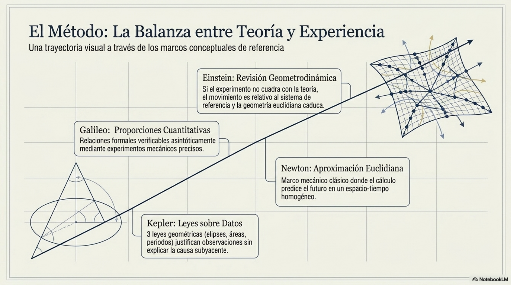

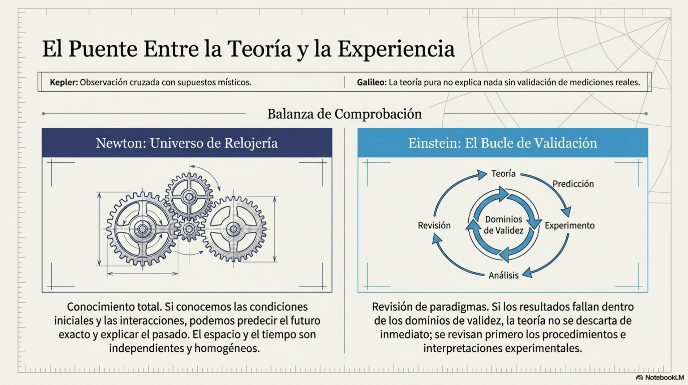

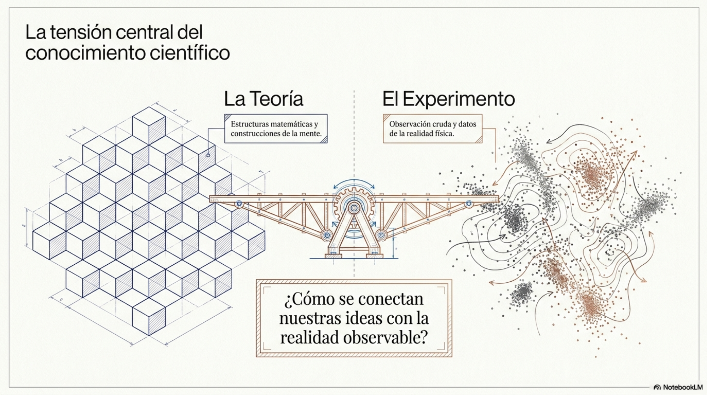

**Kepler** no veía la astronomía como una simple técnica de cálculo,
sino como un intento de descubrir la estructura real y racional del
cosmos. No realizó experimentos en el sentido de Galileo; en cambio hizo
observaciones y mediciones astronómicas extremadamente precisas. Usó los
datos de Tycho Brahe y encontró pequeñas discrepancias entre las órbitas
circulares predichas y las posiciones observadas de planetas como Marte.
Esto lo llevó a pensar en la elipse cómo trayectoria más apropiada para
describir las órbitas planetarias. Dejó de ver los modelos matemáticos
como herramientas predictivas y optó por una estrategia diferente según
la cual la teoría guía la interpretación de los datos y éstos a su vez
corrigen la teoría.

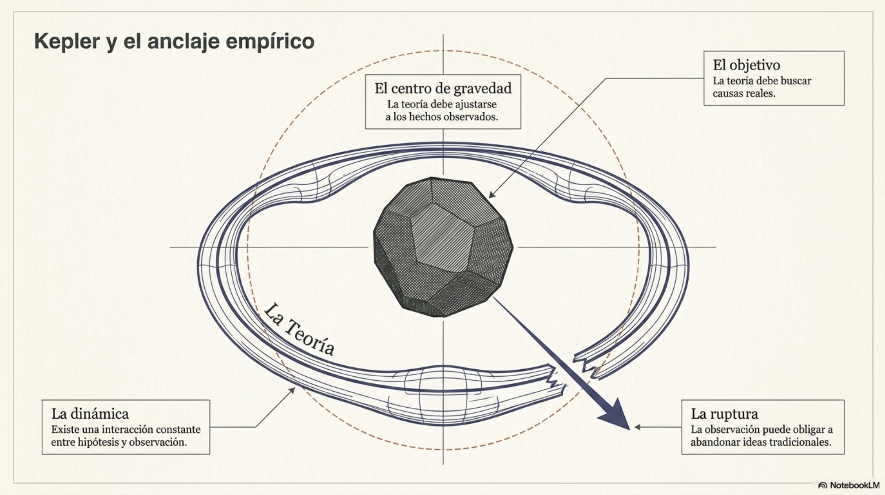

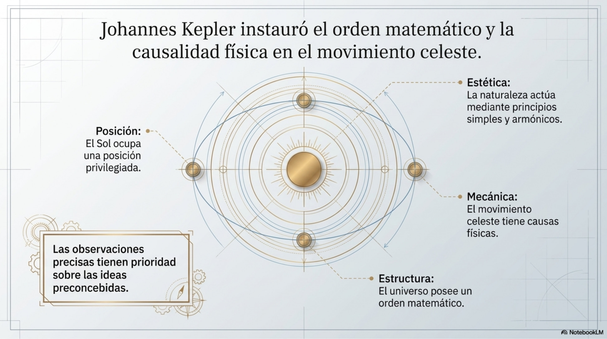

**Galileo** sostuvo que el conocimiento del movimiento debe construirse
mediante la observación controlada, la experimentación, la idealización,
la medición y la formulación matemática. Introdujo idealizaciones
teóricas tales como las superficies sin fricción, la caída sin
resistencia del aire y el movimiento perfectamente uniforme. Resolvió
situaciones en que parecía que los cuerpos pesados caían más rápido y
que todo objeto necesitaba de alguna fuerza continua para moverse.
Consideró que el experimentador debe producir situaciones controladas,
aislar variables, simplificar fenómenos y medir cuantitativamente.
También necesita seleccionar lo que ha de medir, diseñar el experimento,
interpretar los resultados y formular la hipótesis que habrá de probar.

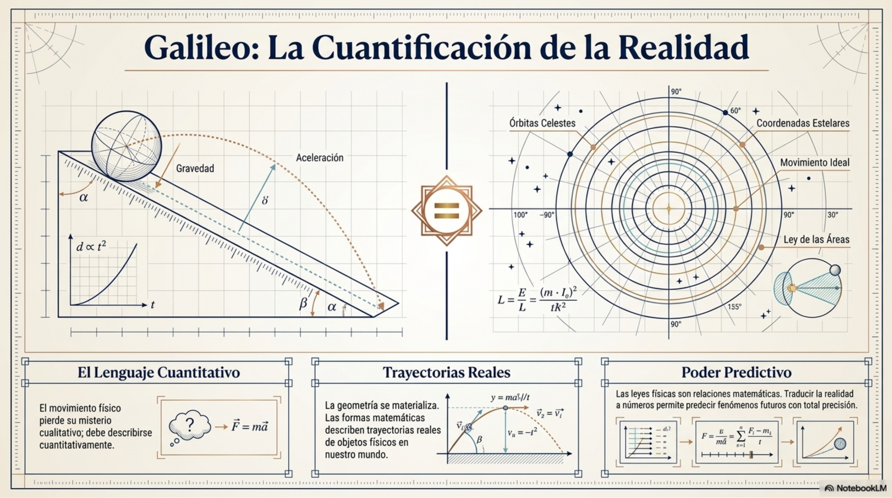

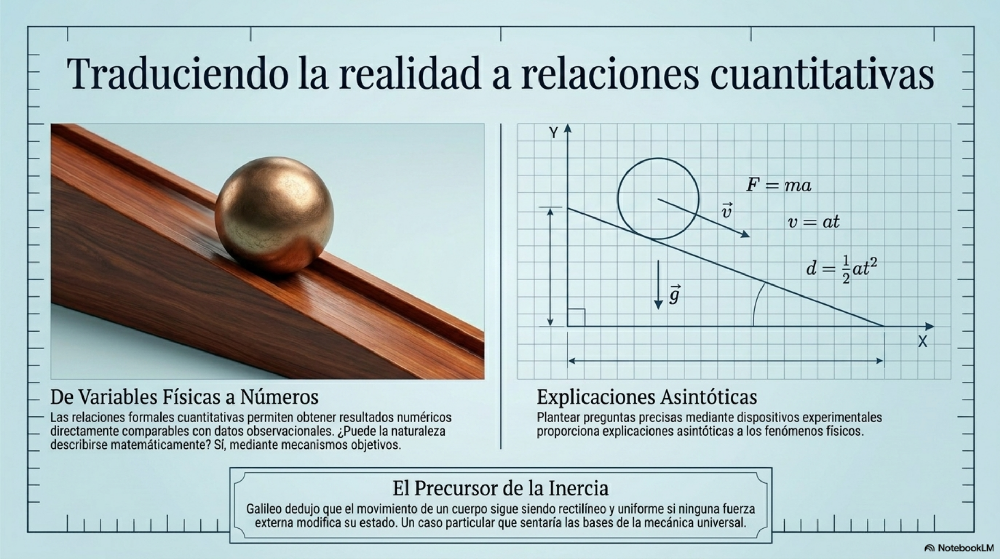

**Newton,** construyó una teoría universal del movimiento basado en la
observación, la experimentación, la deducción matemática y la
formulación de leyes universales. No aceptaba explicaciones sin
fundamento empírico suficiente y suponía que detrás de fenómenos
aparentemente distintos existían principios comunes, como fue el caso de
la caída de los cuerpos, las órbitas planetarias, el movimiento de
proyectiles y las mareas. Combinó el método inductivo (partir de
observaciones para inferir leyes generales) con el método deductivo
(partir de leyes matemáticas para predecir nuevos fenómenos). Fue así
como a partir de observaciones astronómicas formuló la ley de la
gravitación universal y dedujo matemáticamente órbitas, trayectorias y
perturbaciones.

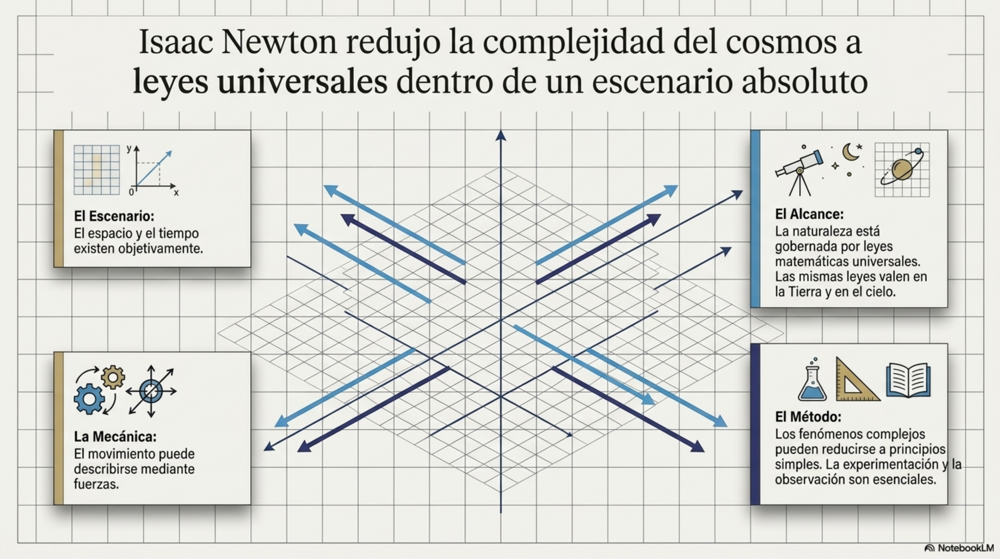

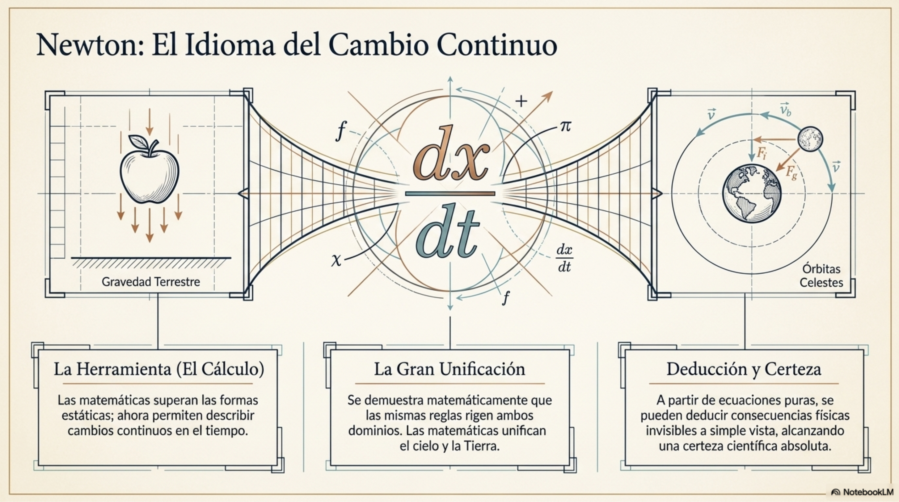

**Einstein** pensaba que la ciencia no surge únicamente de acumular
observaciones, sino de una interacción creativa entre la experiencia
física, la construcción conceptual, los principios teóricos, la
imaginación y la formulación matemática. Supuso que toda buena teoría
debería poder revelar principios profundos de la naturaleza y poseer
coherencia lógica, simplicidad conceptual, universalidad y poder
explicativo. Sus teorías permitieron dar explicaciones y hacer
predicciones comprobables, como el efecto fotoeléctrico y la
condensación de Bose Einstein (fenómenos cuánticos), así como la
desviación de la luz por gravedad, el corrimiento gravitacional, la
precesión del perihelio de la órbita de Mercurio y las ondas
gravitacionales (fenómenos relativistas). Utilizó los llamados
experimentos mentales para plantearse problemas e imaginar soluciones de
trenes en movimiento, montarse en un haz de luz, subir en ascensores
acelerados y colocar observadores en distintos marcos de referencia.

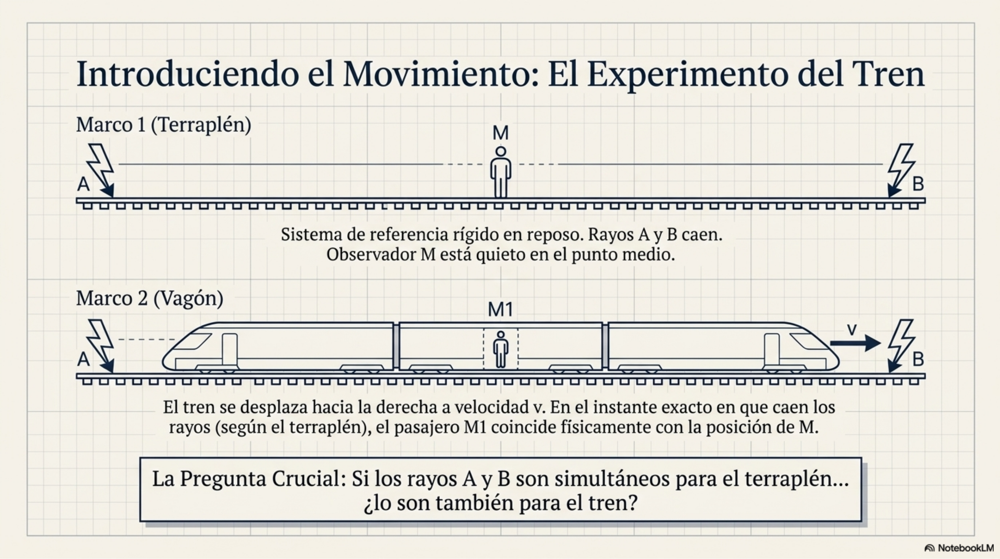

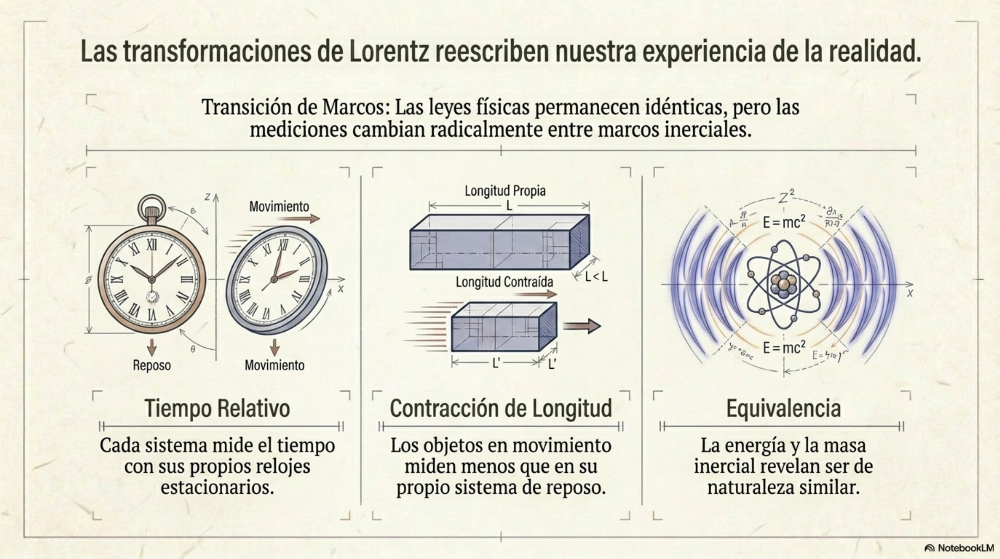

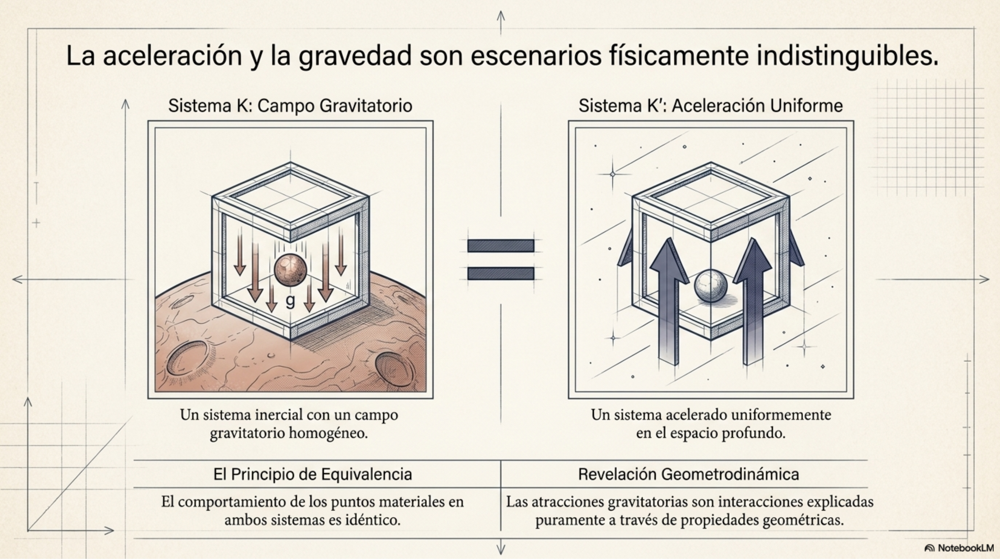

**La importancia de las matemáticas**

A continuación, presentamos un par de diapositivas que tratan de la
evolución de las matemáticas. Posteriormente, la Tabla 4.5 compara
posibles opiniones de los cuatro científicos respecto de la importancia
que tuvieron las matemáticas en el desarrollo de sus trabajos. Después
consideramos la manera en la que cada científico pudo haber sentido,
creado y utilizado las matemáticas.

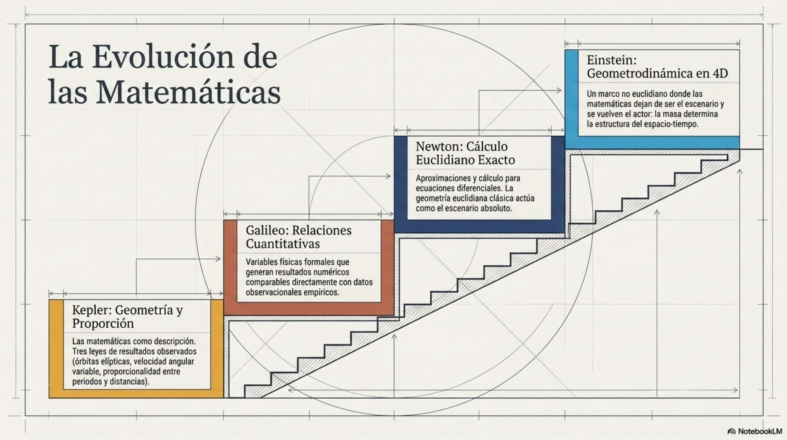

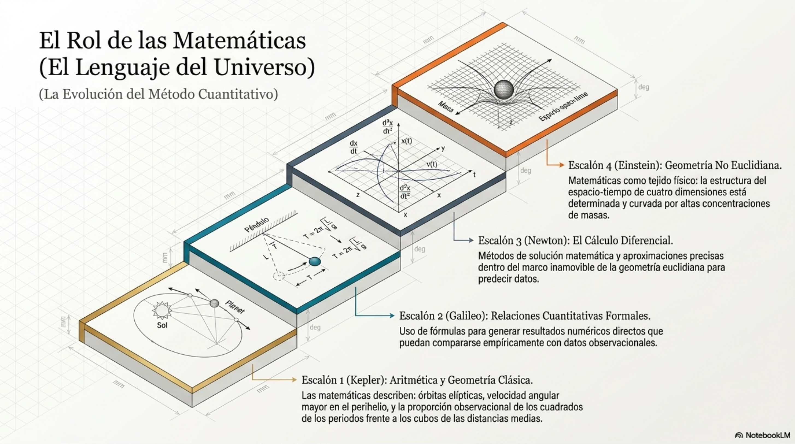

<table>
<colgroup>
<col style="width: 24%" />
<col style="width: 22%" />
<col style="width: 26%" />
<col style="width: 25%" />
</colgroup>
<thead>
<tr class="header">
<th colspan="4">Tabla 4.5. Papel de las matemáticas</th>
</tr>
</thead>
<tbody>
<tr class="odd">
<td>Kepler</td>
<td>Galileo</td>
<td>Newton</td>
<td>Einstein</td>
</tr>
<tr class="even">
<td>
Las matemáticas revelan la estructura del universo.

El movimiento planetario obedece leyes matemáticas precisas.

La geometría permite describir físicamente el cosmos.

Las matemáticas conectan armonía y causalidad.
</td>
<td>
Las matemáticas permiten descubrir leyes universales.

El movimiento debe describirse cuantitativamente.

Las leyes físicas son relaciones matemáticas.

La geometría describe trayectorias reales.

Las matemáticas permiten predecir fenómenos.
</td>
<td>
Las matemáticas expresan las leyes de la naturaleza.

Las matemáticas sirven para describir cambios continuos.

Las matemáticas permiten deducir consecuencias físicas.

La geometría y el cálculo describen el espacio físico real.

Las matemáticas unifican el cielo y la Tierra.

Las matemáticas permiten alcanzar certeza científica.
</td>
<td>
Las matemáticas ayudan a formular leyes invariantes.

Las matemáticas revelan estructuras ocultas de la realidad.

Las matemáticas permiten generalizar principios físicos.

Las matemáticas unifican fenómenos distintos.

Las matemáticas sirven para deducir nuevas predicciones físicas.

La belleza matemática posee valor heurístico.
</td>
</tr>
</tbody>
</table>

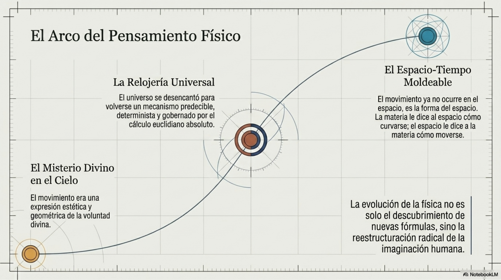


**Kepler** pensaba que las matemáticas constituyen el lenguaje de la
realidad cósmica que se expresa en términos de proporciones, simetrías,
armonías y relaciones numéricas. Además, las figuras geométricas son
expresiones reales de la organización del universo; ayudan a descifrar
el enigma del cielo. Las matemáticas le sirvieron para encontrar
regularidades cuantitativas universales como las que expresan sus tres
leyes: de las órbitas, de las áreas y de las proporciones. Buscó
encontrar y compartir una música del universo basada en proporciones
matemáticas.


**Galileo** dijo que *El libro de la naturaleza está escrito en lenguaje
matemático.* Pensaba que sólo las matemáticas pueden expresar con
precisión las regularidades cuantificables que caracterizan al
movimiento y que comprender una ley significa poder calcular y prever
comportamientos futuros. Introdujo magnitudes medibles para el tiempo,
la velocidad, la aceleración y las trayectorias; descubrió que la caída
de los cuerpos sigue relaciones numéricas precisas. Además, mostró que
el movimiento parabólico de los proyectiles se debía a la combinación de
dos movimientos: un movimiento horizontal uniforme y otro de caída
vertical acelerada.

**Newton** consideró a las matemáticas como el instrumento indispensable
para formular las leyes universales del movimiento: las relaciones
físicas poseen una estructura matemática objetiva y las leyes
matemáticas correctamente confirmadas poseen enorme poder explicativo y
predictivo. A partir de unas pocas leyes generales calculó órbitas
planetarias, trayectorias de cometas, movimiento de proyectiles, mareas
y diversas perturbaciones gravitacionales. Utilizó la geometría y el
cálculo para demostrar propiedades dinámicas y mostró como las figuras
matemáticas permiten representar trayectorias y movimientos reales.
Mostró matemáticamente que las leyes que gobiernan la caída de una
piedra son las mismas que gobiernan las órbitas planetarias.


**Einstein** quería encontrar leyes válidas que permanecieran
invariantes frente a transformaciones en los sistemas de referencia.
Buscó una interacción continua entre la coherencia conceptual y la
verificación empírica. En la teoría de la relatividad especial encontró
una relación universal entre masa y energía; en la teoría de la
relatividad general demostró que la materia curva el espacio-tiempo y
que tal curvatura determina el movimiento. Las ecuaciones relativistas
condujeron a predicciones como los agujeros negros, la expansión del
universo, las ondas gravitacionales y la dilatación del tiempo. Esta
dilatación se manifiesta como un efecto del movimiento en relatividad
especial y un efecto gravitacional en relatividad general.


**4.3. Avance del perihelio de la órbita del planeta Mercurio**


Según las leyes de Newton, un planeta en órbita alrededor del Sol que
está sujeto a la acción de una fuerza central proporcional a
1/r2 debe seguir una trayectoria que corresponde a una curva
cónica. De acuerdo con el valor de su excentricidad (e) esa curva
corresponderá a un círculo (e = 0), una elipse (0 \< e \< 1), una
parábola (e = 1) o una hipérbola (e \> 1).

La excentricidad mide qué tan alejada está una órbita elíptica de una
circunferencia perfecta (que tan alargada es). Se define como
$e = \frac{c}{a},$ donde $a$ es el semieje mayor de la elipse y $c\ $es
la distancia entre el centro de la elipse y uno de sus focos.

Mercurio es el planeta más cercano al Sol; tarda 88 días terrestres en
una traslación completa. Por otra parte, su órbita es la más excéntrica
en todo el sistema planetario solar; tiene un valor medio de
$e = 0.205630\ \ $(el valor más grande entre todos los planetas).


**Observación de la anomalía en la órbita de Mercurio**

Durante más de un siglo las observaciones astronómicas mostraron que la
elipse de la órbita de Mercurio no estaba estática, giraba lentamente
alrededor del Sol en cada revolución. De esta manera, el perihelio
avanzaba un poco en cada revolución, fenómeno que se denomina precesión
(cambio de orientación de la curva después da cada revolución). Los
cambios lentos de orientación de la órbita pueden deberse a las
influencias gravitacionales producidas por otros planetas del sistema y,
en particular, a la curvatura del espacio-tiempo descrita por la
relatividad general.


El avance del perihelio de Mercurio fue observado por primera vez en el
siglo XIX; se conjeturó que otro planeta desconocido en una órbita más
interior al Sol era el causante de las perturbaciones observadas. Sin
embargo, durante mucho tiempo siguió registrándose un exceso de
aproximadamente 43 segundos de arco por siglo, mismo que no podía
explicarse con la mecánica newtoniana.


En la teoría de la relatividad general la gravedad no es, como diría
Newton, la fuereza atractiva instantánea que ejercen dos masas aisladas
colocadas a cierta distancia. Es el efecto geométrico, como diría
Einstein, de una curvatura del espacio-tiempo producida por una gran
concentración de materia. En esas condiciones el planeta se ve obligado
a seguir en ese espacio la trayectoria más rectilínea posible (la
geodésica).


Para obtener la forma de la órbita planetaria es necesario partir de la
ecuación de movimiento y resolverla. La ecuación relativista de la
órbita planetaria no se obtiene al añadir arbitrariamente un término de
corrección a la ecuación newtoniana, sino al deducir que el movimiento
de un planeta corresponde a una geodésica en el espacio-tiempo curvo
generado por el Sol.

La geodésica es la trayectoria más natural o "más recta posible" entre
dos puntos en un espacio geométrico. En un espacio plano, como el de la
geometría euclidiana, una geodésica es simplemente una línea recta. En
términos matemáticos, una geodésica es una curva que localmente minimiza
(hace estacionaria) la distancia entre dos puntos.


**Determinación de la precesión de la órbita**


