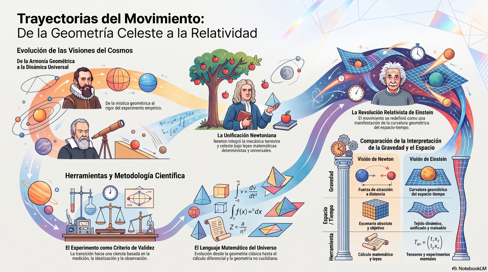
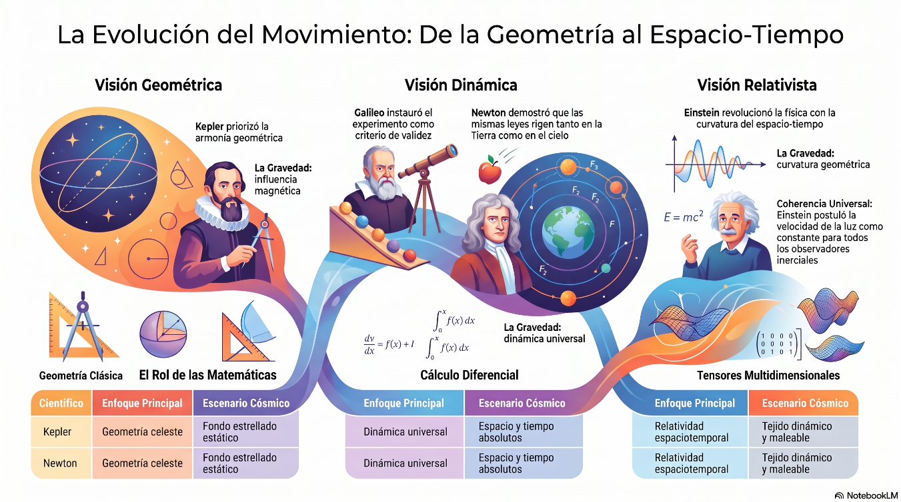
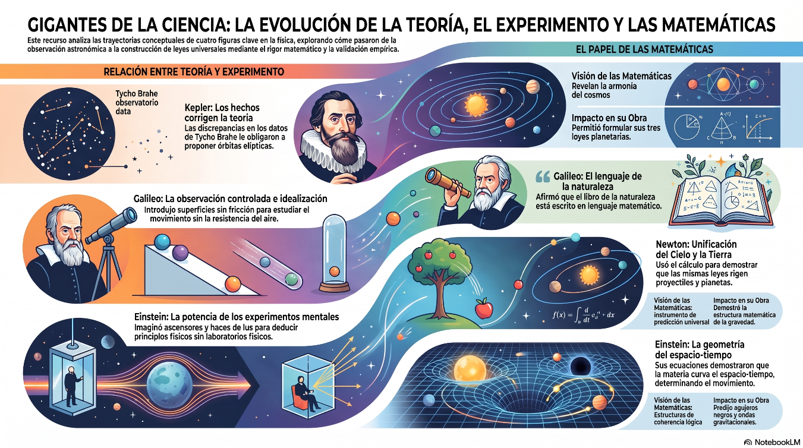
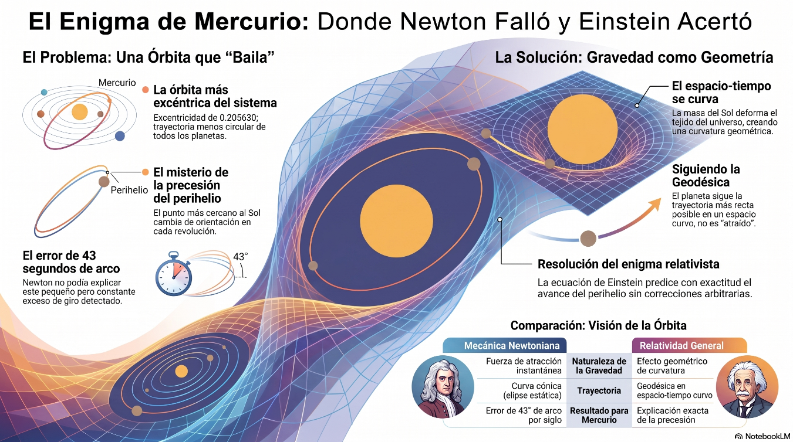
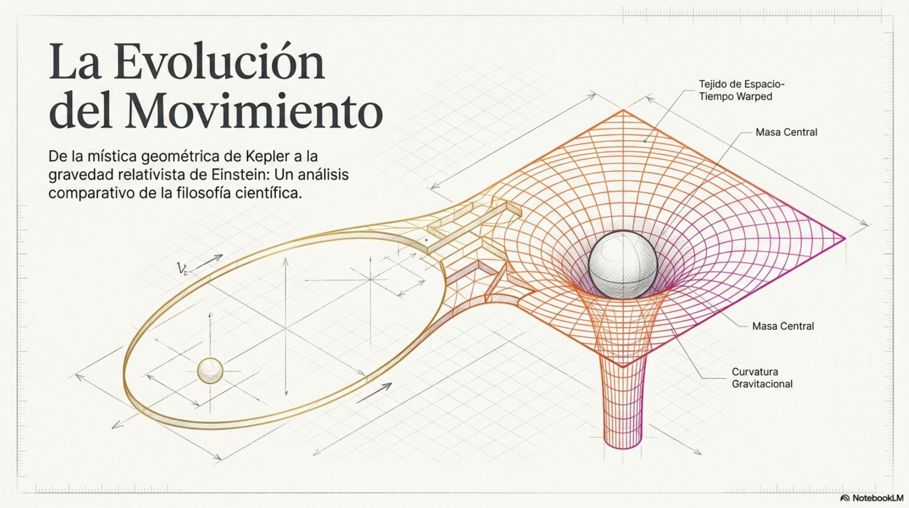
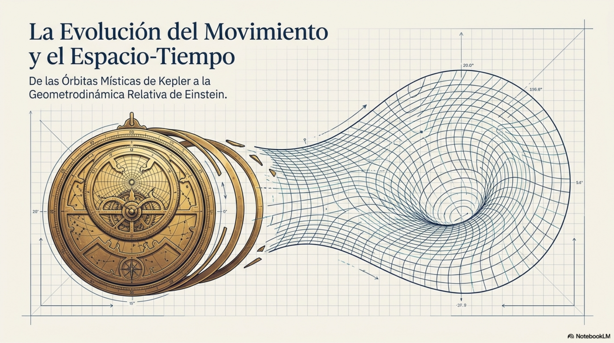

# Capítulo 4: Trayectorias conceptuales acerca del movimiento

Este capítulo es una invitación para explorar las trayectorias
conceptuales recorridas por cuatro científicos: Johannes Kepler, Galileo
Galilei, Isaac Newton y Albert Einstein. Las trayectorias en cuestión
tienen que ver con la evolución de sus conocimientos acerca del
movimiento. Tales conocimientos se refieren a dos tipos de condiciones:
las condiciones iniciales de los autores en relación con las preguntas
fundamentales que pudieron haber formulado cada uno de ellos y las
premisas que plantearon como válidas, así como las condiciones en la
frontera de la disciplina que cultivan (la física), en conexión con las
relaciones teoría – experimento y el papel de las matemáticas.

El conocimiento sirve para describir, explicar y predecir; para
representar e interpretar y para transformar e innovar; es generador de
nuevas ideas, razonamientos, pruebas y demostraciones. Promueve el
mejoramiento de productos y servicios, transforma estructuras y afina
procedimientos; es factor de progreso en ciencia, tecnología,
matemáticas, educación y cultura.

Para cada trayectoria conceptual considerada presentamos una tabla
comparativa de lo que pudieron haber sido, primero las respuestas a las
preguntas planteadas y las premisas aceptadas (condiciones iniciales de
los científicos) y segundo, las observaciones a las relaciones teoría –
experimento y el papel de las matemáticas (condiciones en la frontera de
la disciplina).

Como ejemplo práctico del recorrido de una trayectoria conceptual
consideramos el cálculo de órbitas planetarias desde los puntos de vista
de Newton y Einstein. El cálculo del avance del perihelio de la órbita
de Mercurio ha servido para demostrar que la estructura geométrica del
espacio tiempo gobierna el comportamiento físico del movimiento de la
materia en el universo.

Todas las imágenes incluidas en este capítulo han sido generadas por el
Programa NotebookLM basadas en fuentes generadas por el autor.

**OBJETIVOS Y CONTENIDOS DE LAS SECCIONES**

**4.1. Trayectorias conceptuales relacionadas con las condiciones
iniciales de los autores**

Describir las trayectorias conceptuales acerca del movimiento que se
conectan con las preguntas que se hicieron Kepler, Galileo, Newton y
Einstein y las premisas en las cuales confiaron.

Descripción de trayectorias conceptuales

Preguntas fundamentales planteadas

Premisas consideradas válidas

**4.2. Trayectorias conceptuales relacionadas con las condiciones en la
frontera de la disciplina**

Describir las trayectorias conceptuales acerca del movimiento que se
conectan con las interacciones entre la teoría y el experimento y con el
uso de las matemáticas.

La relación teoría – experimento

La importancia de las matemáticas

**4.3. Avance del perihelio de la órbita del planeta Mercurio**

Describir las trayectorias conceptuales recorridas por Newton y por
Einstein para explicar la órbita de Mercurio, como ejemplo ilustrativo
de cómo evolucionaron la relación teoría – experimento y la importancia
de las matemáticas en el proceso de geometrización de la mecánica
planetaria.

Observación de la anomalía en la órbita de Mercurio

Determinación de la precesión de la órbita

<table>
<colgroup>
<col style="width: 16%" />
<col style="width: 20%" />
<col style="width: 19%" />
<col style="width: 20%" />
<col style="width: 22%" />
</colgroup>
<tbody>
<tr class="odd">
<td colspan="5"><blockquote>

Tabla 4.1. Caracterizaciones de trayectorias conceptuales

</blockquote></td>
</tr>
<tr class="even">
<td>Científico</td>
<td><blockquote>

Kepler

</blockquote></td>
<td><blockquote>

Galileo

</blockquote></td>
<td><blockquote>

Newton

</blockquote></td>
<td><blockquote>

Einstein

</blockquote></td>
</tr>
<tr class="odd">
<td colspan="5"><blockquote>

Según el paradigma vigente

</blockquote></td>
</tr>
<tr class="even">
<td><blockquote>

Enfoque principal

</blockquote></td>
<td><blockquote>

Geometría celeste

</blockquote></td>
<td><blockquote>

Cinemática terrestre

</blockquote></td>
<td><blockquote>

Dinámica universal

</blockquote></td>
<td><blockquote>

Relatividad

espacio-temporal

</blockquote></td>
</tr>
<tr class="odd">
<td><blockquote>

Visión de la gravedad

</blockquote></td>
<td><blockquote>

Influencia magnética solar

</blockquote></td>
<td><blockquote>

Aceleración local constante

</blockquote></td>
<td><blockquote>

Fuerza de atracción a distancia

</blockquote></td>
<td><blockquote>

Curvatura geométrica del espacio tiempo

</blockquote></td>
</tr>
<tr class="even">
<td><blockquote>

Escenario cósmico

</blockquote></td>
<td><blockquote>

Fondo estrellado estático

</blockquote></td>
<td><blockquote>

Marco de

referencia inercial

</blockquote></td>
<td><blockquote>

Espacio y tiempo absolutos

</blockquote></td>
<td><blockquote>

Tejido dinámico y maleable

</blockquote></td>
</tr>
<tr class="odd">
<td><blockquote>

Herramienta clave

</blockquote></td>
<td><blockquote>

Observación y geometría

</blockquote></td>
<td><blockquote>

El experimento mental

</blockquote></td>
<td><blockquote>

El cálculo matemático

</blockquote></td>
<td><blockquote>

Tensores y experimentos

mentales

</blockquote></td>
</tr>
<tr class="even">
<td colspan="5"><blockquote>

Según la evolución de las premisas

</blockquote></td>
</tr>
<tr class="odd">
<td><blockquote>

Metodología

</blockquote></td>
<td><blockquote>

Observación

empírica e ideas preconcebidas

</blockquote></td>
<td><blockquote>

El experimento es mayor que la autoridad

</blockquote></td>
<td><blockquote>

La

experimentación es esencial

</blockquote></td>
<td><blockquote>

Coherencia para todo observador inercial

</blockquote></td>
</tr>
<tr class="even">
<td><blockquote>

Matemáticas

</blockquote></td>
<td><blockquote>

Orden armónico inherente

</blockquote></td>
<td><blockquote>

Regularidades medibles

</blockquote></td>
<td><blockquote>

Leyes universales deterministas

</blockquote></td>
<td><blockquote>

Búsqueda de unidad conceptual

</blockquote></td>
</tr>
<tr class="odd">
<td><blockquote>

Espacio -Tiempo

</blockquote></td>
<td><blockquote>

Escenario celestial

</blockquote></td>
<td><blockquote>

Escenario físico implícito

</blockquote></td>
<td><blockquote>

Escenario absoluto y objetivo

</blockquote></td>
<td><blockquote>

Tejido unificado e indisoluble

</blockquote></td>
</tr>
<tr class="even">
<td><blockquote>

Dinámica - Gravedad

</blockquote></td>
<td><blockquote>

Las causas físicas mueven a los astros

</blockquote></td>
<td><blockquote>

El reposo es un movimiento uniforme con velocidad nula

</blockquote></td>
<td><blockquote>

El movimiento lo describen las

acciones de las fuerzas

</blockquote></td>
<td><blockquote>

La gravedad es una manifestación de una geometría física

</blockquote></td>
</tr>
<tr class="odd">
<td colspan="5"><blockquote>

Según el diagnóstico epistemológico

</blockquote></td>
</tr>
<tr class="even">
<td><blockquote>

Papel de la teoría

</blockquote></td>
<td><blockquote>

Ajustarse a los hechos

observados

</blockquote></td>
<td><blockquote>

Guiar la observación hacia la

idealización

</blockquote></td>
<td><blockquote>

Organizar y unificar

fenómenos

</blockquote></td>
<td><blockquote>

Construcción

intelectual en busca de coherencia

</blockquote></td>
</tr>
<tr class="odd">
<td><blockquote>

Función del experimento

</blockquote></td>
<td><blockquote>

Obligar a abandonar ideas tradicionales

</blockquote></td>
<td><blockquote>

Criterio de validez

descubridor de regularidades

</blockquote></td>
<td><blockquote>

Descubrir relaciones y verificar matemáticas

</blockquote></td>
<td><blockquote>

Criterio final transformador de conceptos

</blockquote></td>
</tr>
<tr class="even">
<td><blockquote>

Naturaleza de la observación

</blockquote></td>
<td><blockquote>

Interacción

constante con la hipótesis

</blockquote></td>
<td><blockquote>

La organización debe ser racional

</blockquote></td>
<td><blockquote>

Interacción

continua con la deducción

</blockquote></td>
<td><blockquote>

Guía profunda con la teoría

</blockquote></td>
</tr>
<tr class="odd">
<td colspan="5"><blockquote>

Según la visión sintética

</blockquote></td>
</tr>
<tr class="even">
<td><blockquote>

Premisas asumidas

</blockquote></td>
<td><blockquote>

Armonía y simetría platónicas

</blockquote></td>
<td><blockquote>

Mecanismos puramente objetivos

</blockquote></td>
<td><blockquote>

Espacio y tiempo absolutos

</blockquote></td>
<td><blockquote>

Equivalencias y dinámica en 4D

</blockquote></td>
</tr>
<tr class="odd">
<td><blockquote>

Método de validación

</blockquote></td>
<td><blockquote>

Ajuste visual a datos

observacionales

</blockquote></td>
<td><blockquote>

Medición

experimental asintótica

</blockquote></td>
<td><blockquote>

Determinismo y

ecuaciones analíticas

</blockquote></td>
<td><blockquote>

Revisión empírica y constancia de la

velocidad de la luz

</blockquote></td>
</tr>
<tr class="even">
<td><blockquote>

Herramientas matemáticas

</blockquote></td>
<td><blockquote>

Geometría y aritmética

clásicas

</blockquote></td>
<td><blockquote>

Relaciones

algebraicas

</blockquote></td>
<td><blockquote>

Cálculo diferencial euclidiano

</blockquote></td>
<td><blockquote>

Geometría no

euclidiana (cuatro dimensiones)

</blockquote></td>
</tr>
<tr class="odd">
<td><blockquote>

Logros del sistema

</blockquote></td>
<td><blockquote>

Leyes cinemáticas sin causa física

</blockquote></td>
<td><blockquote>

Ley de la inercia y método

científico

</blockquote></td>
<td><blockquote>

Unificación de la mecánica con la gravitación

</blockquote></td>
<td><blockquote>

Relatividad y síntesis

electromecánica

</blockquote></td>
</tr>
</tbody>
</table>

