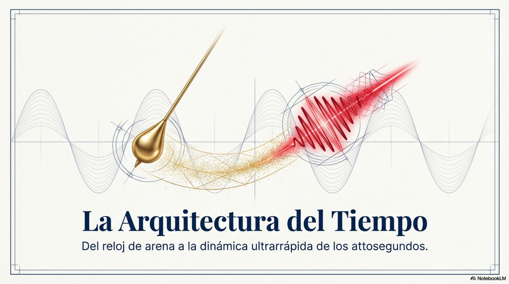

**OBJETIVOS Y CONTENIDOS DE LAS SECCIONES**

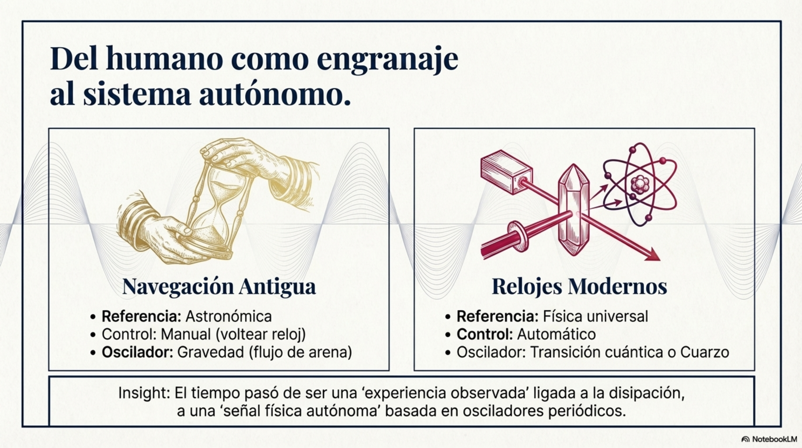

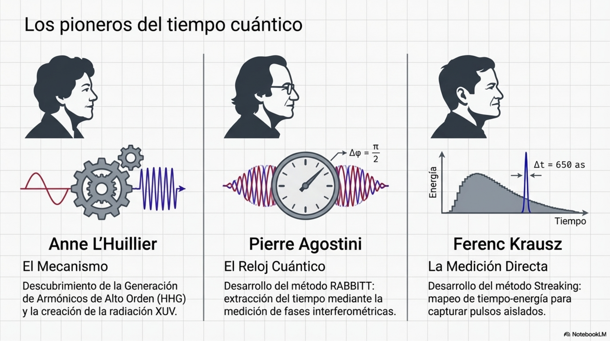

| Tabla 5.1. Fenómenos físicos descritos con diferentes unidades de tiempo |                                                                           |
|--------------------------------------------------------------------------|---------------------------------------------------------------------------|
| Unidad                                                                   | Fenómeno                                                                  |
| Segundo (1 s)                                                            | Duración de un latido humano.                                             |
| Dessegundos (1 ds = 10-1 s)                                   | Duración de un solo parpadeo: (1 – 4) s.                                  |
| Centisegundo (1 cs = 10-2 s)                                  | Reflejo humano a estímulos visuales: (10 – 20) cs.                        |
| Milisegundo (1 ms = 10-3 s)                                   | Tiempo de disparo de una neurona: 1 ms.                                   |
| Microsegundo (1 μs = 10-6 s)                                  | Vida útil de un muón: 2,2 μs.                                             |
| Nanosegundo (1 ns = 10-9 s)                                   | Tiempo que tarda la luz en recorrer 30 cm: 1 ns.                          |
| Picosegundo (1 ps = 10-12 s)                                  | Vida media de un quark bottom: 1 ps.                                      |
| Femtosegundo (1 fs = 10-15 s)                                 | Periodo de vibración de una molécula de hidrógeno: 7,58 fs.               |
| Attosegundo (1 as = 10-18 s)                                  | Pulso más corto de un láser de electrones: 53 as.                         |
| Zeptosegundo (1 zs = 10-21 s)                                 | Tiempo que tarda un fotón en atravesar una molécula de hidrógeno: 247 zs. |
| Octosegundo (1 ys = 10-24 s)                                  | Vida media de un bosón de Higgs: 156 ys.                                  |
| Rontosegundo (1 rs = 10-27 s)                                 | Vida útil media de los bosones W y Z: 300 rs.                             |

**5.1. Movimientos en diferentes escalas de tiempo.**

En esta sección describimos la necesidad de definir distintas unidades
de tiempo para cuantificar duraciones de eventos ultrarrápidos, para
luego considerar dispositivos mecánicos y electrónicos que permiten
medir duraciones temporales y finalmente explorar la participación de
laser en el funcionamiento de los relojes atómicos.

No podemos observar en detalle movimientos extremadamente rápidos como
el aleteo de un colibrí porque en un segundo sus alas vibran como 80
veces. Para percibir claramente estos movimientos, necesitamos registrar
imágenes con una velocidad que sea mayor que la velocidad de vibración
de las alas.

**Medición del tiempo y definición del segundo**

El tiempo se empezó a contar para cuantificar la duración de los
movimientos de objetos astronómicos: el periodo orbital de la Tierra
alrededor del Sol define un *año* con una duración de *315,576,600* s,
el periodo orbital de la Luna alrededor de la Tierra define un *mes* y
corresponde a *12,629,800* s y el tiempo que tarda la Tierra en girar
alrededor del Sol sobre su propio eje define un *día* de 86,400 s. Estos
valores no toman en cuenta que la Tierra ni es plana ni se encuentra
parada en un lugar fijo.

Antiguamente el tiempo era una experiencia observada, hoy es una
magnitud física. En la navegación antigua no había separación clara
entre medición y usuario: el ser humano era parte del sistema de
medición (contar campanadas, observar el Sol, .. ). En cambio, en la
actualidad el sistema es autónomo y desacoplado del ser humano; el
tiempo es una señal física definida, independiente, reproducible y
universal. Al desarrollarse mejores métodos para medir el tiempo se
operó una transición fundamental a nivel cognitivo al pasar del
tratamiento de procesos disipativos irreversibles al de osciladores
periódicos estables.

La Tabla 5.2 establece una comparación entre los métodos de medición del
tiempo usados por los marinos antiguos y los actuales que emplean
relojes modernos: compara las correspondientes arquitecturas
informacionales (A) y los mecanismos de medición (M).

| Tabla 5.2. Arquitectura del sistema (A) y Mecanismo de medición (M) |                     |                                                      |                                               |
|---------------------------------------------------------------------|---------------------|------------------------------------------------------|-----------------------------------------------|
|                                                                     | Componente          | Navegación antigua                                   | Relojes modernos                              |
| A                                                                   | Fuente del fenómeno | Flujo de arena, rotación terrestre (Sol/estrellas)   | Oscilador físico estable (cuarzo o átomo)     |
|                                                                     | Regularidad         | Aproximada, dependiente del entorno                  | Altamente estable y controlada                |
|                                                                     | Referencia          | Natural (ciclos astronómicos)                        | Física universal (frecuencia atómica)         |
|                                                                     | Control del proceso | Manual (reloj de arena)                              | Automático (circuitos electrónicos o láseres) |
| M                                                                   | Dispositivo base    | Reloj de arena                                       | Cuarzo / reloj atómico                        |
|                                                                     | Principio físico    | Flujo gravitacional de arena                         | Oscilación mecánica o transición cuántica     |
|                                                                     | Unidad de medida    | Intervalos prácticos (30 min, 4 h)                   | Segundo definido físicamente                  |
|                                                                     | Reinicio            | Necesario (voltear el reloj para iniciar otro ciclo) | Continuo                                      |

Los marinos antiguos utilizaron los relojes de arena para cuantificar el
paso del tiempo cuando navegaban en mar abierto y el barco vibraba y
cambiaba de posición; además, prácticamente ningún aparato de medición
que quisieran utilizar estaba en reposo. Los marinos disponían de
relojes de arena que medían duraciones de 30 minutos y 4 horas; medían
su jornada de trabajo en bloques de 4 horas cada uno, las que contaban
sonando 8 campanadas, una cada media hora. Por otra parte, para medir la
velocidad del barco lanzaba al agua una cuerda con nudos espaciados
regularmente y con la ayuda de un reloj de arena contaban los nudos que
pasaban mientras corría la arena.

<table>
<colgroup>
<col style="width: 98%" />
<col style="width: 0%" />
<col style="width: 0%" />
</colgroup>
<thead>
<tr class="header">
<th>
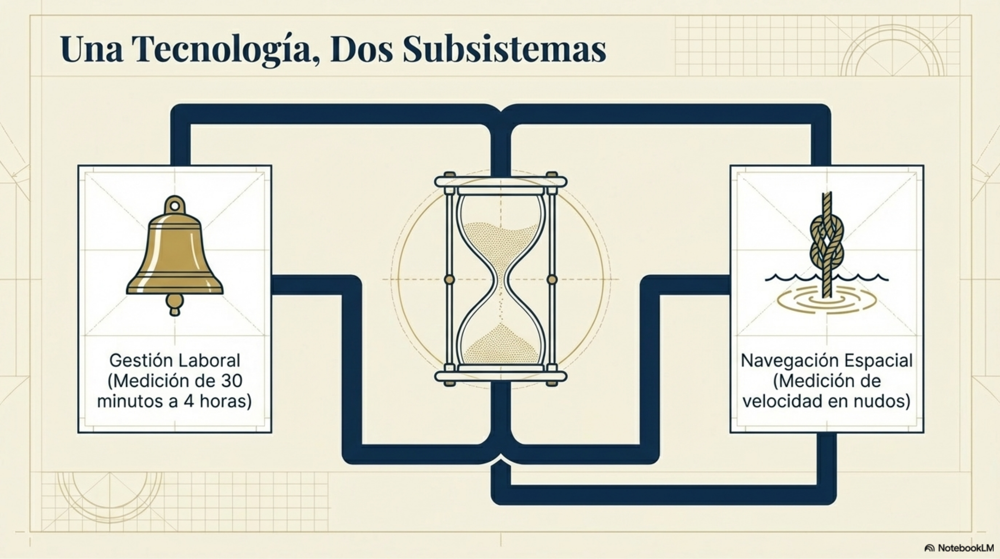

El valor del segundo como unidad de tiempo se derivó primero de
referencias astronómicas y evolucionó después a definiciones basadas en
propiedades físicas. Durante siglos, el tiempo se definía a partir del
movimiento de la Tierra: un día correspondía al tiempo que tarda la
Tierra en hacer una rotación completa: un segundo era la parte
correspondiente a 1/86400 de un día solar medio. Actualmente, según el
Sistema Internacional de Unidades (SI), la duración del segundo
corresponde a una vibración de 9.192.631.770 Hz, que es la frecuencia de
transición hiperfina del estado fundamental no perturbada del átomo de
cesio-133.

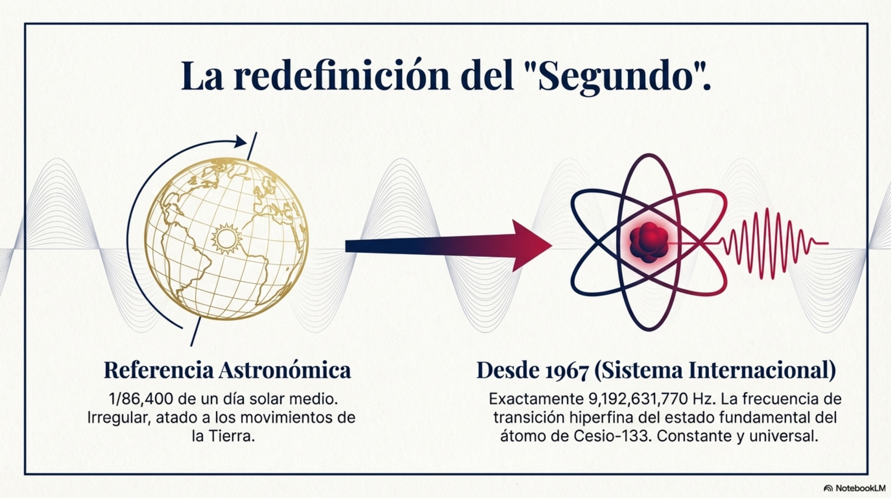
</th>
<th></th>
<th></th>
</tr>
</thead>
<tbody>
</tbody>
</table>

Existe una coincidencia numérica entre la escala temporal del
attosegundo (1 as = 10-18 s) y la edad del universo, que se
estima en 13.8 x 109 años = 4.35 x 1018 s: la
cantidad de attosegundos que tiene un segundo es del mismo orden de
magnitud que los segundos que tiene de vida el universo:
1018. Estas escalas de tiempo cubren una enorme brecha entre
lo infinitesimalmente pequeño (el attosegundo) y lo inmensamente grande
(el tiempo que ha pasado desde que el universo existe).

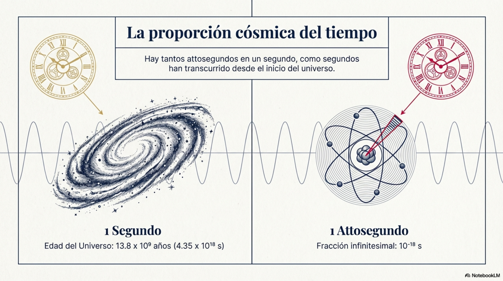

**Tipos de relojes**

Tradicionalmente, en el estudio de la medición del tiempo (la
relojería), se distingue el término reloj del término cronómetro (reloj
de mayor precisión): mientras que el primero sirve para localiza
instantes en que ocurre algún evento, el segundo cuantifica su duración
temporal medida en ciertas unidades. En general, los relojes de más uso
miden intervalos de tiempo más cortos que las unidades naturales como el
día, el mes lunar y el año.

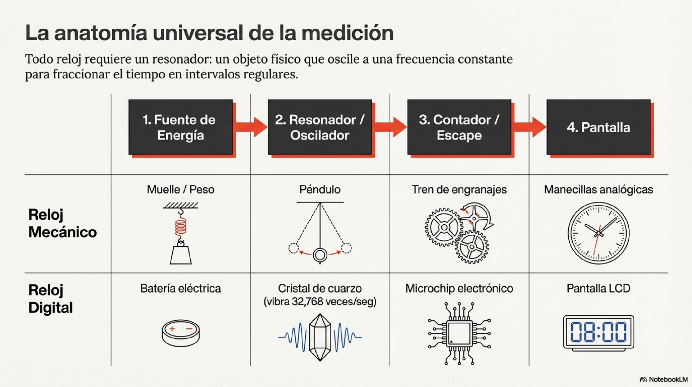

Para medir el tiempo hay que encontrar un evento periódico que se repita
a una velocidad constante y utilizar esa circunstancia para definir una
unidad básica de intervalo de tiempo, como por ejemplo el segundo.
Después, para establecer un sistema de medición del tiempo hay que
definir en forma inequívoca el orden en que aparecen determinados
eventos en la cadena de su evolución temporal, así como cuantificar su
duración en términos del número de segundos que han transcurrido desde
que el evento comenzó hasta que terminó.

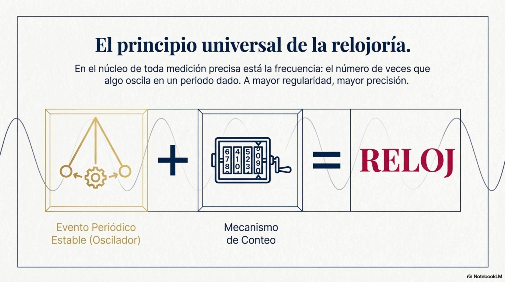

En lo que sigue haremos un breve recorrido histórico de la evolución de
los relojes; dividiremos esa evolución en cuatro etapas, identificables
por el tipo de reloj que se utilizaba entonces: relojes primitivos,
relojes mecánicos, relojes digitales y relojes atómicos. En los relojes
modernos se mide el tiempo aprovechando procesos mecánicos, eléctricos o
atómicos que se repiten en intervalos regulares y predecibles.

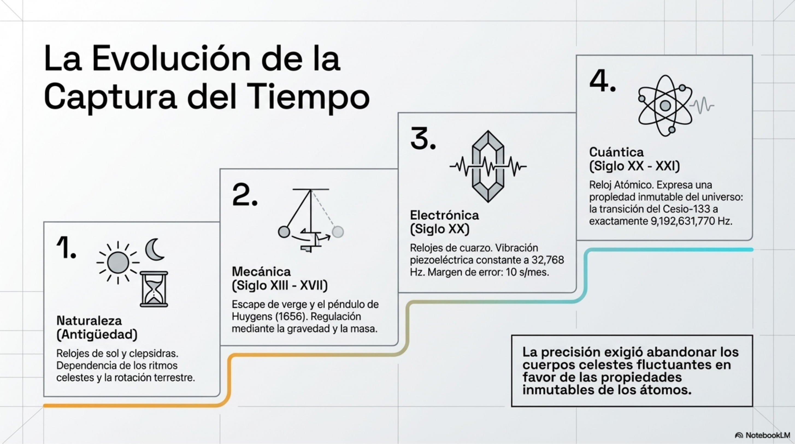

<u>Relojes primitivos</u>

Las primeras maneras como se contaba el tiempo se basaron en la
percepción que se tenía de la evolución temporal de fenómenos naturales
como la rotación de la Tierra alrededor de su propio eje (definición de
día), la rotación de la Luna alrededor de la Tierra (definición de mes)
y rotación de la Tierra alrededor del Sol (definición de año).
Posteriormente se consideró el flujo regular de sustancias como agua o
arena, así como la cantidad de cera o incienso que se consumía al
quemarse.

Fueron los antiguos egipcios y griegos quienes construyeron los primeros
relojes de sol. La posición aparente del Sol en el cielo se modifica a
lo largo del día, reflejando el hecho de que la Tierra gira alrededor de
su propio eje, por lo que la sombra que proyecta una varilla fija sobre
una superficie plana cambia conforme pasa el tiempo. Esas posiciones de
la sombra giran como el Sol que se mueve desde que amanece hasta que
anochece.

Por su parte, los griegos y los chinos desarrollaron relojes de agua,
conocidos como clepsidras; midieron el paso del tiempo cuantificando la
cantidad líquido que se escurría por un orificio de salida. S el flujo
era aproximadamente constante, el volumen de agua que pasaba era
proporcional al tiempo que tardaba en caer cierto volumen de agua.

En la Europa medieval, los relojes de vela surgieron como una solución
que podía funcionar de noche: la cantidad de cera derretida indicaba el
tiempo transcurrido. Los relojes de arena también aparecieron hacia el
siglo XIII hace unos 1200 años**.** En este caso el recurso no se
consumía como en la vela, sino que se reutilizaba.

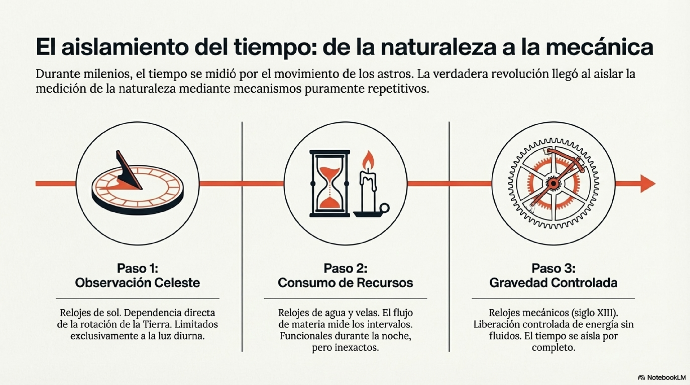

<u>Relojes mecánicos</u>

Los relojes mecánicos son dispositivos que miden el tiempo mediante el
movimiento controlado de engranajes impulsados por una fuente de energía
y regulados por un oscilador periódico. Usan la energía que liberan
pesas o resortes que luego regula un escape y estabiliza el péndulo que
oscila periódicamente. A medida que giran los engranajes se mueven las
manecillas del reloj y el paso del tiempo se exhibe en horas, minutos y
segundos. Se mide el tiempo contando oscilaciones.

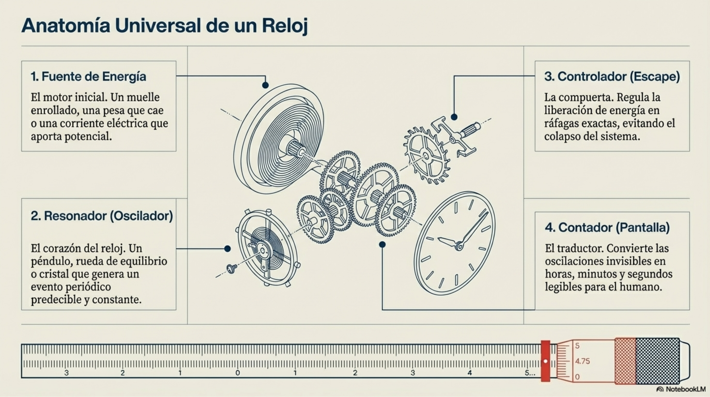

El primer reloj de engranajes conocido fue inventado por Arquímedes
durante el siglo III a.C. Tal reloj consistía en un sistema de cuatro
pesos, contrapesos y cuerdas regulados por un sistema de flotadores en
un recipiente de agua con sifones que regulaban su funcionamiento
automático. El siguiente avance en precisión se dio con la invención del
reloj de péndulo, construido en 1656 por Christiaan Huygens, apoyándose
en el descubrimiento que realizara Galileo en los años 1580 cuando se
topó con la isocronía de las oscilaciones del péndulo. Utilizando su
propio pulso para medir intervalos de tiempo regulares, encontró que
para pequeñas oscilaciones el tiempo de cada oscilación permanecía
prácticamente constante.

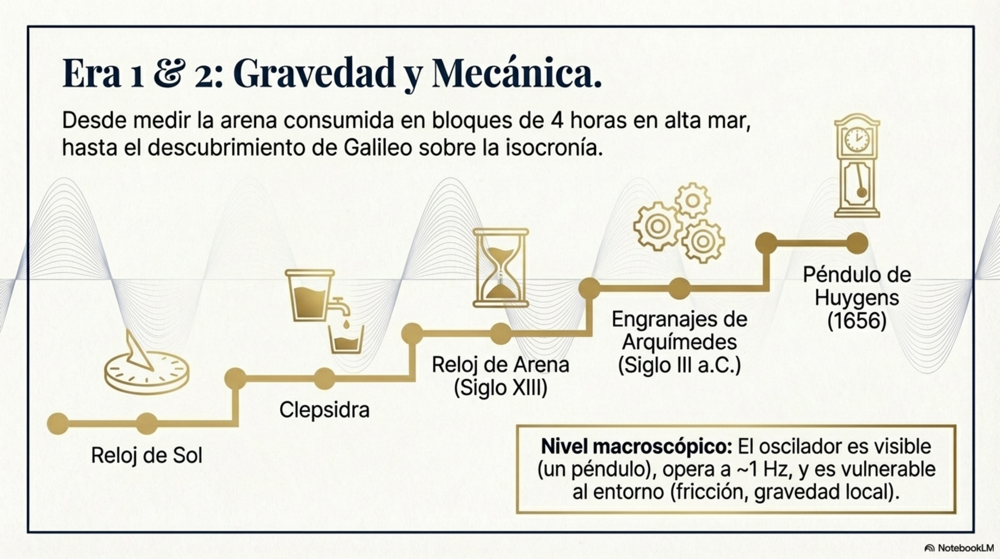

<u>Relojes digitales</u>

Estos relojes funcionan con electricidad y para generarla utilizan
circuitos eléctricos y cristales de cuarzo. Para estabilizar el
movimiento, los relojes eléctricos usan oscilaciones eléctricas o
motores síncronos, generalmente a frecuencias como la de la red
eléctrica (50/60 Hz). Utilizan esta energía con dos propósitos: generar
una oscilación para medir el tiempo y mantener la energía del sistema.
Para conseguirlo ponen en operación el siguiente ciclo de
funcionamiento: cuando la oscilación de un péndulo pasa por cierto punto
se cierra un circuito eléctrico que activa un electroimán que le da un
pequeño impulso al péndulo para que siga oscilando. De esta manera el
proceso se repite y la oscilación se mantiene constante. El primer reloj
eléctrico se construyó en 1815 en Londres.

Los relojes de cuarzo funcionan debido a la piezoelectricidad de los
cristales. En el efecto piezoeléctrico directo se produce electricidad
cuando se aplica una presión mecánica sobre el cristal, mientras que en
el efecto inverso aparecen modificaciones mecánicas tales como
vibraciones cuando se aplica un voltaje externo. Son conversiones
directas entre energía mecánica y energía eléctrica: al deformarse el
cristal se separan cargas y se genera un voltaje, mientras que al
aplicar voltaje las cargas se reorganizan y el material se deforma.

Cuando se aplica una corriente eléctrica a un cristal de cuarzo, este
resuena a su frecuencia natural que depende del tamaño y la forma del
cristal y que típicamente es de 32,768 Hz. Luego un circuito electrónico
rastrea las vibraciones del cristal, cuenta esas oscilaciones y divide
la señal hasta obtener pulsos de un segundo que mueven el mecanismo del
reloj. Finalmente, una pantalla digital se actualiza en tiempo real y
muestra la hora en números basada en el recuento de pulsos. Se estima
que estos relojes pierden solo unos 10 segundos al mes. El primer reloj
de cuarzo fue construido en 1927 en los laboratorios Bell Telephone.

<u>Relojes atómicos</u>

Un reloj atómico usa átomos que funcionan como osciladores para
transformar las energías de transiciones cuántica en señales de
frecuencias bien definidas. No mide el tiempo directamente: mide
frecuencias con precisión extrema y las convierte en tiempo. La base
física del funcionamiento de un reloj atómico es la interacción entre
radiación electromagnética y átomos; esta interacción es regulada por la
emisión estimulada y las transiciones entre niveles de energía bien
definidos.

Los relojes atómicos contienen una fuente de átomos de cesio o rubidio
que llegan a una cavidad de microondas donde sufren las transiciones
energéticas que producen las oscilaciones utilizadas para medir el
tiempo. La frecuencia de estas transiciones se mide mediante un
oscilador que mantiene el reloj sincronizado. Luego un contador de
frecuencias convierte estos datos en segundos, minutos y horas. Esta
frecuencia de oscilación es tan constante que se pierde menos de un
segundo en millones de años.

El primer reloj atómico fue desarrollado en 1949 en el National Bureau
of Standards. En la actualidad existen sistemas de tiempo satelital
conformados por redes sincronizadas de relojes a bordo de satélites,
como las que se usan en sistemas de posicionamiento global (Global
Positioning System) cuyas precisiones son del orden de los nanosegundos.

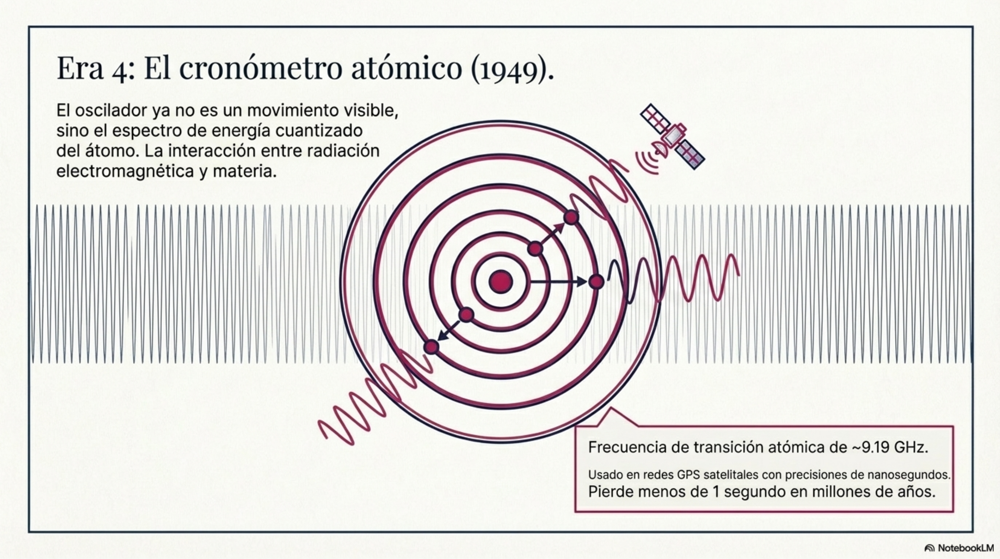

<u>Semejanzas y diferencias en los relojes modernos</u>

Aunque los relojes mecánicos, de cuarzo y atómicos sean resultados de
procesos tecnológicos diferentes, los tres relojes son variantes de un
mismo principio: utilizan un fenómeno periódico para medir el tiempo; un
tiempo que emerge como conteo de ciclos de un proceso periódico estable.
Todos estos relojes tienen en común un oscilador, una interacción, una
medición y un proceso de comparación. Además, los tres relojes mantienen
la misma arquitectura informacional cuyas componentes son: oscilador
estable, conteo de ciclos, control de referencia y lectura del tiempo.

Los relojes modernos son dispositivos que miden frecuencias: en el reloj
mecánico es una oscilación mecánica, en el reloj de cuarzo es una
vibración eléctrica y en el reloj atómico es una transición cuántica. En
cada reloj son diferentes el nivel de operación, el factor que produce
las oscilaciones, la naturaleza del oscilador y la estabilidad de su
funcionamiento:

- En el reloj mecánico el nivel es macroscópico, el factor es el
  movimiento, el oscilador es visible como un péndulo y su estabilidad
  depende de la temperatura, la fricción y el valor de la aceleración de
  la gravedad del entorno.

- En el reloj de cuarzo el nivel es mesoscópico, el factor es la
  oscilación eléctrica del cristal, el oscilador mantiene una frecuencia
  más constante y su estabilidad depende de las propiedades
  piezoeléctricas del material.

- En el reloj atómico el nivel es microscópico, el factor es la
  estructura discreta de las oscilaciones, la naturaleza del oscilador
  es su espectro de energía cuantizada y su estabilidad depende de una
  propiedad fundamental de la naturaleza que es universal e invariante:
  la cuantización de la radiación electromagnética.

La siguiente Tabla 5.3 compara diversas características de los relojes
modernos.

| Tabla 5.3. Comparación estructural de componentes |                      |                       |                                |
|---------------------------------------------------|----------------------|-----------------------|--------------------------------|
| Componente                                        | Reloj mecánico       | Reloj de cuarzo       | Reloj atómico                  |
| Oscilador                                         | Péndulo o volante    | Cristal de cuarzo     | Transición atómica             |
| Principio físico                                  | Mecánica clásica     | Efecto piezoeléctrico | Mecánica cuántica              |
| Frecuencia típica                                 | ~1 Hz                | ~ 32,768 Hz           | ~ 9.19 GHz                     |
| Fuente de energía                                 | Pesas o resorte      | Batería               | Campos electromagnéticos       |
| Regulación                                        | Escape mecánico      | Circuito electrónico  | Resonancia y retroalimentación |
| Señal generada                                    | Movimiento periódico | Señal eléctrica       | Transición cuántica            |
| Dispositivo para contar el tiempo                 | Engranajes           | Divisor digital       | Contador de frecuencias        |
| Precisión                                         | Seg/día              | Seg/mes               | Seg/millones de años           |

<u>Participación del láser en funcionamiento de los relojes atómicos</u>

Un reloj atómico mide el tiempo aprovechando que los átomos de un mismo
elemento funcionan a la frecuencia natural producida por una transición
energética definida, la cual no es visible. La solución consiste en usar
un láser para acoplarse a esa frecuencia y hacerla medible. Para
entender este proceso habrá que revisar qué es un láser y cómo funciona.

Mediante el proceso cuántico de emisión estimulada, el láser (Light
Amplification by Stimulated Emission of Radiation) convierte energía en
una radiación con las siguientes propiedades: monocromaticidad,
coherencia, direccionalidad y alta intensidad; además, hay estabilidad
de fase y precisión de frecuencia. El láser no solo emite luz, sino que
la organiza cuando produce fotones sincronizados en fase, frecuencia y
dirección. El láser permite convertir una propiedad cuántica invisible
(la frecuencia atómica) en una señal macroscópica medible que puede
contarse como tiempo transcurrido.

Un láser típico tiene tres componentes fundamentales: un medio activo
constituido por átomos que pueden emitir fotones, un mecanismo de bombeo
óptico que actúa como fuente de energía que provoca una inversión de la
población según la cual hay más átomos en estados excitados que en el
estado fundamental, y una cavidad resonante conformada por dos espejos
enfrentados, uno completamente transparente y otro solo parcialmente.

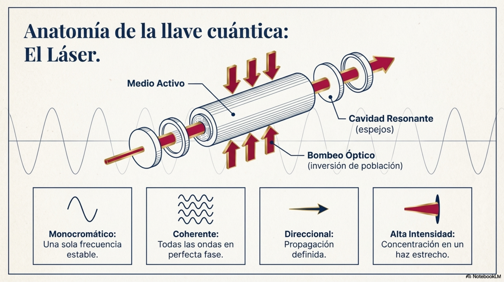

El funcionamiento del láser comprende las siguientes etapas:

1\. Bombeo para excitar al sistema: se suministra energía al medio
activo para que sus moléculas o átomos absorban energía y sus electrones
pasen a niveles excitados.

2\. Inversión de población: se produce un sistema excitado donde existen
átomos con más electrones en estados excitados que en el estado
fundamental.

3\. Emisión espontánea: algunos electrones excitados regresan
espontáneamente a niveles más bajos y emitan fotones.

4\. Emisión estimulada: cuando uno de los fotones emitidos pasa cerca de
un átomo excitado induce la emisión de otro fotón en el mismo estado
cuántico y la misma frecuencia, fase y dirección que el fotón inductor.

5\. Amplificación óptica: los fotones inducidos se multiplican formando
un enjambre coherente que en cascada amplifica coherentemente el haz de
fotones. Solo se amplifican los fotones alineados con el eje y la
longitud de onda de la cavidad, lo que garantiza la direccionalidad.
Además, solo permanecen los fotones que satisfacen la condición de
resonancia $L = \frac{q\lambda}{2}$ donde $L\ $es la longitud de la
cavidad, $\lambda$ la longitud de onda del fotón y $q$ número entero; a
esto se debe la coherencia del láser.

6\. Emisión láser: después de muchos rebotes dentro de la cavidad la luz
se encuentra sincronizada en fase, está alineada espacialmente y
mantiene estabilizada su frecuencia. En tales condiciones, una fracción
de la luz amplificada puede escapar a través del espejo parcialmente
reflectante como salida final del láser.

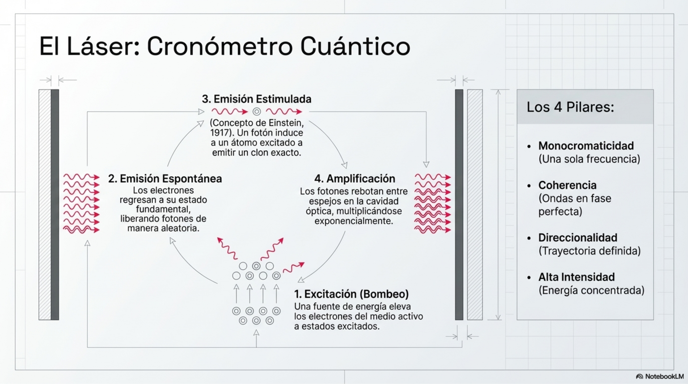

El láser cumple tres funciones simultáneas en los relojes atómicos: (1)
es una sonda que prueba si la frecuencia láser corresponde a la
frecuencia del átomo; (2) establece una regla de comparación y hace los
ajustes necesarios hasta lograr la coincidencia de frecuencias y (3) se
convierte en el oscilador que marca los “tic tac” del reloj. El láser
interviene en el funcionamiento de un reloj atómico en cada una de las
siguientes etapas: Preparación, Interacción átomo-laser, Detección,
Realimentación y Medición del tiempo.

