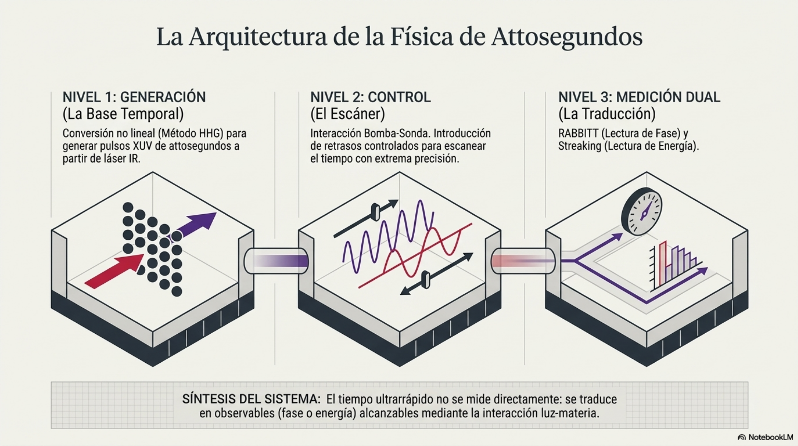
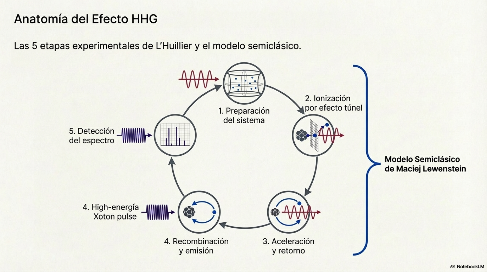
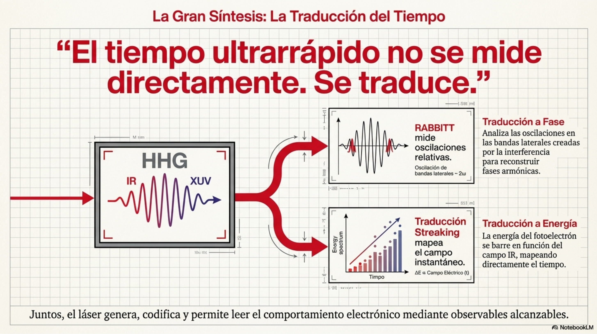
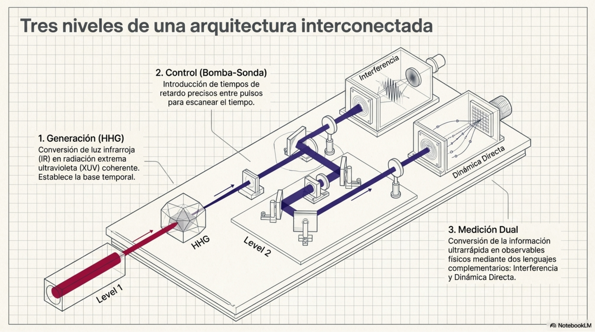
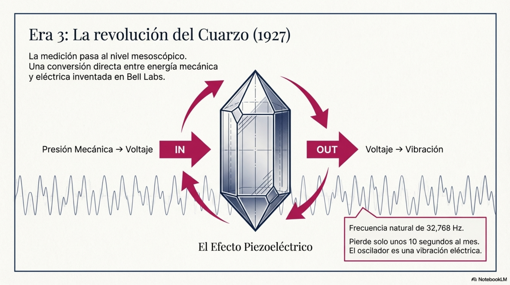

# 5.2. Nacimiento de la física de attosegundos

Esta sección describe los desarrollos teóricos y experimentales que han
hecho posible el desarrollo de la física de pulsos ultrarrápidos, lo
cual ha permitido observar y medir la dinámica de los electrones en la
escala de los attosegundos (1 as = 10⁻¹⁸ s). La siguiente Tabla 5.4
describe las principales etapas de su desarrollo.

<table>
<colgroup>
<col style="width: 14%" />
<col style="width: 26%" />
<col style="width: 58%" />
</colgroup>
<thead>
<tr class="header">
<th colspan="3">Tabla 5.4. Evolución histórica de la ciencia de los
pulsos ultrarrápidos</th>
</tr>
</thead>
<tbody>
<tr class="odd">
<td>Período</td>
<td>Desarrollo</td>
<td>Significado</td>
</tr>
<tr class="even">
<td>1960</td>
<td>Nacimiento del laser</td>
<td>Posibilidad de explorar interacciones ultrarrápidas entre la
radiación y la materia.</td>
</tr>
<tr class="odd">
<td>1980</td>
<td>Óptica de femtosegundos</td>
<td>
Desarrollo de pulsos con duración de 10-15 s para

estudiar la dinámica de moléculas y átomos.
</td>
</tr>
<tr class="even">
<td>1987</td>
<td>Generación de armónicos de orden superior</td>
<td>
Desarrollo de la técnica HHG (High-Harmonic Generation)

Anne L’Huillier descubre que cuando un laser intenso interacciona con
los átomos de un gas noble se emiten armónicos de orden superior que son
múltiplos de la frecuencia original del laser.
</td>
</tr>
<tr class="odd">
<td>1993</td>
<td>Modelo de Lewenstein</td>
<td>Explicación de HHG en términos de un modelo de tres etapas: tunelaje
electrónico, aceleración y recombinación.</td>
</tr>
<tr class="even">
<td>2001</td>
<td>Primerea generación de pulsos con duración de attosegundos</td>
<td>
El grupo de Pierre Agostini produce trenes de pulsos de 250
attosegundos.

El grupo de Ferenc Krausz genera el primer pulso aislado de 650
attosegundos.
</td>
</tr>
<tr class="odd">
<td>2003-2006</td>
<td>Mediciones en escala de attosegundos</td>
<td>Mediciones en fenómenos de emisión electrónica, atrasos en tunelaje
y dinámica de ionización ultrarrápida.</td>
</tr>
<tr class="even">
<td>2010</td>
<td>Expansión de la ciencia de attosegundos</td>
<td>Estudios de migración de cargas en moléculas, correlación
electrónica y procesos ultrarrápidos en sólidos.</td>
</tr>
<tr class="odd">
<td>2023</td>
<td>Premio Nobel en Física</td>
<td>Premio a Anne L´Huillier, Pierre Agostini y Ferenc Krausz “por los
métodos experimentales que generaron pulsos de luz de attosegundos para
estudiar la dinámica electrónica en la materia”.</td>
</tr>
</tbody>
</table>

El desarrollo inicial de la física de pulsos ultrarrápidos en escala de
los attosegundos es debido a las contribuciones de los tres laureados
con el Premio Nobel de Fisca de 2023: Anne L'Huillier, Pierre Agostini y
Ferenc Krausz. Mientras que Anne L´Huillier descubrió el mecanismo
físico (HHG) que hace posible generar la radiación necesaria para medir
el tiempo en la escala de attosegundos, Pierre Agostini transformó la
interferencia cuántica en un reloj ultrarrápido capaz de medir el
movimiento de los electrones, y Ferenc Krausz transformó los pulsos de
attosegundos en una herramienta de medición directa del tiempo. A
continuación, describimos las contribuciones de L´Huillier, Agostini y
Krausz.

**Contribuciones de Anne L´Huillier y colaboradores**

Alrededor de 1980 la dinámica electrónica estaba en un nivel de
descripción de los femtosegundos (10-15 s): las imágenes que
se obtenían en esa escala de tiempo resultaban difusas, lo cual
contrastaba con la evidencia de que el movimiento de los electrones solo
podría percibirse con detalle si se trabaja en la escala de los
attosegundos (10-18 s).

El primer gran avance en el desarrollo de la física de los pulsos
ultrarrápidos se dio cuando Anne L'Huillier descubrió que hacer pasar
luz láser infrarroja a través de un gas noble producía una radiación con
armónicos de orden muy alto. El experimento fue la primera evidencia
clara del fenómeno de High Harmonic Generation (HHG) y mostró que un
electrón individual funcionaba como antena cuántica que convertía un
campo óptico (IR) en radiación XUV coherente.

Las etapas del experimento de Generación de Armónicos de Alto Orden
(HHG) desarrollado por Anne L'Huillier son las siguientes:

**1.** Preparación del sistema experimental: un láser infrarrojo intenso
de frecuencias de femtosegundos se hace pasar por un gas noble (Ar, Ne,
Xe), de manera que el campo eléctrico del láser sea comparable al campo
coulombiano del átomo.

2\. Ionización por efecto túnel: el campo del láser distorsiona el
potencial del átomo y por efecto túnel se libera un electrón, el cual
aprovecha esa energía extra para generar armónicos que son frecuencias
múltiples de la frecuencia original del láser. Estos armónicos son
coherentes (están en fase) y su superposición permite la creación de
pulsos extremadamente cortos con duración en attosegundos. El átomo que
ha perdido un electrón se convierte en ion.

3\. Aceleración del electrón en el campo láser y reencuentro con el ion:
el electrón liberado es acelerado por el campo oscilante del láser;
cuando cambia la dirección de este campo el electrón invierte el sentido
de su movimiento y se reintegra al ion original: después de haber estado
en el continuo vuelve al estado ligado.

4\. Recombinación y emisión de armónicos: el electrón se recombina con
el ion y emite un fotón de alta energía, generando un amplio espectro de
armónicos de orden superior. Al juntar estas frecuencias, se construye
una cadena de pulsos muy cortos e intensos, cada uno con duración de
attosegundos.

*  
*5. Formación y detección del espectro HHG: la generación de pulsos de
attosegundos es una aplicación de la técnica denominada Generación de
Armónicos de Alto Orden (HHG: High Harmonic Generation). El espectro HHG
comprende una región inicial de baja energía de caída rápida de
intensidad, seguido de una meseta (plateau) que contiene armónicos con
intensidades casi constantes y termina en un corte abrupto (cutoff) que
indica la máxima energía alcanzable. El espectro HHG es un mapa
interferométrico de trayectorias electrónicas en el tiempo.

El mecanismo de formación del espectro HHG puede explicarse en términos
del modelo semiclásico de Maciej Lewenstein que comprende tres pasos:
Ionización, Aceleración en el campo láser y Recombinación y emisión de
radiación.

Sin embargo, el avance en la identificación y prueba de pulsos de
attosegundos ocurrió hasta 2001, cuando tal posibilidad teórica se
convirtió en realidad experimental. Pierre Agostini y Ferenc Krausz
demostraron que el efecto HHG podía usarse para crear los pulsos
ultracortos necesarios para el estudio de la materia. En los dos casos,
primero se generaron los pulsos de attosegundo utilizando la técnica HHG
y luego se realizaron experimentos de bombeo-sonda para crear “imágenes"
en tiempo real para estudiar la dinámica electrónica en átomos y
moléculas.

**Contribuciones de Pierre Agostini y colaboradores**

Agostini y su equipo transformaron la luz en un “reloj cuántico” capaz
de medir directamente el movimiento de los electrones: produjeron
experimentalmente trenes de pulsos separados regularmente, cada uno de
duración del orden de los attosegundos.

Su contribución más importante fue el desarrollo del método RABBITT
(Reconstruction of Attosecond Beating By Interference of Two-photon
Transitions). Este método permite medir la duración de pulsos de
attosegundos, determinar la fase de los armónicos generados y acceder a
la dinámica electrónica en escalas attosegundo. Además, revela que la
ionización no es instantánea, que los electrones tienen una estructura
temporal medible y que el tiempo en mecánica cuántica puede extraerse a
partir de fases interferométricas. En lugar de “ver” directamente el
tiempo, se mide una oscilación interferométrica que codifica la
información temporal.

La combinación de un tren de pulsos de attosegundos (generados mediante
HHG) con un campo láser infrarrojo de referencia producía interferencias
cuánticas entre dos caminos de ionización electrónica, lo que generaba
bandas laterales (sidebands) en el espectro fotoelectrónico y una
oscilación temporal que contenía información sobre el tiempo
electrónico. Para conseguir lo anterior, Agostini validó
experimentalmente la estructura espectral de los armónicos, mostró cómo
esos armónicos contenían información temporal para reconstruir la
emisión en el dominio del tiempo: convirtió un fenómeno espectral en una
herramienta de cronoscopía cuántica.

Las etapas del método RABBITT son las siguientes:

1.  Generación del tren de pulsos de attosegundos (HHG): Se hace incidir
    un láser infrarrojo intenso sobre un gas y se generan armónicos
    impares del láser mediante la aplicación del modelo de tres pasos de
    HHG (ionización, aceleración y recombinación). Esto genera un peine
    de frecuencias discretas que corresponden a los armónicos; en el
    dominio temporal representan un tren de pulsos de attosegundos.

2\. Superposición con un campo IR de referencia: Con un tiempo de
retardo controlable $\tau\ $se introduce un segundo campo, el
correspondiente al láser infrarrojo original. Este campo actúa como
referencia interferométrica y permite inducir procesos adicionales de
absorción/emisión.

3\. Ionización del átomo por absorción de armónicos: Los armónicos (XUV)
ionizan un átomo del gas y generan electrones con energías cuantizadas
de frecuencia $\omega$: $E_{q} = q\hslash\omega$, donde $q\ $es un
número entero.

4\. Procesos de ionización en dos caminos: fotones (XUV ± IR): El
electrón puede alcanzar una misma energía final por dos caminos
cuánticos indistinguibles que llevan al mismo estado final del electrón:
el camino A y el camino B. Como resultado aparecen picos principales que
son armónicos XUV impares y niveles intermedios llamados sidebands
(bandas laterales) producidos por la interferencia.

5\. Interferencia cuántica entre los dos caminos: Los dos caminos
anteriores interfieren y la señal resultante oscila con el doble de la
frecuencia del láser IR.

6\. Barrido del retardo temporal (delay scan): Se varía el retardo
$\tau$ entre el tren XUV y el campo IR; luego se mide la intensidad de
las sidebands en función de $\tau$.

7\. Reconstrucción temporal (extracción de fase): A partir de la
oscilación medida se obtiene la fase relativa entre armónicos, lo que
permite reconstruir la estructura temporal del tren de pulsos de
attosegundos, sí como medir retrasos en la emisión electrónica.

**Contribuciones de Ferenc Krausz y colaboradores**

Los experimentos de Ferenc Krausz mostraron la capacidad de asilar
eventos temporales para abordar cuestiones como las siguientes:

1.  Generación de pulsos de attosegundos aislados: Para producir estos
    pulsos individuales y no solo trenes periódicos, Krausz utilizó la
    técnica de generación de armónicos de alto orden (HHG). En tales
    condiciones, el láser funcionó como una “cámara ultrarrápida” capaz
    de capturar inámicas electrónicas.

2\. Método de attosecond streaking (barrido temporal en attosegundos):
Krausz hizo un mapeo tiempo-energía en duraciones de attosegundos para
convertir el tiempo de emisión del electrón en un corrimiento de su
energía. Para lograrlo, un pulso de attosegundos aislado (XUV) ionizaba
un átomo y liberaraba un electrón, mientras el pulso de un láser
infrarrojo (IR) modulaba su energía. Al registrar la energía cinética
del electrón en función del desfase temporal entre los pulsos XUV e IR,
pudo medir un retraso de 21 attosegundos en la emisión de electrones en
el efecto fotoeléctrico.

3\. Observación de dinámica electrónica: El método de barrido temporal
en attosegundos permitió medir los tiempos de fotoemisión y abrió el
campo de la cronoscopía electrónica. En la siguiente sección 5.3
abordaremos algunos desarrollos tecnológicos obtenidos como aplicación
directa de este método.

Etapas del método de barrido temporal en attosegundos (attosecond
streaking)

1\. Generación de pulsos de attosegundos: para iniciar el proceso se
necesita generar armónicos de alto orden con el método HHG y pulsos
ultracortos en el rango de attosegundo (XUV).

2. Esquema de doble pulso
(bomba-sonda: pump–probe): el pulso XUV en attosegundos es la bomba que
ioniza el átomo y el pulso infrarrojo (IR) en femtosegundos es la sonda
que modifica el electrón. Entre los pulsos se introduce un tiempo de
retardo controlado.

3\. Fotoionización ultrarrápida por liberación del electrón: el pulso
XUV arranca un electrón del átomo en un instante bien definido que se
fija como el “tiempo cero” en la escala natural de los electrones en
attrosegundos.

4\. Interacción con el campo IR del barrido en attosegundos: después de
la ionización el electrón entra en el campo eléctrico del pulso IR y
sufre una aceleración o desaceleración que depende del instante en que
el electrón fue liberado. Esta interacción modifica el ímpetu del
electrón y su energía; luego servirá para determinar el instante de su
emisión.

5\. Mapeo tiempo–energía: Al variarse el tiempo de retardo entre los
pulsos se obtiene un conjunto de electrones con distintas energías, cada
una de las cuales corresponde a un instante en que se produjo la
liberación del electrón. Esto produce un espectrograma de barrido
(streaking spectrogram) que relaciona la energía del electrón con el
retardo temporal entre los dos pulsos.

6\. Detección del tiempo de vuelo de los electrones (time-of-flight):
los electrones liberados son registrados en detectores donde se
determina su energía cinética y se reconstruye la distribución de
energías para cada tiempo de retardo. Estos datos constituyen la
información temporal codificada.

7\. Reconstrucción del pulso y dinámica electrónica: al variar el
retardo entre los pulsos XUV e IR, se obtiene un espectro de electrones
cuya energía oscila periódicamente y sigue el campo del láser. Este
patrón se llama traza del barrido (streaking) y contiene información
acerca del tiempo absoluto de emisión (cuándo sale el electrón en el
instante de la ionización), así como de los retrasos entre electrones
debidos a diferencias entre orbitales atómicos o a efectos de
correlación electrónica. Mediante algoritmos se reconstruyen la forma
temporal del pulso attosegundo, la fase del proceso de ionización y los
retardos electrónicos. Lo anterior permite la medición de retrasos de
fotoemisión, el acceso a fases cuánticas y el análisis de la dinámica
electrónica ultrarrápida.

Resumiendo: La acción del campo IR cambia el ímpetu del electrón
liberado y en consecuencia su energía: la determinación del instante de
liberación del electrón (el tiempo es directamente inobservable) se
convierte en la determinación del valor de una observable (la energía o
el ímpetu): el tiempo se traduce en un corrimiento medible en energía.
Esto muestra que la ionización no ocurre instantáneamente y que de
alguna manera el electrón “recuerda” que está bajo la acción del campo
IR en el instante en que nace cuando se ha liberado por efecto de la
ionización. Una consecuencia de esto es que el tiempo en mecánica
cuántica se puede reconstruir a partir de observables energéticos.

**Metodología Experimental en Física de Attosegundos**

Los tres métodos HHG, RABBITT y Attosecond Streaking se pueden ver como
diferentes representaciones del mismo fenómeno: HHG crea la “regla”,
RABBITT mide las “marcas relativas”, y Streaking mide el “tiempo
absoluto”. Los tres métodos implementan una misma idea: el tiempo
ultrarrápido no se mide directamente: se traduce en observables (fase o
energía) alcanzables mediante la interacción luz–materia.

Esta Metodología opera a tres niveles interconectados:

- el nivel 1 de generación (HHG) donde se convierte luz infrarroja en
  radiación XUV coherente y se establece la base temporal del
  attosegundo;

- el nivel 2 de control (pump–probe: bomba-sonda) que introduce el
  tiempo de retardo entre pulsos y permite “escanear” el tiempo con
  precisión extrema, y

- el nivel 3 de medición dual donde se realizan dos lecturas
  complementarias del mismo fenómeno y se convierte información temporal
  ultrarrápida en observables medibles: el método RABBITT como
  interferencia que determina la fase y el método Streaking como
  dinámica directa que determina el tiempo.

Las aplicaciones de esta metodología se han centrado en la respuesta
práctica a dos desafíos científico-tecnológicos:

\(1\) La generación de pulsos suficientemente cortos mediante la
Generación de Armónicos de Alto Orden (HHG), descubierta por Ann
L´Huillier cuando estudiaba la interacción de un láser intenso con gases
nobles y observó que la radiación emitida contenía armónicos de la
radiación láser de orden alto.

\(2\) La metrología que determina la medición y el uso de dichos pulsos
con el fin de estudiar la dinámica electrónica y desarrollar la
espectroscopía de attosegundos a partir de la aplicación de los métodos
RABBITT y Attosecond Streaking. Con RABBITT se realizaron experimentos
de interferencia para medir diferencias de tiempo y con Streaking se
determinó la dinámica electrónica para medir tiempos absolutos.

Los respectivos mecanismos de operación corresponden a lo siguiente:

Mecanismo de RABBITT: un pulso XUV (bomba) y un pulso IR (sonda) se
enfocan con retardo controlado en un gas objetivo (como neón). La
interferencia entre armónicos adyacentes del tren de pulsos (mediante
transiciones de dos fotones) crea bandas laterales que oscilan según el
retardo entre los pulsos. El análisis de la fase de estas oscilaciones
permite reconstruir las fases armónicas relativas, revelando así la
duración del pulso.

Mecanismo de Attosecond Streaking: un pulso XUV aislado (bomba) ioniza
el átomo objetivo y al mismo tiempo un campo IR sincronizado (sonda)
altera la energía cinética final de los electrones liberados. La energía
final del fotoelectrón se barre (raya o modula) en función del tiempo de
ionización y del campo IR.

Los tres métodos comparten la misma estructura informacional:

\(1\) tienen una fuente coherente que es un láser IR que sirve para
definir fases y constituye una referencia temporal;

\(2\) funcionan como un proceso de conversión no lineal que corresponde
al método HHG utilizado para traducir el campo láser en radiación XUV y
codificar la información temporal en frecuencias discretas;

\(3\) comparten el efecto de ionización como interacción con la materia
para crear electrones con características medibles como su energía;

\(4\) realizan la codificación del tiempo mediante dos estrategias
complementarias: RABBITT en el dominio de la fase que trata el tiempo
como una fase interferométrica de manera que las oscilaciones en las
bandas laterales (sidebands) son observables, y Attosecond streaking en
el dominio de la energía que trata el tiempo como un corrimiento
energético de manera que los desplazamientos en el espectro son
observables.

| Tabla 5.5. Comparación estructural de los tres métodos |                                  |                                  |                                   |
|--------------------------------------------------------|----------------------------------|----------------------------------|-----------------------------------|
| Aspecto                                                | HHG                              | RABBITT                          | Attosecond streaking              |
| Función principal                                      | Generación de pulsos attosegundo | Medición interferométrica        | Medición temporal directa         |
| Tipo de proceso                                        | No lineal fuerte                 | Interferencia cuántica           | Mapeo campo-tiempo                |
| Qué mide                                               | Espectro de armónicos            | Fase relativa entre armónicos    | Campo eléctrico instantáneo       |
| Resolución temporal                                    | Indirecta                        | ~decenas de attosegundos         | ~attosegundos o sub-attosegundos  |
| Dominio                                                | Frecuencia → tiempo              | Frecuencia ↔ tiempo              | Tiempo directo                    |
| Requiere IR auxiliar                                   | No                               | Sí                               | Sí                                |
| Salida                                                 | Peine de armónicos               | Oscilaciones en bandas laterales | Espectro desplazado de electrones |

